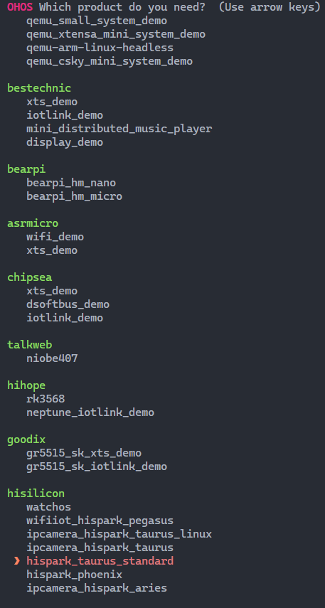
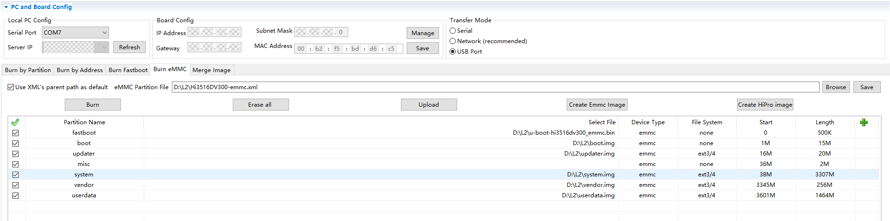

# Getting Started with the Standard System with Hi3516 (CLI Mode)

>  **CAUTION**
>
> **Since OpenHarmony 3.2, the standard system does not perform adaptation verification for the Hi3516D V300 development board. You are advised to use RK3568 to develop standard-system devices.**
>
> **If you still need to use Hi3516DV300 to develop standard-system devices, adaptation may fail. In this case, contact the chip supplier to obtain the adaptation guide or complete adaptation by yourself.**


In addition to the small system, the Hi3516D V300 development board also supports the standard system. This topic describes how to develop the standard system on Hi3516DV300 by using the command-line interface (CLI).


The following exemplifies how to run the first program on the development board. The created program outputs the message "Hello World!"


Before development, [set up the development environment](quickstart-pkg-prepare.md).


## Writing a Hello World Program


### Example Directory


```
applications/sample/hello
 │── BUILD.gn
 │── include
 │   └── helloworld.h
 │── src
 │   └── helloworld.c
 ├── bundle.json
 build
 └── subsystem_config.json
 vendor/hisilicon
 └── Hi3516DV300
     └── config.json
```


### How to Develop

Perform the steps below in the source code directory:

1. Create a directory and write the service code.
   
   Create the **applications/sample/hello/src/helloworld.c** directory and file whose code is shown in the following example. You can customize the content to be printed. For example, you can change **World** to **OHOS**. Declare the string printing function **HelloPrint** in the **helloworld.h** file. You can use either C or C++ to develop a program.


   ```
   #include <stdio.h>
   #include "helloworld.h"
   int main(int argc, char **argv)
   {
       HelloPrint();
       return 0;
   }
   void HelloPrint()
   {
       printf("\n\n");
       printf("\n\t\tHello World!\n");
       printf("\n\n");
   }
   ```

   Add the header file **applications/sample/hello/include/helloworld.h**. The sample code is as follows:


   ```
   #ifndef HELLOWORLD_H
   #define HELLOWORLD_H
   #ifdef __cplusplus
   #if __cplusplus
   extern "C" {
   #endif
   #endif
   void HelloPrint();
   #ifdef __cplusplus
   #if __cplusplus
   }
   #endif
   #endif
   #endif // HELLOWORLD_H
   ```

2. Create a build file.
   1. Create the **applications/sample/hello/BUILD.gn** file. The file content is as follows:
      
       ```
       import("//build/ohos.gni") # Import the build template.
       ohos_executable("helloworld") {# Executable module.
         sources = [       # Source code of the module.
           "src/helloworld.c"
         ]
         include_dirs = [  # Directory of header files on which the module depends.
           "include" 
         ]
         cflags = []
         cflags_c = []
         cflags_cc = []
         ldflags = []
         configs = []
         deps =[]    # Internal dependencies of the component.
         part_name = "hello"    # Component name. This parameter is mandatory.
         install_enable = true # Whether to install the software by default. This parameter is optional. By default, the software is not installed.
       }
       ```
   2. Create the **applications/sample/hello/bundle.json** file and add the description of the **sample** component. The content is as follows:
      
       ```
       {
           "name": "@ohos/hello",
           "description": "Hello world example.",
           "version": "3.1",
           "license": "Apache License 2.0",
           "publishAs": "code-segment",
           "segment": {
               "destPath": "applications/sample/hello"
           },
           "dirs": {},
           "scripts": {},
           "component": {
               "name": "hello",
               "subsystem": "sample",
               "syscap": [],
               "features": [],
               "adapted_system_type": [ "mini", "small", "standard" ],
               "rom": "10KB",
               "ram": "10KB",
               "deps": {
                   "components": [],
                   "third_party": []
               },
               "build": {
                   "sub_component": [
                       "//applications/sample/hello:helloworld"
                   ],
                   "inner_kits": [],
                   "test": []
               }
           }
       }
       ```

       The **bundle.json** file consists of two parts. The first part describes the information about the subsystem to which the component belongs, and the second part defines the build configuration for the component. When adding a component, you must specify the **sub_component** of the component. If there are APIs provided for other components, add them in **inner_kits**. If there are test cases, add them in **test**.

3. Modify the subsystem configuration file.

   Add the configuration of the new subsystem to the **build/subsystem_config.json** file.


   ```
   "sample": {
       "path": "applications/sample/hello",
       "name": "sample"
     },
   ```

4. Modify the product configuration file.

   In the **vendor/hisilicon/Hi3516DV300/config.json** file, add the **hello** part after the existing part.


   ```
       "usb:usb_manager_native":{},
       "applications:prebuilt_hap":{},
       "sample:hello":{},
       "wpa_supplicant-2.9:wpa_supplicant-2.9":{},
   ```


## Building Source Code

You can build source code with hb or the **build.sh** script. The following exemplifies how to build source code with hb. For details about how to build source code with the **build.sh** script, see [Building Source Code Using the build.sh Script](quickstart-pkg-common-build.md).

For details about the functions of the OpenHarmony compilation and building module, see [Compilation and Building Guide](../subsystems/subsys-build-all.md).


### Prerequisites

- The [required libraries and tools](quickstart-pkg-install-package.md) have been installed.

- The [compilation tools](quickstart-pkg-install-tool.md) have been installed.

- A **Hello World** program has been created with code written.

- The access to the Ubuntu environment is normal.


### Procedure

Go to the root directory of the source code and run the build command.

1. Set the build path.
   
   ```
   hb set
   ```

2. Select the current path.
   
   ```
   .
   ```

3. Select **hispark_taurus_standard** under **hisilicon** and press **Enter**.
   >  **NOTE**
   >
   > When adapting the development board to a specific use case, select an appropriate build form factor, that is, **product** settings. For details, see [Build Form Factors](quickstart-appendix-compiledform.md).

     **Figure 1** Hi3516 build settings 
   
   

4. Start building.
   >  **NOTE**
   > - To build a component (for example, **hello**), run the **hb build -T *targetName*** command.
   > 
   > - To build a product incrementally, run the **hb build** command.
   > 
   > - To build a product from the scratch, run the **hb build -f** command.
   > 
   > This example builds a product from the scratch.

   
   ```
   hb build -f
   ```

5. Check the build result. If "build success" is displayed, the building is successful.
   >  **NOTICE**
   >
   > The build result and log files are stored in **out/hi3516dv300**.


## Burning an Image

The following exemplifies how to burn an image to Hi3516DV300 using HiTool. You can also do so using DevEco Device Tool, by following instructions in [Burning an Image](quickstart-appendix-hi3516-ide.md#burning-an-image).


### Prerequisites

- The source code of the development board has been compiled into files for burning.

- [HiTool](http://www.hihope.org/download/download.aspx) has been installed on the client platform (for example, a Windows-based computer).

- The USB port driver has been installed on the client platform. For details, see [Installing the USB Port Driver on the Hi3516D V300 Development Board](https://device.harmonyos.com/en/docs/documentation/guide/usb_driver-0000001058690393).

- A serial port terminal tool, such as IPOP, has been installed on the client platform.

- The client platform and development board are connected using a USB cable and serial cable.


### Procedure

1. Prepare the files to be burnt.
   1. On the client platform, create a folder for storing the files to be burnt, for example, **D:\L2**.
   2. Download the compiled source package to the client platform, decompress the package, and copy the files required for burning to the folder created in step 1.
      
      For the Hi3516DV300 development board, the files required for burning of the standard system are as follows: **boot.img**, **Hi3516DV300-emmc.xml**, **system.img**, **u-boot-hi3516dv300_emmc.bin**, **uImage**, **updater.img**, **userdata.img**, and **vendor.img**.

2. Burn the image files using HiTool.
   1. Open HiTool.
   2. Set up HiTool.
      
      Set the transfer mode to USB and burning mode to eMMC (the storage medium of the development board is eMMC).
   3. Click **Browse** and select the burning configuration file (for example, **Hi3516DV300-emmc.xml**) from the folder created in step 1.
      
       
   4. After clicking the **Burn** button, press and hold the **Update** key next to the serial port on the development board, and remove and insert the USB cable.
      
      After the burning starts, logs are displayed in the console area at the bottom of HiTool.

      When the burning is complete, HiTool displays a dialog box indicating that the burning is successful.
   5. Click **OK**.

3. Import startup parameters.
   1. Use the terminal tool to enable the serial port.
   2. Restart the development board by removing and inserting its power supply. Press **Enter** in the serial port terminal tool within 3 seconds.
      
      If **hisilicon \#** is displayed on the terminal tool page, the serial port of the development board is connected.
   3. Copy the following startup parameters in the serial port terminal tool and press **Enter** to complete the setup.
      
       ```
       setenv bootargs 'mem=640M console=ttyAMA0,115200 mmz=anonymous,0,0xA8000000,384M clk_ignore_unused rootdelay=10 hardware=Hi3516DV300 init=/init root=/dev/ram0 rw blkdevparts=mmcblk0:1M(boot),15M(kernel),20M(updater),2M(misc),3307M(system),256M(vendor),-(userdata)';setenv bootcmd 'mmc read 0x0 0x82000000 0x800 0x4800; bootm 0x82000000'
       
       saveenv
       
       reset
       ```

       >  **NOTICE**
       >
       > When entering startup parameters, do not delete blank lines.


## Running an Image

After the system is started, copy the executable file **helloworld** in the **out** directory of the source code to the **bin** directory, and run the Hello World program as follows:


### Procedure

1. Go to the **bin** directory on the startup page.
   
   ```
   cd bin
   ```

2. Run the following command to run the **helloworld** program:
   
   ```
   ./helloworld
   ```

   If the message "Hello World!" is displayed, the program runs successfully.


### Next

Congratulations! You have finished all steps! Proceed to [develop a sample](../guide/device-clock-guide.md) to better familiarize yourself with OpenHarmony development.
