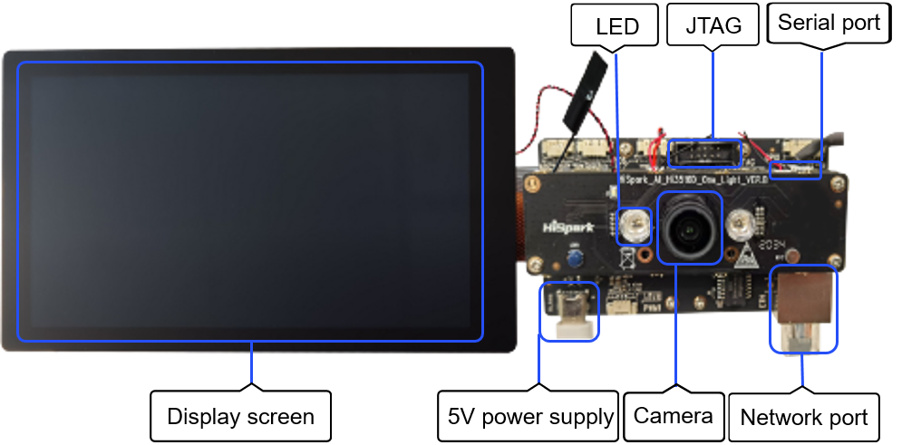

# Hi3516 Development Board

## Introduction

Hi3516DV300 is a next-generation system on chip (SoC) designed for the industry-dedicated smart HD IP camera. Thanks to its next-generation image signal processor (ISP), H.265 video compression encoder, and high-performance NNIE engine, Hi3516DV300 provides low bit rates, high image quality, low power consumption, and intelligent processing and analysis.

  **Figure 1** Hi3516 front view 

## Specifications

**Table 1** Hi3516 specifications

| Item| Description|
| -------- | -------- |
| Processor and internal memory| - Hi3516DV300 chip -&nbsp;DDR3&nbsp;1GB - eMMC 4.5, 8 GB capacity|
| External components| - Ethernet port - Audio and video   - 1 voice input   - 1 mono channel (AC_L) output, connected to a 3 W power amplifier (LM4871)   - MicroHDMI (1-channel HDMI 1.4) - Camera   - Sensor IMX335   - M12 lens, 4 mm focal length, and f/1.8 aperture - Display   - 2.35-inch LCD connector   - 5.5-inch LCD connector - External components and ports   - Memory card port   - JTAG/I2S port   - ADC port   - Steering gear port   - Grove connector   - USB 2.0 (Type-C)   - Three function keys, two user-defined keys, and one upgrade key   - LED indicator, green or red |
