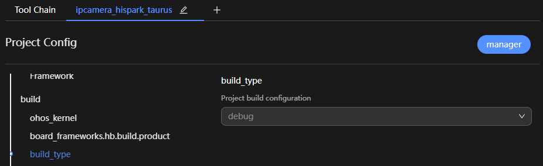
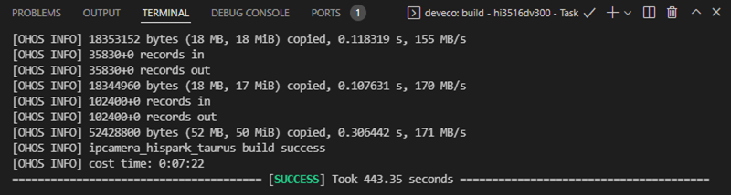

# Building Source Code

With DevEco Device Tool, you can easily build source code of the Hi3516DV300 development board, thanks to its productivity-boosting features, such as the compiler toolchain, detection of the build environment dependencies, and one-click installation of the dependencies.

>  **NOTE**
>
> The build environment of Hi3516DV300 is Ubuntu.

1. Click **Project Settings** on the menu bar to access the Hi3516DV300 project configuration page.

   

2. On the **Tool Chain** tab page, DevEco Device Tool automatically checks whether the dependent compiler toolchain is complete.

   - If any tool is indicated as **uninstalled** (), click **Download Uninstalled Tools** to install all the required tools, or click **Download** next to a tool to install the specific tool.
   - If some tool types are missing, click **Add Utility** to add them.
   - If **Download** is not available for a missing tool, it is not cataloged in DevEco Device Tool. In this case, you need to download the tool to the local host and click **Import** to import it.
   - If the status of **OpenHarmony Environment Dependency** is abnormal (, click **Install**.

   

   Certain tools may require the root access to install. For these tools, enter the user password in the **TERMINAL** window as prompted.

   >  **NOTE**
   >
   > - If pip fails to be installed, [change the Python source](https://device.harmonyos.com/en/docs/documentation/guide/ide-set-python-source-0000001227639986) and try again.
   > - If apt fails to be installed, [change the apt source](https://device.harmonyos.com/en/docs/documentation/guide/faq-toolchain-install-0000001301623822) and try again.

   

   After the installation is complete, the status of the tools and environment dependencies is displayed as .
   
3. On the **ipcamera_hispark_taurus** tab page, set **build_type**, whose default value is **debug**.

   

4. Choose **PROJECT TASKS** > **ipcamera_hispark_taurus** > **Build** to start building.

   

5. Wait until **SUCCESS** is displayed in the **TERMINAL** window, indicating that the build is complete.

   

   After the building is complete, go to the **out** directory of the project to view the generated files, which are needed for [burning an image](quickstart-ide-3516-burn.md).
