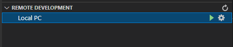
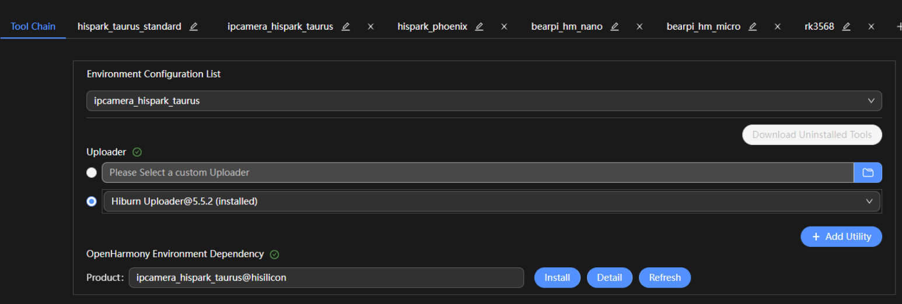
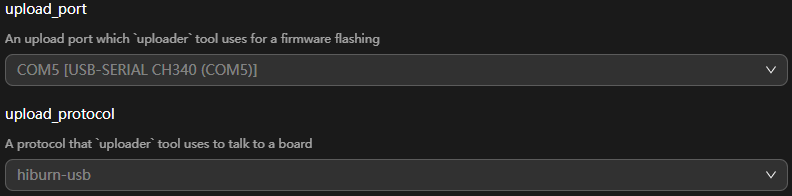
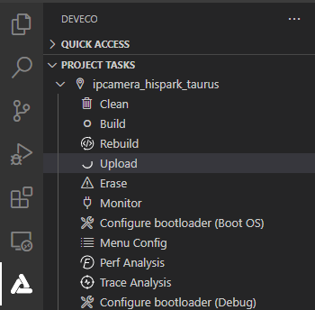

# Burning an Image

Burning is the process of downloading compiled program files to a development board to provide a basis for subsequent debugging. With the one-click burning function of DevEco Device Tool, you can burn images on development boards quickly and efficiently.

The images of Hi3516DV300 are burnt in the Windows environment. After burning is initiated, DevEco Device Tool copies the target program files generated in the Ubuntu environment to the specified Windows directory in remote mode, and then burns the program files to Hi3516DV300 using the Windows burning tool.

Hi3516D V300 supports burning for the small system through the USB port, network port, and serial port. This topic describes how to burn source code through the USB port.

## Prerequisites

- [Source code building](quickstart-ide-3516-build.md) has been completed.

- The serial port driver has been installed on Hi3516DV300. For details, see [Installing the Serial Port Driver on the Hi3516D V300 Development Board](https://device.harmonyos.com/en/docs/documentation/guide/hi3516_hi3518-drivers-0000001050743695).

- The USB port driver has been installed on Hi3516DV300. For details, see [Installing the USB Port Driver on the Hi3516D V300 Development Board](https://device.harmonyos.com/en/docs/documentation/guide/usb_driver-0000001058690393).

## Procedure

1. Connect the computer and the target development board through the serial port and USB port. For details, see [Hi3516 Development Board](quickstart-appendix-hi3516.md).

2. In DevEco Device Tool, choose **REMOTE DEVELOPMENT** > **Local PC** to check the connection status between the remote computer (Ubuntu build environment) and the local computer (Windows build environment).
   - If  is displayed on the right of **Local PC**, the remote computer is connected to the local computer. In this case, no further action is required.
   - If  is displayed, click the connect icon. During the connection, DevEco Device Tool will restart. Therefore, to avoid task interruptions, do not connect to DevEco Device Tool when downloading or building source code.

   

3. Click **Project Settings** on the menu bar to access the Hi3516DV300 project configuration page.

   

4. On the **Tool Chain** tab page, DevEco Device Tool automatically checks for the uploader tool.

   - If any tool is indicated as **uninstalled** (), click **Download Uninstalled Tools** to install all the required tools, or click **Download** next to a tool to install the specific tool.
   - If **Download** is not available for a missing tool, it is not cataloged in DevEco Device Tool. In this case, you need to download the tool to the local host and click **Import** to import it.

   

5. On the **ipcamea_hispark_taurus** tab page, set the burning options. The settings are automatically saved.
   - **upload_partitions**: Select the file to be burnt. By default, the **fastboot**, **kernel**, **rootfs**, and **userfs** files are burnt at the same time. Check the preset information of the files to be burnt and modify them when necessary. To modify the burning settings for a specific file, click  next to the file.
      >  **NOTE**
      >
      > Set the start address and length of the partition based on the size of the files to be burnt.
      >
      > Make sure the size of the partition is greater than that of the files to be burnt and the partition addresses of the files to be burnt do not overlap.
      
      
   
   - **upload_protocol**: Select the burning protocol **hiburn-usb**.
   - **upload_port**: Select the serial port number obtained.
   
      
   
6. Choose **ipcamera_hispark_taurus** > **Upload** to transfer the files to be burnt from Ubuntu to Windows.

   

   When the "Operation paused, Please press Enter key to continue" message is displayed, which indicates that the transfer is complete, press **Enter** to start burning.

   

7. When the following information is displayed in the **TERMINAL** window, press and hold the **Update** key (shown below) within 15 seconds, remove and insert the USB cable, and then release the **Update** key to start burning.

   

   

   When the "SUCCESS" message is displayed, it indicates that the burning is successful.

   

8. When the burning is successful, perform the operations in [Running an Image](quickstart-ide-3516-running.md) to start the system.
