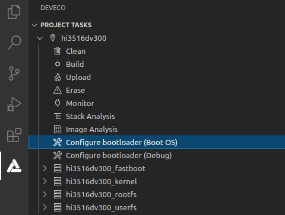
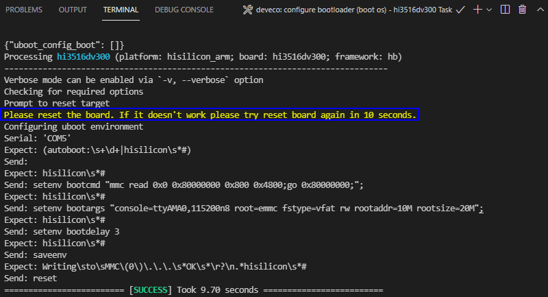

# Running an Image


## Starting the System

After burning is completed, you must configure the bootloader to run the OpenHarmony system.

1. In the Hi3516D V300 task, click **Configure bootloader (Boot OS)** to configure the bootloader.
   >  **NOTE**
   >
   > The bootloader configuration in DevEco Device Tool has been adapted to Hi3516D V300. Therefore, no manual modification is needed.
   
   
   
2. When the message shown below is displayed, restart the development board. If "SUCCESS" is displayed, it indicates that the configuration is successful.

   

3. Click **Monitor** on the taskbar to start the serial port tool.

   

4. When the command output is displayed, press **Enter** until **OHOS \#** is displayed, indicating that the system is started successfully.

   


## Running a Hello World Program

After the system is started, perform the following steps to run the Hello World program:

1. Go to the **bin** directory on the startup page.
   
   ```shell
   cd bin
   ```

2. Run the following command to run the **helloworld** program:
   
   ```shell
   ./helloworld
   ```

   If the message "Hello World!" is displayed, the program runs successfully.

   


## Next

Congratulations! You have finished all steps! Proceed to develop samples to better familiarize yourself with OpenHarmony development:

- [Screen and Camera Control](../guide/device-camera-control-overview.md)

- [Visual Application Development](../guide/device-camera-visual-overview.md)
