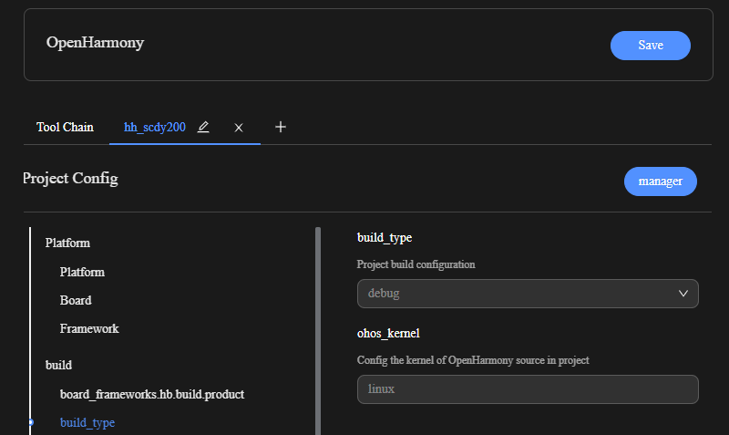
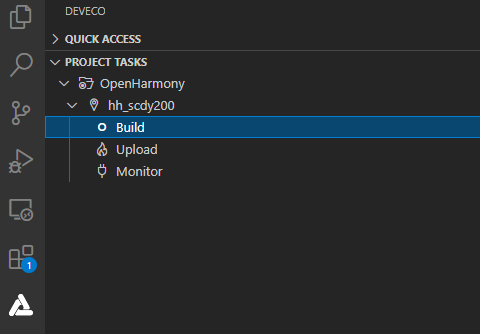

# Building Source Code

With DevEco Device Tool, you can easily build source code of the Rockchip RK3568 development board, thanks to its productivity-boosting features, such as the compiler toolchain, detection of the build environment dependencies, and one-click installation of the dependencies.

>  **NOTE**
>
> The build environment of RK3568 is Ubuntu.

1. Click **Project Settings** on the menu bar to access the RK3568 project configuration page.

   

2. On the **Tool Chain** tab page, DevEco Device Tool automatically checks whether the dependent compiler toolchain is complete. If a message is displayed indicating that some tools are missing, click **Install** to automatically install the required tools.

   >  **NOTE**
   >
   > - If pip fails to be installed, [change the Python source](https://device.harmonyos.com/en/docs/documentation/guide/ide-set-python-source-0000001227639986) and try again.
   > - If APT fails to be installed, [change the APT source](https://device.harmonyos.com/en/docs/documentation/guide/faq-toolchain-install-0000001301623822) and try again.

   

   Install the toolchain related to RK3568. Certain tools may require the root access to install. In this case, enter the user password in the **TERMINAL** window.

   

   After the toolchain is automatically installed, the figure below is displayed.

   

3. On the **rk3568** tab page, set **build_type**, whose default value is **debug**.

   

4. Choose **PROJECT TASKS** > **rk3568** > **Build** to start building.

   

5. Wait until **SUCCESS** is displayed in the **TERMINAL** window, indicating that the build is complete.

   

   After the building is complete, go to the **out** directory of the project to view the generated files, which are needed for [burning an image](quickstart-ide-3568-burn.md).
