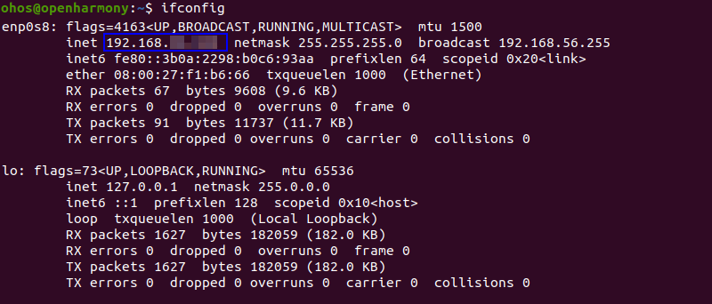
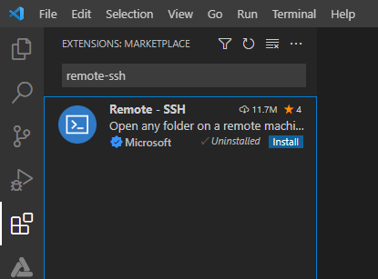
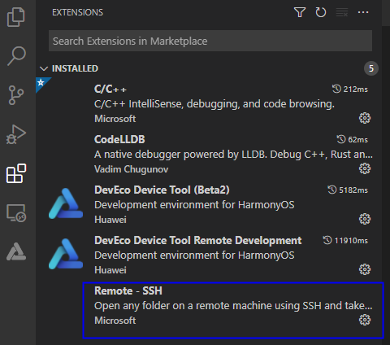
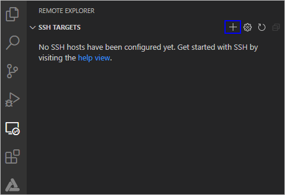
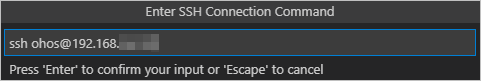
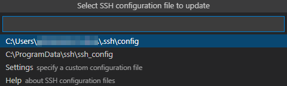
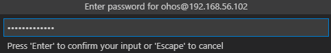
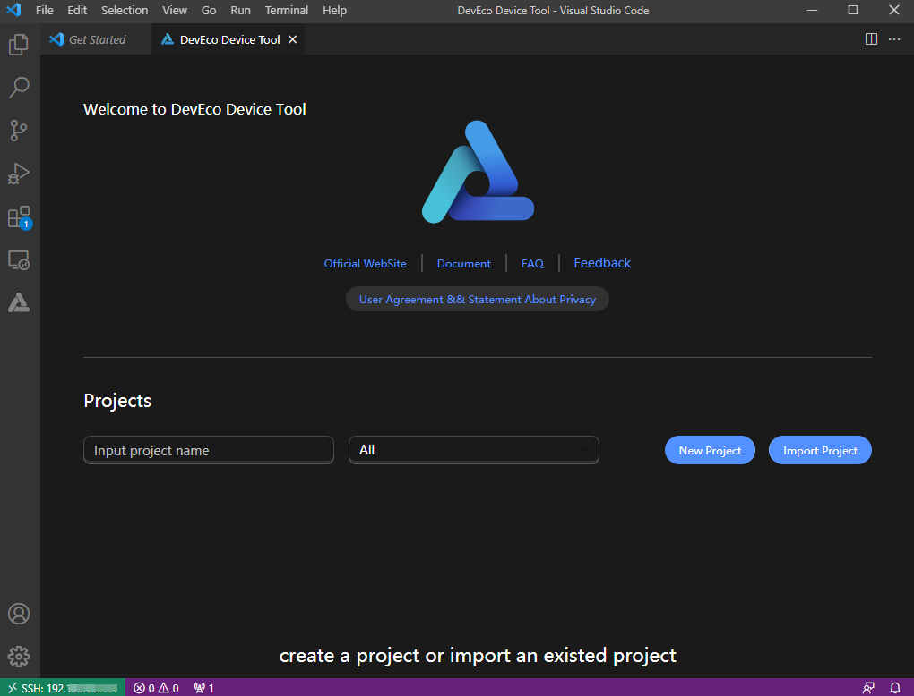

# Configuring the Environment for Remote Access


After the Windows and Ubuntu development environments have been set up, perform the following operations to enable Windows to remotely access Ubuntu, which is required to transfer images for burning.


## Installing the SSH Service and Obtaining the IP Address for Remote Access

1. In Ubuntu, open the Terminal tool and run the following command to install the SSH service:
   >  **NOTE**
   >
   > If the command fails to be executed and the system displays a message indicating that the openssh-server and openssh-client depend on different versions, install the openssh-client of the required version (for example, **sudo apt-get install openssh-client=1:8.2p1-4**) as prompted on the command-line interface (CLI) and run the command again to install the openssh-server.
   
   
   ```shell
   sudo apt-get install openssh-server
   ```

2. Run the following command to start the SSH service:
   
   ```shell
   sudo systemctl start ssh
   ```

3. Run the following command to obtain the IP address of the current user for remote access to the Ubuntu environment from Windows:
   
   ```shell
   ifconfig
   ```

   >  **NOTE**
   >
   > If the message "command-not-found" is displayed after you run the **ifconfig** command, run the **sudo apt-get install net-tools** command to install **net-tools** and obtain the IP address again.

   


## Installing Remote SSH

1. Open Visual Studio Code in Windows, click , and search for **remote-ssh** in the Extension Marketplace.

   

2. Click **Install** next to **Remote-SSH** to install the tool. After the installation is successful, **Remote-SSH** is displayed on the **INSTALLED** list.

   


## Remotely Connecting to the Ubuntu Environment

1. Open Visual Studio Code in Windows, click , and click **+** under **SSH TARGETS**.

   

2. In the **Enter SSH Connection Command** text box, enter **ssh _username_\@_ip_address_**, where *ip_address* indicates the IP address of the remote computer to be connected and *username* indicates the account name used for logging in to the remote computer.

   

3. In the displayed dialog box, select the default first option as the SSH configuration file.

   

4. Under **SSH TARGETS**, find the remote computer and click  to start it.

   

5. In the displayed dialog box, select **Linux**, select **Continue**, and enter the password for logging in to the remote computer.
   >  **NOTE**
   >
   > To eliminate the need for frequently entering the password for logging in to the remote computer, [set an SSH public key](https://device.harmonyos.com/cn/docs/documentation/guide/ide-registering-public-key-0000001247162706).
   
   
   
   After the connection is successful, the plug-in is automatically installed in the **.vscode-server** folder of the user directory on the remote computer. After the installation is complete, reload Visual Studio Code in Windows as prompted. Then you can develop, compile, and burn source code in DevEco Device Tool on Windows.

   >  **NOTE**
   >
   > If your computer has DevEco Device Tool 3.0 Release or an earlier version installed, the plug-in may fail to be installed, in which case the dialog box shown below stays in the lower right corner of Visual Studio Code. If this is the case, follow the instructions in [Fixing the DevEco Device Tool Installation Failure](https://device.harmonyos.com/en/docs/documentation/guide/faq-device-tool-install-failed-0000001437806813).

   

The environment for remote access is now set up. As shown below, the IP address of the remotely connected computer is displayed in the lower left corner.

   
