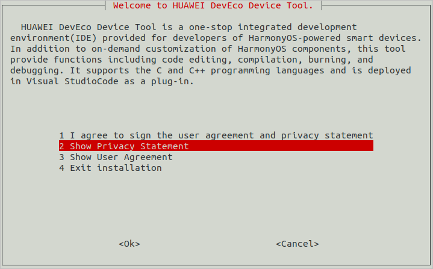

# Setting Up the Ubuntu Environment

In embedded development, Windows-based tools, such as Visual Studio Code, are widely used in code editing. Yet, because the source code of most development boards, such as Hi3861 and Hi3516, cannot be built in Windows, these development boards require the Ubuntu build environment.

In the Windows+Ubuntu hybrid build environment, you can enjoy the benefits of both DevEco Device Tool for Windows and DevEco Device Tool for Ubuntu (where Visual Studio Code is optional).

The following describes how to set up the Ubuntu environment.

>  **NOTE**
>
> If the Ubuntu system has not been set up yet, set it up on a virtual machine running Windows. For details, see [Ubuntu Installation Guide](https://developer.huawei.com/consumer/cn/training/course/video/C101639987816176315). Then, [configure the Ubuntu basic environment](https://developer.huawei.com/consumer/cn/training/course/video/C101639988048536240).


## System Requirements

- Ubuntu: Ubuntu 18.04 to 21.10; version 20.04 with 16 GB or larger memory and a 100 GB or larger hard disk is recommended

- User name (Ubuntu): cannot contain Chinese characters

- DevEco Device Tool: latest and same version installed on both Ubuntu and Windows

  >  **NOTE**
  >
  > The following uses DevEco Device Tool of the 3.1 Release version as an example. The supported features and operations vary according to the DevEco Device Tool version. For details, see the [User Guide](https://device.harmonyos.com/en/docs/documentation/guide/service_introduction-0000001050166905).


## Procedure

1. Make sure the Ubuntu shell environment is **bash**.
   1. Run the following command and check whether the command output is **bash**. If the command output is not **bash**, go to step 2.
      
       ```shell
       ls -l /bin/sh
       ```

       

   2. Start the command-line tool, run the following command, enter your password, and select **No** to set **Ubuntu shell** to **bash**.
      
       ```shell
       sudo dpkg-reconfigure dash
       ```

       

2. Download the latest version of [DevEco Device Tool](https://device.harmonyos.com/cn/ide#download) for Linux.

3. Decompress the DevEco Device Tool software package and assign permission on the folder obtained from the decompression.
   1. Go to the directory where the DevEco Device Tool software package is stored and run the following command to decompress the software package. In the command, **devicetool-linux-tool-{Version}.zip** indicates the software package name.
      
       ```shell
       unzip devicetool-linux-tool-{Version}.zip
       ```
   2. Open the folder of the decompressed software package and run the following command to grant the execute permission on the installation file. In the command, **devicetool-linux-tool-{Version}.sh** indicates the installation file name.
      
       ```shell
       chmod u+x devicetool-linux-tool-{Version}.sh
       ```

4. Run the following command to install DevEco Device Tool, where **devicetool-linux-tool-{Version}.sh** indicates the installation file name.
   
   ```shell
   sudo ./devicetool-linux-tool-{Version}.sh
   ```

5. On the page for agreeing to the user agreement and privacy statement, read and agree to the user agreement and privacy statement. You can scroll through the options by pressing the up and down arrow keys on the keyboard.

   

   Wait until the "DevEco Device Tool successfully installed." message is displayed.

   
