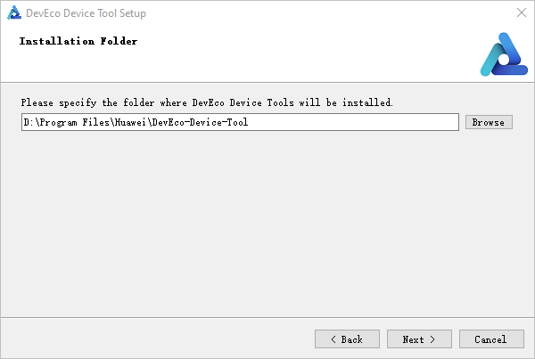
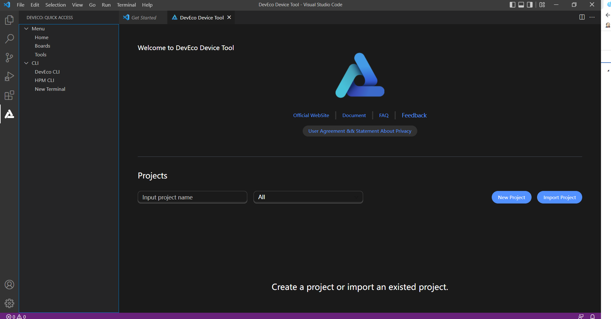

# Setting Up the Windows Environment

In embedded development, Windows-based tools, such as Visual Studio Code, are widely used in code editing. Yet, because the source code of most development boards, such as Hi3861 and Hi3516, cannot be built in Windows, these development boards require the Ubuntu build environment.

In the Windows+Ubuntu hybrid build environment, you can enjoy the benefits of both DevEco Device Tool for Windows and DevEco Device Tool for Ubuntu (where Visual Studio Code is optional).

The following describes how to set up the Windows environment.

## System Requirements

- Windows 10 (64-bit): 8 GB or larger memory and a 100 GB or larger hard disk recommended

- DevEco Device Tool: latest and same version installed on both Ubuntu and Windows

  >  **NOTE**
  >
  > The following uses DevEco Device Tool of the 3.1 Release version as an example. The supported features and operations vary according to the DevEco Device Tool version. For details, see the [User Guide](https://device.harmonyos.com/en/docs/documentation/guide/service_introduction-0000001050166905).

## Procedure

1. Download the latest version of [DevEco Device Tool](https://device.harmonyos.com/cn/ide#download) for Windows.

2. Decompress the DevEco Device Tool package, double-click the installer, and then click **Next**.

3. On the page shown, read the user agreement and privacy statement carefully and select **I accept the licenses** before proceeding to the next step.

4. Set the installation path for DevEco Device Tool and click **Next**. Make sure the path does not contain Chinese characters and is **in a drive other than the C drive**.

   

5. Install the dependent tools by following the onscreen instructions.

   You can select **Install** or **Custom** as needed:

   - **Install**: Install the software based on the default path and parameters.
   
   - **Custom**: You can customize the installation path and other parameters before the installation.

   After the installation is complete, the status of the dependent tools should be **OK**.
   
6. Click **Install** to install DevEco Device Tool.

7. Wait for the DevEco Device Tool setup wizard to automatically install DevEco Device Tool. After the installation is complete, click **Finish** to close the setup wizard.

8. From Visual Studio Code, access the DevEco Device Tool page. Now you can conduct your development in DevEco Device Tool.

   
