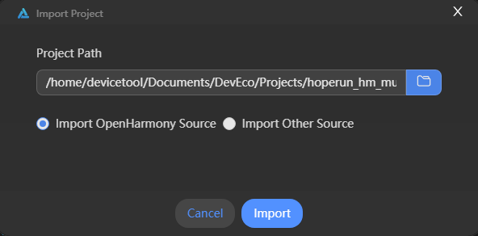
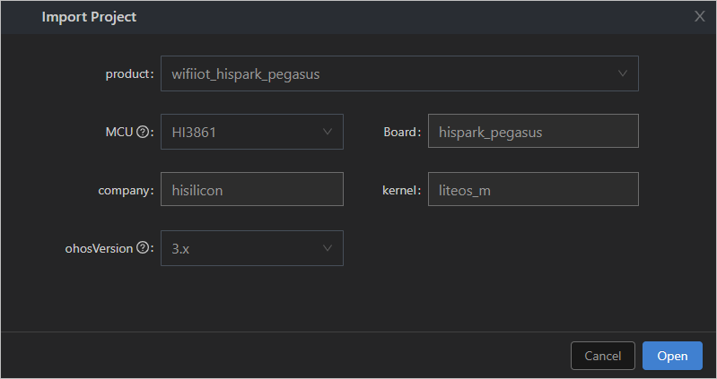

# Importing a Source Code Project

After [setting up the Windows+Ubuntu hybrid development environment](../quick-start/quickstart-ide-lite-env-setup-win-ubuntu.md) and [obtaining source code](../quick-start/quickstart-ide-lite-sourcecode-acquire.md), perform the following steps to create a source code project in Windows:

1. Open DevEco Device Tool, go to the home page, and click **Import Project** to open your project or source code.

   

2. Select the source code directory to be imported and click **Import**.

   >  **NOTE** 
   > Make sure the selected directory does not contain Chinese characters or spaces. Otherwise, the building may fail.

   

3. If this is the first time you import a project, a message will be displayed indicating that the project is not a DevEco Device Tool project. Click **Import** to continue.

   

4. On the **Select Project type** page, select **Import from OpenHarmony Source**.

   

5. On the **Import Project** page, select a product, and the MCU, board, company, and kernel fields will be automatically populated. Then, select the OpenHarmony source code version for **ohosVersion**. The following figure uses **wifiiot_hispark_pegasus** as an example.

   >  **NOTE**
   > - Set **Product** to **wifiiot_hispark_pegasus** for the Hi3861 development board.
   > 
   > - Set **Product** to **ipcamera_hispark_taurus** for the Hi3516D V300 development board.

   

6. Click **Open** to open the project or source code.
