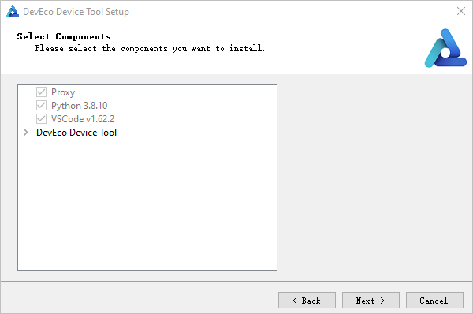

# Setting Up the Windows+Ubuntu Hybrid Development Environment


In embedded development, Windows-based tools, such as Visual Studio Code, are widely used in code editing. Yet, as the source code of most development boards, such as Hi3861 and Hi3516, cannot be built in Windows, these development boards require the Ubuntu development environment.


In the Windows+Ubuntu hybrid development environment, you can enjoy the benefits of both DevEco Device Tool for Windows and DevEco Device Tool for Ubuntu (where Visual Studio Code is optional).


## System Requirements

- Windows: Windows 10 (64-bit)

- Ubuntu: Ubuntu 20.04 or later; recommended memory: 16 GB or higher.

- User name: cannot contain Chinese characters

- DevEco Device Tool: 3.0 Release


## Setting Up the Ubuntu Development Environment

1. Make sure the Ubuntu shell environment is **bash**.
   1. Run the following command and check whether the command output is **bash**. If the command output is not **bash**, go to step 2.
      
       ```
       ls -l /bin/sh
       ```

       

   2. Start the command-line tool, run the following command, enter your password, and select **No** to set **Ubuntu shell** to **bash**.
      
       ```
       sudo dpkg-reconfigure dash
       ```

       

2. Download the [DevEco Device Tool 3.0 Release Linux version](https://device.harmonyos.com/cn/ide#download).

3. Decompress the DevEco Device Tool software package and assign permission on the folder obtained from the decompression.

   1. Go to the directory where the DevEco Device Tool software package is stored and run the following command to decompress the software package. In the command, change **devicetool-linux-tool-3.0.0.401.zip** to the actual software package name.
      
       ```
       unzip devicetool-linux-tool-3.0.0.401.zip
       ```

   2. Open the folder of the decompressed software package and run the following command to grant the execute permission on the installation file. In the command, change **devicetool-linux-tool-3.0.0.401.sh** to the actual installation file name.
      
       ```
       chmod u+x devicetool-linux-tool-3.0.0.401.sh
       ```

4. Run the following command to install DevEco Device Tool, where **devicetool-linux-tool-3.0.0.401.sh** indicates the installation file name.

   >  **NOTE**<br>
   > During the installation, the setup wizard automatically checks whether Python 3.8 or 3.9 is installed. If Python 3.8 or 3.9 is not installed, the setup wizard displays the "Do you want to continue?" message; enter **Y** to allow the setup wizard to automatically install Python.

   
   ```
   sudo ./devicetool-linux-tool-3.0.0.401.sh
   ```

   Wait until the "Deveco Device Tool successfully installed." message is displayed.

   


## Setting Up Windows Development Environment

To remotely access the Ubuntu environment through Windows and enjoy the benefits of DevEco Device Tool for Windows, you need to install DevEco Device Tool on Windows.

1. Download the [DevEco Device Tool 3.0 Release](https://device.harmonyos.com/cn/ide#download) Windows edition.

2. Decompress the DevEco Device Tool package, double-click the installer, and then click **Next**.

3. Set the installation path of DevEco Device Tool and click **Next**. You are advised to install DevEco Device Tool in a non-system drive.

   >  **NOTE**
   > If you have installed DevEco Device Tool 3.0 Beta2 or earlier, the earlier version will be uninstalled before you install a new version. If the following error message is displayed during the uninstallation, click **Ignore** to continue the installation. This error does not affect the installation of the new version.
   > 
   > 

   

4. When prompted, select the tools to be automatically installed.

   1. On the **VSCode installation confirm** page, select **Install VScode 1.62.2 automatically** and click **Next**.

       >  **NOTE**<br>
       > If Visual Studio Code 1.62 or later has been installed, this step will be skipped.

       

   2. On the displayed **Python select page**, select **Download from Huawei mirror** and click **Next**.

       >  **NOTE**<br>
       > If Python 3.8 or 3.9 has been installed, select **Use one of compatible on your PC**.

       

5. In the dialog box shown below, click **Next** to download and install the tools..

   

6. Wait for the DevEco Device Tool setup wizard to automatically install DevEco Device Tool. After the installation is complete, click **Finish** to close the setup wizard.

   

7. From Visual Studio Code, access the DevEco Device Tool page. Now you can conduct your development in DevEco Device Tool.

   


## Configuring Windows to Remotely Access the Ubuntu Development Environment


### Installing the SSH Service and Obtaining the IP Address for Remote Access

1. In Ubuntu, open the Terminal tool and run the following command to install the SSH service:

   >  **NOTE**<br>
   > If the command fails to be executed and the system displays a message indicating that the openssh-server and openssh-client depend on different versions, install the openssh-client of the required version (for example, **sudo apt-get install openssh-client=1:8.2p1-4**) as prompted on the command-line interface (CLI) and run the command again to install the openssh-server.

   
   ```
   sudo apt-get install openssh-server
   ```

2. Run the following command to start the SSH service:
   
   ```
   sudo systemctl start ssh
   ```

3. Run the following command to obtain the IP address of the current user for remote access to the Ubuntu environment from Windows:
   
   ```
   ifconfig
   ```

   


### Installing Remote SSH

1. Open Visual Studio Code in Windows, click , and search for **remote-ssh** in the Extension Marketplace.

   

2. Click **Install** to install Remote-SSH. After the installation is successful, **Remote-SSH** is displayed on the **INSTALLED** list.

   


### Remotely Connecting to the Ubuntu Environment

1. Open Visual Studio Code in Windows, click , and click + on the **REMOTE EXOPLORER** page.

   

2. In the **Enter SSH Connection Command** text box, enter **ssh *username@ip_address***, where *ip_address* indicates the IP address of the remote computer to be connected and *username* indicates the account name used for logging in to the remote computer.

   

3. In the displayed dialog box, select the default first option as the SSH configuration file.

   

4. Under **SSH TARGETS**, find the remote computer and click  to start it.

   

5. In the displayed dialog box, select **Linux**, select **Continue**, and enter the password for logging in to the remote computer.

   

   After the connection is successful, the plug-in is automatically installed in the .vscode-server folder on the remote computer. After the installation is complete, reload Visual Studio Code in Windows as prompted. Then you can develop, compile, and burn source code in DevEco Device Tool on Windows.


### Registering the Public Key for Accessing the Ubuntu Environment

After the preceding operations are complete, you can remotely connect to the Ubuntu environment through Windows for development. However, you need to frequently enter the remote connection password. To eliminate this need, you can use the SSH public key.

1. Open the Git bash CLI and run the following command to generate an SSH public key. During command execution, perform operations as prompted. Set **username** and **ip** to the user name and IP address you use for connecting to the Ubuntu system.
   
   ```
   ssh-keygen -t rsa
   ssh-copy-id -i ~/.ssh/id_rsa.pub username@ip
   ```

   

2. In Visual Studio Code, click the remote connection setting button and open the **config** file.

   

3. In the **config** file, add the SSK key file information, as shown below. Then save the file.

   
