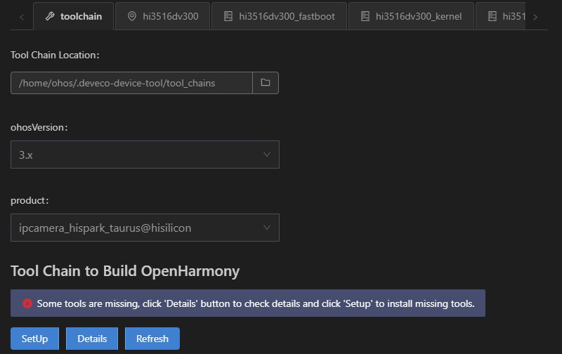
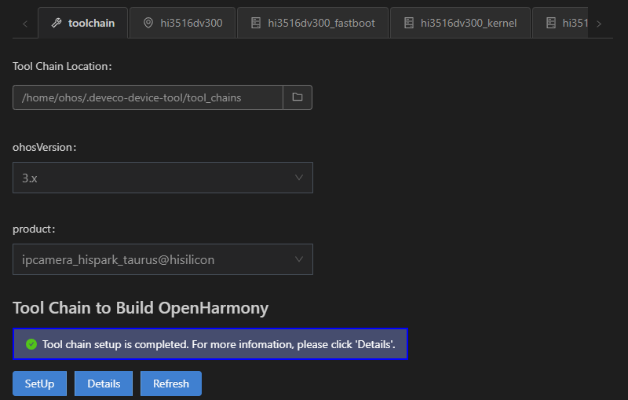

# Building

1. Click **Project Settings** on the menu bar to access the Hi3516D V300 project configuration page.

   

2. On the **Tool Chain** tab page, DevEco Device Tool automatically checks whether the dependent compilation toolchain is complete. If a message is displayed indicating that some tools are missing, click **Install** to automatically install the required tools.
   
   

3. Install the toolchain related to Hi3516D V300. Certain tools may require the root access to install. In this case, enter the user password in the **TERMINAL** window.
   
   >  **NOTE**
   > If the pip component fails to be installed, [change the Python source](https://device.harmonyos.com/en/docs/documentation/guide/ide-set-python-source-0000001227639986) and try again.
   
   
   
   After the toolchain is automatically installed, the figure below is displayed.
   
   
   
4. On the **hi3516dv300** tab page, set **build_type**. The default value is **debug**. Click **Save** to save the settings.

   

5. Choose **PROJECT TASKS** > **hi3516dv300** > **Build** to start building.

   

6. Wait until **SUCCESS** is displayed in the **TERMINAL** window, indicating that the compilation is complete.

   

   After the building is complete, go to the **out** directory of the project to view the generated files, which are needed in [burning](quickstart-ide-lite-steps-hi3516-burn.md).
