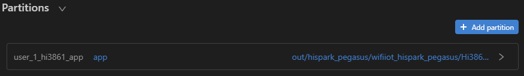
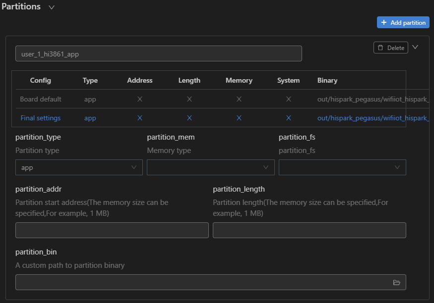

# Burning

Burning is the process of downloading compiled program files to a development board to provide a basis for subsequent debugging. With the one-click burning function of DevEco Device Tool, you can burn images on development boards quickly and efficiently.

Hi3861 V100 supports burning through the serial port. To burn source code through the serial port in Windows, perform the following steps:

1. Connect the computer and the target development board through the serial port and USB port. For details, see [Introduction to the Hi3861 V100 Development Board](https://gitee.com/openharmony/docs/blob/master/en/device-dev/quick-start/quickstart-lite-introduction-hi3861.md).

2. If your computer does not have the USB-to-serial driver, install it by following the instructions in [Installing the Serial Port Driver on Hi3861 V100](https://device.harmonyos.com/en/docs/documentation/guide/hi3861-drivers-0000001058153433).

3. In DevEco Device Tool, choose **REMOTE DEVELOPMENT** > **Local PC** to check the connection status between the remote computer (Ubuntu development environment) and the local computer (Windows development environment).

   - If  is displayed on the right of **Local PC**, the remote computer is connected to the local computer. In this case, no further action is required.
   - If  is displayed, click the connect icon.

   

   >  **NOTE**
   > This operation is required only in remote access mode (in the Windows+Ubuntu hybrid development environment). If the local access mode (Windows or Ubuntu development environment) is used, skip this step.

4. Check the serial port number in **QUICK ACCESS** > **DevEco Home** > **Device** in DevEco Device Tool.

   

   

5. Choose **QUICK ACCESS** > **DevEco Home** > **Projects**, and then click **Settings**.

   

6. On the **hi3861** tab page, set the burning options.

   - **upload_port**: Select the serial port number obtained.
   - **upload_protocol**: Select the burning protocol **hiburn-serial**.
   - **upload_partitions**: Select the files to be burnt. **hi3861_app** is selected by default.

   

7. In **Partitions**, check the preset burning settings of the files to be burnt.

   

   To modify the burning settings for a specific file, click  next to the file.

   

8. When you finish modifying, click **Save** on the top.

9. Click **Open** to open the project file. Then, choose **PROJECT TASKS** > **hi3861** > **Upload** to start burning.

   

10. When the following information is displayed, press the RST button on the development board within 15 seconds to restart it.

   

   When the following message is displayed, the burning is successful.

   