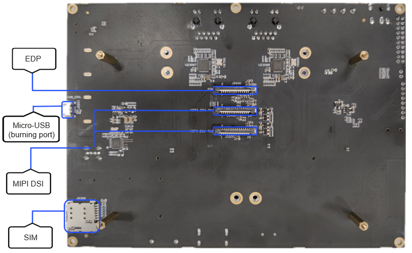

# Introduction to the RK3568 Development Board

## Overview

Bolstered by the Rockchip RK3568 chip, the RK3568 development board integrates a dual-core GPU and high-efficiency NPU. Its quad-core 64-bit Cortex-A55 processor uses the advanced 22 nm manufacturing process and is clocked at up to 2.0 GHz. The development board is packed with Bluetooth, Wi-Fi, audio, video, and camera features, with a wide range of expansion ports as well as video input and output ports. It comes with dual GE auto-sensing RJ45 ports, so it can be used in multi-connectivity products, such as NVRs and industrial gateways.

  **Figure 1** Front view of the RK3568 development board

  

  **Figure 2** RK3568 rear view

  

## Development Board Specifications

  **Table 1** RK3568 specifications

| Item| Description|
| -------- | -------- |
| Display| -&nbsp;1 x HDMI 2.0 (Type-A) port, supporting 4K/60 fps output -&nbsp;2 x MIPI, supporting 1920 x 1080\@60 fps output -&nbsp; 1 x eDP, supporting 2K@60 fps output|
| Audio port| -&nbsp;1×8ch&nbsp;I2S/TDM/PDM -&nbsp;1 x HDMI -&nbsp;1 x speaker output -&nbsp;1 x headset output -&nbsp;1 x microphone for onboard audio input|
| Ethernet port| 2 x GMAC (10/100/1000M)|
| Wireless connectivity| SDIO port, supporting Wi-Fi 6 5G/2.5 GHz and Bluetooth 4.2|
| Camera port| MIPI-CSI2, 1 x 4-lane/2x2-lane\@2.5 Gbps/lane|
| USB | -&nbsp;2 x USB 2.0 Host, Type-A -&nbsp;1 x USB 3.0 Host, Type-A -&nbsp;1×USB3.0&nbsp;OTG |
| PCIe | 1 x 2-lane PCIe 3.0 Connector (RC mode)|
| SATA | 1×SATA3.0&nbsp;Connector |
| SDMMC | 1×Micro&nbsp;SD&nbsp;Card3.0 |
| Keys| -&nbsp;1×Vol+/Recovery -&nbsp;1×Reset -&nbsp;1×Power -&nbsp;1×Vol- -&nbsp;1×Mute |
| Debugging port| 1 x Debugging serial port|
| RTC | 1 x RTC |
| IR | 1 x IR |
| Tri-color indicator| 3 x LED |
| G-sensor | 1 x G-sensor |
| Fan | 1 x fan |
| Expansion port| The 20-pin expansion ports include: -&nbsp;2 x ADC -&nbsp; 2 x I2C -&nbsp;7 x GPIO (or 3 x GPIO + 4 x UART) -&nbsp;3 x VCC power (12 V, 3.3 V, and 5 V)|
| Mother board dimensions| 180mm×130mm |
| PCB| 4-laminate|
