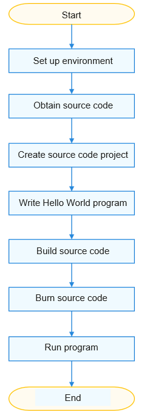

# Standard System Overview

## Introduction

The OpenHarmony standard system applies to devices with a reference memory greater than or equal to 128 MiB. This document helps you quickly get started for development of the OpenHarmony standard system, from environment setup to building, burning, and startup.

To accommodate different developer habits, OpenHarmony provides two modes for getting started with the standard system:

- IDE mode: DevEco Device Tool is used for one-stop development, covering dependency installation, building, burning, and running.

- Installation package mode: Dependency download and installation as well as building operations are performed using commands. Burning and running are performed in DevEco Device Tool.
  OpenHarmony also provides the [Docker environment](../get-code/gettools-acquire.md), which can significantly simplify the environment configuration before compilation. You can build your source code in the Docker environment if you are more accustomed to using the installation package mode.

This document exemplifies how to use the IDE mode. For details about the installation package mode, see [Getting Started with Standard System (Installation Package Mode)](../quick-start/quickstart-standard-package-directory.md).

## Development Environment

In the Windows+Ubuntu hybrid environment for OpenHarmony development:

- Windows: used for source code development and burning.

- Ubuntu: used for source code building.

This document describes how to develop OpenHarmony in the Windows+Ubuntu environment.

## Development Boards

In this document, two development board models are used as examples: Hi3516D V300 and RK3568. For details about these development boards, see [Appendix](../quick-start/quickstart-standard-board-introduction.md). You can purchase the development board as required.

## Development Process

Below you can see the quick start process for the development of the standard system.

  **Figure 1** Quick start process for the development of the standard system

  
