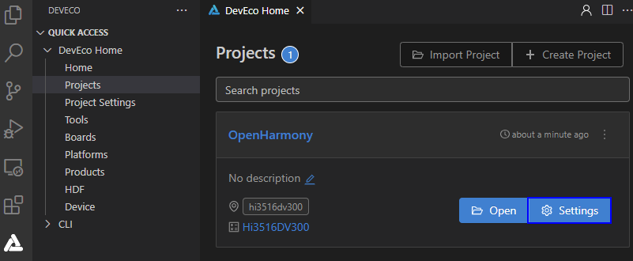
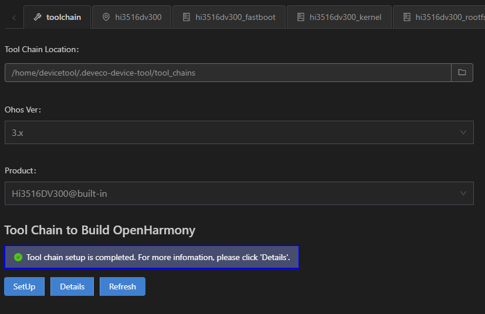
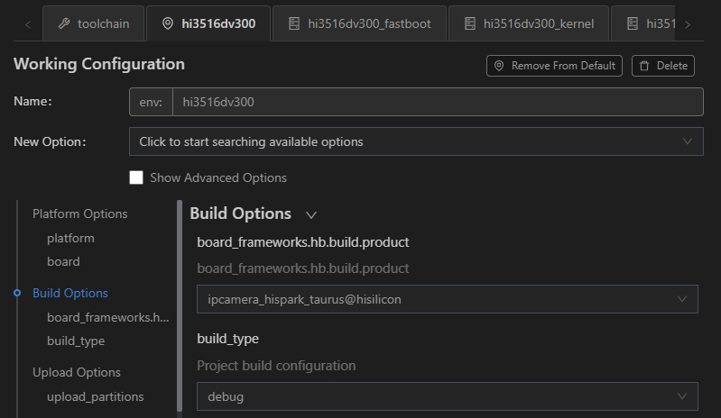
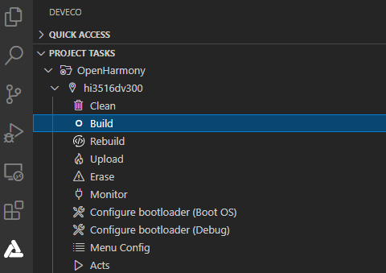

# Building

1. In **Projects**, click **Settings**. The Hi3516D V300 configuration page is displayed.

   

2. On the **toolchain** tab page, DevEco Device Tool automatically checks whether the dependent compilation toolchain is complete. If a message is displayed indicating that some tools are missing, click **SetUp** to automatically install the required tools.

   >  **NOTE**
   > If the pip component fails to be installed, [change the Python](https://device.harmonyos.com/en/docs/documentation/guide/ide-set-python-source-0000001227639986) source and try again.

   

   After the toolchain is automatically installed, the figure below is displayed.

   

3. On the **hi3516dv300** tab page, set **build_type**. The default value is **debug**. Click **Save** to save the settings.

   

4. Choose **PROJECT TASKS** > **hi3516dv300** > **Build** to start building.

   

5. Wait until **SUCCESS** is displayed in the **TERMINAL** window, indicating that the compilation is complete.

   

   After the building is complete, go to the out directory of the project to view the generated files, which are needed in [burning](https://device.harmonyos.com/en/docs/documentation/guide/ide-hi3516-upload-0000001052148681).
