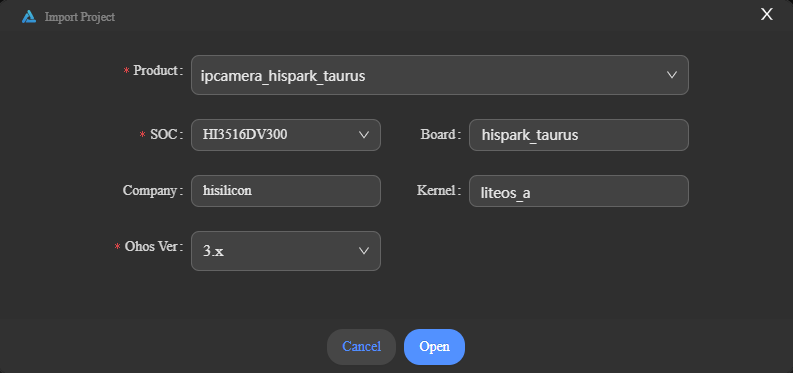
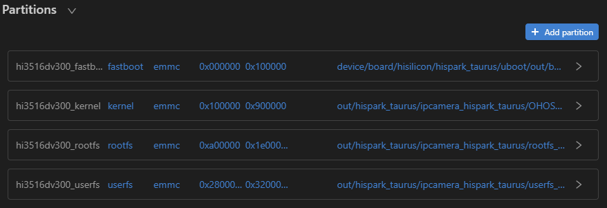
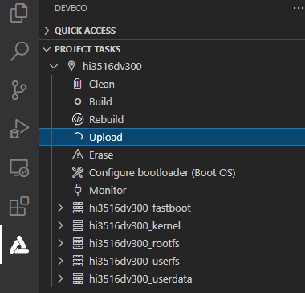

# Burning

Burning is the process of downloading compiled program files to a development board to provide a basis for subsequent debugging. With the one-click burning function of DevEco Device Tool, you can burn images on development boards quickly and efficiently.

Hi3516D V300 supports burning through the USB port, network port, and serial port. This document describes how to burn source code through the USB port in Windows.

## Importing Source Code

After the building is complete, ensure that you can [remotely access the Ubuntu environment from Windows](quickstart-lite-env-setup.md). Then, perform the following steps to import the source code before burning:

1. Open DevEco Device Tool, go to the home page, and click **Import Project** to open your project or source code.

   

2. Select the root directory of the OpenHarmony source code (in Ubuntu), select **Import OpenHarmony Source**, and click **Import**.

   >  **NOTE** 
   > Make sure the selected directory does not contain Chinese characters or spaces.

   

3. On the **Import Project** page, select a product, and the SoC, board, company, and kernel fields will be automatically populated. Then, select the OpenHarmony source code version for **Ohos Ver**.

   

4. Click **Open** to open the project or source code.

## Burning

After the source code is imported, perform the following steps:

1. Connect the computer and the target development board through the serial port and USB port. For details, see [Introduction to the Hi3516 Development Board](quickstart-lite-introduction-hi3516.md).

2. If your computer does not have the USB port driver or USB-to-serial driver, install it by following the instructions in [Installing the Serial Port Driver on the Hi3516D V300 or Hi3751 V350 Development Board](https://device.harmonyos.com/en/docs/documentation/guide/hi3516_hi3518-drivers-0000001050743695) or [Installing the USB Port Driver on the Hi3516D V300 Development Board](https://device.harmonyos.com/en/docs/documentation/guide/usb_driver-0000001058690393), depending on the missing driver.

3. In DevEco Device Tool, choose **REMOTE DEVELOPMENT** > **Local PC** to check the connection status between the remote computer (Ubuntu build environment) and the local computer (Windows build environment).

   - If  is displayed on the right of **Local PC**, the remote computer is connected to the local computer. In this case, no further action is required.
   - If  is displayed, click the connect icon. During the connection, DevEco Device Tool will restart. Therefore, to avoid task interruptions, do not connect to DevEco Device Tool when downloading or building source code.

   

4. Click **Project Settings** on the menu bar to access the Hi3516D V300 project configuration page.

   

5. On the **Tool Chain** tab page, set the Uploader burning tool. You can click **Install** on this page to install the tool online.

   

6. On the **hi3516dv300** tab page, set the burning options.

   - **upload_partitions**: Select the file to be burnt. By default, the **fastboot**, **kernel**, **rootfs**, and **userfs** files are burnt at the same time. Check the preset information of the files to be burnt and modify them when necessary. To modify the burning settings for a specific file, click  next to the file.

     >  **NOTE** 
     > Set the start address and length of the partition based on the size of the files to be burnt. Make sure the size of the partition is greater than that of the files to be burnt and the partition addresses of the files to be burnt do not overlap.

     

   - **upload_protocol**: Select the burning protocol **hiburn-usb**.

   - **upload_port**: Select the serial port number obtained.

     

7. When you finish modifying, click **Save** on the top.

8. Choose **hi3516dv300** > **Upload** to transfer the files to be burnt from Ubuntu to Windows.

   

   When the "Operation paused, Please press Enter key to continue" message is displayed, which indicates that the transfer is complete, press **Enter** to start burning.

   

9. When the following information is displayed in the **TERMINAL** window, press and hold the **Update** key within 15 seconds, remove and insert the USB cable, and then release the **Update** key to start burning.

   

   When the "SUCCESS" message is displayed, it indicates that the burning is successful.

   

10. When the burning is successful, perform the operations in "Running" to start the system.
