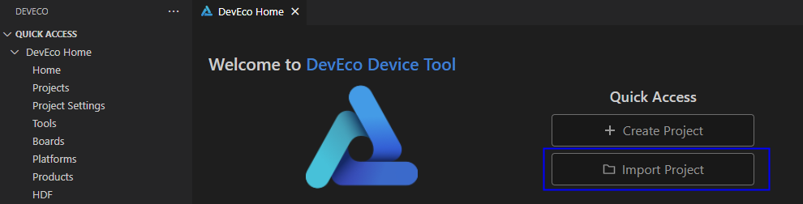
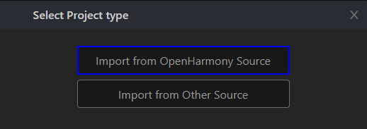
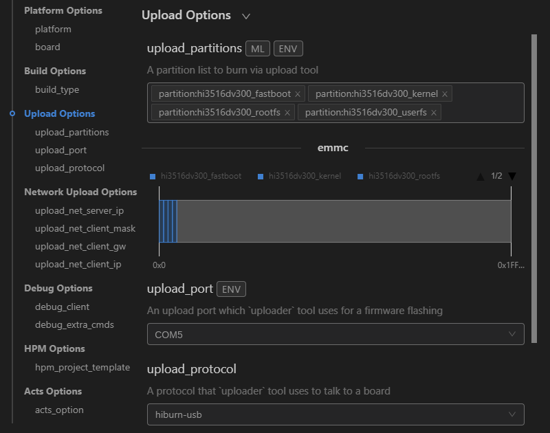
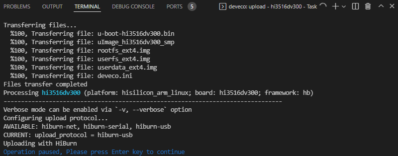
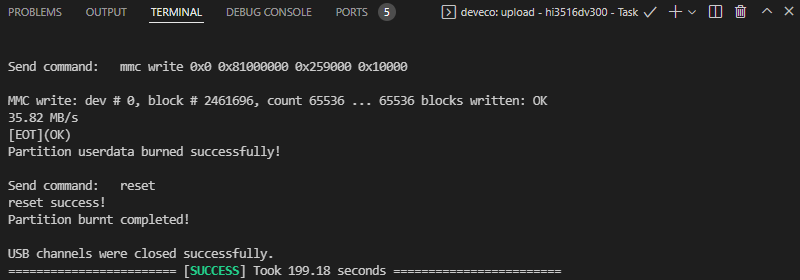

# Burning

Hi3516D V300 supports burning through the USB port, network port, and serial port. This document describes how to burn source code through the USB port. The operations are performed in Windows.

### Importing Source Code

After the building is complete, ensure that you can [remotely access the Ubuntu environment from Windows](../quick-start/quickstart-lite-env-setup.md). Then, perform the following steps to import the source code before burning:

1. Open DevEco Device Tool, go to the home page, and click **Import Project** to open your project or source code.

   

2. Select the target directory (in the Ubuntu environment) and click **Import**.

   >  **NOTE**
   > Make sure the selected directory does not contain Chinese characters or spaces. Otherwise, the building may fail.

   

3. If you select to open the OpenHarmony source code, a message will be displayed indicating that the project is not a DevEco Device Tool project. Click **Import** to continue.

   

4. On the **Select Project type** page, select **Import from OpenHarmony Source**.

   

5. On the **Import Project** page, select **ipcamera_hispark_taurus** for **Product**, and the MCU, board, company, and kernel fields will be automatically populated. Then, select the OpenHarmony source code version for **Ohos Ver**.

   

6. Click **Open** to open the project or source code.

### Burning

After the source code is imported, perform the following steps:

1. Connect the computer and the target development board through the serial port and USB port. For details, see [Introduction to the Hi3516D V300 Development Board](https://gitee.com/openharmony/docs/blob/master/en/device-dev/quick-start/quickstart-lite-introduction-hi3516.md).

2. In DevEco Device Tool, choose **REMOTE DEVELOPMENT** > **Local PC** to check the connection status between the remote computer (Ubuntu development environment) and the local computer (Windows development environment).

   - If  is displayed on the right of **Local PC**, the remote computer is connected to the local computer. In this case, no further action is required.
   - If  is displayed, click the connect icon.

   

   >  **NOTE**
   > This operation is required only in remote access mode (in the Windows+Ubuntu hybrid development environment). If the local access mode (Windows or Ubuntu development environment) is used, skip this step.

3. Check the serial port number in **QUICK ACCESS** > **DevEco Home** > **Device** in DevEco Device Tool.

   

   >  **NOTE**
   > If the serial port number is not displayed correctly, follow the steps described in [Installing the Serial Port Driver on the Hi3516 or Hi3518 Series Development Boards](https://device.harmonyos.com/en/docs/documentation/guide/hi3516_hi3518-drivers-0000001050743695).

4. Choose **QUICK ACCESS** > **DevEco Home** > **Projects**, and then click **Settings**.

   

5. On the **hi3516dv300** tab page, set the burning options.

   - **upload_partitions**: Select the file to be burnt. By default, the **fastboot**, **kernel**, **rootfs**, and **userfs** files are burnt at the same time.
   - **upload_port**: Select the serial port number obtained.
   - **upload_protocol**: Select the burning protocol **hiburn-usb**.

   

6. Check the preset information of the files to be burnt and modify them when necessary. The files to be burnt include **fastboot**, **kernel**, **rootfs**, and **userfs**.

   1. On the **hi3516dv300_fastboot** tab, select the items to be modified in **New Option**, such as **partition_bin**, **partition_addr**, and **partition_length**.

       

   2. In **Partition Options**, modify the items selected in the preceding step.

       >  **NOTE**
       > Set the start address and length of the partition based on the size of the files to be burnt. Make sure the size of the partition is greater than that of the files to be burnt and the partition addresses of the files to be burnt do not overlap.

       

   3. Follow the same procedure to modify the information about the **kernel**, **rootfs**, and **userfs** files.

7. When you finish modifying, click **Save** on the top.

8. Go to **hi3516dv300** > **Upload** to start burning.

   >  **NOTE**
   > If this is the first time you burn source code to the Hi3516D V300 or Hi3518E V300 board, the message "not find the Devices" may be displayed. In this case, follow the steps in [Installing the USB Port Driver on the Hi3516D V300 or Hi3518E V300 Development Board](https://device.harmonyos.com/en/docs/documentation/guide/usb_driver-0000001058690393) and start burning again.

   

9. When the following information is displayed in the Terminal window, press and hold the reset button, remove and insert the USB cable, and release the reset button to start burning.

   

   If the following message is displayed, it indicates that the burning is successful.

   

10. When the burning is successful, perform the operations in Running an Image to start the system.
