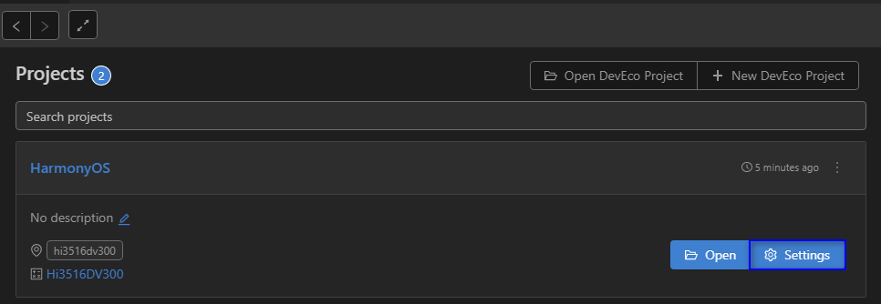
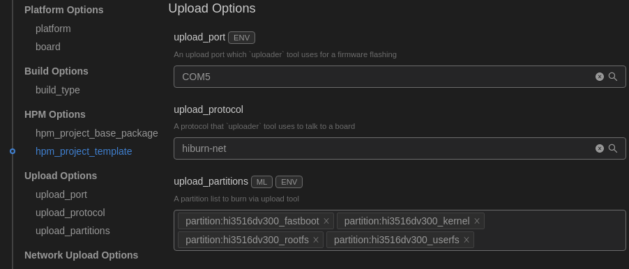

# Running a Hello OHOS Program<a name="EN-US_TOPIC_0000001174270695"></a>

This section describes how to create, compile, burn, and run the first program, and finally print  **Hello OHOS!**  on the develop board.

## Creating a Program<a name="section204672145202"></a>

1.  Create a directory and the program source code.

    Create the  **applications/sample/camera/apps/src/helloworld.c**  directory and file whose code is shown in the following example. You can customize the content to be printed. For example, you can change  **OHOS**  to  **World**. You can use either C or C++ to develop a program.

    ```
    #include <stdio.h>
    
    int main(int argc, char **argv)
    {
        printf("\n************************************************\n");
        printf("\n\t\tHello OHOS!\n");
        printf("\n************************************************\n\n");
    
        return 0;
    }
    ```

2.  Create a build file.

    Create the  **applications/sample/camera/apps/BUILD.gn**  file. The file content is as follows:

    ```
    import("//build/lite/config/component/lite_component.gni")
    lite_component("hello-OHOS") {
      features = [ ":helloworld" ]
    }
    executable("helloworld") {
      output_name = "helloworld"
      sources = [ "src/helloworld.c" ]
      include_dirs = []
      defines = []
      cflags_c = []
      ldflags = []
    }
    ```

3.  Add a new component.

    Add the configuration of the  **hello\_world\_app**  component to the  **build/lite/components/applications.json**  file. The sample code below shows some configurations defined in the  **applications.json**  file, and the code between  **\#\#start\#\#**  and  **\#\#end\#\#**  is the new configuration \(Delete the rows where  **\#\#start\#\#**  and  **\#\#end\#\#**  are located after the configurations are added.\)

    ```
    {
      "components": [
        {
          "component": "camera_sample_communication",
          "description": "Communication related samples.",
          "optional": "true",
          "dirs": [
            "applications/sample/camera/communication"
          ],
          "targets": [
            "//applications/sample/camera/communication:sample"
          ],
          "rom": "",
          "ram": "",
          "output": [],
          "adapted_kernel": [ "liteos_a" ],
          "features": [],
          "deps": {
            "components": [],
            "third_party": []
          }
        },
    ##start##
        {
          "component": "hello_world_app",
          "description": "Communication related samples.",
          "optional": "true",
          "dirs": [
            "applications/sample/camera/apps"
          ],
          "targets": [
            "//applications/sample/camera/apps:hello-OHOS"
          ],
          "rom": "",
          "ram": "",
          "output": [],
          "adapted_kernel": [ "liteos_a" ],
          "features": [],
          "deps": {
            "components": [],
            "third_party": []
          }
        },
    ##end##
        {
          "component": "camera_sample_app",
          "description": "Camera related samples.",
          "optional": "true",
          "dirs": [
            "applications/sample/camera/launcher",
            "applications/sample/camera/cameraApp",
            "applications/sample/camera/setting",
            "applications/sample/camera/gallery",
            "applications/sample/camera/media"
          ],
    ```

4.  Modify the board configuration file.

    Add the  **hello\_world\_app**  component to the  **vendor/hisilicon/hispark\_taurus/config.json**  file. The sample code below shows the configurations of the  **applications**  subsystem, and the code between  **\#\#start\#\#**  and  **\#\#end\#\#**  is the new configuration \(Delete the rows where  **\#\#start\#\#**  and  **\#\#end\#\#**  are located after the configurations are added.\)

    ```
          {
            "subsystem": "applications",
            "components": [
              { "component": "camera_sample_app", "features":[] },
              { "component": "camera_sample_ai", "features":[] },
    ##start##
              { "component": "hello_world_app", "features":[] },
    ##end##
              { "component": "camera_screensaver_app", "features":[] }
            ]
          },
    ```


## Building<a name="section1077671315253"></a>

If the Linux environment is installed using Docker, perform the building by referring to  [Using Docker to Prepare the Build Environment](../get-code/gettools-acquire.md#section107932281315). If the Linux environment is installed using a software package, go to the root directory of the source code and run the following commands for source code compilation:

```
hb set (Set the building path.)
. (Select the current path.)
Select ipcamera_hispark_taurus@hisilicon and press Enter.
hb build -f (Start building.)
```

**Figure  1**  Hi3516 settings<a name="fig1458988766"></a>  


The result files are generated in the  **out/hispark\_taurus/ipcamera\_hispark\_taurus**  directory.

> **NOTICE:** 
>The U-Boot file of the Hi3516D V300 development board can be obtained from the following path: device/hisilicon/hispark\_taurus/sdk\_liteos/uboot/out/boot/u-boot-hi3516dv300.bin

## Burning<a name="section1347011412201"></a>

The Hi3516 development board allows you to burn flash memory over the USB port, serial port, or network port. The following uses the network port burning as an example.

### Burning Through the Network Port<a name="section1935410617363"></a>

To burn Hi3516D V300 through the network port in the Windows or Linux environment:

1.  Connect the PC and the target development board through the serial port, network port, and power port. For details, see  [Introduction to the Hi3516 Development Board](https://device.harmonyos.com/en/docs/start/introduce/oem_minitinier_des_3516-0000001152041033).
2.  <a name="en-us_topic_0000001056443961_li142386399535"></a>Open Device Manager, then check and record the serial port number corresponding to the development board.

    > **NOTE:** 
    >If the serial port number is not displayed correctly, follow the steps described in  [Installing the Serial Port Driver on the Hi3516 or Hi3518 Series Development Boards](https://device.harmonyos.com/en/docs/ide/user-guides/hi3516_hi3518-drivers-0000001050743695).

    

3.  Open DevEco Device Tool, choose  **QUICK ACCESS**  \>  **DevEco Home**  \>  **Projects**, and then click  **Settings**.

    

4.  On the  **Partition Configuration**  tab page, modify the settings. In general cases, you can leave the fields at their default settings.
5.  On the  **hi3516dv300**  tab page, configure the burning options.

    -   **upload\_port**: Select the serial port number obtained in step  [2](#en-us_topic_0000001056443961_li142386399535).
    -   **upload\_protocol**: Select the burning protocol  **hiburn-net**.
    -   **upload\_partitions**: Select the file to be burnt. By default, the  **fastboot**,  **kernel**,  **rootfs**, and  **userfs**  files are burnt at the same time.

    

6.  <a name="en-us_topic_0000001056443961_li1558813168234"></a>Check and set the IP address of the network adapter connected to the development board. For details, see  [Setting the IP Address of the Network Port for Burning to Hi3516](https://device.harmonyos.com/en/docs/ide/user-guides/set_ipaddress-0000001141825075).
7.  Set the IP address of the network port for burning:

    -   **upload\_net\_server\_ip**: Select the IP address set in step  [6](#en-us_topic_0000001056443961_li1558813168234), such as 192.168.1.2.
    -   **upload\_net\_client\_mask**: Set the subnet mask of the development board, such as 255.255.255.0. Once the  **upload\_net\_server\_ip**  field is set, this field will be automatically populated.
    -   **upload\_net\_client\_gw**: Set the gateway of the development board, such as 192.168.1.1. Once the  **upload\_net\_server\_ip**  field is set, this field will be automatically populated.
    -   **upload\_net\_client\_ip**: Set the IP address of the development board, such as 192.168.1.3. Once the  **upload\_net\_server\_ip**  field is set, this field will be automatically populated.

    

8.  When you finish modifying, click  **Save**  in the upper right corner.
9.  Open the project file and go to    \>  **PROJECT TASKS**  \>  **hi3516dv300**  \>  **Upload**  to start burning.

    

10. When the following message is displayed, power off the development board and then power it on.

    

11. If the following message is displayed, it indicates that the burning is successful.

    

12. When the burning is successful, perform the operations in Running an Image to start the system.

### Running an Image<a name="section24721014162010"></a>

After burning is completed, you need to configure the bootloader to run the OpenHarmony system.

1.  In the Hi3516D V300 task, click  **Configure bootloader \(Boot OS\)**  to configure the bootloader.

    > **NOTE:** 
    >The bootloader configuration in DevEco Device Tool has been adapted to Hi3516D V300. Therefore, no manual modification is needed.

    

2.  When the message shown below is displayed, restart the development board. If  **SUCCESS**  is displayed, it indicates that the configuration is successful.

    

3.  Click  **Monitor**  on the taskbar to start the serial port tool.

    

4.  Follow the onscreen instructions until  **OHOS \#**  is displayed, indicating that the system is started successfully.

    


## Running a Program<a name="section5276734182615"></a>

In the root directory, run the  **./bin/helloworld**  command to operate the demo program. The compilation result is shown in the following example.

**Figure  2**  Successful system startup and program execution<a name="fig149821431194515"></a>  


