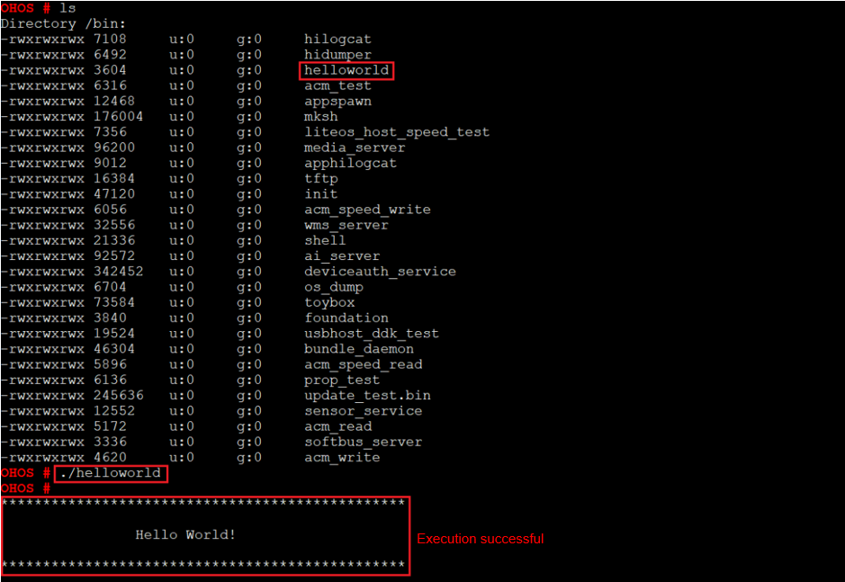

# Running


## Starting the System

After burning is completed, you need to configure the bootloader to run the OpenHarmony system.

1. In the Hi3516D V300 task, click **Configure bootloader (Boot OS)** to configure the bootloader.

   >  **NOTE**
   > The bootloader configuration in DevEco Device Tool has been adapted to Hi3516D V300. Therefore, no manual modification is needed.

   

2. When the message shown below is displayed, restart the development board. If "SUCCESS" is displayed, it indicates that the configuration is successful.

   

3. Click **Monitor** on the taskbar to start the serial port tool.

   

4. When the command output is displayed, press **Enter** until **OHOS #** is displayed, indicating that the system is started successfully.

   


## Running a Hello World Program

After the system is started, copy the executable file **helloworld** in the **out** directory of the source code to the **bin** directory, and run the Hello World program as follows:

1. Go to the **bin** directory on the startup page.
     
   ```
   cd bin
   ```

2. Run the following command to run the **helloworld** program:
     
   ```
   ./helloworld
   ```

   If the message "Hello World!" is displayed, the program runs successfully.

   


## Next

Congratulations! You have finished all steps! Proceed to [develop a sample camera with a screen](https://gitee.com/openharmony/docs/blob/master/en/device-dev/guide/device-camera.md) to better familiarize yourself with OpenHarmony development.
