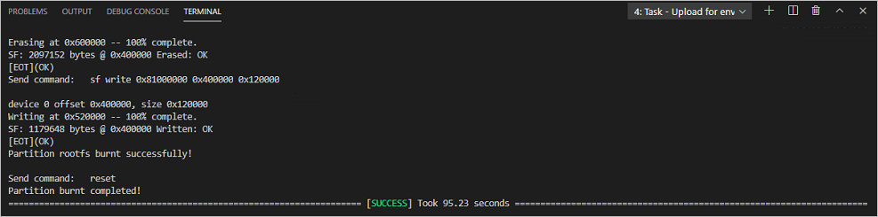
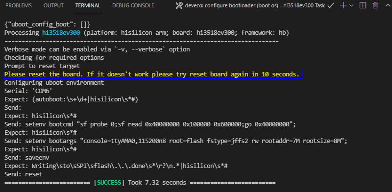

# Running a Hello OHOS Program<a name="EN-US_TOPIC_0000001174350607"></a>

-   [Creating a Program](#section1550972416485)
-   [Building](#section234175193114)
-   [Burning](#section7609155824819)
-   [Running an Image](#section17612105814480)
-   [Follow-up Learning](#section9712145420182)

This section describes how to create, compile, burn, and run the first program, and finally print  **Hello OHOS!**  on the develop board.

## Creating a Program<a name="section1550972416485"></a>

1.  Create a directory and the program source code.

    Create the  **applications/sample/camera/apps/src/helloworld.c**  directory and file whose code is shown in the following example. You can customize the content to be printed. For example, you can change  **OHOS**  to  **World**. You can use either C or C++ to develop a program.

    ```
    #include <stdio.h>
    
    int main(int argc, char **argv)
    {
        printf("\n************************************************\n");
        printf("\n\t\tHello OHOS!\n");
        printf("\n************************************************\n\n");
    
        return 0;
    }
    ```

2.  Create a build file.

    Create the  **applications/sample/camera/apps/BUILD.gn**  file. The file content is as follows:

    ```
    import("//build/lite/config/component/lite_component.gni")
    lite_component("hello-OHOS") {
      features = [ ":helloworld" ]
    }
    executable("helloworld") {
      output_name = "helloworld"
      sources = [ "src/helloworld.c" ]
      include_dirs = []
      defines = []
      cflags_c = []
      ldflags = []
    }
    ```

3.  Add a component.

    Add the configuration of the  **hello\_world\_app**  component to the  **build/lite/components/applications.json**  file. The sample code below shows some configurations defined in the  **applications.json**  file, and the code between  **"\#\#start\#\#"**  and  **"\#\#end\#\#"**  is the new configuration \(Delete the rows where  **"\#\#start\#\#"**  and  **"\#\#end\#\#"**  are located after the configurations are added.\)

    ```
    {
      "components": [
        {
          "component": "camera_sample_communication",
          "description": "Communication related samples.",
          "optional": "true",
          "dirs": [
            "applications/sample/camera/communication"
          ],
          "targets": [
            "//applications/sample/camera/communication:sample"
          ],
          "rom": "",
          "ram": "",
          "output": [],
          "adapted_kernel": [ "liteos_a" ],
          "features": [],
          "deps": {
            "components": [],
            "third_party": []
          }
        },
    ##start##
        {
          "component": "hello_world_app",
          "description": "Communication related samples.",
          "optional": "true",
          "dirs": [
            "applications/sample/camera/apps"
          ],
          "targets": [
            "//applications/sample/camera/apps:hello-OHOS"
          ],
          "rom": "",
          "ram": "",
          "output": [],
          "adapted_kernel": [ "liteos_a" ],
          "features": [],
          "deps": {
            "components": [],
            "third_party": []
          }
        },
    ##end##
        {
          "component": "camera_sample_app",
          "description": "Camera related samples.",
          "optional": "true",
          "dirs": [
            "applications/sample/camera/launcher",
            "applications/sample/camera/cameraApp",
            "applications/sample/camera/setting",
            "applications/sample/camera/gallery",
            "applications/sample/camera/media"
          ],
    ```

4.  Modify the board configuration file.

    Add the  **hello\_world\_app**  component to the  **vendor/hisilicon/hispark\_aries/config.json**  file. The sample code below shows the configurations of the  **applications**  subsystem, and the code between  **\#\#start\#\#**  and  **\#\#end\#\#**  is the new configuration \(Delete the rows where  **\#\#start\#\#**  and  **\#\#end\#\#**  are located after the configurations are added.\)

    ```
          {
            "subsystem": "applications",
            "components": [
    ##start##
              { "component": "hello_world_app", "features":[] },
    ##end##
              { "component": "camera_sample_app", "features":[] }
    
            ]
          },
    ```


## Building<a name="section234175193114"></a>

If the Linux environment is installed using Docker, perform the building by referring to  [Using Docker to Prepare the Build Environment](../get-code/gettools-acquire.md#section107932281315). If the Linux environment is installed using a software package, go to the root directory of the source code and run the following commands for source code compilation:

```
hb set (Set the building path.)
. (Select the current path.)
Select ipcamera_hispark_aries@hisilicon and press Enter.
hb build -f (Start building.)
```

The result files are generated in the  **out/hispark\_aries/ipcamera\_hispark\_aries**  directory.

**Figure  1**  Settings<a name="fig1766174411418"></a>  


> **NOTICE:** 
>The U-Boot file of the Hi3518E V300 development board can be obtained from the following path: device/hisilicon/hispark\_aries/sdk\_liteos/uboot/out/boot/u-boot-hi3518ev300.bin

## Burning<a name="section7609155824819"></a>

Programming the flash memory is the process of downloading compiled program files to a chipset development board to provide a basis for subsequent debugging. With the one-click flash memory programming function of DevEco Device Tool, you can program flash memory on development boards quickly and efficiently.

The Hi3518E V300 development board allows you to program flash memory through the USB port or serial port.

-   **Windows system: Supports programming through the USB port or serial port**
-   **Linux system: Supports programming through the serial port \(Linux+Windows dual system: Supports programming through the serial port or USB port\)**

Except for environment setup, the operations of programming are the same for Windows and Linux.

The following uses the USB port burning as an example.

1.  Connect the PC and the target development board through the serial port and USB port. For details, see  [Introduction to the Hi3518 Development Board](https://device.harmonyos.com/en/docs/start/introduce/oem_minitinier_des_3518-0000001105201138).
2.  <a name="en-us_topic_0000001057313128_li46411811196"></a>Open Device Manager, then check and record the serial port number corresponding to the development board.

    > **NOTE:** 
    >If the serial port number is not displayed correctly, follow the steps described in  [Installing the Serial Port Driver on the Hi3516 or Hi3518 Series Development Boards](https://device.harmonyos.com/en/docs/ide/user-guides/hi3516_hi3518-drivers-0000001050743695).

    

3.  Open DevEco Device Tool and go to  **Projects**  \>  **Settings**.

    

4.  On the  **Partition Configuration**  tab page, modify the settings. In general cases, you can leave the fields at their default settings.
5.  On the  **hi3518ev300**  tab page, set the programming options.

    -   **upload\_port**: Select the serial port number obtained in step  [2](#en-us_topic_0000001057313128_li46411811196).
    -   **upload\_protocol**: Select the programming protocol  **hiburn-usb**.
    -   **upload\_partitions**: Select the file to be programmed. By default, the  **fastboot**,  **kernel**,  **rootfs**, and  **userfs**  files are programmed at the same time.

    

6.  When you finish modifying, click  **Save**  in the upper right corner.
7.  Open the project file, go to    \>  **PROJECT TASKS**  \>  **hi3518ev300\_fastboot**  \>  **Erase**  to erase U-Boot.

    

8.  When the following message is displayed, power off the development board and then power it on.

    

9.  If the following message is displayed, it indicates that U-Boot is erased successfully.

    

10. Go to  **hi3518ev300**  \>  **Upload**  to start programming.

    

11. If the following message is displayed, it indicates that the programming is successful.

    


## Running an Image<a name="section17612105814480"></a>

After programming is completed, you need to configure the bootloader to run the OpenHarmony system.

1. In the Hi3518E V300 task, click  **Configure bootloader \(Boot OS\)**  to configure the bootloader.

   >  **NOTE:** 
   > The bootloader configuration in DevEco Device Tool has been adapted to Hi3518E V300. Therefore, no manual modification is needed.

   

2. When the message shown below is displayed, restart the development board. If  **SUCCESS**  is displayed, it indicates that the configuration is successful.

   

3. Click  **Monitor**  on the taskbar to start the serial port tool.

   

4. Follow the onscreen instructions until  **OHOS \#**  is displayed, indicating that the system is started successfully.

   


## Follow-up Learning<a name="section9712145420182"></a>

Congratulations! You have finished all steps! You are advised to go on learning how to develop  [Cameras with a Screen](../guide/device-wlan-sdk.md).

