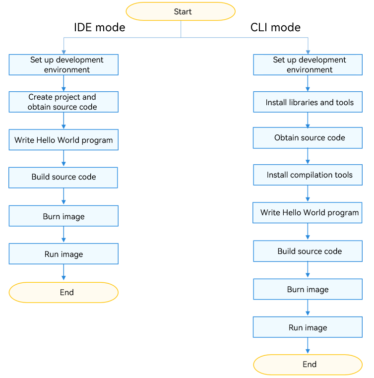

# Quick Start Overview

OpenHarmony is an open-source distributed operating system for all scenarios. It uses a component-based design to better suit devices with 128 KiB to GiB-level of RAM. You can integrate a flexible combination of system components based on the hardware capabilities of devices.

OpenHarmony defines three basic system types. You only need to select a suitable system type and configure the mandatory component set, thereby developing a system for your device at the minimum workload. The definitions of the basic system types are provided as follows for your reference:

**Table 1** Basic system types

| System Type| Processor| Minimum Memory| Competence|
| -------- | -------- | -------- | -------- |
| Mini system| MCU processors, such as Arm Cortex-M and 32-bit RISC-V| 128 KiB | Provides a variety of lightweight network protocols, a lightweight graphics framework, and a wide range of read/write components with the Internet of Things (IoT) bus. Applicable products include connection modules, sensors, and wearables for smart home.|
| Small system| Application processors, such as Arm Cortex-A| 1 MiB | Provides higher security capabilities, a standard graphics framework, and video encoding and decoding capabilities. Applicable products include smart home products such as IP cameras, peephole cameras, and routers as well as smart travel products such as event data recorders (EDRs).|
| Standard system| Application processors, such as Arm Cortex-A| 128 MiB | Provides a complete application framework supporting enhanced interactions, 3D GPU, hardware composer, diverse components, and rich animations. Applicable products include high-end refrigerator displays.|

This document helps you quickly get started with OpenHarmony device development, from environment setup to "Hello World" program running.

## Operations

To accommodate different developer habits, OpenHarmony provides two modes for getting started with OpenHarmony device development:

**Table 2** Modes for getting started

| Mode| Tool| Description| Target Audience|
| -------- | -------- | -------- | -------- |
| [IDE mode](quickstart-ide-env-win.md) | DevEco Device Tool| DevEco Device Tool, an integrated development environment (IDE), is used for one-stop development, covering dependency installation, building, burning, and running. DevEco Device Tool works in the Windows+Ubuntu hybrid development environment. - Windows: code development, debugging, and image burning - Ubuntu: source code compilation DevEco Device Tool provides an intuitive GUI to accelerate your development.| - Developers who are unfamiliar with the command line - Developers who are accustomed to GUI-based operations|
| [CLI mode](quickstart-pkg-prepare.md)| Command line tools| The command-line interface (CLI) is used to download and install the compilation tools. In Linux, commands are used to build source code. In Windows, the tools provided by the development board vendors are used to burn an image. The CLI mode allows you to install the required toolchain easily in a centralized manner.| Developers who are familiar with the command line|

## Development Boards

This document describes the system development with three typical development boards. Purchase the development board as needed.

**Table 3** Mapping between development boards and system types

| Development Board| System Type| Description|
| -------- | -------- | -------- |
| Hi3861 WLAN module| Mini| [Hi3861 Development Board](quickstart-appendix-hi3861.md)|
| Hi3516DV300 | Small| [Hi3516 Development Board](quickstart-appendix-hi3516.md)|
| RK3568 | Standard| [RK3568 Development Board](quickstart-appendix-rk3568.md)|

## How to Develop

Below you can see the quick start process.

**Figure 1** Quick start process

