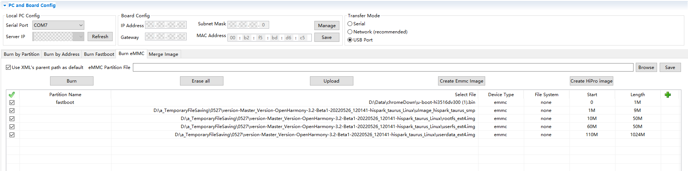

# Burning an Image


The following exemplifies how to burn an image to Hi3516DV300 using HiTool. You can also do so using DevEco Device Tool, by following instructions in [Burning an Image](quickstart-appendix-hi3516-ide.md#burning-an-image).


## **Prerequisites**

- The source code of the development board has been compiled into files for burning.

- [HiTool](http://www.hihope.org/download/download.aspx) has been installed on the client platform (for example, a Windows-based computer).

- The USB port driver has been installed on the client platform. For details, see [Installing the USB Port Driver on the Hi3516D V300 Development Board](https://device.harmonyos.com/en/docs/documentation/guide/usb_driver-0000001058690393).

- A serial port terminal tool, such as IPOP, has been installed on the client platform.

- The client platform and development board are connected using a USB cable and serial cable.


## Procedure

1. Prepare the files to be burnt.
   1. On the client platform, create a folder for storing the files to be burnt, for example, **D:\liteos** or **D:\linux**.
   2. Save the burning configuration file and boot file to the new folder.
       - For the small system with the LiteOS kernel, the burning configuration file is **L1_3516_liteos.xml**, and the boot file is **[u-boot-hi3516dv300.bin](https://gitee.com/openharmony/device_board_hisilicon/tree/master/hispark_taurus/uboot/out/boot)**.
          You need to prepare the **L1_3516_liteos.xml** file on your own by applying the template below:

          
          ```
          <?xml version="1.0" encoding="GB2312" ?>
          <Partition_Info ProgrammerFile="">
          <Part Sel="1" PartitionName="fastboot" FlashType="emmc" FileSystem="none" Start="0" Length="1M" SelectFile="D:\liteos\u-boot-hi3516dv300.bin"/>
          <Part Sel="1" PartitionName="" FlashType="emmc" FileSystem="none" Start="1M" Length="9M" SelectFile="D:\liteos\OHOS_Image.bin"/>
          <Part Sel="1" PartitionName="" FlashType="emmc" FileSystem="none" Start="10M" Length="50M" SelectFile="D:\liteos\rootfs_vfat.img"/>
          <Part Sel="1" PartitionName="" FlashType="emmc" FileSystem="none" Start="60M" Length="50M" SelectFile="D:\liteos\userfs_vfat.img"/>
          </Partition_Info>
          ```
       - For the small system with the Linux kernel, the burning configuration file is **L1_3516_linux.xml**, and the boot file is **[u-boot-hi3516dv300.bin](https://gitee.com/openharmony/device_board_hisilicon/tree/master/hispark_taurus/uboot/out/boot)**.
          You need to prepare the **L1_3516_linux.xml** file on your own by applying the template below:

          
          ```
          <?xml version="1.0" encoding="GB2312" ?>
          <Partition_Info ProgrammerFile="">
          <Part Sel="1" PartitionName="fastboot" FlashType="emmc" FileSystem="none" Start="0" Length="1M" SelectFile="D:\linux\u-boot-hi3516dv300.bin"/>
          <Part Sel="1" PartitionName="ohos_image" FlashType="emmc" FileSystem="none" Start="1M" Length="9M" SelectFile="D:\linux\uImage_hi3516dv300_smp"/>
          <Part Sel="1" PartitionName="rootfs" FlashType="emmc" FileSystem="ext3/4" Start="10M" Length="50M" SelectFile="D:\linux\rootfs_ext4.img"/>
          <Part Sel="1" PartitionName="userfs" FlashType="emmc" FileSystem="ext3/4" Start="60M" Length="50M" SelectFile="D:\linux\userfs_ext4.img"/>
          <Part Sel="1" PartitionName="userdata" FlashType="emmc" FileSystem="ext3/4" Start="110M" Length="1024M" SelectFile="D:\linux\userdata_ext4.img"/>
          </Partition_Info>
          ```
   3. Download the compiled source package to the client platform, decompress the package, and copy the files required for burning to the folder created in step 1.
      
      For the Hi3516 development board, the files required for burning of the mini system are as follows:

       - Small system with the LiteOS kernel: **OHOS_Image.bin**, **rootfs_vfat.img**, and **userfs_vfat.img**
       - Small system with the Linux kernel: **uImage_hi3516dv300_smp**, **rootfs_ext4.img**, **userfs_ext4.img**, and **userdata_ext4.img**

2. Burn the image files using HiTool.
   1. Open HiTool.
   2. Set up HiTool.
      
      Set the transfer mode to USB and burning mode to eMMC (the storage medium of the development board is eMMC).
   3. Click **Browse** and select the burning configuration file (for example, **L1_3516_linux.xml**) from the folder created in step 1.
      
       
   4. After clicking the **Burn** button, press and hold the **Update** key next to the serial port on the development board, and remove and insert the USB cable.
      
      After the burning starts, logs are displayed in the console area at the bottom of HiTool.

      When the burning is complete, HiTool displays a dialog box indicating that the burning is successful.
   5. Click **OK**.

3. Import startup parameters.
   1. Use the terminal tool to enable the serial port.
   2. Restart the development board by removing and inserting its power supply. Press **Enter** in the serial port terminal tool within 3 seconds.
      
      If **hisilicon \#** is displayed on the terminal tool page, the serial port of the development board is connected.
   3. Copy the following startup parameters in the serial port terminal tool and press **Enter** to complete the setup.
       - Startup parameters corresponding to the small system with the LiteOS kernel:
         
          ```
          setenv bootcmd "mmc read 0x0 0x80000000 0x800 0x4800;go 0x80000000";
          setenv bootargs "console=ttyAMA0,115200n8 root=emmc fstype=vfat rootaddr=10M rootsize=50M rw";
          saveenv
          sa;reset
          ```
       - Startup parameters corresponding to small system with the Linux kernel:
         
          ```
          setenv bootargs "mem=128M console=ttyAMA0,115200 root=/dev/mmcblk0p3 rw rootfstype=ext4 rootwait blkdevparts=mmcblk0:1M(boot),9M(kernel),50M(rootfs),50M(userfs),1024M(userdata)"
          setenv bootcmd "mmc read 0x0 0x82000000 0x800 0x4800; mw 0x10FF0044 0x0600;mw 0x120D2010 0x00000000;mw 0x120D2400 0x000000ff;mw 0x120D2010 0x00000000; bootm 0x82000000"
          saveenv;
          reset
          ```
