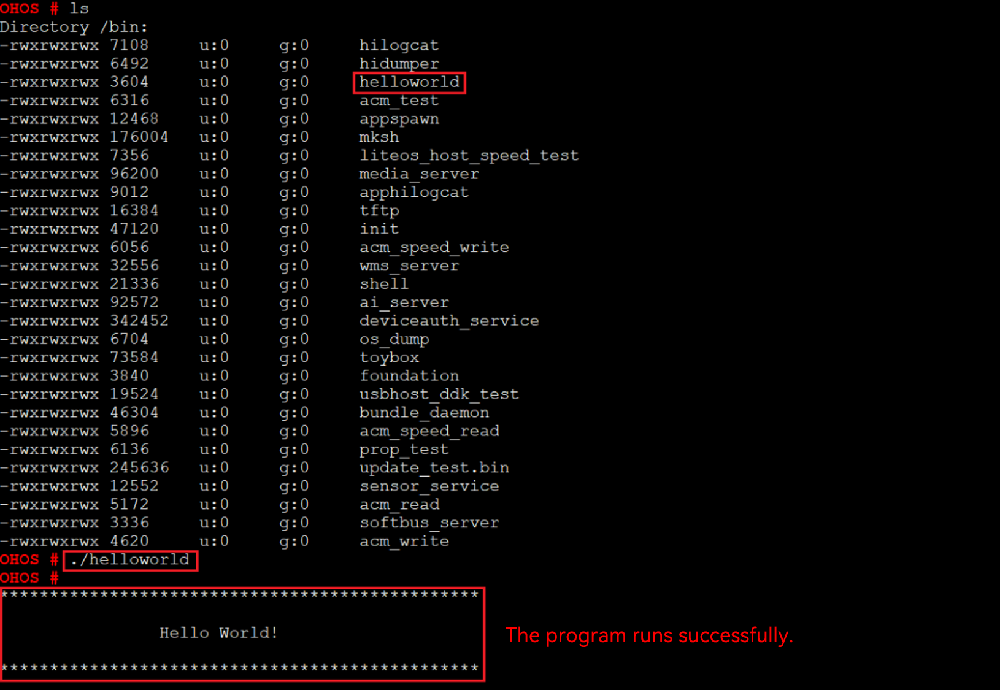

# Running an Image


After the system is started, copy the executable file **helloworld** in the **out** directory of the source code to the **bin** directory, and run the Hello World program as follows:


## Procedure

1. Go to the **bin** directory on the startup page.
   
   ```
   cd bin
   ```

2. Run the following command to run the **helloworld** program:
   
   ```
   ./helloworld
   ```

   If the message "Hello World!" is displayed, the program runs successfully.

   


## Next

Congratulations! You have finished all steps! Proceed to develop samples to better familiarize yourself with OpenHarmony development:

- [Screen and Camera Control](../guide/device-camera-control-overview.md)

- [Visual Application Development](../guide/device-camera-visual-overview.md)
