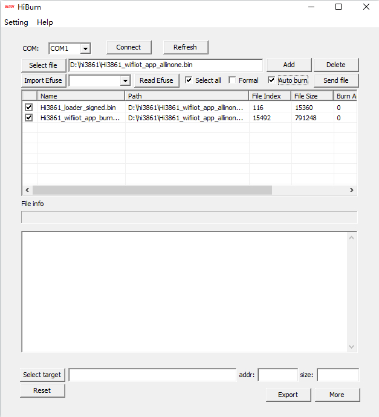

# Burning an Image

The following exemplifies how to burn an image to Hi3861 using Hi3861. You can also do so using DevEco Device Tool, by following instructions in [Burning an Image](quickstart-ide-3861-burn.md).

## Prerequisites

- The source code of the development board has been compiled into files for burning.

- [HiBurn](https://gitee.com/hihope_iot/docs/tree/master/HiSpark_WiFi_IoT/Software/tools) has been installed on the client platform (for example, a Windows-based computer).

- The USB-serial adapter driver has been installed on the client platform. For details, see [Installing the USB-Serial Adapter Driver](https://device.harmonyos.com/en/docs/documentation/guide/hi3861-drivers-0000001058153433).

- A serial port terminal tool, such as IPOP, has been installed on the client platform.

- The client platform is connected to the development board through a USB cable.

## Procedure

1. Prepare the files to be burnt.
   1. On the client platform, create a folder for storing the files to be burnt, for example, **D:\hi3861**.
   2. Download the compiled source package to the client platform, decompress the package, and copy the files required for burning to the folder created in step 1.
      Specifically, the files required for burning are **Hi3861_wifiiot_app_burn.bin** and **Hi3861_loader_signed.bin**.

2. Burn the files using HiBurn.
   1. Open HiBurn.
   
   2. In the HiBurn window, select a COM port and enable **Select all** and **Auto burn**.
      
      **Figure 1** HiBurn window 
      
      
      
   3. Click **Select file** and select the files in the folder created in step 1.
      
       **Figure 2** File selected 
     
       
       
   4. Verify the COM port settings and click **Connect**. Then press the Reset button next to the serial port on the development board to start burning.
    
      After the burning starts, logs are displayed in the console area at the bottom of HiBurn.
    
      After the burning is complete, the message "Execution Successful" is displayed in the console area.
       
      **Figure 3** Connect clicked 
    
      
       
       **Figure 4** Burning in process after the Reset button is pressed on the development board 
    
      
       
       **Figure 5** Burning completed 
       
       
       
   5. Click **Disconnect**.
