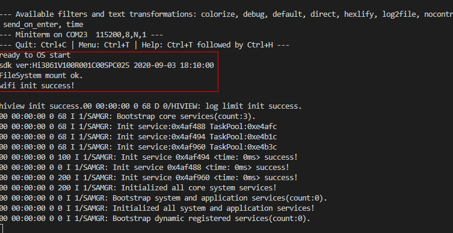

# Running an Image


## Networking Configuration

After you have completed building and burning, perform the following to connect the Hi3861 WLAN module to the Internet.

1. While the Windows workbench is connected to the Hi3861 WLAN module, ensure that the serial port terminal is displayed properly.

2. Reset the Hi3861 WLAN module. The message **ready to OS start** is displayed on the **TERMINAL** panel, indicating that the WLAN module is started successfully.
   
   **Figure 1** Successful resetting of the Hi3861 WLAN module 
  
   

3. Run the following AT commands in sequence to enable the STA mode, connect to the specified AP, and enable the DHCP function:
   
   ```
   AT+STARTSTA                             # Start the STA mode.
   AT+SCAN                                 # Scan for available APs.
   AT+SCANRESULT                           # Display the scanning result.
   AT+CONN="SSID",,2,"PASSWORD"            # Connect to the specified AP. (SSID and PASSWORD represent the name and password of the hotspot to be connected, respectively.)
   AT+STASTAT                              # View the connection result.
   AT+DHCP=wlan0,1                         # Request the IP address of wlan0 from the AP using DHCP.
   ```

4. Check whether the Hi3861 WLAN module is properly connected to the gateway, as shown in the following figure.
   
   ```
   AT+IFCFG                                # View the IP address assigned to an interface of the module.
   AT+PING=X.X.X.X                         # Check the connectivity between the module and the gateway. Replace X.X.X.X with the actual gateway address.
   ```

   **Figure 2** Successful networking of the Hi3861 WLAN module 
   


## Verification

When the burning and networking are complete, you can use either of the following methods to debug and verify whether the source code has been burnt correctly:

1. Using printf to print logs

2. Using ASM files to locate panic issues

As the example used here is simple, we use the printf method. The following describes the two methods in detail.


### Using printf to Print Logs

Add the printf function to the code, which helps print data to the serial port. You can add log printing in key service paths or service exception locations, as shown in the following figure.


```
void HelloWorld(void)
{
    printf("[DEMO] Hello world.\n");
}
```


### Using ASM Files to Locate Issues

If the system exits abnormally, the call stack information about the abnormal exit is displayed on the serial port. Analyze the displayed information to troubleshoot and pinpoint issues.

```
=======KERNEL PANIC=======
**Call Stack*
Call Stack 0 -- 4860d8 addr:f784c
Call Stack 1 -- 47b2b2 addr:f788c
Call Stack 2 -- 3e562c addr:f789c
Call Stack 3 -- 4101de addr:f78ac
Call Stack 4 -- 3e5f32 addr:f78cc
Call Stack 5 -- 3f78c0 addr:f78ec
Call Stack 6 -- 3f5e24 addr:f78fc
Call Stack end***
```

To analyze the call stack information, the **Hi3861_wifiiot_app.asm** file is required. This file records the symbol addresses of the functions in the code in the flash memory and the disassembly information. The ASM file is built and output together with the version software package and is stored in the **./out/wifiiot/** directory.

1. (Optional) Save the call stack information to a TXT file for editing.

2. Open the ASM file, search for the function address in each call stack, and list the corresponding function. Generally, you only need to find the functions matching the first several stacks to locate issues.
   
   ```
   Call Stack 0 -- 4860d8 addr:f784c -- WadRecvCB
   Call Stack 1 -- 47b2b2 addr:f788c -- wal_sdp_process_rx_data
   Call Stack 2 -- 3e562c addr:f789c
   Call Stack 3 -- 4101de addr:f78ac
   Call Stack 4 -- 3e5f32 addr:f78cc
   Call Stack 5 -- 3f78c0 addr:f78ec
   Call Stack 6 -- 3f5e24 addr:f78fc
   ```

3. Based on the above call stack information, it can be determined that an exception occurs in the **WadRecvCB** function.
  
   

4. Check and modify the code.


## Execution Result Examination

After the sample code is compiled, burnt, run, and debugged, restart the development board. If the following messages are displayed, the image is running correctly:


```
ready to OS start
FileSystem mount ok.
wifi init success!
[DEMO] Hello world.
```

Next

Congratulations! You have finished all steps! Proceed to develop samples to better familiarize yourself with OpenHarmony development:

- [LED Peripheral Control](../guide/device-wlan-led-control.md)

- [Third-Party SDK Integration](../guide/device-wlan-sdk.md)
