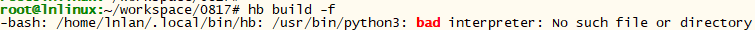

# Fixing Compilation and Building Errors


## "ImportError: No module named apt_pkg" is displayed during the execution of an unidentifiable command

- **Symptom**
  
  The message "ImportError: No module named apt_pkg" is displayed when an unidentifiable command is executed on the Linux server.

- **Possible Causes**
  
  There is a compatibility issue of python3-apt.

- **Solution**
  
  Reinstall python3-apt.

  
  ```
  sudo apt-get remove  python3-apt
  sudo apt-get install python3-apt
  ```


## The message indicating Python cannot be found is displayed during the build process

- **Symptom**

  The following information is displayed during the build process:

  
  ```
  -bash: /usr/bin/python: No such file or directory
  ```

- **Possible Cause 1**
  
  Python is not installed.

- **Solution**
  
  Run the following command to install Python. The following uses Python 3.8 as an example.

  
  ```
  sudo apt-get install python3.8
  ```

- **Possible Cause 2**
  
  The soft link to Python does not exist in the **usr/bin** directory.

  

- **Solution**
  
  Run the following commands to add the soft link to Python:

  
  ```
  # cd /usr/bin/ 
  # which python3
  # ln -s /usr/local/bin/python3 python
  # python --version
  ```

  Example:

  


## The message indicating Python 3 cannot be found is displayed during the build process

- **Symptom**
  
  

- **Possible Causes**

  Python 3 is not installed.

- **Solution**
  
  Run the following command to install Python 3:

  
  ```
  sudo apt-get install python3.8
  ```


## "configure: error: no acceptable C compiler found in $PATH" is displayed during Python 3 installation

- **Symptom**
  
  The following information is displayed during the Python 3 installation process:

  
  ```
  configure: error: no acceptable C compiler found in $PATH. See 'config.log' for more details
  ```

- **Possible Causes**
  
  GCC is not installed.

- **Solution**
  1. Run the **apt-get install gcc** command to install **gcc** online.
  2. Install Python 3.


## "-bash: make: command not found" is displayed during Python 3 installation

- **Symptom**
  
  The following information is displayed during the Python 3 installation process:

  
  ```
  -bash: make: command not found
  ```

- **Possible Causes**
  
  make is not installed.

- **Solution**
  1. Run the **apt-get install make** command to install make online.
  2. Install Python 3.


## "No module named '_ctypes'" is displayed during Python 3 installation

- **Symptom**
  
  The following information is displayed during the Python 3 installation process:

  
  ```
  ModuleNotFoundError: No module named '_ctypes'
  ```

- **Possible Causes**
  
  libffi and libffi-devel are not installed.

- **Solution**
  1. Run the **apt-get install libffi* -y** command to install libffi and libffi-devel online.
  2. Install Python 3.


## "No module named 'Crypto'" is displayed during the build process

- **Symptom**
  
  The following information is displayed during the build process:

  
  ```
  ModuleNotFoundError: No module named 'Crypto'
  ```

- **Possible Causes**
  
  **Crypto** is not installed.

- **Solution**
  Method 1: Run the **pip3 install Crypto** command to install **Crypto** online.

  Method 2: Install **Crypto** offline.

  Download the source code from [PyPI](https://pypi.org/project/pycrypto/#files).

  

  Save the source package to the Linux server, decompress the package, and run the **python3 setup.py install** command to install **Crypto**.

  Start the build again.


## (Hi3861) "No module named 'ecdsa'" is displayed during the build process

- **Symptom**
  
  The following information is displayed during the build process:

  
  ```
  ModuleNotFoundError: No module named 'ecdsa'
  ```

- **Possible Causes**
  
  **ecdsa** is not installed.

- **Solution**
  Method 1: Run the **pip3 install ecdsa** command to install **ecdsa** online.

  Method 2: Offline installation

  Download the installation package from [PyPI](https://pypi.org/project/ecdsa/#files).

  

  Save the installation package to the Linux server and run the **pip3 install ecdsa-0.15-py2.py3-none-any.whl** command to install ecdsa.

  Start the build again.


## (Hi3861)" Could not find a version that satisfies the requirement six>=1.9.0" is displayed during the build process

- **Symptom**
  
  The following information is displayed during the build process:

  
  ```
  Could not find a version that satisfies the requirement six>=1.9.0
  ```

- **Possible Causes**
  
  **six** is not installed.

- **Solution**
  Method 1: Run the **pip3 install six** command to install **six** online.

  Method 2: Install **six** offline.

  Download the installation package from [PyPI](https://pypi.org/project/six/#files).

  

  Save the source code to the Linux server and run the **pip3 install six-1.14.0-py2.py3-none-any.whl** command to install **six**.

  Start the build again.


## (Hi3861) "cannot find -lgcc" is displayed during the build process

- **Symptom**
  
  The following information is displayed during the build process:

  
  ```
  riscv32-unknown-elf-ld: cannot find -lgcc
  ```

- **Possible Causes**
  
  The gcc_riscv32 path is incorrectly set as follows. There is an extra slash (/) after **bin**.

  
  ```
  ~/gcc_riscv32/bin/:/data/toolchain/
  ```

- **Solution**
  
  Modify the gcc_riscv32 path as follows:

  
  ```
  ~/gcc_riscv32/bin:/data/toolchain/
  ```


## (Hi3861) An lsb_release error occurs during kconfiglib installation

- **Symptom**
  
  The following information is displayed during the **kconfiglib** installation process:

  
  ```
  subprocess.CalledProcessError: Command '('lsb_release', '-a')' returned non-zero exit status 1.
  ```

- **Possible Causes**
  
  The Python version matched with the **lsb_release** module is different from the current Python version.

- **Solution**
  
  Run the **find / -name lsb_release** command, for example, **sudo rm -rf /usr/bin/lsb_release** to locate and delete **lsb_release**.
