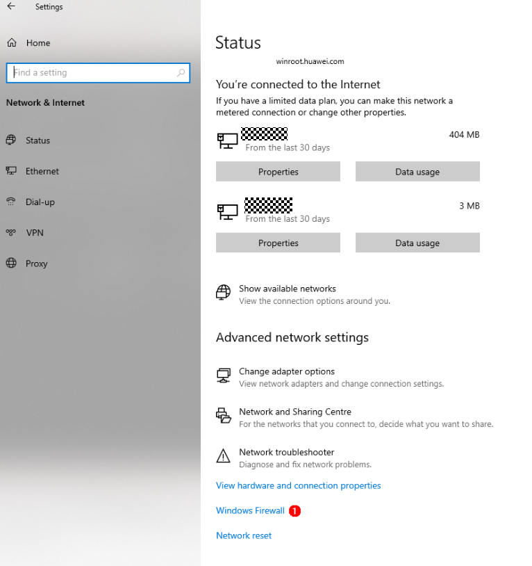

# Fixing Image Burning Errors

## "Error: Opening COMxx: Access denied" is displayed when I start image burning

- **Symptom**
  
  "Error: Opening COMxx: Access denied" is displayed after a serial port is selected to start image burning.

    **Figure 1** Failed to open the serial port 
  
   

- **Possible Causes**
  
  The serial port is in use.

- **Solution**

1. Search for the terminal using serial-xx from the drop-down list in the **TERMINAL** panel.
   
    **Figure 2** Checking whether the serial port is in use 
   
   

2. Click the dustbin icon as shown below to disable the terminal using the serial port.
   
    **Figure 3** Disabling the terminal using the serial port 
  
   

3. Click **Burn**, select the serial port, and start burning images again.
   
    **Figure 4** Restarting the burning task 

   

## The development board failed to connect to the PC

- **Symptom**
  
  The file image cannot be obtained after a serial port is selected to start image burning.

    **Figure 5** Failed to obtain the file image due to network disconnection 
  
   

- **Possible Causes**
  
  The development board is disconnected from the PC.

  Windows Firewall does not allow Visual Studio Code to access the network.

- **Solution**

1. Check whether the network cable is properly connected.

2. Click **Windows Firewall**.
   
    **Figure 6** Network and firewall settings 
   
   

3. Click **Firewall & network protection**, and on the displayed page, click **Allow applications to communicate through Windows Firewall**.
   
    **Figure 7** Firewall and network protection 
  
   

4. Select Visual Studio Code.
   
    **Figure 8** Selecting Visual Studio Code 
  
   

5. Select the **Private** and **Public** network access rights for Visual Studio Code.
   
   **Figure 9** Allowing Visual Studio Code to access the network 
   
   

## (Hi3516) No information is displayed through the serial port

- **Symptom**
  
  The serial port shows that the connection has been established. However, no information is displayed through the serial port after the board is restarted and **Enter** is pressed.

- **Possible Cause 1**
  
  The serial port is connected incorrectly.

- **Solution**
  
  Change the serial port number.

  Start **Device Manager** to check whether the serial port connected to the board is the same as that connected to the terminal device. If the serial ports are different, correct the serial port number by following instructions in ["Error: Opening COMxx: Access denied" is displayed when I start image burning](#error-opening-comxx-access-denied-is-displayed-when-i-start-image-burning).

- **Possible Cause 2**
  
  The U-Boot of the board is damaged.

- **Solution**

  Burn the U-Boot.

  If the fault persists after you perform the preceding operations, the U-Boot of the board may be damaged. You can burn the U-Boot by performing the following steps:

1. Obtain the U-Boot file.
   >  **NOTICE**
   >
   > You can download the U-Boot file from the [open-source package](device\hisilicon\hispark_taurus\sdk_liteos\uboot\out\boot\u-boot-hi3516dv300.bin).
   
2. Burn the U-Boot file.
   
   Follow the instructions in [Burning Through the USB Port](https://device.harmonyos.com/en/docs/documentation/guide/upload_hi3516_small_system-0000001326267405).

3. Log in to the serial port after the burning is complete.
   
    **Figure 10** Information displayed through the serial port after the U-Boot is burnt 
   
   
