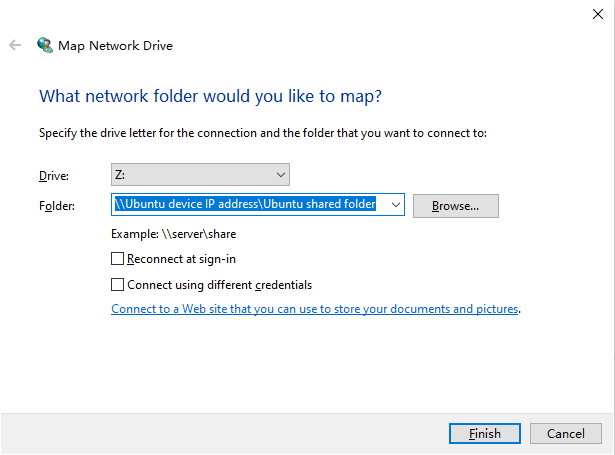
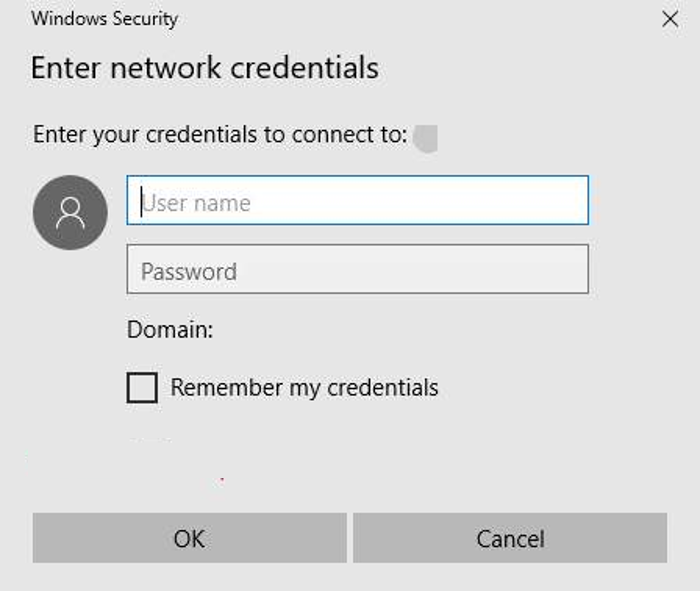

# Setting Up the Development Environment


In embedded development, Windows-based tools, such as Visual Studio Code, are widely used in code editing. Yet, because the source code of most development boards, such as Hi3861 and Hi3516, cannot be built in Windows, these development boards require the Ubuntu build environment. Therefore, for these development boards, you need Ubuntu to build source code and Windows to burn images.

Set up the Windows and Ubuntu development environments that meet the [Windows Requirements](#windows-requirements) and [Ubuntu Requirements](#ubuntu-requirements), respectively. Then enable Windows to remotely access Ubuntu. No specific requirements are placed on the development devices.


>  **NOTE**
>
> OpenHarmony also provides the [Docker environment](https://gitee.com/openharmony/docs/blob/master/en/device-dev/get-code/gettools-acquire.md), which can significantly simplify the environment configuration before compilation. You can build your source code in the Docker environment if you are more accustomed to using the command line.


## Windows Requirements

64-bit Windows 10


## Ubuntu Requirements

- OS: Ubuntu 18.04 or later, X86_64 architecture, and 16 GB or more of RAM (recommended)

- User name: cannot contain Chinese characters


## Preparing for Remote Access

When burning images in Windows, you need to remotely access the source code and image files in Ubuntu. To achieve this, use a file transfer or sharing tool.

In this example the Samba server is used.


### Configuring the Samba Server

Perform the following operations in Ubuntu:

1. Install the Samba software package.
   
   ```
   sudo apt-get install samba samba-common
   ```

2. Configure the sharing information in the Samba configuration file.
     
     Open the **smb.conf** file.
   
   ```
   sudo gedit /etc/samba/smb.conf   
   ```
   
   Append the following information to the configuration file:
   
   
   ```
   [Share]                    # Name of the root folder mapped in Windows (Share is used as an example)
   comment = Shared Folder    # Information about the sharing
   path = /home/share         # Shared directory
   valid users = username     # User who can access the shared directory (user name in Ubuntu)
   directory mask = 0775      # Default directory permissions
   create mask = 0775         # Default file permissions
   public = yes               # Whether to enable public access
   writable = yes             #  Whether to enable write access
   available = yes            # Whether the directory is available
   browseable = yes           # Whether the directory is browseable
   ```
     
3. Add the user name and password for accessing the Samba server.

   ```
   sudo smbpasswd -a username   # Enter the Ubuntu user name. Then set the password as prompted.
   ```

4. Run the following command to restart the Samba service:

   ```
   sudo service smbd restart
   ```


### Mapping a Network Drive in Windows

Perform the following operations in Windows:

1. Right-click **This PC** and choose **Map network drive** from the shortcut menu. In the **Drive** list, select a drive letter. In the **Folder** field, enter the path in the format of *\\Ubuntu device IP address\Ubuntu shared folder*.

   

2. Enter the user name and password for accessing the Samba server, which has been set up in [Configuring the Samba Server](#configuring-the-samba-server).

   

3. The shared directory is displayed in Windows and available for access.
