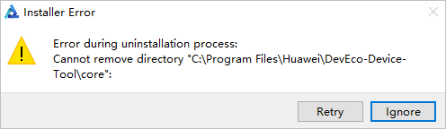
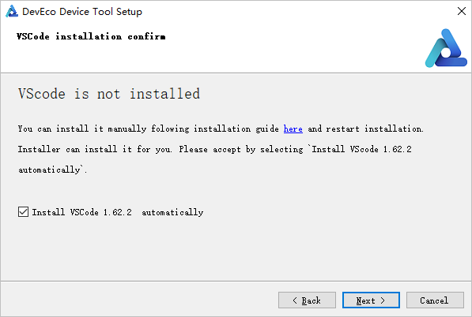
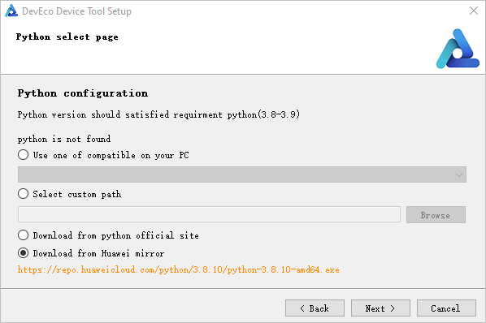
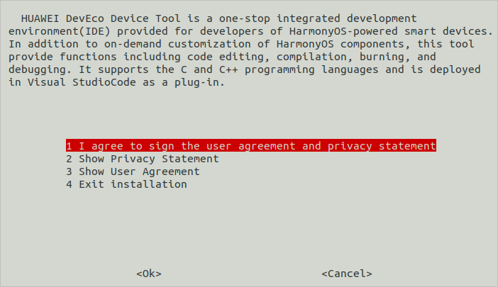
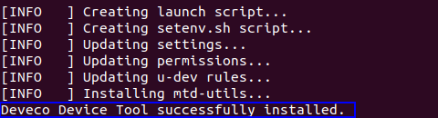

# Setting Up Environments for Standard System


## System Requirements

- Windows: Windows 10 (64-bit)

- Ubuntu: Ubuntu 18.04 to 21.10; recommended memory: 16 GB or larger.

- User name: cannot contain Chinese characters

- DevEco Device Tool: 3.0 Release


## Installing Necessary Libraries and Tools

To install the necessary libraries and tools, perform the following steps.

On Ubuntu:

1. Run the following **apt-get** command:
   
   ```
   sudo apt-get update && sudo apt-get install binutils binutils-dev git git-lfs gnupg flex bison gperf build-essential zip curl zlib1g-dev gcc-multilib g++-multilib gcc-arm-linux-gnueabi libc6-dev-i386 libc6-dev-amd64 lib32ncurses5-dev x11proto-core-dev libx11-dev lib32z1-dev ccache libgl1-mesa-dev libxml2-utils xsltproc unzip m4 bc gnutls-bin python3.8 python3-pip ruby genext2fs device-tree-compiler make libffi-dev e2fsprogs pkg-config perl openssl libssl-dev libelf-dev libdwarf-dev u-boot-tools mtd-utils cpio doxygen liblz4-tool openjdk-8-jre gcc g++ texinfo dosfstools mtools default-jre default-jdk libncurses5 apt-utils wget scons python3.8-distutils tar rsync git-core libxml2-dev lib32z-dev grsync xxd libglib2.0-dev libpixman-1-dev kmod jfsutils reiserfsprogs xfsprogs squashfs-tools pcmciautils quota ppp libtinfo-dev libtinfo5 libncurses5-dev libncursesw5 libstdc++6 gcc-arm-none-eabi vim ssh locales libxinerama-dev libxcursor-dev libxrandr-dev libxi-dev
   ```

   >  **NOTE**
   >
   > The preceding command is applicable to Ubuntu 18.04. For other Ubuntu versions, modify the preceding installation command based on the installation package name. Where:
   >
   > - Python 3.8 or a later version is required. This section uses Python 3.8 as an example.
   > - Java 8 or later is required. This section uses Java 8 as an example.
   >
2. Set Python 3.8 as the default Python version.

   Check the location of Python 3.8:

   
   ```
   which python3.8
   ```

   Change python and python3 to python3.8.
   
   ```
   sudo update-alternatives --install /usr/bin/python python {python3.8 path} 1    #{Python3.8 path} is the location of Python 3.8 obtained in the previous step.
   sudo update-alternatives --install /usr/bin/python3 python3 {python3.8 path} 1   #{Python3.8 path} is the location of Python 3.8 obtained in the previous step.
   ```


## Installing DevEco Device Tool

To remotely access the Ubuntu environment through Windows to perform operations such as burning, you need to install DevEco Device Tool on both Windows and Ubuntu.

>  **NOTE**
>
> DevEco Device Tool is a one-stop integrated development environment (IDE) provided for developers of OpenHarmony-powered smart devices. It allows code editing, compiling, burning, and debugging. This document describes how to use DevEco Device Tool to remotely connect to the Ubuntu environment for burning and running.


### Installing DevEco Device Tool for Windows

1. Download the [DevEco Device Tool 3.0 Release](https://device.harmonyos.com/cn/ide#download) Windows edition.

2. Decompress the DevEco Device Tool package, double-click the installer, and then click **Next**.

3. Set the installation path of DevEco Device Tool to a path that does not contain any Chinese characters, and then click **Next**. You are advised to install DevEco Device Tool in a non-system drive.

   >  **NOTE**
   >
   > If you have installed DevEco Device Tool 3.0 Beta2 or earlier, the earlier version will be uninstalled before you install a new version. If the following error message is displayed during the uninstallation, click **Ignore** to continue the installation. This error does not affect the installation of the new version.
   > 
   > 

   

4. When prompted, select the tools to be automatically installed.

   1. On the **VSCode installation confirm** page, select **Install VScode 1.62.2 automatically** and click **Next**.

       >  **NOTE**
       >
       > If Visual Studio Code 1.62 or later has been installed, this step will be skipped.

       

   2. On the displayed **Python select page**, select **Download from Huawei mirror** and click **Next**.

       >  **NOTE**
       >
       > If Python 3.8 or 3.9 has been installed, select **Use one of compatible on your PC**.
       
       

5. In the dialog box shown below, click **Next**.

   

6. Read the user agreement and privacy statement carefully, select **I accept the licenses**, and click **Next**.

   

7. Wait for the DevEco Device Tool setup wizard to automatically install DevEco Device Tool. After the installation is complete, click **Finish** to close the setup wizard.

   

8. From Visual Studio Code, access the DevEco Device Tool page. Now you can conduct your development in DevEco Device Tool.

   


### Installing DevEco Device Tool for Ubuntu


>  **NOTE**
>
> If the Ubuntu system has not been set up yet, set it up on a virtual machine running Windows. For details, see [Ubuntu Installation Guide](https://developer.huawei.com/consumer/cn/training/course/video/C101639987816176315). Then, [configure the Ubuntu basic environment](https://developer.huawei.com/consumer/cn/training/course/video/C101639988048536240).


1. Make sure the Ubuntu shell environment is **bash**.

   1. Run the following command and check whether the command output is **bash**. If the command output is not **bash**, go to step 2.
      
       ```
       ls -l /bin/sh
       ```

       

   2. Start the command-line tool, run the following command, enter your password, and select **No** to set **Ubuntu shell** to **bash**.
      
       ```
       sudo dpkg-reconfigure dash
       ```

       

2. Download the [DevEco Device Tool 3.0 Release](https://device.harmonyos.com/cn/ide#download) Linux edition.

3. Decompress the DevEco Device Tool software package and assign permission on the folder obtained from the decompression.

   1. Go to the directory where the DevEco Device Tool software package is stored and run the following command to decompress the software package. In the command, change **devicetool-linux-tool-3.0.0.401.zip** to the actual software package name.
      
       ```
       unzip devicetool-linux-tool-3.0.0.401.zip
       ```
   2. Open the folder of the decompressed software package and run the following command to grant the execute permission on the installation file. In the command, change **devicetool-linux-tool-3.0.0.401.sh** to the actual installation file name.
      
       ```
       chmod u+x devicetool-linux-tool-3.0.0.401.sh
       ```

4. Run the following command to install DevEco Device Tool, where **devicetool-linux-tool-3.0.0.401.sh** indicates the installation file name.
   
   ```
   sudo ./devicetool-linux-tool-3.0.0.401.sh
   ```

5. On the page for agreeing to the user agreement and privacy statement, read and agree to the user agreement and privacy statement. 

   

   Wait until the "DevEco Device Tool successfully installed." message is displayed.

   


## Configuring Windows to Remotely Access the Ubuntu Build Environment


### Installing the SSH Service and Obtaining the IP Address for Remote Access

1. In Ubuntu, open the Terminal tool and run the following command to install the SSH service:

   >  **NOTE**<br/>
   >
   > If the command fails to be executed and the system displays a message indicating that the openssh-server and openssh-client depend on different versions, install the openssh-client of the required version (for example, **sudo apt-get install openssh-client=1:8.2p1-4**) as prompted on the command-line interface (CLI) and run the command again to install the openssh-server.

   
   ```
   sudo apt-get install openssh-server
   ```

2. Run the following command to start the SSH service:
   
   ```
   sudo systemctl start ssh
   ```

3. Run the following command to obtain the IP address of the current user for remote access to the Ubuntu environment from Windows:
   
   ```
   ifconfig
   ```

   


### Installing Remote SSH

1. Open Visual Studio Code in Windows, click , and search for **remote-ssh** in the Extension Marketplace.

   

2. Click **Install** to install Remote-SSH. After the installation is successful, **Remote-SSH** is displayed on the **INSTALLED** list.

   


### Remotely Connecting to the Ubuntu Environment

1. Open Visual Studio Code in Windows, click , and click + on the **REMOTE EXOPLORER** page.

   

2. In the **Enter SSH Connection Command** text box, enter **ssh *username*\@*ip_address***, where *ip_address* indicates the IP address of the remote computer to be connected and *username* indicates the account name used for logging in to the remote computer.

   

3. In the displayed dialog box, select the default first option as the SSH configuration file.

   

4. Under **SSH TARGETS**, find the remote computer and click  to start it.

   

5. In the displayed dialog box, select **Linux**, select **Continue**, and enter the password for logging in to the remote computer.

   >  **NOTE**<br/>
   >
   > To eliminate the need for frequently entering the password for logging in to the remote computer, [set an SSH public key](https://device.harmonyos.com/cn/docs/documentation/guide/ide-registering-public-key-0000001247162706).

   

   After the connection is successful, the plug-in is automatically installed in the .vscode-server folder on the remote computer. After the installation is complete, reload Visual Studio Code in Windows as prompted. Then you can develop, compile, and burn source code in DevEco Device Tool on Windows.


## Obtaining Source Code

In the Ubuntu environment, perform the following steps to obtain the OpenHarmony source code:


### Preparations

1. Register your account with Gitee.

2. Register an SSH public key for access to Gitee.

3. Install the git client and git-lfs. (Skip this step if these tools have been installed in Installing Required Libraries and Tools. )

   Update the software source:
   
   ```
   sudo apt-get update
   ```

   Run the following command to install the tools:
   
   ```
   sudo apt-get install git git-lfs
   ```

4. Configure user information.
   
   ```
   git config --global user.name "yourname"
   git config --global user.email "your-email-address"
   git config --global credential.helper store
   ```

5. Run the following commands to install the **repo** tool:

   In this example, **~/bin** is used as an example installation directory. You can change the directory as needed.
  
   ```
   mkdir ~/bin
   curl https://gitee.com/oschina/repo/raw/fork_flow/repo-py3 -o ~/bin/repo 
   chmod a+x ~/bin/repo
   pip3 install -i https://repo.huaweicloud.com/repository/pypi/simple requests
   ```

6. Add the path of the **repo** tool to environment variables.

   ```
   vim ~/.bashrc               # Edit environment variables.
   export PATH=~/bin:$PATH     # Add the path of the **repo** tool to the end of environment variables.
   source ~/.bashrc            # Apply environment variables.
   ```


### How to Obtain

>  **NOTE**
>
> Download the master code if you want to get quick access to the latest features for your development. Download the release code, which is more stable, if you want to develop commercial functionalities.

- **Obtaining OpenHarmony master code**

  Method 1 \(recommended\): Use the **repo** tool to download the source code over SSH. \(You must have registered an SSH public key for access to Gitee.\)
  
  ```
  repo init -u git@gitee.com:openharmony/manifest.git -b master --no-repo-verify
  repo sync -c
  repo forall -c 'git lfs pull'
  ```

  Method 2: Use the **repo** tool to download the source code over HTTPS.

  
  ```
  repo init -u https://gitee.com/openharmony/manifest.git -b master --no-repo-verify
  repo sync -c
  repo forall -c 'git lfs pull'
  ```

- **Obtaining OpenHarmony release code**

  For details about how to obtain the source code of an OpenHarmony release, see the [Release-Notes](../../release-notes/Readme.md).


### Running prebuilts

Go to the root directory of the source code and run the following script to install the compiler and binary tool:

```
bash build/prebuilts_download.sh
```


## Installing the Compilation Tools

hb is a compilation tool of OpenHarmony. To install hb in Ubuntu, perform the following steps. For details about the functions of the OpenHarmony compilation and building module, see [Compilation and Building Guide](../subsystems/subsys-build-all.md).


>  **NOTE**
>
> To install a proxy, see [Configuring the Proxy](../quick-start/quickstart-standard-reference.md#configuring-the-proxy).


1. Run the following command to install hb and update it to the latest version:
   
   ```
   pip3 install --user build/lite
   ```

2. Set the environment variable.
   
   ```
   vim ~/.bashrc
   ```

   Copy the following command to the last line of the .bashrc file, save the file, and exit.
   
   ```
   export PATH=~/.local/bin:$PATH
   ```

   Update the environment variable.
   
   ```
   source ~/.bashrc
   ```

3. Run the **hb -h** command in the source code directory. If the following information is displayed, the installation is successful:
   
   ```
   usage: hb
   
   OHOS build system
   
   positional arguments:
     {build,set,env,clean}
       build               Build source code
       set                 OHOS build settings
       env                 Show OHOS build env
       clean               Clean output
   
   optional arguments:
     -h, --help            show this help message and exit
   ```


>  **NOTICE**<br>
> - Run the following command to uninstall hb:
>    
>       ```
>       pip3 uninstall ohos-build
>       ```
> 
> - If any issue occurs during the hb installation, see [FAQs](../quick-start/quickstart-standard-faq-hb.md) to troubleshoot.
