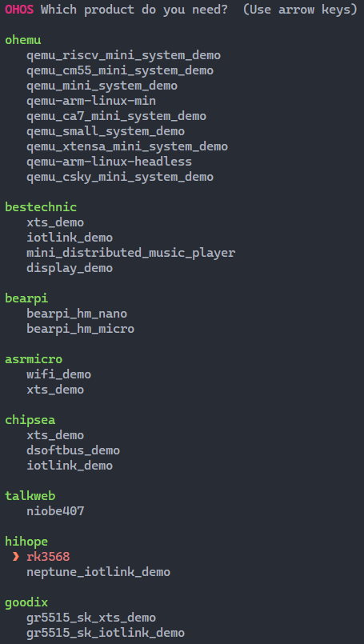

# Building


You can build source code with hb or the **build.sh** script. This section exemplifies how to build source code with hb. For details about how to build with the **build.sh** script, see [Building Source Code Using the build.sh Script](../quick-start/quickstart-standard-reference.md).


Go to the root directory of the source code in the Ubuntu environment and perform the following steps:


1. Set the build path.
     
   ```
   hb set
   ```

2. Select the current path.
     
   ```
   .
   ```

3. Select **rk3568** under **built-in** and press **Enter**.

4. Start building.

   >  **NOTE**
   > - To build a component (for example, **hello**), run the **hb build -T _ Target name _** command.
   > 
   > - To build a product incrementally, run the **hb build** command.
   > 
   > - To build a product from the scratch, run the **hb build -f** command.
   > 
   > This example builds a product from the scratch.

     
   ```
   hb build -f
   ```

     
     **Figure 1** RK3568 build settings

     

5. Check the build result. If "rk3568 build success" is displayed, the building is successful.

   >  **NOTICE**
   > The build result and log files are stored in **out/rk3568**.
