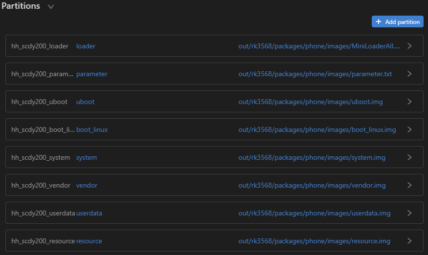
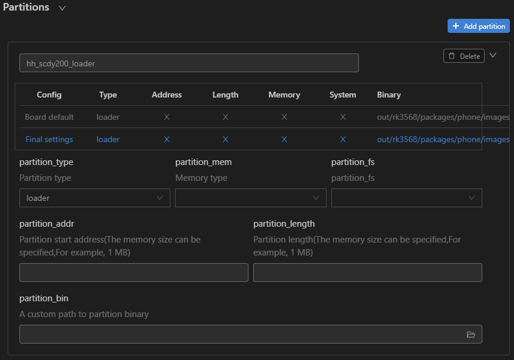

# Burning

Burning is the process of downloading compiled program files to a development board to provide a basis for subsequent debugging. With the one-click burning function of DevEco Device Tool, you can burn images on development boards quickly and efficiently.

>  **NOTE** 
> - If you are using source code from the master branch released since May 9, 2022, use RKDevTool for burning.
> 
> - DevEco Device Tool currently does not support burning of source code released before May 9, 2022. This feature will be introduced in the coming version.

To burn source code to RK3568 on Windows, perform the following steps:

## Importing Source Code

[Ensure that the Windows system can remotely access the Ubuntu environment](../quick-start/quickstart-standard-env-setup.md), and then perform the following steps to import source code:

1. Open DevEco Device Tool, go to the home page, and click **Import Project** to open your project or source code.

   

2. Select the target directory (in the Ubuntu environment) and click **Import**.

   >  **NOTE** 
   > Make sure the selected directory does not contain Chinese characters or spaces.

   

3. If this is the first time you import the source code, the following dialog box will be displayed. Click **Import** when prompted.

   

4. On the **Select Project type** page, select **Import from OpenHarmony Source**.

   

5. On the **Import Project** page, select **rk3568** for **Product**, and the MCU, board, company, and kernel fields will be automatically populated. Then, select the OpenHarmony source code version for **Ohos Ver**.

   

6. Click **Open** to open the project or source code.

## Burning

After the source code is imported, perform the following steps:

1. [Download](https://gitee.com/hihope_iot/docs/blob/master/HiHope_DAYU200/%E7%83%A7%E5%86%99%E5%B7%A5%E5%85%B7%E5%8F%8A%E6%8C%87%E5%8D%97/windows/DriverAssitant_v5.1.1.zip) **DriverInstall.exe**. Double-click **DriverInstall.exe** to open the installer. Then click the install button to install the USB driver as prompted.

   > **NOTE** 
   > If the burning tool of an earlier version has been installed, uninstall it first.

2. Connect the computer to the target development board through the USB port.

   >  **NOTE** 
   >
   > If you are using the remote access mode (Windows + Ubuntu on the local VM), disable the USB control of the VM as follows to ensure that the development board is connected to the USB port of the host:
   > 
   > - VMware: Configure the device to connect to the host under **Preferences** > **USB** and remove the USB controller from the VM settings.
   > 
   > - VirtualBox: Deselect **Enable USB Controller** in the USB device options under Ubuntu settings.

3. In DevEco Device Tool, choose **REMOTE DEVELOPMENT** > **Local PC** to check the connection status between the remote computer (Ubuntu build environment) and the local computer (Windows build environment).

   - If  is displayed on the right of **Local PC**, the remote computer is connected to the local computer. In this case, no further action is required.
   - If  is displayed, click the connect icon.

   

   >  **NOTE** 
   > This operation is required only in remote access mode (in the Windows+Ubuntu hybrid build environment). If the local access mode (Windows or Ubuntu build environment) is used, skip this step.

4. Open DevEco Device Tool, choose **QUICK ACCESS** > **DevEco Home** > **Projects**, and then click **Settings**.

   

5. On the **hh_scdy200** tab page, set the burning options.

   - **upload_partitions**: Select the files to be burnt.
   - **upload_protocol**: Select the burning protocol **upgrade**.

   

6. In **Partitions**, check the preset burning settings of the files to be burnt.

   

   To modify the burning settings for a specific file, click  next to the file.

   >  **NOTE** 
   > Set the start address and length of the partition based on the size of the files to be burnt. Make sure the size of the partition is greater than that of the files to be burnt and the partition addresses of the files to be burnt do not overlap.

   

7. When you finish modifying, click **Save** on the top.

8. Choose **PROJECT TASKS** > **hh_scdy200** > **Upload** to start burning.

   

9. If the message "Operation paused, Please press Enter key to continue" is displayed, press **Enter**.

   >  **NOTE** If the message "The board is not in Loader mode. Please Hold on the VOL+key..." is displayed, place the development board in Loader mode as follows: Press and hold the Volume+ key for 3 seconds, press the RESET key, wait for 3 seconds, and then release the Volume+ key.
   >
   

Wait until the burning is complete. If the following message is displayed, the burning is successful.

