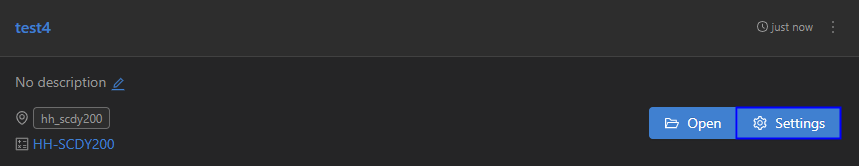
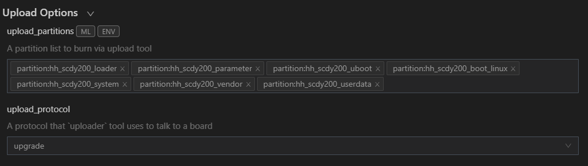
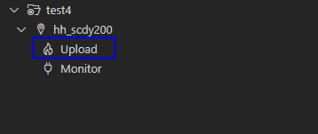

# Burning

To burn source code to RK3568 on Windows, perform the following steps:

### Importing Source Code

After the building is complete, ensure that you can [remotely access the Ubuntu environment from Windows](../quick-start/quickstart-standard-env-setup.md). Then, perform the following steps to import the source code before burning:

1. Open DevEco Device Tool, go to the home page, and click **Import Project** to open your project or source code.

   

2. Select the target directory (in the Ubuntu environment) and click **Import**.

   >  **NOTE** 
   > Make sure the selected directory does not contain Chinese characters or spaces. Otherwise, the building may fail.

   

3. If you select to open the OpenHarmony source code, a message will be displayed indicating that the project is not a DevEco Device Tool project. Click **Import** to continue.

   

4. On the **Select Project type** page, select **Import from OpenHarmony Source**.

   

5. On the **Import Project** page, select a product, and the MCU, board, company, and kernel fields will be automatically populated. Then, select the OpenHarmony source code version for **ohosVersion**. Select **rk3568**.

   

6. Click **Open** to open the project or source code.

### Burning

After the source code is imported, perform the following steps:

1. [Download](https://gitee.com/hihope_iot/docs/blob/master/HiHope_DAYU200/%E7%83%A7%E5%86%99%E5%B7%A5%E5%85%B7%E5%8F%8A%E6%8C%87%E5%8D%97/windows/DriverAssitant_v5.1.1.zip) **DriverInstall.exe**. Double-click **DriverInstall.exe** to open the installer. Then click the install button to install the USB driver as prompted.
   >  **NOTE** 
   > If the burning tool of an earlier version has been installed, uninstall it first.

2. Connect the computer to the target development board through the USB port.

3. In DevEco Device Tool, choose **REMOTE DEVELOPMENT** > **Local PC** to check the connection status between the remote computer (Ubuntu development environment) and the local computer (Windows development environment).

   - If  is displayed on the right of **Local PC**, the remote computer is connected to the local computer. Inthis case, no further action is required.
   - If  is displayed, click the connect icon.

   

   >  **NOTE** 
   > This operation is required only in remote access mode (in the Windows+Ubuntu hybrid development environment). If the local access mode (Windows or Ubuntu development environment) is used, skip this step.

4. In DevEco Device Tool, choose QUICK ACCESS > DevEco Home > Projects, and then click Settings.

   

5. On the **hh_scdy200** tab page, set the burning options.

   - **upload_partitions**: Select the files to be burnt.
   - **upload_protocol**: Select the burning protocol **upgrade**.

   

6. Check the preset information of the files to be burnt and modify them when necessary. The files to be burnt include **loader**, **parameter**, **uboot**, **boot_linux**, **system**, **vendor**, and **userdata**.

   1. On the **hh_scdy200_loader** tab, select the items to be modified in **New Option**, such as **partition_bin**, **partition_addr**, and **partition_length**.

       

   2. In **Partition Options**, modify the items selected in the preceding step.

       >  **NOTE** 
       > Set the start address and length of the partition based on the size of the files to be burnt. Make sure the size of the partition is greater than that of the files to be burnt and the partition addresses of the files to be burnt do not overlap.

       

   3. Follow the same procedure to modify the information about the **parameter**, **uboot**, **boot_linuxv, **system**, **vendor**, and **userdata** files.

7. When you finish modifying, click **Save** on the top.

8. Click **Open** to open the project file. Click  to open DevEco Device Tool. Then, choose **PROJECT TASKS** > **hh_scdy200** > **Upload** to start burning.

   

9. If the message "Operation paused, Please press Enter key to continue" is displayed, press **Enter**.

   >  **NOTE** 
   > If the message "The boad is not in Loader mode. Please Hold on the VOL+key..." is displayed, place the development board in Loader mode as follows: Press and hold the Volume+ key for 3 seconds, press the RESET key, wait for 3 seconds, and then release the Volume+ key.
   
10. Wait until the burning is complete. If the following message is displayed, the burning is successful.

   
