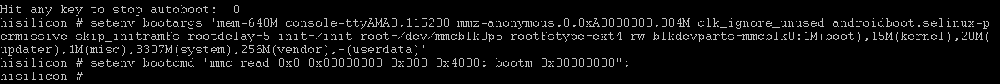

# Running an Image<a name="EN-US_TOPIC_0000001142160948"></a>

-   [\#EN-US\_TOPIC\_0000001142160948/section153991115191314](#section153991115191314)

After the image burning is complete, perform the following steps to run the system:

> **NOTE:** 
>This operation procedure is required only if this is the first time you burn an image for the standard system.

1.  In DevEco Device Tool, click  **Monitor**  to open the serial port tool.

    

2.  Restart the development board. Before the autoboot countdown ends, press any key to enter the system.

    

3.  Run the following commands to set system boot parameters:

    ```
    setenv bootargs 'mem=640M console=ttyAMA0,115200 mmz=anonymous,0,0xA8000000,384M clk_ignore_unused androidboot.selinux=permissive skip_initramfs rootdelay=5 init=/init root=/dev/mmcblk0p5 rootfstype=ext4 rw blkdevparts=mmcblk0:1M(boot),15M(kernel),20M(updater),1M(misc),3307M(system),256M(vendor),-(userdata)'
    ```

    ```
    setenv bootcmd "mmc read 0x0 0x80000000 0x800 0x4800; bootm 0x80000000";
    ```

    

4.  Save the parameter settings.

    ```
    save
    ```

    

5.  Restart the development board to start the system.

    ```
    reset
    ```

    


