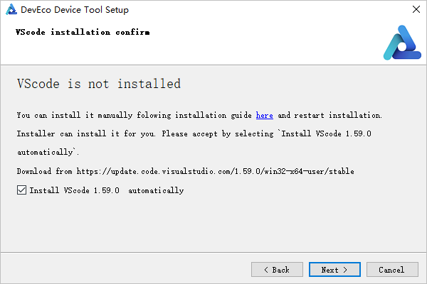
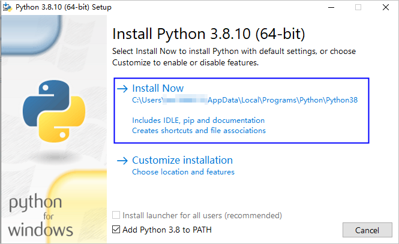

# Setting Up a Windows Development Environment

-   [Installing DevEco Device Tool](#en-us_topic_0000001058091994_section10761564496)

System requirements:

-   OS: 64-bit Windows 10
-   User name: cannot contain Chinese characters

## Installing DevEco Device Tool

DevEco Device Tool is installed in Visual Studio Code as a plug-in and depends on Python, Node.js, and HPM for running.

DevEco Device Tool supports integrated installation. The DevEco Device Tool setup wizard checks whether the adaptation versions of Visual Studio Code, Python, Node.js and HPM tools have been installed. If any of the tools is not installed, you'll be prompted to select the tool to be automatically installed.

> **NOTE:** 
>Before installing DevEco Device Tool, make sure the user name of the host does not contain Chinese characters. Otherwise, the  **DevEco Home**  page will be stuck loading and the DevEco Device Tool cannot work.

1.  Log in to the  [HarmonyOS Device website](https://device.harmonyos.com/cn/ide#download_beta)  with your HUAWEI ID and download DevEco Device Tool V3.0 Beta1 or a later version. If you do not have a HUAWEI ID,  [register](https://developer.huawei.com/consumer/en/doc/start/registration-and-verification-0000001053628148)  one first.
2.  Decompress the DevEco Device Tool package, double-click the installer, and then click  **Next**.
3.  Set the installation path of DevEco Device Tool and click  **Next**.
4.  When prompted, select the tools to be automatically installed and click  **Next**.

    

    > **NOTE:** 
    >When the setup wizard detects that a compatible Python version has been installed, it prompts you to select the installed Python version or download the recommended Python version.

5.  In the dialog box shown below, click  **Next**  to download and install the tools.

    

6.  In the displayed Python setup wizard, select  **Add Python 3.8 to PATH**  and click  **Install Now**. After the installation is complete, click  **Close**.

    > **NOTE:** 
    >If you have selected the compatible Python version installed on your device, the Python setup wizard will not be displayed. In this case, you skip this step.
    >If DevEco Device Tool 2.1 Release is installed, the Python version must be 3.8.x. If DevEco Device Tool V3.0 Beta1 or a later version is installed, the Python version must be 3.8.x or 3.9.x.

    

7.  In the Visual Studio Code setup wizard, install Visual Studio Code as prompted. During the installation, select  **Add to PATH \(requires shell restart\)**.

    > **NOTE:** 
    >If you are using the correct version of Visual Studio Code, the Visual Studio Code setup wizard will not be displayed. In this case, you skip this step.

    

8.  In the Node.js setup wizard, retain the default settings and click  **Next**  until  **Finish**  is displayed. During the installation, Node.js will automatically set the system Path environment variable to the installation directory of  **node.exe**.

    > **NOTE:** 
    >If you are using the correct version of Node.js, the Node.js setup wizard will not be displayed. In this case, you skip this step.

9.  Wait for the DevEco Device Tool setup wizard to automatically install the HPM and DevEco Device Tool. After the installation is complete, click  **Finish**  to close the setup wizard.

    > **NOTE:** 
    >If you are using the correct version of HPM, the setup wizard does not download or install HPM.

10. Start Visual Studio Code. The C/C++ and CodeLLDB plug-ins on which DevEco Device Tool depends will be automatically installed. After the installation is complete, click    on the left of Visual Studio Code to check whether C/C++, CodeLLDB, and DevEco Device Tool are included in the  **INSTALLED**  list.

    > **NOTE:** 
    >If the C/C++ and CodeLLDB plug-ins fail to be installed, DevEco Device Tool cannot run properly. To solve the issue, see  [Installing the C/C++ and CodeLLDB Plug-ins Offline](https://device.harmonyos.com/en/docs/ide/user-guides/offline_plugin_install-0000001074376846).

    

