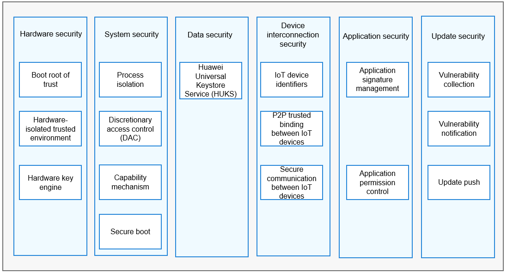
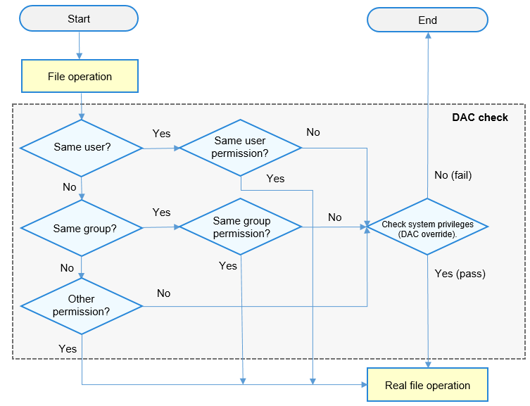
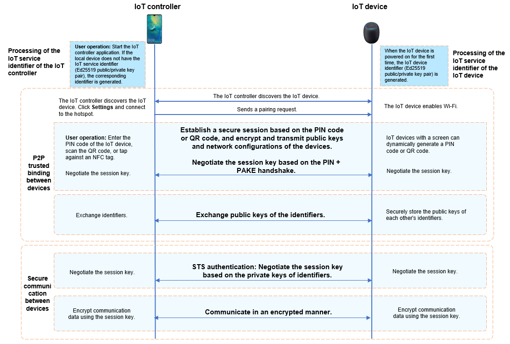

# Security Guidelines

## Overview

OpenHarmony is an open OS that allows you to easily develop services and applications. It provides an execution environment to ensure security of application data and user data.

This environment combines chip security and system security features with upper-layer security services to secure hardware, the system, data, device interconnection, applications, and updates.

  **Figure 1** Security assurance

## Hardware Security

### Security Mechanism

- Boot root of trust

  OpenHarmony devices use the public key infrastructure (PKI) to protect software integrity and ensure that the software source is valid and the software is not tampered with.

  In the device boot process, software signature verification is performed at each phase to form a secure boot chain. If signature verification fails at any phase, the device boot will be terminated. The hardware or software entity that initially performs signature verification in the secure boot chain is the boot root of trust. It must be valid and should not be tampered with. The boot root of trust can be a built-in code segment in the read-only memory (ROM). This code segment is written in the chip during the chip manufacturing and cannot be modified later. When the device is powered on and initialized, this code segment is executed first and used to verify software signatures.

  When you use the code for signature verification, ensure the validity of the PKI public keys. OpenHarmony devices use a storage medium such as eFUSE and one-time password (OTP) to store the public keys (for example, their hash values) and guarantee their validity. A public key is usually programed into the eFuse or OTP of a device during device manufacturing.

- Hardware-isolated trusted environment

  The hardware-isolated trusted environment complies with the design concept of the trusted computing system. There is a clear boundary between the trusted environment and untrusted one. OpenHarmony devices protect core sensitive data in the trusted environment. Even if OS vulnerabilities in the untrusted environment are exploited, sensitive data in the trusted environment is secure.

  The trusted environment of OpenHarmony devices is built based on a hardware security isolation mechanism. The chip isolation mechanism varies slightly on different OpenHarmony devices, and the most common mechanism is Arm TrustZone. On some RISC-V chip platforms, independent security cores may also be used to build a trusted environment.

  A specific, simplified OS iTrustee lite runs in the trusted environment to manage resources and schedule tasks in the environment and provide security services for OpenHarmony devices. Key management and data security are the most common security services in the trusted environment. A device has a unique hardware root key in the eFuse/OTP. Based on this root key and service context, the trusted environment generates multiple keys that provide key management and data encryption/decryption services for applications. During their whole lifecycle, core keys of devices stay in the trusted environment. The trusted environment also provides security services such as identity authentication, system status monitoring, and secure data storage to enhance device security.

- Hardware key engine

  Cryptography is the basis of information security. Data encryption/decryption requires high efficiency and security of computing devices. Hardware encryption/decryption technologies use computer hardware to assist or even replace software to encrypt or decrypt data. Hardware-based encryption/decryption is more efficient and secure than software-based encryption/decryption.

  Since some dedicated hardware resources are used for data encryption/decryption, the CPU can concurrently execute other computing tasks, which greatly improves performance and reduces the CPU load. In addition, a well-designed hardware key engine protects keys from leak even if the software is cracked and even defends against electromagnetic and radiation attacks from physical channels.

  OpenHarmony devices support the hardware key engine, which allows OpenHarmony to perform computing tasks such as data encryption and decryption, certificate signature verification, and hash value calculation. The hardware key engine supports popular algorithms such as Advanced Encryption Standard (AES) and Rivest-Shamir-Adleman (RSA).

### Recommended Practices

- The boot root of trust consists of a built-in code segment in the chip and the root key of the device. The root of trust is written into the chip during manufacturing and cannot be modified in the device lifecycle. It is used to verify software certificates in the device boot process. The root key is the public key matching the private key of the device certificate signature. The private key is maintained on the PKI signature server and the public key is written to the device. To prevent attackers from tampering with the public key to bypass signature authentication, you can write the public key to media such as fuses on OpenHarmony devices. Considering that the fuse space is limited, you can store only the hash value of the public key in the fuse and verify the validity of the public key using the boot code.

- Generally, a trusted execution environment (TEE) is built based on the Arm TrustZone technology, and can also adopt other isolation mechanisms, such as TrustZone-M and independent security cores, depending on the device form. A TEE OS must be deployed in the TEE to manage resources and schedule tasks. OpenHarmony provides iTrustee as the TEE OS. You can develop and deploy security services based on iTrustee.

  Not all OpenHarmony devices need to support the TEE, for example, some devices with thin resources that run less sensitive services may not need the TEE. You can choose whether to support the TEE and how to implement the TEE based on service requirements.

- The hardware key engine must provide key algorithms related to true random numbers, public keys, symmetric keys, and hash values. By deploying required drivers in OpenHarmony, you can provide unified key management and key algorithms for applications.

## System Security

### Security Mechanism

For device with 128 KB to 128 MB of memory, the OpenHarmony lite kernel is recommended. It provides the following features:

- Process isolation

  Process isolation prevents processes from reading and writing memory data of each other. Generally, virtual address space mapping is used for process isolation. The virtual addresses of two processes are mapped to physical address segments using the memory management unit (MMU). In this way, the non-shared memory data that can be accessed by one of the two processes through the virtual address is inaccessible to the other process.

  Due to limited resources, OpenHarmony adopts different mechanisms for kernel-level and user-level processes. All kernel-level processes share the same VMM space, that is, kernel-level processes are not isolated from each other. When the OS is booted, two basic kernel-level processes KProcess and KIdle are created. KProcess is the root process of kernel-level process, and KIdle is the subprocess of KProcess. Each user-level process has its own VMM space that is invisible to other processes, and user-level processes are isolated from each other.

- DAC

  Discretionary access control (DAC) means that the file owner determines access permissions of other roles. There are three granularities of permission control: user, group, and other (UGO). The file owner can classify any user into one of the three dimensions and adopt a control policy to perform DAC permission verification.

  DAC depends on the attributes of processes, such as the UID and GID, which are used as feature IDs during file creation and access. When creating a file, the creator writes its UID into the file. When a file is accessed, the UID is used for classifying the file.

  Each application has a UID. When creating a file, an application adds its UID to the metadata of the file and sets permissions of the user, group, and other. When an application tries to access the file, the UID and permissions in the metadata of the file are used to verify the application UID.

  The following figure shows how DAC works when a process accesses a file. The DAC first matches the process UID with the file UID, and then the process GID with the file GID. If the UID and GID both fail to match, DAC checks the **other** attribute of the file to determine whether the process is allowed to read, write, or execute the file. In addition, the system supports a privileged capability that is not subject to DAC mechanism (read, write, and execute) and can access files directly. Services with high permissions (such as system services) can manage files of applications with low permissions (such as third-party applications).

  **Figure 2** How DAC works
    

- Capability mechanism

  The capability mechanism is a subdivision of the root permission. A multi-user computer system usually has a special role that has all system permissions, that is, the system administrator with the root permission. OpenHarmony needs to support kernels of the third-party application ecosystem, and privileged access to the system must be controlled. The system needs to restrict privileged system calls made by users to access the kernel. Only some applications with high-level permissions are allowed to perform privileged operations. To be specific, the kernel spawns the first user program INIT that has all privileged permissions. Then INIT starts other application framework services and retains only privileged permissions necessary for each application. When an application requests to call a privileged API, the kernel checks whether the application has the permission to access the API based on the process ID.

- Secure boot

  Secure boot is the basis of system security. A digital signature and integrity verification mechanism is used to verify the integrity and validity of software at each layer, starting from the boot root of trust in the chip. This ensures that a correct and valid OS is booted, preventing attackers from tampering with or implanting system software and providing a secure, basic running environment.

  The chip does not need to be verified after it is powered on because the on-chip ROM code cannot be modified. The on-chip ROM verifies the bootloader based on the public key hash value which is calculated using the asymmetric algorithm in eFuse. The verification is performed based on the hardware trust root and is fully trusted. The bootloader that passes this verification is deemed to be trusted for subsequent use. This is the process of constructing a trust chain. Bootloader initializes the execution environment, including initializing the double data rate (DDR) and reading and writing the flash memory, to prepare for loading modules and executing more complex logic. After the bootloader is initialized, it verifies the integrity of the X.509 certificate and verifies image packages (**kernel.bin**, **teeOS.bin**, and **rootfs.bin**) using the public key of the X.509 certificate.

### Recommended Practices

- DAC and the capability mechanism are used to control who can access resources. It is recommended that the minimum permissions are granted.

- Secure boot must be enabled, and the trusted root must be in the chip and cannot be modified. In addition, you must consider the impact of secure upgrade (if available) on secure boot, that is, the signature or hash value of an image file must be updated after a secure upgrade.

## Data security

### Security Mechanism

OpenHarmony Universal KeyStore (HUKS) provides key and certificate management. For OpenHarmony, it mainly provides key management for HiChain (device identity authentication platform). The figure below shows the HUKS functions.

  **Figure 3** HUKS functions 

The following algorithms are supported:

- Authentication and encryption: AES-128/192/256-GCM

- Signing and signature verification: ED25519

- Key agreement: X25519

- Message authentication: HMAC-SHA-256/HMAC-SHA-256

- Data digest: SHA-256/SHA-512

HUKS has the following restrictions:

- Secure storage of keys

  Keys must be stored in a secure area and cannot be modified. When factory settings are restored, preset keys are not deleted.

- Key access security

  OpenHarmony stores data of different applications in different locations to isolate data. The parameter structures must contain the UID and process ID to implement data isolation of different applications.

- Concurrent access

  HUKS is only a library and does not support concurrent access from multiple applications. If multiple applications need to access HUKS, each application must connect to a HUKS library and pass a path for storing data. Data is stored in the directory of each application.

### Recommended Practices

To use the device certification function, it is recommended that you use HiChain to interconnect with HUKS. HUKS provides applications such as HiChain with key generation, import, export, encryption/decryption, storage, and destruction, certificate import and query, and secret information storage.

## Device Interconnection Security

To ensure secure transmit of user data between devices, a trust relationship and a secure data transmission channel must be established between the devices. The following figure shows how an IoT controller and an IoT device establish a trust relationship.

  **Figure 4** Process of establishing a trust relationship between devices

- IoT device interconnection security

  A trust relationship can be established between an IoT device that runs OpenHarmony (such as an AI speaker, smart home device, and wearable) and an IoT controller. Encrypted user data is transmitted between the IoT device and IoT controller through a secure connection.

- IoT service identifier of the IoT controller

  An IoT controller generates different identifiers for different IoT device management services to isolate these services. The identifier can be used for authentication and communication between an IoT controller and an IoT device. It is an Ed25519 public/private key pair generated using the elliptic curve cryptography.

- IoT device identifier

  An IoT device can generate its own device identifier for communicating with the IoT controller. It is also an Ed25519 public/private key pair generated using elliptic curve cryptography, with the private key stored on the IoT device. Each time the device is restored to factory settings, the public/private key pair will be reset.

  The identifier can be used for secure communication between the IoT controller and IoT device. After the devices exchange the service identifier or device identifier, they can negotiate the key and establish a secure communication channel.

- P2P trusted binding between devices

  When an IoT controller and an IoT device establish a trust relationship, they exchange identifiers.

  During this process, the user needs to enter or scan the PIN provided by the IoT device on the IoT controller. PIN is either dynamically generated if the IoT device has a screen, or preset by the manufacturer if it does not have a screen. A PIN can be a number or a QR code. Then the IoT controller and IoT device perform authentication and session key exchange based on password authenticated key exchange (PAKE), and use the session key to encrypt the channel for exchanging identity public keys.

- Secure communication between the IoT controller and IoT device

  When an IoT controller and an IoT device communicate with each other after establishing a trust relationship, they authenticate each other by using the locally stored identity public key of the peer. Bidirectional identity authentication and session key exchange are performed using the Station-to-Station (STS) protocol during each communication. The session key is used to encrypt the data transmission channel between the devices.

## Application Security

### Security Mechanism

- Application signature management

  After developing and debugging an OpenHarmony application, sign the application installation package using a private key, which matches a public key. Generally, the OEM generates a public/private key pair, presets the public key in the device, and stores the private key on a local server that is not connected to the Internet to prevent private key leakage. After you finish developing an application, you can use an external device (such as a USB flash drive) to upload the installation package to the server where the private key is stored, calculate the signature, and download the signature to the external device. During application installation, the hash value of the bundle is calculated using the SHA-256 algorithm. The hash value, together with the signature and preset public key, is used for authentication. The application can be installed only after the authentication is successful.

  In addition, the application source must be verified to ensure that the application is from a valid developer. As a developer, you must apply for a development certificate and use it to sign the application you have developed. During application installation, the upper-level certificate stored on the device is used to verify the signature to ensure validity of the developer.

- Application permission control

  OpenHarmony allows users to install third-party applications and controls calls made by third-party applications to sensitive permissions. When developing an application, you need to declare the sensitive permissions that the application may require in the application configuration file. The permissions can be static or dynamic. Static permissions need to be registered during application installation, and dynamic permissions can be obtained only upon user authorization. Authorization modes include system settings, manual authorization by applications, and others. In addition, application signature control is used to ensure that the application installation package has been confirmed by the device vendor.

  **Table 1** OpenHarmony system permissions
  
  | Permission| **Authorization Mode**| **Description**| 
  | -------- | -------- | -------- |
  | ohos.permission.LISTEN_BUNDLE_CHANGE | system_grant (static permission)| Allows an application to listen for application changes.| 
  | ohos.permission.GET_BUNDLE_INFO | system_grant (static permission)| Allows an application to obtain information about other applications.| 
  | ohos.permission.INSTALL_BUNDLE | system_grant (static permission)| Allows an application to install other applications.| 
  | ohos.permission.CAMERA | user_grant (dynamic permission)| Allows an application to use the camera to take photos and record videos at any time.| 
  | ohos.permission.MODIFY_AUDIO_SETTINGS | system_grant (static permission)| Allows an application to modify global audio settings, such as the volume and speaker for output.| 
  | ohos.permission.READ_MEDIA | user_grant (dynamic permission)| Allows an application to read users' favorite videos.| 
  | ohos.permission.MICROPHONE | user_grant (dynamic permission)| Allows an application to use the microphone for audio recording at any time.| 
  | ohos.permission.WRITE_MEDIA | user_grant (dynamic permission)| Allows an application to write users' favorite music.| 
  | ohos.permission.DISTRIBUTED_DATASYNC | user_grant (dynamic permission)| Allows an application to manage distributed data transmission.| 
  | ohos.permission.DISTRIBUTED_VIRTUALDEVICE | user_grant (dynamic permission)| Allows an application to use distributed virtualization features.| 

### Recommended Practices

When developing an application, determine the permissions required by your application and register the permissions in the application configuration file. Sign the application to ensure that the devices on which the application will be installed can verify its integrity and source.

> **NOTE**
> 
> The application configuration file varies depending on the application model. It is **config.json** for the application based on the FA model and **module.json5** for the application based on the stage mode. For details about the application models, see [Interpretation of the Application Model](../../application-dev/application-models/application-model-description.md).
