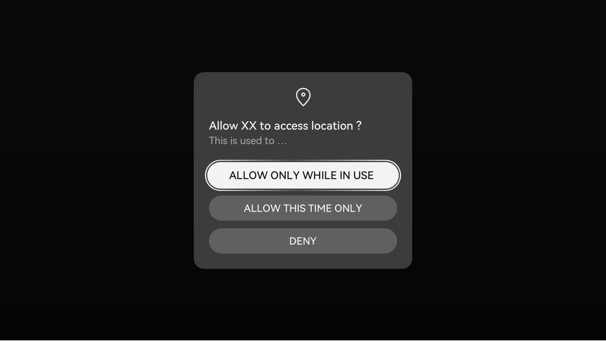

# Privacy Protection

## Overview

Personal data plays an increasingly important role in social economy and daily life along with the development of the Internet and informatization. Meanwhile, personal data leakage risks are increasing. As a consumer product developer, you shall take more effective measures to protect users' personal data and improve their trust in your products. To protect consumers' privacy and improve their experience on privacy, you should set high-level privacy protection policies for your product.

**Basic Concepts**

- **Personal data**

    Any information relating to an identified or identifiable natural person \("Data Subject"\) who can be identified, directly or indirectly, in particular by reference to an identifier such as a name, an identification number, location data, an online identifier or to one or more factors specific to the physical, physiological, genetic, mental, commercial, cultural, or social identity of that natural person. Personal data includes a natural person's email address, phone number, biometric information \(such as a fingerprint\), location data, IP address, healthcare information, religious belief, social security number, marital status, and so on.

- **Sensitive personal data**

  Sensitive personal data, as an important subset of personal data, refers to the most confidential information of a data subject or information that may adversely affect the data subject upon leakage. Sensitive personal data defined in laws and regulations of EU and its members includes personal data revealing racial or ethnic origin, political opinions, religious or philosophical beliefs, trade-union membership, genetic data, biometric information, and data concerning health or sex life and sexual orientation.

  With reference to industry best practices, we also define the following data related to a natural person's identity as sensitive: bank card number, identification number, passport number, and passwords. More strict protection measures are usually required for processing sensitive personal data.

- **Public available personal data**

  Personal data that is proactively disclosed by a data subject or that can be accessed on public web pages or applications, including posts and comments made on forums.

- **User profile**

  Any form of automated processing of personal data to assess a natural person in specific aspects, and in particular to analyze and predict the natural person's work performance, financial situation, health, personal preference, interest, creditability, behavior, and location or trace.

- **Data controller**

  A natural or legal person, public authority, agency, or any other body that, alone or jointly with others, determines the purposes and means of personal data processing.

- **Data processor**

  A natural or legal person, public authority, agency, or any other body that processes personal data on behalf of a data controller. A data processor must provide adequate protection following the data controller's requirements.

- **Explicit consent**

  Explicit consent applies to the following scenarios where the General Data Protection Regulation (GDPR) allows the legitimate processing of personal data based on data subjects' explicit consent:

  - Processing of sensitive personal data
  - Automated decision-making, including user profiles
  - Transfer of personal data to countries without an adequate level of protection, which uses consent as the legal basis

  Explicit consent can be implemented as follows:

  - In the collection of specific data, display a privacy statement to notify data subjects of matters related to the processing of personal data, provide a check box which is deselected by default, and prompt data subjects to proactively select the option indicating that "I agree to process my personal data in the above manner" or click the "I agree" button.
  - Expressly present consent in writing and request data subjects to sign it.
  - Ask data subjects to upload an electronic form with their signature in the system.
  - Adopt the double verification method by requesting data subjects to consent via an email and then re-click the email link for verification or enter the SMS verification code.
  - Users provide information proactively, such as scenarios where a user enters their identification number and bank card number to bind the bank card.

## Data Classification

Data is classified into five levels: very high, high, moderate, low, and public based on the data protection objectives and consequences (the impact of legal risks caused by data leakage or damage on individuals, organizations, or the public).

**Table 1** Standards for data classification

| **Level**| **Privacy Risk**| **Privacy Attribute**| **Typical Example**|
| -------- | -------- | -------- | -------- |
| Very high| Once data is identified or associated with an individual or group of individuals, its disclosure or improper use may have a catastrophic negative impact on that individual or group of individuals.| Sensitive personal data| DNA, race, religious belief, and sexual orientation; biometric information; original communication content; bank account password and magnetic track data|
| High| Once data is identified or associated with an individual or group of individuals, its disclosure or improper use may have a severe negative impact on that individual or group of individuals.| Sensitive personal data| Social identity (such as ID card and passport number); web browsing history; tracks; content (such as images, audio, and video) uploaded to the cloud|
| Moderate| Once data is identified or associated with an individual or group of individuals, its disclosure or improper use may have a significant negative impact on that individual or group of individuals.| General personal data| Device ID (IMEI, SN, or OAID), user ID, basic personal information (name and address), mobile number, and email address.|
| Low| Once data is identified or associated with an individual or group of individuals, its disclosure or improper use may have a limited negative impact on that individual or group of individuals.| General personal data| OS settings (including the OS version and country/region); device hardware information (device model, screen size, and screen resolution); network information (network connection status and access network information); device status (login time/duration)|
| Public| Public data has no adverse impact on individuals or organizations.| Non-personal data| Publicly released product introduction, public meeting information, and external open-source code|

> **NOTE**
>
> For details about the definitions of privacy protection and data classification, see GDPR.

## General Privacy Design Rules

Observe the following general privacy design requirements when designing your OpenHarmony products:

**Openness and Transparency in Data Collection and Use**

When collecting personal data, clearly and explicitly notify users of the data to collect and how their personal data will be used.

- Develop specific privacy processing policies for personal data at different levels.

  - Explicit consent shall be obtained from the data subject before your product attempts to collect sensitive personal data.
  - Generally, the collection of personal data requires the consent of the data subject or other legal authorizations.
  - If non-personal data is to be collected in association with personal data at the moderate, high, or very high level, the data subject's consent or other legal authorization is required, and the consent or authorization shall be presented in the privacy statement.

- Develop and follow appropriate privacy policies. Comply with all applicable laws, policies, and regulations when collecting, using, retaining, and sharing users' personal data with any third parties. For example, prior to data collection, fully inform users of the types, purposes, processing methods, and retention periods of personal data to meet the requirements of data subjects' rights.
    Guided by the preceding principles, we have designed some examples for your reference. The figures below are examples of a privacy notice and a privacy statement, respectively.

    **Figure 1** Example of a privacy notice

    

    **Figure 2** Example of a privacy statement

    

- Personal data shall be collected for specified, explicit, and legitimate purposes and not further processed in a manner that is incompatible with those purposes. If the purposes are changed or a user withdraws their consent, you shall obtain user consent again before using the data. The figures below are examples of a privacy statement update and content withdrawal, respectively.

    **Figure 3** Example dialog showing a privacy notice or statement update

    

    **Figure 4** Example dialog showing consent withdrawal

    

    **Figure 5** Example dialog showing consent withdrawal

    

- You shall provide an entry for users to view the privacy statement. For example, you can provide an entry on the **About** page of your application to view the privacy statement, as shown in the following figure.

    **Figure 6** Example of About page providing an entry to the privacy statement

    

**Minimization in Data Collection and Use**

Collect personal data only when they are adequate, relevant, and limited to what is necessary in relation to the purposes for which they are processed. Apply anonymization or pseudonymization to personal data if possible to reduce the risks to the data subjects concerned. Data shall only be collected and processed for a specified purpose, and no further unnecessary operations shall be conducted on them.

- When applying for sensitive permissions, adhere to permission minimization and apply for only the permissions required for obtaining necessary information or resources. For example, if your application can implement its functions without access to the camera, then it shall not request the user for the camera permission.
- Comply with data collection minimization, and do not collect data irrelevant to services provided by the product. For example, a product that provides location services shall not collect users' web browsing history.
- The functions that use personal data shall be able to benefit users. The collected data shall not be used for functions irrelevant to users' normal use. No data shall be collected for any function irrelevant to user operations. For example, sensitive personal data, such as biometric features and health data, shall not be used for non-core service functions like service improvement, advertising, and marketing.
- Printing sensitive personal data in logs is prohibited. If common personal data needs to be printed in logs, make sure the data is anonymized or pseudonymized.
- Use settable identifiers preferentially. For example, use **NetworkID** and **DVID** to identify devices in distributed scenarios, and use the **UUID** interface to generate identifiers for other scenarios where unique identifiers are required. Use permanent identifiers, such as serial numbers and MAC addresses, only when settable identifiers cannot meet service requirements.

**Data Processing Selection and Control**

You shall obtain consent from users and comply with applicable laws and regulations for processing personal data and give users full control over their data.

- When applying for a certain sensitive permission, your product shall display a pop-up dialog to notify the user of the requested permission and the purpose of using the permission. The user shall be able to choose whether to grant the permission and how they would like to grant the permission. This ensures that permission granting and use are transparent, perceivable, and controllable. The following figure is an example dialog for requesting a sensitive permission.

    **Figure 7** Example dialog for requesting a sensitive permission

    

- Users shall have the right to modify or withdraw the permissions granted to your product. When a user does not agree to a permission or data collection, the user shall be allowed to use the functions irrelevant to the permission or data collection. For example, the user can refuse to grant the camera permission to social or communication apps on Smart TVs, when using product functions irrelevant to the camera, such as voice calls.

- In scenarios where personal data is recorded, users shall be provided with the functions of adding, deleting, modifying, and viewing personal data.

- Your products shall provide a mechanism or method for securely deleting personal data when hardware is recycled or returned to the factory.

- The download or upgrade of user system software or application software may involve the modification of users' private space. Users shall have the right to know and control such behavior. They shall be informed of such behavior and be given the option to agree or disagree with such behavior.

**Data Security**

Data processing security shall be ensured in technical terms, which include encrypted storage and secure transmission. Security mechanisms or measures shall be enabled by default for a system.

- A protection mechanism shall be available for personal data access, including identity authentication and access control. Identity authentication (such as user name and password) allows only authenticated users to access data in multi-user scenarios. Access control, such as [permission control](../security/security-guidelines-overall.md) can be used to restrict certain applications.

- Secure storage of personal data on distributed devices must meet Huawei Universal KeyStore (HUKS) requirements, including secure storage of keys and data.

- The transfer of personal data between distributed devices must meet the trust binding relationship between devices and security requirements of data transmission channels. For details, see [Device Interconnection Security](../security/security-guidelines-overall.md#device-interconnection-security).

- Authentication data (such as passwords and fingerprints) shall be encrypted before being stored.

**Localization**

User data shall be preferentially processed on the local device. Data that cannot be processed on the local device shall be preferentially processed on a device of the Super Device. If any data cannot be processed on the Super Device, the data shall be anonymized before being transferred out of Super Device for processing.

**Minors' Data Protection**

If your product is designed for minors or you can identify, based on the collected user age data, that the end user is a minor, you shall particularly analyze issues related to minors' personal data protection based on relevant local laws in the target market. Your product shall obtain explicit consent from the holders of parental responsibility over minors.

## **Privacy Protection Requirements for Special Categories**

In addition to these general privacy requirements, consumer hardware products have the following requirements for special categories. You shall comply with these requirements during product design.

**Table 2** Privacy protection requirements for special categories

| **Product Category**| Privacy Protection Requirements|
| -------- | -------- |
| **Smart home**| Biometric information (such as fingerprints, voiceprints, facial recognition, and irises) and user passwords involved in security products are sensitive personal data. They shall be processed using technical measures (for example, extracting the digest of biometric information) before being encrypted and stored in the products.|
| **Smart home**| For security products that involve audio, video, and images, their manufacturers, functioning as the data controller, shall provide an independent privacy notification and a brand log on their application UI. Transfer and storage of audio and video data shall be encrypted. Access to audio and video data of security products is permitted only after being authorized by the data subject.|
| **Smart home/Entertainment**| Cameras on products should be able to be physically disabled. For example, cameras can be hidden, shuttered, or re-oriented so that consumers can perceive that the cameras are disabled.|
| **Smart home/Entertainment**| Products with a microphone should provide an explicit display of the recording status. For example, the products can provide a status indicator that blinks when recording is started and turns off when recording is stopped.|
| **Mobile office**| In scenarios such as cross-device display and transfer of user data, your products shall obtain explicit consent from users and give them full control over their personal data.|
| **Head unit**| 1. Privacy notice and permission settings Do not let users read privacy policies and permission settings in the driving state. IVI applications shall consider the safety of vehicle use. The applications shall not require complex permission settings or reading of privacy policies when users are driving. For example, HiCar is usable only after users have set basic permissions and read privacy policies on their mobile phone. The privacy statement shall be notified after the user identity is confirmed. Vehicle data involves vehicle owners, drivers, and passengers. The data subject shall be notified of the privacy statement. The recommended practice is to make a privacy statement after confirming the user identity. For an application that requires login, the privacy statement should be displayed after, instead of before, a user is logged in. 2. Personal data protection for sharing applications Shared applications shall exit after the IVI is restarted, and the personal data of the current user shall be cleared or encrypted. The applications shall also provide the function to permanently delete historical data. 3. Notifications As the IVI is used in an open environment, applications shall not directly display the message content on the IVI. Instead, the applications shall only notify users that there is an incoming message.|
