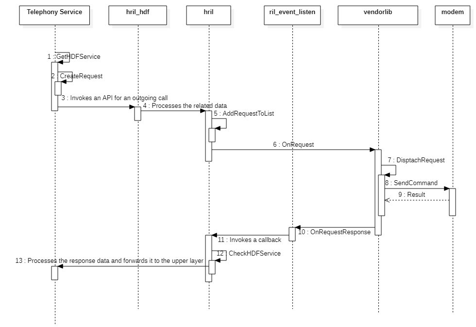
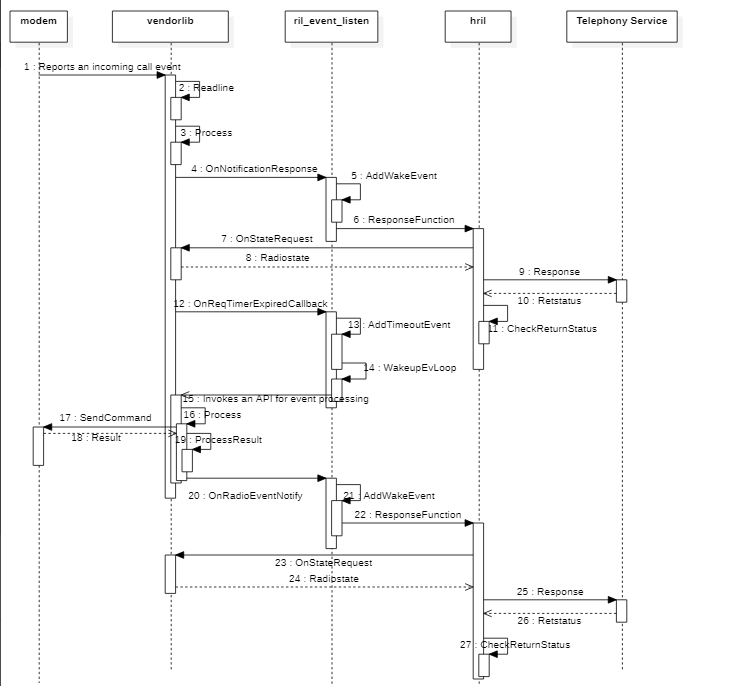

# Development Examples<a name="EN-US_TOPIC_0000001144061261"></a>

-   [Outgoing Calls](#section286643718507)
-   [Incoming Calls](#section3205350105014)

## Outgoing Calls<a name="section286643718507"></a>

The following figure shows the API calling for an outgoing call:

**Figure  1**  API calling for an outgoing call<a name="fig182512371267"></a>  




When an application triggers an outgoing call action, the RIL Adapter receives a request for making a call, and the  **OnRequest\(\)**  calls the required function based on the request ID. In the function for making a call, the data transmitted by the telephony service is encapsulated as an AT command sent to the modem. After executing the dialing command, the modem reports the execution result to RIL Adapter through  **OnRequestResponse\(\)**.

```
#include <stdio.h> 
#include <string.h> 
#include <errno.h> 
#include <alloca.h> 
#include "atchannel.h" 
#include "at_tok.h" 
#include "hdf_log.h" 
#include "ril.h" 

static void OnRequest(int request, void *data, size_t datalen, RIL_Token token)
{
    HDF_LOGI("OnRequest request = %{public}d start \n", request);
    switch (request) {
        case HREQ_CALL_DIAL:
            SendDialRequest(data, datalen, token);
            break;
        ...
        default:
            break;
    }
}
 
// Send the AT command (combination of the request ID and the above parameters) to the modem through send_at_request.
static void SendDialRequest(void *data, size_t datalen __unused, RIL_Token token)
{
    char *atCmd;
    const char *clir;
    int ret;
    DialInfo *pDial;
    pDial = (DialInfo *) data;

    if (!strncmp(pDial->address, "*31#", 4)) {
        HDF_LOGI("clir suppression");
        clir = "i";
        num = (char *)&(pDial->address[4]);
    } else if (!strncmp(pDial->address, "#31#", 4)) {
        HDF_LOGI("clir invocation");
        clir = "I";
        num = (char *)&(pDial->address[4]);
    } else {
        HDF_LOGI("set clir state to default");
        clir = "";
        num = (char *)pDial->number;
    }

    asprintf(&atCmd, "ATD%s%s;", pDial->address, clir);
    ret = send_at_request(atCmd, NULL);
    free(atCmd);
    // Called after the AT command is executed to send the modem execution result to RIL Adapter.
    OnRequestResponse(t, RIL_RESULT_SUCCESS, NULL, 0);
}
```

## Incoming Calls<a name="section3205350105014"></a>

The following figure shows the API calling of an incoming call:

**Figure  2**  API calling of an incoming call<a name="fig11621520133015"></a>  




The  **s\_tid\_read**  thread cyclically reads the messages reported by the modem. When the modem receives an incoming call event, it actively reports the information about the incoming call.

**OnNotificationResponse\(\)**  is called to parse an incoming call event. If the parsed data reported by the modem starts with characters such as  **+CRING**  and  **RING**, it indicates that an incoming call event exists. In this case, the event is reported to RIL Adapter through  **OnRadioEventNotify\(HNOTI\_CALL\_STATUS,  NULL, 0\)**.

```
#include <stdio.h> 
#include "atchannel.h" 
#include "at_tok.h" 
#include "hdf_log.h" 
#include "ril.h" 

bool IsCallStatusUpdated(const char *s)
{
    return (StrBeginWith(s, "+CRING:") 
        || StrBeginWith(s, "RING") 
        || StrBeginWith(s, "NO CARRIER") 
        || StrBeginWith(s, "+CCWA"));
}

// Parse the data reported by the modem into the target modem event.
static void OnNotificationResponse(const char *s, const char *sms_pdu) 
{ 
    char *line = NULL, *p; 
    HDF_LOGI("OnNotificationResponse = %{public}s sState = %{public}d", s, sState); 
    // Convert data starting with +CRING: to an incoming call event.
    if (IsCallStatusUpdated(s)) { 
        // Notify the RIL Adapter of an incoming call event.
        OnRadioEventNotify(HNOTI_CALL_STATUS, NULL, 0); 
    } 
    ...
}
```

