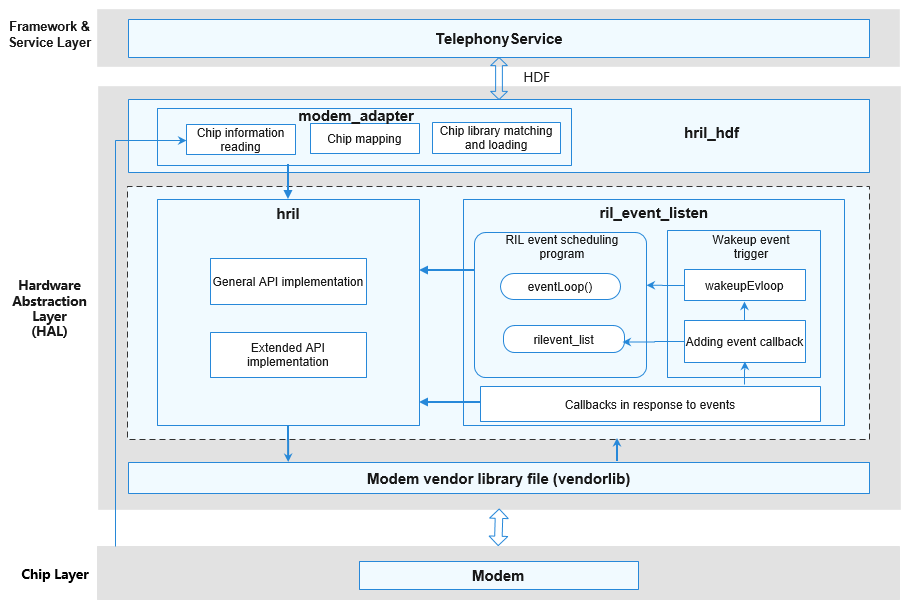

# Overview

-   [Basic Concepts](#section202mcpsimp)
-   [Working Principles](#section205mcpsimp)
-   [Limitations and Constraints](#section207mcpsimp)

This document provides development guidelines related to OpenHarmony telephony subsystem, including integrating and initializing modem vendor libraries, responding to modem service requests, and reporting modem events.

## Basic Concepts

The RIL Adapter module of the telephony subsystem is used for the communication between the cellular communication framework and a modem. This module helps develop libraries of different modem vendors and supports modem service requests and event reporting.

## Working Principles

**Figure  1**  Architecture of the RIL Adapter module  

The architecture of the RIL Adapter module consists of the module initialization \(**hril\_hdf**  &  **modem\_adapter**\), API implementation \(**hril**  &  **ril\_event\_listen**\), and modem vendor library \(**vendorlib**\), as shown in Figure 1.

After  **hril\_hdf**  is executed,  **vendorlib**  is dynamically loaded and obtains the available requests and pointers to functions for reporting events from  **hril\_hdf**. After this process is complete,  **hril\_hdf**  can communicate with a modem through  **vendorlib**.

-   hril\_hdf: Entry of the RIL Adapter. It is used to load the modem vendor library file, initialize the  **hril**  library, start the event scheduler  **ril\_event\_listen**, and load the associated modem vendor library file.
-   modem\_adapter: Adapter that allows a single firmware to adapt to different modems. Specifically, you can obtain the modem type from the kernel and then load the target modem vendor library based on the modem type.
-   hril: Implementation of APIs related to telephony services. The APIs include general and extended APIs. General APIs implement telephony services and main modem cellular communication \(SIM card, network search, cellular data, cellular call, and SMS/MMS services\). Extended APIs are used for vendors to implement customized capabilities.
-   ril\_event\_listen: Event scheduler that processes events reported by a modem. Specifically, when an event \(for example, an incoming call\) reported by the modem is received, the event can be encapsulated as  **ril\_event**  and added to the event scheduling queue. Then, a callback is invoked through the queue management mechanism to report the event to the telephony service.
-   vendorlib: Modem vendor library file. Different modem vendor libraries are developed based on standard APIs or service request IDs provided by RIL Adapter. \(**vendorlib**  is provided by modem vendors.\)

## Limitations and Constraints

**Specifications**

-   At least one modem must be supported by a device vendor. If no modem is supported,  **vendorlib**  APIs do not need to be implemented.

