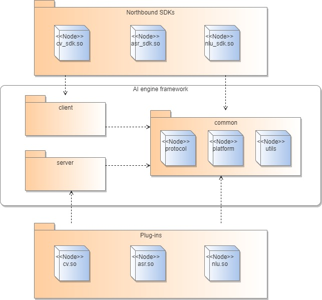

# AI Framework Development Guide

## **Overview**

### Introduction

The AI subsystem is the part of OpenHarmony that provides native distributed AI capabilities. At the heart of the subsystem is a unified AI engine framework, which implements quick integration of AI algorithm plug-ins. 
The framework consists of the plug-in management, module management, and communication management modules, fulfilling lifecycle management and on-demand deployment of AI algorithms. Specifically, plug-in management implements lifecycle management, on-demand deployment, and quick integration of AI algorithm plug-ins; module management implements task scheduling and client instance management; communication management manages inter-process communication (IPC) between the client and server and data transmission between the AI engine and plug-ins. Under this framework, AI algorithm APIs will be standardized to facilitate distributed calling of AI capabilities. In addition, unified inference APIs will be provided to adapt to different inference framework hierarchies.
The following figure shows the AI engine framework.


  **Figure 1** AI engine framework
  

### Setting Up the Environment


1. Prepare a development board, which can be Hi3516D V300 or Hi3518E V300.

2. [Download the source code.](../get-code/sourcecode-acquire.md)

## Technical Specifications

### Code Management

The AI engine framework consists of three modules: **client**, **server**, and **common**. The client module provides the server connection management function. An OpenHarmony SDK needs to encapsulate and call the public APIs provided by the client in the algorithm's external APIs. The server module provides functions such as plug-in loading and task management. Plug-ins are integrated using the plug-in APIs provided by the server. The common module provides platform-related operation methods, engine protocols, and tool classes for other modules.


The following figure shows the code dependency between modules of the AI engine framework.


  **Figure 2** Code dependency

  


#### Recommendation: Develop plug-ins and OpenHarmony SDKs in the directories specified by the AI engine.

In the overall planning of the AI engine framework, OpenHarmony SDKs are a part of the client, and plug-ins are called by the server and are considered a part of the server. Therefore, the following directories have been planned for plug-in and OpenHarmony SDK development in the AI engine framework:

- SDK code directory: //foundation/ai/engine/services/client/algorithm_sdk
  
  Example 1: //foundation/ai/engine/services/client/algorithm_sdk/cv

  Example 2: //foundation/ai/engine/services/client/algorithm_sdk/nlu

- Plug-in code directory: //foundation/ai/engine/services/server/plugin
  
  Example 1: //foundation/ai/engine/services/server/plugin/cv

  Example 2: //foundation/ai/engine/services/server/plugin/nlu


#### Rule: Store all external APIs provided by plug-ins in the **interfaces/kits** directory of the AI subsystem.

The AI subsystem exposes its capabilities through external APIs of OpenHarmony SDKs. According to API management requirements of OpenHarmony, store all external APIs of the SDK in the **interfaces/kits** directory of the subsystem. Currently, the external APIs of plug-ins of the AI subsystem are stored in the **//foundation/ai/engine/interfaces/kits** directory. You can add a sub-directory for each newly added plug-in in this directory. For example, if you add a CV plug-in, then store its external APIs in the **//foundation/ai/engine/interfaces/kits/cv** directory.


#### Rule: Make sure that plug-in build results are stored in the **/usr/lib** directory.

Plug-in loading on the server uses the dlopen mode and can only be performed in the** /usr/lib** directory. Therefore, when compiling the **.so** file of a plug-in, set the output directory as **/usr/lib** in the build configuration file.

### Naming rule

#### Rule: Name an SDK in the format of **domain_keyword<_other information 1_other information 2_...>_sdk.so**.

You are advised to use the commonly known abbreviations for domains. For example, use **cv** for image and video, **asr** for voice recognition, and **translation** for text translation. Add one if there is no available abbreviation for a domain. Use keywords that accurately describe the algorithm capability of the plug-in. For example, use **keyword\_spotting** for wakeup keyword spotting (KWS). Add other information, such as the supported chip type and applicable region, between **keyword** and **sdk**, with each of them separated by an underscore (\_). Note that the name of an SDK must end with **\_sdk**.

For example, if the SDK for the KWS plug-in supports only the Kirin 9000 chipset and is applicable only in China, then name the SDK as follows: **asr\_keyword\_spotting\_kirin9000\_china\_sdk.so**.


#### Rule: Name a plug-in in the format of **domain_keyword<_other information 1_other information 2_...>.so**.

There is a one-to-one mapping between plug-ins and SDKs. Therefore, the definitions and requirements of terms such as the domain, keyword, and other information in plug-in names are the same as those in SDK names. The only difference is that the name of the SDK ends with **\_sdk** additionally. For example, if the plug-in is named **asr\_keyword\_spotting.so**, the corresponding SDK is named **asr\_keyword\_spotting\_sdk.so**.

For example, if the SDK for the KWS plug-in supports only the Kirin 9000 chipset and is applicable only in China, then name the plug-in as follows: **asr\_keyword\_spotting\_kirin9000\_china.so**.

### API Development

#### Rule: Encapsulate the external APIs provided by the client based on the algorithm call sequence. For the SDK of an asynchronous plug-in, implement the **IClientCb** API provided by the client.

The external APIs provided by the client of the AI engine include **AieClientInit**, **AieClientPrepare**, **AieClientSyncProcess**, **AieClientAsyncProcess**, **AieClientRelease**, **AieClientDestroy**, **AieClientSetOption**, and **AieClientGetOption**. The SDK needs to encapsulate at least the following five APIs in sequence: **AieClientInit**, **AieClientPrepare**, **AieClientSyncProcess** (or **AieClientAsyncProcess**), **AieClientRelease**, and **AieClientDestroy**. Otherwise, a call failure or memory leakage may occur. For example, if the **AieClientPrepare** API is omitted during encapsulation, the server cannot load the plug-in. As a result, APIs that follow it cannot be called.

For an asynchronous plug-in, the SDK needs to implement the **IClientCb** API to receive the algorithm inference result from the client and return the result to the third-party caller.


#### Rule: Save all common data related to client interaction in the SDK during API implementation.

The client of the AI engine uses the singleton pattern for API implementation. If the client is connecting to multiple SDKs, each SDK needs to store all common data exchanged with the client so that they can connect to the server to perform operations such as task inference and return the result. Common data usually includes **clientInfo**, **algorithmInfo**, and **configInfo**, which are defined in the SDK's member variables.


#### Recommendation: Enable the SDK to implement the **IServiceDeadCb** API defined by the client.

The processes running on the server are system resident processes. The server provides services for clients by way of system capabilities. The **IServiceDeadCb** API is called if a server process is abnormally killed. The SDK can implement related operations in this API, for example, stopping process call or restarting the server.

The following is an example of **IServiceDeadCb** API implementation:


```
class ServiceDeadCb : public IServiceDeadCb {
public:
ServiceDeadCb() = default;
~ServiceDeadCb() override = default;
void OnServiceDead() override
{
printf("[ServiceDeadCb]OnServiceDead Callback happens");
}
};
```

As shown above, the SDK can implement its own operations in the **OnServiceDead()** function, for example, stopping API call.


#### Rule: Convert dedicated algorithm data into common data of the AI engine if the SDK and plug-ins need to use the codec module.

For plug-ins, inference data is transmitted by the third-party caller to them through the client and server. The required data type varies according to algorithms. For example, the CV algorithm requires image data, and the ASR algorithm requires audio data. To address this issue, the AI engine provides the codec capabilities to convert different types of data into common data that can be used by it.

The encoded data is as follows:


```
struct DataInfo {
unsigned char *data;
int length;
} DataInfo;

```

As shown above, **DataInfo** consists of two variables: a pointer to the data memory, and the data length.

To use the APIs of the AI engine framework, you need to:

1. Add the dependency header file utils/encdec/include/encdec.h.

2. Add the dependency items in the **build.gn** file.

Add **//foundation/ai/engine/services/common** to **include\_dirs**.

Add **//foundation/ai/engine/services/common/utils/encdec:encdec** to **deps**.

3. Convert different types of data through codec. The following is an example:


```
// Example function for encoding: arg1, arg2, and arg3 are variables to be encoded, and dataInfo is the encoding result.
retCode = ProcessEncode(dataInfo, arg1, arg2, arg3) // The number of parameters can be flexible.
// Example function for decoding: dataInfo is the data to be decoded, and arg1, arg2, and arg3 are the decoding result.
retCode = ProcessDecode(dataInfo, arg1, arg2, arg3) // The number of parameters can be flexible.
```

Note:

- The sequence of parameters must be the same during encoding and decoding.

- After encoding, the memory used by **dataInfo** needs to be manually released by the caller.

- The memory is managed and released separately on the server and the client.

- If a pointer contains the shared memory, no extra processing is required.

- If other types of pointers are used, you need to dereference them before using **ProcessEncode** or **ProcessDecode**.

- The codec module has not been adapted to the **class** data type and therefore it is not recommended.


#### Rule: Release the memory used by the encoded or decoded parameters in the SDK. Otherwise, a memory leakage occurs.

Encoding is essentially a process of encapsulating different types of data in the same memory space and then encapsulating the start address and length of the memory into the body. A plug-in is unable to release the memory that has been allocated to output parameter data, which is returned to the SDK through encoding. To obtain the data, the SDK first needs to release the memory.

The following is an example of releasing the memory:


```
DataInfo outputInfo = {
.data = nullptr,
.length = 0,
};
AieClientPrepare(clientInfo_, algorithmInfo_, inputInfo, outputInfo, nullptr);
if (outputInfo.data != nullptr) {
free(outputInfo.data);
outputInfo.data = nullptr;
outputInfo.length = 0;
}
```


#### Rule: Enable plug-ins to implement the **IPlugin** API defined by the server and use the **PLUGIN\_INTERFACE\_IMPL** statement to provide the function pointer for external systems.

The server manages a variety of plug-ins, and the API implementation logic varies according to plug-ins. To unify the plug-in loading process, the AI engine provides the **IPlugin** API. In the runtime environment, a plug-in is loaded as a dynamic link library (DLL) by the AI engine framework in dlopen mode. Therefore, the plug-in needs to use the **PLUGIN\_INTERFACE\_IMPL** statement to expose the function pointer. Otherwise, the plug-in cannot be properly loaded. 


#### Rule: Use the unified data channel provided by the AI engine for plug-ins.

The AI engine provides a unified data channel between the server and plug-ins to send inference requests from the SDK and returned results from plug-ins. Plug-ins need to obtain the request data and encapsulate the inference result over the data channel when calling the inference API.

The following is an example of using the data channel:


```
int SyncProcess(IRequest *request, IResponse *&response)
{
HILOGI("[IvpPlugin]Begin SyncProcess");
if (request == nullptr) {
HILOGE("[IvpPlugin]SyncProcess request is nullptr");
return RETCODE_NULL_PARAM;
}
DataInfo inputInfo = request->GetMsg();
if (inputInfo.data == nullptr) {
HILOGE("[IvpPlugin]InputInfo data is nullptr");
return RETCODE_NULL_PARAM;
}

...

response = IResponse::Create(request);
response->SetResult(outputInfo);
return RETCODE_SUCCESS;
}
```

In the example, the request and response are the data body sent over the data channel. The server encapsulates data in the request and sends it to the plug-in. After completing algorithm processing, the plug-in encapsulates the result into the response and returns it to the server over the data channel.

## Development Guidelines

### Developing the SDK

The function of the SDK header file is implemented by mapping SDK API calls to client API calls. The following table lists the APIs provided by the client.


  **Table 1** Client APIs

| API| Description| Parameters|
| -------- | -------- | -------- |
| int&nbsp;**AieClientInit**(const&nbsp;ConfigInfo&nbsp;&amp;configInfo,<br>&nbsp;ClientInfo&nbsp;&amp;clientInfo,&nbsp;const&nbsp;AlgorithmInfo<br>&nbsp;&amp;algorithmInfo,&nbsp;IServiceDeadCb&nbsp;\*cb) | **Function**: Links and initializes the engine service and activates IPC call.<br>**Return value**: **0** if the operation is successful; a non-zero value otherwise.| **configInfo**: engine-related initial configuration data. This parameter must not be null.<br>**clientInfo**: engine client information. This parameter must not be null.<br>**algorithmInfo**: information about the called algorithm. This parameter must not be null.<br>**cb**: death callback object. This parameter can be null. |
| int&nbsp;**AieClientPrepare**(const&nbsp;ClientInfo&nbsp;&amp;clientInfo<br>,&nbsp;const&nbsp;AlgorithmInfo&nbsp;&amp;algorithmInfo,&nbsp;const&nbsp;DataInfo<br>&nbsp;&amp;inputInfo,&nbsp;DataInfo&nbsp;&amp;outputInfo,&nbsp;IClientCb&nbsp;\*cb) | **Function**: Loads an algorithm plug-in.<br>**Return value**: **0** if the operation is successful; a non-zero value otherwise.| **clientInfo**: engine client information. This parameter must not be null.<br>**algorithmInfo**: information about the called algorithm. This parameter must not be null.<br>**inputInfo**: input information specified for algorithm plug-in loading. This parameter can be null.<br>**outputInfo**: information returned after algorithm plug-in loading, if any. This parameter can be null.<br>**cb**: return result of the asynchronous algorithm. This parameter must not be null for the asynchronous algorithm. For the synchronous algorithm, this parameter must be null. |
| int&nbsp;**AieClientAsyncProcess**(const&nbsp;ClientInfo&nbsp;&amp;clientInfo,<br>&nbsp;const&nbsp;AlgorithmInfo&nbsp;&amp;algorithmInfo,&nbsp;const&nbsp;DataInfo<br>&nbsp;&amp;inputInfo) | **Function**: Executes an asynchronous algorithm.<br>**Return value**: **0** if the operation is successful; a non-zero value otherwise.| **clientInfo**: engine client information. This parameter must not be null.<br>**algorithmInfo**: information about the called algorithm. This parameter must not be null.<br>**inputInfo**: input information specified for algorithm operations. This parameter can be null. |
| int&nbsp;**AieClientSyncProcess**(const&nbsp;ClientInfo&nbsp;&amp;clientInfo,<br>&nbsp;const&nbsp;AlgorithmInfo&nbsp;&amp;algorithmInfo,&nbsp;const<br>&nbsp;DataInfo&nbsp;&amp;inputInfo,&nbsp;DataInfo&nbsp;&amp;outputInfo) | **Function**: Executes a synchronous algorithm.<br>**Return value**: **0** if the operation is successful; a non-zero value otherwise.| **clientInfo**: engine client information. This parameter must not be null.<br>**algorithmInfo**: information about the called algorithm. This parameter must not be null.<br>**inputInfo**: input information specified for algorithm operations. This parameter can be null.<br>**outputInfo**: output information in the return result of the synchronous algorithm. This parameter can be null. |
| int&nbsp;**AieClientRelease**(const&nbsp;ClientInfo&nbsp;&amp;clientInfo,<br>&nbsp;const&nbsp;AlgorithmInfo&nbsp;&amp;algorithmInfo,&nbsp;const<br>&nbsp;DataInfo&nbsp;&amp;inputInfo) | **Function**: Uninstalls an algorithm plug-in.<br>**Return value**: **0** if the operation is successful; a non-zero value otherwise.| **clientInfo**: engine client information. This parameter must not be null.<br>**algorithmInfo**: information about the algorithm plug-in to be uninstalled. This parameter must not be null.<br>**inputInfo**: input information specified for algorithm plug-in uninstallation. This parameter can be null. |
| int&nbsp;**AieClientDestroy**(ClientInfo&nbsp;&amp;clientInfo) | **Function**: Disconnects from the server and releases the cache.<br>**Return value**: **0** if the operation is successful; a non-zero value otherwise.| **clientInfo**: engine client information. This parameter must not be null. |
| int&nbsp;**AieClientSetOption**(const&nbsp;ClientInfo&nbsp;&amp;clientInfo,<br>&nbsp;int&nbsp;optionType,&nbsp;const&nbsp;DataInfo&nbsp;&amp;inputInfo) | **Function**: Sets configuration items. You can use this API to pass algorithm's extended information to plug-ins.<br>**Return value**: **0** if the operation is successful; a non-zero value otherwise.| **clientInfo**: engine client information. This parameter must not be null.<br>**optionType**: algorithm used for obtaining the configuration item information. An algorithm plug-in can use this parameter as needed. This parameter must not be null.<br>**inputInfo**: Indicates algorithm parameter information. An algorithm plug-in can use this parameter as needed. This parameter can be null. |
| int&nbsp;**AieClientGetOption**(const&nbsp;ClientInfo&nbsp;&amp;clientInfo,<br>&nbsp;int&nbsp;optionType,&nbsp;const&nbsp;DataInfo&nbsp;&amp;inputInfo,<br>&nbsp;DataInfo&nbsp;&amp;outputInfo) | **Function**: Obtains configuration item information based on the specified **optionType** and **inputInfo**.<br>**Return value**: **0** if the operation is successful; a non-zero value otherwise.| **clientInfo**: engine client information. This parameter must not be null.<br>**optionType**: algorithm used for obtaining the configuration item information. This parameter must not be null.<br>**inputInfo**: input information specified for obtaining configuration item information of the algorithm. This parameter can be null.<br>**outputInfo**: configuration item information in the return result. This parameter can be null. |


The following table describes the data structure of **ConfigInfo**, **ClientInfo**, **AlgorithmInfo**, and **DataInfo**.


  **Table 2** Data structure of ConfigInfo, ClientInfo, AlgorithmInfo, and DataInfo

| Data Structure| Description| Attributes|
| -------- | -------- | -------- |
| ConfigInfo | Algorithm configuration item information| **const&nbsp;char&nbsp;\*description**: body of configuration item information. |
| ClientInfo | Client information.| **long&nbsp;long&nbsp;clientVersion**: client version number. This parameter is not used currently.<br>**int&nbsp;clientId**: client ID.<br>**int&nbsp;sessionId**: session ID.<br>**uid\_t&nbsp;serverUid**: server UID.<br>**uid\_t&nbsp;clientUid**: client UID.<br>**int&nbsp;extendLen**: length of the extended information (**extendMsg**).<br>**unsigned&nbsp;char&nbsp;\*extendMsg**: body of the extended information. |
| AlgorithmInfo | Algorithm information| **long&nbsp;long&nbsp;clientVersion**: client version number. This parameter is not used currently.<br>**bool&nbsp;isAsync**: whether asynchronous execution is used.<br>**int&nbsp;algorithmType**: algorithm type ID allocated by the AI engine framework based on the plug-in loading sequence.<br>**long&nbsp;long&nbsp;algorithmVersion**: algorithm version number.<br>**bool&nbsp;isCloud**: whether to migrate data to the cloud. This parameter is not used currently.<br>**int&nbsp;operateId**: execution ID. This parameter is not used currently.<br>**int&nbsp;requestId**: request ID, which identifies each request and corresponds to the execution result.<br>**int&nbsp;extendLen**: length of the extended information (**extendMsg**).<br>**unsigned&nbsp;char&nbsp;\*extendMsg**: body of the extended information. |
| DataInfo | Algorithm input parameter configuration information (**inputInfo**)<br>and output parameter configuration information (**outputInfo**)| **unsigned&nbsp;char&nbsp;\*data**: data subject.<br>**int&nbsp;length**: data length. |


For details about the development process, see the development example of the [KWS SDK](#kws-sdk).

### Developing a Plug-in
The AI engine framework has defined a set of algorithm plug-in access specifications. Each plug-in needs to implement specified APIs to implement functions such as obtaining the plug-in version information and algorithm inference type, executing synchronous and asynchronous algorithms, loading algorithm plug-ins, uninstalling algorithm plug-ins, setting algorithm configuration information, and obtaining specified algorithm configuration information. Specifically, implement the **SyncProcess** API for the synchronous algorithm and the **AsyncProcess** API for the asynchronous algorithm.


The following table describes the **IPlugin** APIs.


  **Table 3** IPlugin APIs

| API| Description| Parameters|
| -------- | -------- | -------- |
| const&nbsp;long&nbsp;long&nbsp;GetVersion()&nbsp;const; | **Function**: Obtains the plug-in version information.<br>**Return value**: version number (in the **long&nbsp;long** format)| - |
| const&nbsp;char&nbsp;\*GetInferMode()&nbsp;const; | **Function**: Obtains the algorithm inference type.<br>**Return value**: "SYNC"&nbsp;or&nbsp;"ASYNC"| - |
| int&nbsp;SyncProcess(IRequest&nbsp;\*request,<br>IResponse&nbsp;\*&amp;response); | **Function**: Executes a synchronous algorithm.<br>**Return value**: **0** if the operation is successful; a non-zero value otherwise.| **request**: used to pass the request content to the algorithm plug-in over the data channel between the engine server and the plug-in. This parameter must not be null.<br>**response**: used to receive the synchronous algorithm execution result returned by the algorithm plug-in over the data channel between the engine server and the plug-in. This parameter must not be null.|
| int&nbsp;AsyncProcess(IRequest&nbsp;\*request,<br>IPluginAlgorithmCallback&nbsp;\*callback); | **Function**: Executes an asynchronous algorithm.<br>**Return value**: **0** if the operation is successful; a non-zero value otherwise.| **request**: used to pass the request content to the algorithm plug-in over the data channel between the engine server and the plug-in. This parameter must not be null.<br>**callback**: used to return the asynchronous algorithm execution result to the engine server. This parameter must not be null.|
| int&nbsp;Prepare(long&nbsp;long&nbsp;transactionId,<br>const&nbsp;DataInfo&nbsp;&amp;inputInfo,&nbsp;DataInfo<br>&amp;outputInfo); | **Function**: Loads an algorithm plug-in.<br>**Return value**: **0** if the operation is successful; a non-zero value otherwise.| **transactionId**: transaction ID, which is used to identify the client and session. This parameter must not be null.<br>**inputInfo**: input information specified for algorithm plug-in loading. This parameter can be null.<br>**outputInfo**: output information in the return result of algorithm plug-in loading. This parameter can be null.|
| int&nbsp;Release(bool&nbsp;isFullUnload,&nbsp;long&nbsp;long<br>transactionId,&nbsp;const&nbsp;DataInfo&nbsp;&amp;inputInfo); | **Function**: Uninstalls an algorithm plug-in.<br>**Return value**: **0** if the operation is successful; a non-zero value otherwise.| **isFullUnload**: whether a plug-in is called by only one client. A plug-in can be uninstalled only when it is called by only one client. This parameter must not be null.<br>**transactionId**: transaction ID, which is used to identify the client and session. This parameter must not be null.<br>**inputInfo**: input information specified for algorithm plug-in uninstallation. This parameter can be null.|
| int&nbsp;SetOption(int&nbsp;optionType,&nbsp;const<br>DataInfo&nbsp;&amp;inputInfo); | **Function**: Sets configuration items. You can use this API to pass algorithm's extended information to plug-ins.<br>**Return value**: **0** if the operation is successful; a non-zero value otherwise.| **optionType**: algorithm used for obtaining the configuration item information. An algorithm plug-in can use this parameter as needed. This parameter must not be null.<br>**inputInfo**: algorithm parameter information. An algorithm plug-in can use this parameter as needed. This parameter can be null.|
| int&nbsp;GetOption(int&nbsp;optionType,&nbsp;const<br>DataInfo&nbsp;&amp;inputInfo,&nbsp;DataInfo<br>&amp;outputInfo); | **Function**: Obtains configuration item information based on the specified **optionType** and **inputInfo**.<br>**Return value**: **0** if the operation is successful; a non-zero value otherwise.| **optionType**: algorithm used for obtaining the configuration item information. This parameter must not be null.<br>**inputInfo**: input information specified for obtaining configuration item information of the algorithm. This parameter can be null.<br>**outputInfo**: configuration item information in the return result. This parameter can be null.|


Algorithm plug-in APIs including **Prepare**, **SyncProcess**, **AsyncProcess**, **Release**, **SetOption**, and **GetOption** are in 1:1 mapping with the client APIs including **AieClientPrepare**, **AieClientSyncProcess**, **AieClientAsyncProcess**, **AieClientRelease**, **AieClientSetOption**, and **AieClientGetOption**. The **GetInferMode** API is used to return the algorithm execution type, which can be synchronous or asynchronous.


The following table describes the **IPluginCallback** APIs.


  **Table 4** IPluginCallback APIs

| API| Description| Parameters|
| -------- | -------- | -------- |
| void&nbsp;OnEvent(PluginEvent&nbsp;event,<br>IResponse&nbsp;\*response); | **Function**: Returns the asynchronous algorithm execution result.| **event**: used to enumerate the algorithm execution result. The value can be **ON\_PLUGIN\_SUCCEED** or **ON\_PLUGIN\_FAIL**.<br>**response**: used to return the algorithm execution result.|


The **Request** and **Response** classes define the requests and responses used for communication between the AI engine server and algorithm plug-ins. A request encapsulates the request content and input data of the caller. The plug-in returns the calculation result to the AI engine server through a response.


The following table describes the attributes of the **Request** class.


  **Table 5** Attributes of the Request class

| Attribute| Description| Default Value|
| -------- | -------- | -------- |
| innerSequenceId_ | **Type**: long&nbsp;long<br>**Function**: reserved| 0 |
| requestId_ | **Type**: int<br>**Function**: Indicates the request sequence, which is used to bind the return result.| 0 |
| operationId_ | **Type**: int<br>**Function**: reserved| 0 |
| transactionId_ | Type: long&nbsp;long<br>**Function**: Indicates the transaction ID, which is the combination of **clientId** and **sessionId**.| 0 |
| algoPluginType_ | **Type**: int<br>**Function**: Indicates the algorithm type ID allocated by the AI engine framework based on the plug-in loading sequence.| 0 |
| msg_ | **Type**: DataInfo<br>**Function**: Stores the input parameters for calling the algorithm API.| .data&nbsp;=&nbsp;nullptr<br>.length&nbsp;=&nbsp;0 |


The following table describes the attributes of the **Response** class.


  **Table 6** Attributes of the Response class

| Attribute| Description| Default Value|
| -------- | -------- | -------- |
| innerSequenceId_ | **Type**: long&nbsp;long<br>**Function**: reserved| 0 |
| requestId_ | **Type**: int<br>**Function**: Indicates the request sequence, which is used to bind the return result.| 0 |
| retCode__ | **Type**: int<br>**Function**: Indicates the inference result code of the asynchronous algorithm.| 0 |
| retDesc_ | **Type**: string<br>**Function**: reserved| - |
| transactionId_ | Type: long&nbsp;long<br>**Function**: Indicates the transaction ID, which is the combination of **clientId** and **sessionId**.| 0 |
| algoPluginType_ | **Type**: int<br>**Function**: Indicates the algorithm type ID allocated by the AI engine framework based on the plug-in loading sequence.| INVALID_ALGO_PLUGIN_TYPE(-1) |
| result_ | **Type**: DataInfo<br>**Function**: Stores the inference result of the asynchronous algorithm.| .data&nbsp;=&nbsp;nullptr<br>.length&nbsp;=&nbsp;0 |


For details about the development process, see the development example of the [KWS plug-in](#kws-plug-in).

### Preparing the Configuration File

The SDK identifies the plug-in type based on **algorithmVersion** and **algorithmType** in the **AlgorithmInfo** structure so it can call the plug-in capabilities. Therefore, you need to develop the plug-in configuration file as follows:


1. Add the plug-in configuration file to the **//foundation/ai/engine/services/common/protocol/plugin\_config/plugin\_config\_ini/** directory.

2. Add the algorithm type to the **aie\_algorithm_type.h** file in the **//foundation/ai/engine/services/common/protocol/plugin\_config/** directory.

3. Add the name of the KWS algorithm and its sequence number in **ALGORITHM\_TYPE\_ID\_LIST** to the **aie\_plugin\_info.h** file in the **//foundation/ai/engine/services/server/plugin\_manager/include/** directory.

For details about the development process, see the development example of the [configuration file](#kws-configuration-file).

## Development Example

### KWS SDK


1. Add the API definition of the KWS SDK to the **//foundation/ai/engine /interfaces/kits** directory. This API can be called by third-party applications. The following code snippet is an example API for the KWS SDK. The reference code is available at the **//foundation/ai/engine /interfaces/kits/asr/keyword\_spotting** directory.
  
   ```
   class KWSSdk {
   public:
       KWSSdk();
       virtual ~KWSSdk();
   
       // Create a KWS SDK instance.
       int32_t Create();
   
       // Synchronously execute the KWS task.
       int32_t SyncExecute(const Array<int16_t> &audioInput);
   
       // Set the KWS callback.
       int32_t SetCallback(const std::shared_ptr<KWSCallback> &callback);
   
       // Destroy the KWS SDK instance to release the session engaged with the plug-in.
       int32_t Destroy();
   };
   ```

2. Add the API implementation of the SDK to the **//foundation/ai/engine/services/client/algorithm\_sdk** directory and call the APIs provided by the client to use the algorithm plug-in capabilities. The following code snippet is an example implementation of the **create** method in the API of the KWS SDK. For more details, see the reference code at **//foundation/ai/engine/services/client/algorithm\_sdk/asr/keyword\_spotting**.
  
   ```
   int32_t KWSSdk::KWSSdkImpl::Create()
   {
       if (kwsHandle_ != INVALID_KWS_HANDLE) {
           HILOGE("[KWSSdkImpl]The SDK has been created");
           return KWS_RETCODE_FAILURE;
       }
       if (InitComponents() != RETCODE_SUCCESS) {
           HILOGE("[KWSSdkImpl]Fail to init sdk components");
           return KWS_RETCODE_FAILURE;
       }
       // Call the AieClientInit API provided by the client to initialize the engine service and activate IPC call.
       int32_t retCode = AieClientInit(configInfo_, clientInfo_, algorithmInfo_, nullptr);
       if (retCode != RETCODE_SUCCESS) {
           HILOGE("[KWSSdkImpl]AieClientInit failed. Error code[%d]", retCode);
           return KWS_RETCODE_FAILURE;
       }
       if (clientInfo_.clientId == INVALID_CLIENT_ID) {
           HILOGE("[KWSSdkImpl]Fail to allocate client id");
           return KWS_RETCODE_FAILURE;
       }
       DataInfo inputInfo = {
           .data = nullptr,
           .length = 0,
       };
       DataInfo outputInfo = {
           .data = nullptr,
           .length = 0,
       };
       // Call the AieClientPrepare API provided by the client to load the algorithm plug-in.
       retCode = AieClientPrepare(clientInfo_, algorithmInfo_, inputInfo, outputInfo, nullptr);
       if (retCode != RETCODE_SUCCESS) {
           HILOGE("[KWSSdkImpl]AieclientPrepare failed. Error code[%d]", retCode);
           return KWS_RETCODE_FAILURE;
       }
       if (outputInfo.data == nullptr || outputInfo.length <= 0) {
           HILOGE("[KWSSdkImpl]The data or length of output info is invalid");
           return KWS_RETCODE_FAILURE;
       }
       MallocPointerGuard<unsigned char> pointerGuard(outputInfo.data);
       retCode = PluginHelper::UnSerializeHandle(outputInfo, kwsHandle_);
       if (retCode != RETCODE_SUCCESS) {
           HILOGE("[KWSSdkImpl]Get handle from inputInfo failed");
           return KWS_RETCODE_FAILURE;
       }
       return KWS_RETCODE_SUCCESS;
   }
   ```

   The preceding code is the specific API implementation. The **create** function in the API of the KWS SDK calls the open **AieClientInit** and **AieClientPrepare** APIs provided by the client to connect to the server and load the algorithm model.

   > **NOTE**
   > 
   > The sequence for the SDK to call client APIs of the AI engine is as follows: AieClientInit -> AieClientPrepare -> AieClientSyncProcess/AieClientAsyncProcess -> AieClientRelease -> AieClientDestroy. An exception will be thrown if the call sequence is violated.

### KWS Plug-in
Add the API definition (that is, **IPlugin**) of the KWS plug-in to the **//foundation/ai/engine/services/server/plugin** directory. This API is used to call AI capabilities. The following code snippet is an example API implementation of the KWS plug-in. The reference code is available at the **//foundation/ai/engine/services/server/plugin/asr/keyword\_spotting** directory.
     
   ```
   #include "plugin/i_plugin.h
   class KWSPlugin : public IPlugin {
   public:
       KWSPlugin();
       ~KWSPlugin();
       const long long GetVersion() const override;
       const char* GetName() const override;
       const char* GetInferMode() const override;
       int32_t Prepare(long long transactionId, const DataInfo &amp;amp;inputInfo, DataInfo &amp;amp;outputInfo) override;
       int32_t SetOption(int optionType, const DataInfo &amp;amp;inputInfo) override;
       int32_t GetOption(int optionType, const DataInfo &amp;amp;inputInfo, DataInfo &amp;amp;outputInfo) override;
       int32_t SyncProcess(IRequest *request, IResponse *&amp;amp;response) override;
       int32_t AsyncProcess(IRequest *request, IPluginCallback*callback) override;
       int32_t Release(bool isFullUnload, long long transactionId, const DataInfo &amp;amp;inputInfo) override;
   };
   ```
The preceding code implements the **IPlugin** APIs provided by the server. The following table shows the mapping between the client APIs and the plug-in APIs.
     
**Table 7** Mapping between the client APIs and the plug-in APIs

| Client API| Plug-in API| Description|
| -------- | -------- | -------- |
| AieClientPrepare | Prepare | Initializes the inference algorithm plug-in. For KWS, this API loads the KWS model from the fixed location (**/sdcard/wenwen\_inst.wk**) to the memory.|
| AieClientSyncProcess | SyncProcess | Executes the inference algorithm synchronously. For KWS, this API synchronously executes the audio inference algorithm to determine whether the specified wakeup keyword exists in the audio.|
| AieClientAsyncProcess | AsyncProcess | Executes the inference algorithm asynchronously. Currently, this API is not used in KWS. However, you can implement the API based on your use case.|
| AieClientSetOption | SetOption | Sets algorithm-related configuration items, such as the confidence threshold and delay. Currently, this API is not used in KWS. However, you can implement the API based on your use case.|
| AieClientGetOption | GetOption | Obtains algorithm-related configuration items. For KWS, this API can obtain the input and output scale of the KWS model. The input scale is the MFCC feature (fixed value: **4000**) required by the KWS model, and the output scale is the confidence (fixed value: **2**) of the result.|
| AieClientRelease | Release | Releases the algorithm model. For KWS, this API releases the specified algorithm model and clears the dynamic memory in the feature processor.|

   Note:

   1. The **AieClientInit** and **AieClientDestroy** APIs are used to connect to and disconnect from the server, respectively. They are not called in the plug-in algorithm and therefore do not need to be defined in the plug-in.

   2. The KWS plug-in needs to use the **PLUGIN\_INTERFACE\_IMPL** statement to expose the function pointer. Otherwise, the plug-in cannot be properly loaded.


   ```
   PLUGIN_INTERFACE_IMPL(KWSPlugin);
   ```

### KWS Configuration File

1. Add the KWS configuration file to the **//foundation/ai/engine/services/common/protocol/plugin\_config/plugin\_config\_ini/** directory.
  
   ```
   [base]
   supported_boards = hi3516dv300
   related_sessions = asr_keyword_spotting+20001002
   
   // Naming rule: [algorithm name+algorithm version], for example, [asr\_keyword\_spotting+20001002]
   [asr_keyword_spotting+20001002]
   AID         = asr_keyword_spotting
   VersionCode = 20001002
   VersionName = 2.00.01.002
   XPU         = NNIE
   District    = China
   // Location of the complied **.so** file of the plug-in
   FullPath    = /usr/lib/libasr_keyword_spotting.so
   Chipset     = ALL
   ChkSum      = ''
   Key         = ''
   ```

2. Add the type ID of the KWS algorithm to the **aie\_algorithm_type.h** file in the **//foundation/ai/engine/services/common/protocol/plugin\_config/** directory.
  
   ```
   // Make sure that the type ID maps to the sequence number in **ALGORITHM\_TYPE\_ID\_LIST**.
   const int ALGORITHM_TYPE_KWS = 3;
   ```

3. Add the name of the KWS algorithm and its sequence number in **ALGORITHM\_TYPE\_ID\_LIST** to the **aie\_plugin\_info.h** file in the **//foundation/ai/engine/services/server/plugin\_manager/include/** directory.
  
   ```
   const std::string ALGORITHM_ID_SAMPLE_1 = "sample_plugin_1";
   const std::string ALGORITHM_ID_SAMPLE_2 = "sample_plugin_2";
   const std::string ALGORITHM_ID_IVP = "cv_human_detect";
   // Add the name of the KWS algorithm: asr\_keyword\_spotting.
   // Name the algorithm variable in the same way as the algorithm type ID in ALGORITHM\_TYPE\_ID\_LIST, for example, ALGORITHM_ID_KWS.
   const std::string ALGORITHM_ID_KWS = "asr_keyword_spotting";
   const std::string ALGORITHM_ID_IC = "cv_image_classification";
   const std::string ALGORITHM_ID_INVALID = "invalid algorithm id";
   
   const std::vector<std::string> ALGORITHM_TYPE_ID_LIST = {
       ALGORITHM_ID_SAMPLE_1,
       ALGORITHM_ID_SAMPLE_2,
       ALGORITHM_ID_IVP,
       // Add the sequence number of the KWS algorithm to ALGORITHM\_TYPE\_ID\_LIST, so that the name of the KWS algorithm can be obtained based on the sequence number.
       // Make sure that the algorithm name maps to the sequence number in ALGORITHM\_TYPE\_ID\_LIST.
       ALGORITHM_ID_KWS,
       ALGORITHM_ID_IC,
   };
   ```
