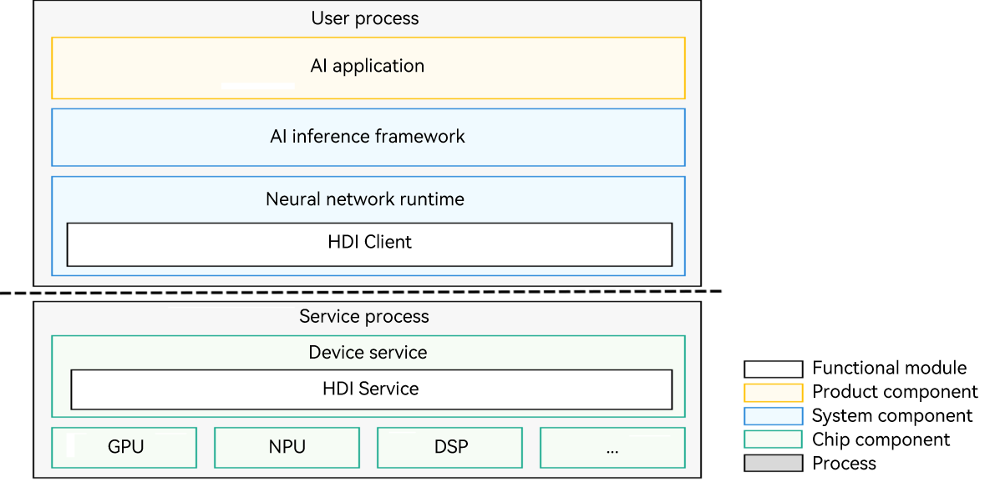
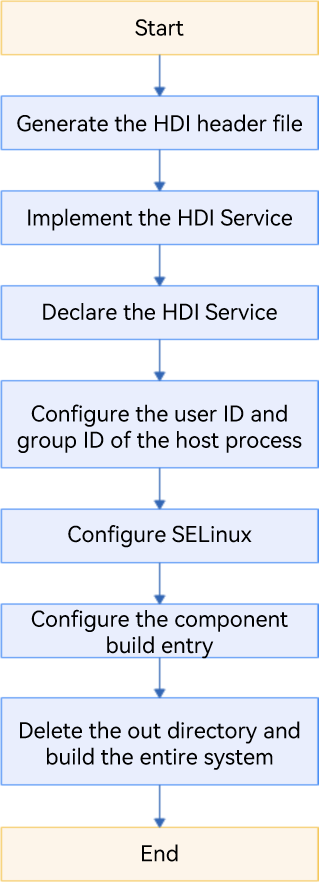

# Neural Network Runtime Device Access

## Overview

### Function Introduction

Neural Network Runtime (NNRt) functions as a bridge to connect the upper-layer AI inference framework and underlying acceleration chips, implementing cross-chip inference computing of AI models.

NNRt opens HDIs for chip vendors to connect dedicated acceleration chips to NNRt to interconnect with the OpenHarmony ecosystem.  

### Basic Concepts
Before you get started, it would be helpful for you to have a basic understanding of the following concepts:

- Hardware Device Interface (HDI): defines APIs for cross-process communication between services in OpenHarmony.
- Interface Description Language (IDL): defines the HDI language format.

### Constraints
- System version: OpenHarmony trunk version.
- Development environment: Ubuntu 18.04 or later.
- Access device: a chip with AI computing capabilities.

### Working Principles
NNRt connects to device chips through HDIs, which implement cross-process communication between services.

**Figure 1** NNRt architecture



The NNRt architecture consists of three layers: AI applications at the application layer, AI inference framework and NNRt at the system layer, and device services at the chip layer. To use a dedicated acceleration chip model for inference, an AI application needs to call the underlying dedicated AI acceleration chip through the AI inference framework and NNRt. NNRt is responsible for adapting to various underlying dedicated acceleration chips. It opens standard and unified HDIs for various AI acceleration chips to access the OpenHarmony ecosystem. In addition, NNRt opens standard and unified APIs to connect to various upper-layer AI inference frameworks.

During program running, the AI application, AI inference framework, and NNRt reside in the user process, and the underlying AI chip device services reside in the HDI service process. NNRt implements the HDI client and the service side implements HDI Service to fulfill cross-process communication through the Hardware Driver Foundation (HDF) subsystem.

## How to Develop

### Application Scenario
Suppose you are connecting an AI acceleration chip, for example, RK3568, to NNRt. The following exemplifies how to connect the RK3568 chip to NNRt through HDI V2.0 to implement AI model inference. The process is similar for HDI V1.0.
> **NOTE**<br>In this tutorial, the purpose of connecting the RK3568 chip to NNRt is to utilize the runtime and CPU operators of MindSpore Lite, instead of implementing the CPU driver. Therefore, the RK3568 chip depends on the dynamic libraries and header files of MindSpore Lite. In practice, the RK3568 chip does not depend on any library or header file of MindSpore Lite.

### Development Flowchart
The following figure shows the process of connecting a dedicated AI acceleration chip to NNRt.

**Figure 2** Process of connecting a dedicated AI acceleration chip to NNRt



### Development Procedure
The following uses the RK3568 chip as an example to describe the development procedure.
#### Generating the HDI Header File
Download the OpenHarmony source code from the open source community, build the `drivers_interface` component, and generate the HDI header file.

1. [Download the source code](../get-code/sourcecode-acquire.md).

2. Go to the root directory of OpenHarmony source code, and compile the IDL API file of NNRt.
    ```shell
    ./build.sh --product-name rk3568 –ccache --build-target drivers_interface_nnrt
    ```

    After the compilation is complete, an HDI header file of the C++ language is generated in the `out/rk3568/gen/drivers/interface/nnrt/v2_0` directory. To generate a header file of the C language, run the following command to set the language field in the `drivers/interface/nnrt/v2_0/BUILD.gn` file before starting compilation:

    ```shell
    language = "c"
    ```

    The directory of the generated header file is as follows:
    ```text
    out/rk3568/gen/drivers/interface/nnrt
    └── v2_0
        ├── drivers_interface_nnrt__libnnrt_proxy_2.0_external_deps_temp.json
        ├── drivers_interface_nnrt__libnnrt_stub_2.0_external_deps_temp.json
        ├── innrt_device.h                        # Header file of the HDI
        ├── iprepared_model.h                     # Header file of the AI model
        ├── libnnrt_proxy_2.0__notice.d
        ├── libnnrt_stub_2.0__notice.d
        ├── model_types.cpp                       # Implementation file for AI model structure definition
        ├── model_types.h                         # Header file for AI model structure definition
        ├── nnrt_device_driver.cpp                # Device driver implementation example
        ├── nnrt_device_proxy.cpp
        ├── nnrt_device_proxy.h
        ├── nnrt_device_service.cpp               # Implementation file for device services
        ├── nnrt_device_service.h                 # Header file for device services
        ├── nnrt_device_stub.cpp
        ├── nnrt_device_stub.h
        ├── nnrt_types.cpp                        # Implementation file for data type definition
        ├── nnrt_types.h                          # Header file for data type definitions
        ├── node_attr_types.cpp                   # Implementation file for AI model operator attribute definition
        ├── node_attr_types.h                     # Header file for AI model operator attribute definition
        ├── prepared_model_proxy.cpp
        ├── prepared_model_proxy.h
        ├── prepared_model_service.cpp            # Implementation file for AI model services
        ├── prepared_model_service.h              # Header file for AI model services
        ├── prepared_model_stub.cpp
        └── prepared_model_stub.h
    ```

#### Implementing the HDI Service

1. Go to the root directory of OpenHarmony source code, and create the `nnrt` folder in the `drivers/peripheral` directory for HDI service development. The directory structure is as follows:
    ```text
    drivers/peripheral/nnrt
    ├── bundle.json
    ├── v2_0
        ├── BUILD.gn                                  # Code build script
        └── hdi_cpu_service                           # Customized directory
            ├── BUILD.gn                              # Code build script
            ├── include
            │   ├── nnrt_device_service.h             # Header file for device services
            │   ├── node_functions.h                  # Optional, depending on the actual implementation
            │   ├── node_registry.h                   # Optional, depending on the actual implementation
            │   └── prepared_model_service.h          # Header file for AI model services
            └── src
                ├── nnrt_device_driver.cpp            # Implementation file for the device driver
                ├── nnrt_device_service.cpp           # Implementation file for device services
                ├── nnrt_device_stub.cpp              # Optional, depending on the actual implementation
                ├── node_attr_types.cpp               # Optional, depending on the actual implementation
                ├── node_functions.cpp                # Optional, depending on the actual implementation
                ├── node_registry.cpp                 # Optional, depending on the actual implementation
                └── prepared_model_service.cpp        # Implementation file for AI model services
    ```

2. Implement the device driver. Unless otherwise required, you can directly use the `nnrt_device_driver.cpp` file generated through IDL file compilation.

3. Implement service APIs by referring to the `nnrt_device_service.cpp` and `prepared_model_service.cpp` files. For details about the API definitions, see [NNRt HDI Definitions](https://gitee.com/openharmony/drivers_interface/tree/master/nnrt).

4. Compile the implementation files for device drivers and services as shared libraries.

    Create the `BUILD.gn` file with the following content in the `drivers/peripheral/nnrt/v2_0/hdi_cpu_service/` directory. For details about how to set related parameters, see [Compilation and Building](https://gitee.com/openharmony/build).

    ```shell
    import("//build/ohos.gni")
    import("//drivers/hdf_core/adapter/uhdf2/uhdf.gni")

    ohos_shared_library("libnnrt_service_2.0") {
      include_dirs = []
      sources = [
        "src/nnrt_device_service.cpp",
        "src/node_functions.cpp",
        "src/node_registry.cpp",
        "src/prepared_model_service.cpp",
        "src/shared_buffer_parser.cpp",
        "src/validation.cpp",
      ]

      external_deps = [
        "c_utils:utils",
        "drivers_interface_nnrt:libnnrt_stub_2.0",
        "hdf_core:libhdf_utils",
        "hilog_native:libhilog",
        "ipc:ipc_core",
      ]

      install_images = [ chipset_base_dir ]
      subsystem_name = "hdf"
      part_name = "drivers_peripheral_nnrt"
    }

    ohos_shared_library("libnnrt_driver") {
      include_dirs = []
      sources = [ "src/nnr_device_driver.cpp" ]
      deps = [ ":libnnrt_service_2.0" ]

      external_deps = [
        "c_utils:utils",
        "drivers_interface_nnrt:libnnrt_stub_2.0",
        "hdf_core:libhdf_host",
        "hdf_core:libhdf_ipc_adapter",
        "hdf_core:libhdf_utils",
        "hdf_core:libhdi",
        "hilog_native:libhilog",
        "ipc:ipc_core",
      ]

      install_images = [ chipset_base_dir ]
      subsystem_name = "hdf"
      part_name = "drivers_peripheral_nnrt"
    }

    group("hdf_nnrt_service") {
      deps = [
        ":libnnrt_driver",
        ":libnnrt_service_2.0",
      ]
    }
    ```

    Add `group("hdf_nnrt_service")` to the `drivers/peripheral/nnrt/v2_0/BUILD.gn` file so that it can be referenced at a higher directory level.
    ```shell
    if (defined(ohos_lite)) {
      group("nnrt_entry") {
        deps = []
      }
    } else {
      group("nnrt_entry") {
        deps = [ "./hdi_cpu_service:hdf_nnrt_service" ]
      }
    }
    ```

    Create the `drivers/peripheral/nnrt/bundle.json` file to define the new `drivers_peripheral_nnrt` component.
    ```json
    {
      "name": "drivers_peripheral_nnrt",
      "description": "Neural network runtime device driver",
      "version": "4.0",
      "license": "Apache License 2.0",
      "component": {
        "name": "drivers_peripheral_nnrt",
        "subsystem": "hdf",
        "syscap": [""],
        "adapter_system_type": ["standard"],
        "rom": "1024KB",
        "ram": "2048KB",
        "deps": {
          "components": [
            "c_utils",
            "hdf_core",
            "hilog_native",
            "ipc"
          ],
          "third_part": [
            "bounds_checking_function"
          ]
        },
        "build": {
          "sub_component": [
            "//drivers/peripheral/nnrt/v2_0:nnrt_entry"
          ],
          "test": [
          ],
          "inner_kits": [
          ]
        }
      }
    }
    ```

#### Declaring the HDI Service

  In the `uhdf` directory, declare the user-mode driver and services in the `.hcs` file of the corresponding product. For example, for the RK3568 chip, add the following configuration to the `vendor/hihope/rk3568/hdf_config/uhdf/device_info.hcs` file:
  ```text
  nnrt :: host {
      hostName = "nnrt_host";
      priority = 50;
      uid = "";
      gid = "";
      caps = ["DAC_OVERRIDE", "DAC_READ_SEARCH"];
      nnrt_device :: device {
          device0 :: deviceNode {
              policy = 2;
              priority = 100;
              moduleName = "libnnrt_driver.z.so";
              serviceName = "nnrt_device_service";
          }
      }
  }
  ```
> **NOTE**<br>After modifying the `.hcs` file, you need to delete the `out` folder and compile the file again for the modification to take effect.

#### Configuring the User ID and Group ID of the Host Process
  In the scenario of creating an nnrt_host process, you need to configure the user ID and group ID of the corresponding process. The user ID is configured in the `base/startup/init/services/etc/passwd` file, and the group ID is configured in the `base/startup/init/services/etc/group` file.
  ```text
  # Add the user ID in base/startup/init/services/etc/passwd.
  nnrt_host:x:3311:3311:::/bin/false

  # Add the group ID in base/startup/init/services/etc/group.
  nnrt_host:x:3311:
  ```

#### Configuring SELinux

The SELinux feature has been enabled for the OpenHarmony. You need to configure SELinux rules for the new processes and services so that they can run the host process to access certain resources, release HDI services, etc.

1. Add the following configuration to the `base/security/selinux/sepolicy/ohos_policy/drivers/adapter/public/hdf_service_contexts` file:
    ```text
    # Add the security context configuration.
    nnrt_device_service        u:object_r:hdf_nnrt_device_service:s0 
    ```
    > **NOTE**<br>`nnrt_host` indicates the process name configured in [Declaring the HDI Service](#declaring-the-hdi-service).

2. Add the following configuration to the `base/security/selinux/sepolicy/ohos_policy/drivers/adapter/public/hdf_service.te` file:
    ```text
    # Add the security context configuration.
    type hdf_nnrt_device_service, hdf_service_attr; 
    ```

3. Add the following configuration to the `base/security/selinux/sepolicy/ohos_policy/drivers/adapter/public/hdfdomain.te` file:
    ```text
    # Add the security context configuration.
    neverallow { domain -hdfdomain -sadomain } { hdfdomain -nnrt_host -allocator_host -hdf_public_domain }:binder call; 
    ```

4. Add the following configuration to the `base/security/selinux/sepolicy/ohos_policy/drivers/adapter/public/type.te` file:
    ```text
    # Add the security context configuration.
    type nnrt_host, hdfdomain, domain;
    ```

5. Add the following configuration to the `base/security/selinux/sepolicy/ohos_policy/drivers/adapter/vendor/hdf_devmgr.te` file:
    ```text
    # Add the security context configuration.
    allow hdf_devmgr nnrt_host:binder { call transfer };
    allow hdf_devmgr nnrt_host:dir { search };
    allow hdf_devmgr nnrt_host:file { open read write };
    allow hdf_devmgr nnrt_host:process { getattr };
    ```

6. Add the following configuration to the `base/security/selinux/sepolicy/ohos_policy/drivers/adapter/vendor/init.te` file:
    ```text
    # Add the security context configuration.
    allow init nnrt_host:process { rlimitinh siginh transition };
    ```

7. Modify the configuration in the `base/security/selinux/sepolicy/ohos_policy/startup/init/public/chipset_init.te` file.

    Find the line containing `chipset_init`.
    ```text
    allow chipset_init { light_host input_user_host wifi_host camera_host power_host audio_host }:process { rlimitinh siginh transition };
    ```
    Add `nnrt_host` to the `host` list.
    ```text
    allow chipset_init { light_host input_user_host wifi_host camera_host power_host audio_host nnrt_host }:process { rlimitinh siginh transition };
    ```

8. Create the `nnrt_host.te` configuration file.
    ```shell
    # Create the nnrt folder.
    mkdir base/security/selinux/sepolicy/ohos_policy/drivers/peripheral/nnrt

    # Create the vendor folder.
    mkdir base/security/selinux/sepolicy/ohos_policy/drivers/peripheral/nnrt/vendor

    # Create the `nnrt_host.te` file.
    touch base/security/selinux/sepolicy/ohos_policy/drivers/peripheral/nnrt/vendor/nnrt_host.te
    ```

9. Write the following required permissions to the `nnrt_host.te` file:
    ```text
    allow nnrt_host dev_hdf_kevent:chr_file { ioctl };
    allow nnrt_host hilog_param:file { read open map };
    allow nnrt_host sh:binder { transfer };
    allow nnrt_host samgr:binder { call };
    allow nnrt_host dev_ashmem_file:chr_file { open };
    allow nnrt_host dev_unix_socket:dir { search };
    allow nnrt_host hdf_device_manager:hdf_devmgr_class { get };
    allow nnrt_host hdf_nnrt_device_service:hdf_devmgr_class { add get };
    allow nnrt_host dev_console_file:chr_file { read write };
    allow nnrt_host debug_param:file { read open map };
    allow nnrt_host sa_device_service_manager:samgr_class { get };
    allow nnrt_host hdf_devmgr:binder { call transfer };
    allow nnrt_host hdf_nnrt_device_service:binder { call };
    allow nnrt_host sysfs_devices_system_cpu:file { read open getattr };
    allow sh hdf_nnrt_device_service:hdf_devmgr_class { add get };
    allow sh hdf_hci_interface_service:hdf_devmgr_class { get };
    allow sh nnrt_host:dir { getattr search };
    allow sh nnrt_host:file { open read };
    allow sh nnrt_host:process { getattr };
    allow sh nnrt_host:binder { call };
    allow sh nnrt_host:fd { use };
    ```

10. Configure access permissions because SELinux uses the trustlist access permission mechanism. Upon service startup, run the `dmesg` command to view the AVC alarm,
which provides a list of missing permissions. For details about the SELinux configuration, see [security_selinux](https://gitee.com/openharmony/security_selinux/blob/master/README-en.md).
    ```shell
    hdc_std shell
    dmesg | grep nnrt
    ```

#### Configuring the Component Build Entry
Access the `chipset_common.json` file.
```shell
vim //productdefine/common/inherit/chipset_common.json
```
Add the following configuration to `"subsystems"`, `"subsystem":"hdf"`, and `"components"`:
```shell
{
  "component": "drivers_peripheral_nnrt",
  "features": []
}
```

#### Deleting the out Directory and Building the Entire System
```shell
# Delete the out directory.
rm -rf ./out

# Build the entire system.
./build.sh --product-name rk3568 –ccache --jobs=4
```


### Commissioning and Verification
On completion of service development, you can use XTS to verify its basic functions and compatibility. The operation procedure is as follows:

1. Compile the **hats** test cases of NNRt in the `test/xts/hats/ai/nnrt/hdi` directory.
    ```shell
    # Go to the hats directory.
    cd test/xts/hats

    # Compile the `hats` test cases.
    ./build.sh suite=hats system_size=standard product_name=rk3568

    # Return to the root directory.
    cd -
    ```
    The test case executable file `HatsHdfNnrtFunctionTest` is exported to the `out/rk3568/suites/hats/testcases/` directory.

2. Push the test case executable file to the `/data/local/tmp/` directory of the RK3568 device.
    ```shell
    # Push the test case executable file to the device. In this example, the executable file is HatsHdfNnrtFunctionTest.
    hdc_std file send out/rk3568/suites/hats/testcases/HartsHdfNnrtFunctionTest /data/local/tmp/

    # Grant required permissions to the test case executable file.
    hdc_std shell "chmod +x /data/local/tmp/HatsHdfNnrtFunctionTest"
    ```

3. Execute the test cases and view the result.
    ```shell
    # Execute the test cases.
    hdc_std shell "/data/local/tmp/HatsHdfNnrtFunctionTest"
    ```

    According to the following example test report, all of the 47 test cases are successfully executed, indicating the service has passed the compatibility test.
    ```text
    ...
    [----------] Global test environment tear-down
    Gtest xml output finished
    [==========] 47 tests from 3 test suites ran. (515 ms total)
    [  PASSED  ] 47 tests.
    ```

### Development Example
For the complete demo code, see [NNRt Service Implementation Example](https://gitee.com/openharmony/ai_neural_network_runtime/tree/master/example/drivers).

1. Go to the root directory of OpenHarmony source code and create the `nnrt` folder in the `drivers/peripheral` directory. Then, copy the `example/driver/nnrt/v2_0` folder from the  `foundation/ai/neural_network_runtime` directory of NNRt source code to the created `nnrt` folder.
    ```shell
    cp -r example/drivers/nnrt/v2_0 drivers/peripheral/nnrt
    ```

2. Add the `bundle.json` file to the `drivers/peripheral/nnrt` directory. For details about how to write the `bundle.json` file, see [Implementing the HDI Service](#implementing-the-hdi-service).

3. Add the dependency files of MindSpore Lite because the demo depends on the CPU operator of MindSpore Lite.
    - Run the following command in the root directory of the OpenHarmony source code to build the MindSpore Lite dynamic library: The MindSpore source code is stored in `third_party/mindspore` in the root directory of the OpenHarmony source code.
      ```shell
      # Build the MindSpore Lite dynamic libraries.
      ./build.sh --product-name rk3568 -ccaache --jobs 4 --build-target mindspore_lib
      ```
    - Create the `mindspore` folder in the `drivers/peripheral/nnrt/v2_0` directory to store the dynamic libraries and header files of MindSpore Lite.
      ```shell
      mkdir drivers/peripheral/nnrt/v2_0/mindspore
      ```
    - Copy the `mindspore-src/source/include` directory in the MindSpore source code to the `drivers/peripheral/nnrt/v2_0/mindspore` directory.
      ```shell
      cp third_party/mindspore/mindspore-src/source/include drivers/peripheral/nnrt/v2_0/mindspore
      ```
    - Create and copy the `schema` file of MindSpore Lite.
      ```shell
      # Create the mindspore_schema folder.
      mkdir drivers/peripheral/nnrt/v2_0/hdi_cpu_service/include/mindspore_schema

      # Copy the MindSpore schema file from the third_party directory.
      cp third_party/mindspore/mindspore-src/source/mindspore/lite/schema/* drivers/peripheral/nnrt/v2_0/hdi_cpu_service/include/mindspore_schema/
      ```
    - Copy the MindSpore Lite dynamic library to the `mindspore` directory.
      ```shell
      # Create the `mindspore` folder in the `drivers/peripheral/nnrt/v2_0/mindspore` directory.
      mkdir drivers/peripheral/nnrt/v2_0/mindspore/mindspore

      # Copy the MindSpore dynamic libraries from the `out` folder to the `drivers/peripheral/nnrt/v2_0/mindspore/mindspore` directory.
      cp out/rk3568/package/phone/system/lib/libmindspore-lite.so drivers/peripheral/nnrt/v2_0/mindspore/mindspore/
      ```
4. Follow the [development procedure](#development-procedure) to complete other configurations.
