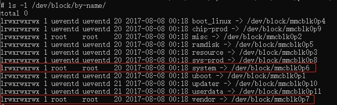
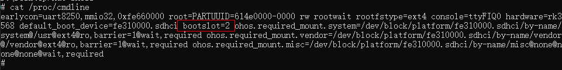
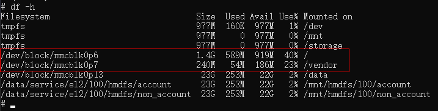
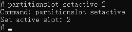
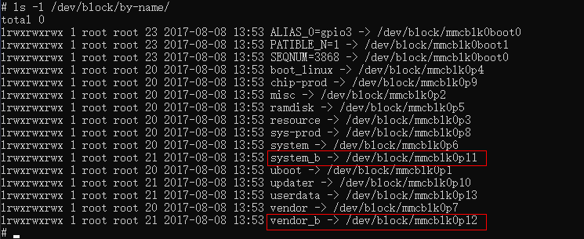

# Device Boot

## Context Structure

The following figure shows the context structure of the Startup subsystem.

  **Figure 1** Context structure of the Startup subsystem

  

When the system is powered on, the kernel loads and starts services and applications as follows:

1. The kernel loads the init process, which is specified by cmdline of the kernel when the bootloader starts the kernel.
2. After the init process is started, tmpfs and procfs are mounted and basic dev nodes are created to establish a basic root file system.
3. The init process starts the ueventd process to listen for device hot-swap events in the kernel and creates dev nodes for related devices as well as partitions for the block device.
4. After mounting partitions (system and vendor) of the block device, the init process scans for the init startup script of each system service and starts the respective system ability (SA).
5. Each SA registers with the samgr process, which serves as the service registration center. The samgr process assigns each SA with an ID, which will be used by an application to access the desired SA.
6. The foundation process implements application lifecycle management. It is a special SA service process that provides the user program management framework and basic services. This process manages the lifecycle of applications.
7. For an application, loading of the JS running environment involves a great deal of preparations. To reduce the application startup time, the appspawn process directly spawns an application process once receiving an application startup request from the foundation process.


The Startup subsystem consists of the following modules:

- init Module

  This module corresponds to the init process, which is the first user-space process started after the kernel is initialized. After the init process starts, it reads and parses the init.cfg file. Based on the parsing result, the init module executes the commands listed in Table 2 in [Job Management](../subsystems/subsys-boot-init-jobs.md#available-apis) and starts the key system service processes in sequence with corresponding permissions granted.

- ueventd module

  This module listens for **netlink** events about hot plug of kernel device drivers and dynamically manages the dev node of the corresponding device based on the event type.

- appspawn Module

  This module spawns application processes upon receiving commands from the foundation, configures permissions for new processes, and calls the entry function of the application framework.

- bootstrap Module

  This module provides entry identifiers for starting services and features. When samgr is started, the entry function identified by bootstrap is called and system services are started.

## Constraints

  The source code directory of the Startup subsystem varies according to the platform.

  **Table 1** Directories and applicable platforms of the Startup subsystem

| Name| Applicable Platform|
| -------- | -------- |
| base/startup/appspawne | Small system devices (reference memory ≥ 1 MB) and standard systems, such as Hi3516D V300 , Hi3518E V300, and RK3568|
| base/startup/bootstrap_lite | Mini-system devices (reference memory ≥ 128 KiB), for example, Hi3861 V100|
| base/startup/init | Small system devices (reference memory ≥ 1 MB) and standard systems, such as Hi3516D V300 , Hi3518E V300, and RK3568|

- init module
  - To start a system service, you first need to write a boot script file named `init.cfg`, in which you define the service name, path of executable files, permissions, etc.
  - The boot script of each system service is installed in the `/system/etc/init` directory. The init process scans this directory for the boot script to execute.

- When porting a new chip platform, you need to add the `/vendor/etc/init/init.{hardware}.cfg` file that contains the platform-level initialization configuration. This file is used to implement platform-level initialization, for example, installing the ko driver and configuring information on the related `/proc` nodes.

  > **NOTE**
  >
  > The `init.cfg` file must be in JSON format.

- bootstrap module: The zInit code must be configured in the link script.

## Boot Process for the OpenHarmony Standard System

By default, the OpenHarmony standard system supports the images listed in the following table.

| Image    | Mount Point | Description                                                |
| ------------ | ------- | ---------------------------------------------------- |
| boot.img     | NA      | Kernel and ramdisk image, which is the first image loaded by the bootloader.     |
| system.img   | /system | System component image, which stores chip-irrelevant platform services.        |
| vendor.img   | /vendor | Chip component image, which stores chip-related hardware abstraction services.          |
| updater.img  | /       | Updater image, which is used for system updating. This image is not loaded during normal startup.|
| userdata.img | /data   | Writable user data image.                                |

On each development board, you need to partition the memory to store the preceding images. When the SoC starts, the bootloader loads the images as follows:

- Initializes hardware such as the ROM and RAM, and loads the partition table information.
- Loads the `boot.img` file based on the partition table and parses and loads the `ramdisk.img` file to the memory.
- Prepares the partition table information and ramdisk address and enters the kernel, so that the kernel loads the the ramdisk image and starts the init process.
- Waits until the init process prepares the initial file system and mounts `required.fstab` (including `system.img` and `vendor.img`) to the file system.
- Scans the boot scripts in the `etc/init` directory in `system.img` and `vendor.img` and runs each boot command.

### U-Boot Process

[U-Boot](https://elinux.org/U-Boot) is used as an example to describe the key image loading process. When U-Boot starts the system, it passes the boot information to the system by using bootargs.

- `boot.img` loading and parsing

  - `boot.img` format

    boot.img building and loading varies depending on the platform. The implementation on mainstream OpenHarmony platforms is as follows:

    - Hi3516DV300

      On this platform, the `boot.img` file uses the flattened image tree (FIT) format. It is generated by the Mkimage tool by packing the `ramdisk.img` files, which are packed by using zImage-dtb or cpio during kernel building, based on the information in the `its` file.

      The related files and tool are described as follows:

      1. `its` file

         An image source file that describes the information about the image to be generated. You need to create the file, for example, the `ohos.its` file on the Hi3516 platform.

      2. Mkimage packaging tool

         A tool that parses its files and packs the corresponding images based on the image configuration to generate an itb file, that is, `boot.img`.

      3. ramdisk

         A `ramdisk.img` file packed by using cpio.

      4. zImage-dtb

         An image that contains the compressed kernel image and device description file image.

    - rk3568

      On this platform, the boot.img file is named `boot_linux.img`. The packaged files are different from those on the Hi3516D V300 platform.

      1. Image

         Image file generated after kernel building.

      2. toybrick.dtb

         A file that is similar to the device description file image generated through dts building.

      3. ramdisk.img

         A `ramdisk.img` file packed by using cpio.

  - U-Boot loading

    The ramdisk boot process is supported. In this scenario, you need to modify the product configuration file in `productdefine` and enable ramdisk generation by setting `enable_ramdisk`. The ramdisk processing method varies according to the platform. Take the Hi3516D V300 platform as an example. You need to change the original U-Boot parameter to `root=/dev/ram0 initrd=0x84000000,0x292e00`.


- Kernel start

  When U-Boot starts the kernel, it can pass key information to the kernel through bootargs. The information varies according to the platform. The main fields are described in the table below.

  | Name       | Example                                                        | Description                                                        |
  | ----------- | ------------------------------------------------------------ | ------------------------------------------------------------ |
  | initrd      | 0x84000000,0x292e00                                          | For details, see the kernel documentation:<br>[ramfs-rootfs-initramfs.rst](https://gitee.com/openharmony/kernel_linux_5.10/blob/master/Documentation/filesystems/ramfs-rootfs-initramfs.rst)<br>[initrd.rst](https://gitee.com/openharmony/kernel_linux_5.10/blob/master/Documentation/admin-guide/initrd.rst) |
  | init        | /init                                                        |                                                              |
  | blkdevparts | mmcblk0:1M(boot),15M(kernel),200M(system),200M(vendor),<br>2M(misc),20M(updater),-(userdata) | Partition table information. The kernel creates physical partitions based on the information.                |
  | hardware    | Hi3516D V300, rk3568, etc.                                                 | (Mandatory information) Hardware platform.|
  | root        | /dev/ram0 (Hi3516DV00), root=PARTUUID=614e0000-0000 rw (rk3568)                                                   | Boot device loaded by the kernel.|
  | rootfstype  | ext4                                                         | Type of the root file system.|
  | default_boot_device | soc/10100000.himci.eMMC | (Recommended information) Default boot device. In the first phase of the boot process, a soft link will be created for the required partition device based on this field.|
  | ohos.required_mount.xxx | /dev/block/platform/soc/10100000.himci.eMMC/by-name/xxx@/usr@ext4@ro,barrier=1@wait,required |  The `fstab` information is first read from cmdline. If this fails, the system will try to read the information from the `fstab.required` file.|

- Mounting of `required` partitions

  A `required` partition is one that is essential for system boot. It must be mounted before level-2 boot. For mandatory images like `system` and `vendor` images, the corresponding block device files must be created before mounting. This is usually done based on the **uevent** messages reported by the kernel. The init process needs to know the main device directory of the storage device. The bootloader process passes the primary device directory of the storage device to the init process through `default_boot_device`.

  Currently, the init process obtains required partition information in two ways. The init process first reads the required partition information through `bootargs` in `/proc/cmdline`. If the attempt fails, the init process reads the `fstab.required` file in the ramdisk image.

    - Logic of block device creation

      - Preparations

        1. The init process reads the `fstab.required` file from cmdline. If the attempt fails, the init process reads the `fstab.required` file to obtain `PARTNAME` of the block devices that must be mounted, for example, `system` or `vendor`.
        2. Create a socket for receiving **uevent** messages reported by the kernel and read `default_boot_device` from `/proc/cmdline`.
        3. Traverse the `/sys/devices` directory with the fstab information and socket handle to get the kernel prepared for reporting **uevent** messages.

      - Event triggering

        1. Use **ueventd** to trigger the kernel to report a **uevent** message.
        2. Check whether partitionName in the **uevent** message matches with device information in the `fstab.required` file.
        3. If they match, format the device node path and proceed with device node creation.

      - Node creation

        1. Format the path of the soft link to be created for required block device nodes. A soft link helps facilitate access to device nodes in user mode and improve their readability.
        2. Create device nodes based on the primary and secondary device numbers passed in the **uevent** message, and the device node path and soft link path obtained in the previous steps. Meanwhile, create a soft link for them.

      Up to now, the creation of block device nodes is complete.

    - Mapping with default_boot_device

      The kernel writes bootargs information to `/proc/cmdline`. The information includes `default_boot_device`, which specifies the primary device directory required for system boot. The content prefixed with `ohos.required_mount.` is the partition mounting information required for system boot. It should be the same as that in the `fstab.required` file. In addition, the block device node in the partition mounting information should be a device node pointed by the soft link under by-name in the `default_boot_device` directory. For example, if the value of `default_boot_device` is `soc/10100000.himci.eMMC`, then the value of `ohos.required_mount.system` contains `/dev/block/platform/soc/10100000.himci.eMMC/by-name/system`, which is the soft link pointing to the system device node.

      During creation of a block device node, the device path will be matched against the value of `default_boot_device`. If the matching is successful, a soft link pointing to the real block device node will be created in `/dev/block/by-name`. In this way, device node access is made irrelevant to the chip platform.

    - Example

      This example assumes the `system` partition as the required partition on the Hi3516D V300 platform to illustrate the boot process. During this process, the init process reads the `fstab.required` file, creates a block device node, and mounts it to the required partition. The following provides the key code snippets and log information as reference for debugging.

      > **NOTE**
      >
      > The code snippets below are exhibited in the logical sequence. They are not neighboring to each other in the source code.

      1. Obtain the `required` partition device information.
          ```
          Fstab* LoadRequiredFstab(void)
          {
              Fstab *fstab = NULL;
              fstab = LoadFstabFromCommandLine();
              if (fstab == NULL) {
                  INIT_LOGI("Cannot load fstab from command line, try read from fstab.required");
                  const char *fstabFile = "/etc/fstab.required";
                  if (access(fstabFile, F_OK) != 0) {
                      fstabFile = "/system/etc/fstab.required";
                  }
                  INIT_ERROR_CHECK(access(fstabFile, F_OK) == 0, abort(), "Failed get fstab.required");
                  fstab = ReadFstabFromFile(fstabFile, false);
              }
              return fstab;
          }
          ```
          The preceding code provides two methods for the init process to obtain the fstab information. First, the init process calls `LoadFstabFromCommandLine()` to read the fstab information from cmdline. If the attempt fails, the init process outputs log information and continues to read the `fstab.required` file for the fstab information.

          For the `system` partition, the key information read from devices is as follows:
          ```
          /dev/block/platform/fe310000.sdhci/by-name/system
          ```

      2. Create a socket and trigger the kernel to report a **uevent** message.
         ```
         static int StartUeventd(char **requiredDevices, int num)
         {
             INIT_ERROR_CHECK(requiredDevices != NULL && num > 0, return -1, "Failed parameters");
             int ueventSockFd = UeventdSocketInit();
             if (ueventSockFd < 0) {
                 INIT_LOGE("Failed to create uevent socket");
                 return -1;
             }
             RetriggerUevent(ueventSockFd, requiredDevices, num);
             close(ueventSockFd);
             return 0;
         }
         ```

      3. Read information from cmdline to obtain `default_boot_device`.
         ```
         char *buffer = ReadFileData("/proc/cmdline");
         int ret = GetProcCmdlineValue("default_boot_device", buffer, bootDevice, CMDLINE_VALUE_LEN_MAX);
         INIT_CHECK_ONLY_ELOG(ret == 0, "Failed get default_boot_device value from cmdline");
         ```
         In this example, the value of `default_boot_device` is `soc/10100000.himci.eMMC`. The value is stored in the global variable `bootDevice` and will be matched with the path of the `system` partition device when a soft link is created.

      4. Process the **uevent** message of the `required` partition device.
         ```
         if (uevent->partitionName == NULL) {
             INIT_LOGI("Match with %s for %s", devices[i], uevent->syspath);
             deviceName = strstr(devices[i], "/dev/block");
             INIT_INFO_CHECK(deviceName != NULL, continue,
                 "device %s not match \"/dev/block\".", devices[i]);
             deviceName += sizeof("/dev/block") - 1;
             INIT_INFO_CHECK(strstr(uevent->syspath, deviceName) != NULL, continue,
                 "uevent->syspath %s not match deviceName %s", uevent->syspath, deviceName);
             HandleBlockDeviceEvent(uevent);
             break;
         } else if (strstr(devices[i], uevent->partitionName) != NULL) {
             INIT_LOGI("Handle block device partitionName %s", uevent->partitionName);
             HandleBlockDeviceEvent(uevent);
             break;
         }
         ```
         In this step, the device information in `devices` is matched with the **uevent** message reported by the kernel. The value of `uevent -> partitionName` should be system for the **uevent** message of the system partition device. If the value matches that of the `/dev/block/platform/fe310000.sdhci/by-name/system` field in `devices`, the **uevent** message of the system partition device will be processed.

      5. Create the `required` partition device node and the corresponding soft link.

         The first thing is to format the path of the corresponding soft link. In this step, the value of `default_boot_device` in `bootargs` will be matched with the path of the required device node in the **uevent** message, so as to create a platform-irrelevant soft link that points to the device node. The key code is as follows:
         ```
         if (STRINGEQUAL(bus, "/sys/bus/platform")) {
             INIT_LOGV("Find a platform device: %s", parent);
             parent = FindPlatformDeviceName(parent);
             if (parent != NULL) {
                 BuildDeviceSymbolLinks(links, linkNum, parent, uevent->partitionName, uevent->deviceName);
             }
             linkNum++;
             if ((parent != NULL) && STRINGEQUAL(parent, bootDevice)) {
                 BuildBootDeviceSymbolLink(links, linkNum, uevent->partitionName);
                 linkNum++;
             }
         }
         ```
         The key variables in the code are as follows:

         - `bus`: a string that saves the path of the bus connected to the current device.
         - `parent`: a string that stores the device path obtained from `uevent -> syspath` in the **uevent** message.
         - `links`: a pointer to the memory that stores the soft link path.
         - `bootDevice`: a string that stores the value of `default_boot_device` in `bootargs`.
         According to the code, the corresponding soft link is created for the device only when the type of the connected bus is platform. The path of the soft link is as follows:
         ```
         /dev/block/platform/soc/10100000.himci.eMMC/by-name
         ```
         A platform-irrelevant soft link is created only when the device path matches that in `bootDevice`.

         For the `system` partition device, the path is as follows:
         ```
         /sys/devices/platform/soc/10100000.himci.eMMC/mmc_host/mmc0/mmc0:0001/block/mmcblk0/mmcblk0p5
         ```
         Therefore, when processing the **uevent** message of the device, the init process compares the device path with that in `bootDevice`, that is, `soc/10100000.himci.eMMC`. If they match, a soft link will be created as follows:
         ```
         /dev/block/by-name/system
         ```

         After the soft link path is formatted, the init process creates the device node and soft link based on the information in the **uevent** message. Up to now, the creation of a device node for the `system` partition is complete.

      6. Mount the `required` partition.

         After a device node is created, mount it to the corresponding partition. The code is as follows:
         ```
          int MountRequiredPartitions(const Fstab *fstab)
          {
              INIT_ERROR_CHECK(fstab != NULL, return -1, "Failed fstab is NULL");
              int rc;
              INIT_LOGI("Mount required partitions");
              rc = MountAllWithFstab(fstab, 1);
              return rc;
          }
         ```
         Therefore, when "Mount required partitions" is displayed, the `required` partition device is ready for mounting. During the mounting process, the following key information is printed:
         ```
         BEGET_LOGE("Unsupported file system \" %s \"", item->fsType);
         ```
         The current file system type is not supported.
         ```
         BEGET_LOGE("Cannot get stat of \" %s \", err = %d", target, errno);
         ```
         The attempt to obtain the mount point directory has failed.
         ```
         BEGET_LOGE("Failed to create dir \" %s \", err = %d", target, errno);
         ```
         The attempt to create the mount point directory has failed.
         ```
         BEGET_LOGI("Mount %s to %s successful", item->deviceName, item->mountPoint);
         ```
         The device is successfully mounted. The output also contains the name of the mounted device and information about the mount point.

- Mounting of `vendor` partition

After mounting required partitions, the init process scans each script file in the `vendor` partition. The initialization scripts related to the chip or development board is named in the format of `/vendor/etc/init.{ohos.boot.hardware}.cfg`. Wherein, `/vendor/etc/fstab.{ohos.boot.hardware}` represents the extended mount partition file; `hardware` is sourced from `bootargs`, which is passed from the bootloader to the kernel.

### fstable File Description

- File content

  ```
  # fstab file.
  #<src>      <mnt_point> <type>  <mnt_flags and options>   <fs_mgr_flags>
  /dev/block/platform/fe310000.sdhci/by-name/system    /usr       ext4     ro,barrier=1  wait,required
  /dev/block/platform/fe310000.sdhci/by-name/vendor    /vendor        ext4     ro,barrier=1  wait,required
  /dev/block/platform/fe310000.sdhci/by-name/sys-prod     /sys_prod        ext4     ro,barrier=1  wait
  /dev/block/platform/fe310000.sdhci/by-name/chip-prod     /chip_prod        ext4     ro,barrier=1  wait
  /dev/block/platform/fe310000.sdhci/by-name/userdata      /data       f2fs     discard,noatime,nosuid,nodev,fscrypt=2:aes-256-cts:aes-256-xts,usrquota  wait,check,fileencryption=software,quota
  ```

- Field description

  | Field                 | Description                                                        |
  | --------------------- | ------------------------------------------------------------ |
  | src                   | Address of the partition or path of the device mounted to the file system                        |
  | mnt_point             | Mount point in the root file system.                                      |
  | type                  | File system type. Common file systems are **ext2**, **vfat**, and **NTFS**.                    |
  | mnt_flags and options | Mounting parameters.                                   |
  | fs_mgr_flags          | File system manager flags.<br>Available values include **check**, **wait**, **required**, **nofail**, and **hvb**.|

- Description of mnt_flags and options

  ```
  auto Attempts automatic mounting at startup or after the mount -a command is entered.
  noauto Do not attempt automatic mounting upon system startup. The mount -a command is not used to load the file system.
  exec Allows execution of binary files in this file system.
  noexec Do not allow execution of binary files in this file system.
  ro Mounts a file system as read-only.
  rw Mounts a file system as read/write.
  user Allows any user to mount the file system. If no definition is displayed, the noexec nosuid nodev parameter is implicitly enabled.
  users Allows all users in the users group to mount the file system.
  nouser Allows only the root user to mount the file system.
  owner Allows only the device owner to mount the file system.
  sync Synchronizes the data in the memory and disk in real time without buffering the write operations of the device. This protects the file system against damages caused by abnormal device shutdown but reduces the system speed.
  async Do not synchronize the data in the memory and disk. The system writes the memory data to the disk at a specified interval.
  dev Parses block special files in the file system.
  nodev Do not parse block special files in the file system.
  suid/nosuid Allows a partition to have the suid attribute or not.
  quota Forcibly limits the disk quota on the file system.
  usrquota Enables the disk quota mode to limit the disk quota by users.
  grpquota Enables the disk quota mode to limit the disk quota by groups.
  nodiratime Do not update the inode access records on the file system.
  realtime Updates inode access records in real time.
  defaults Uses the default mounting parameters of the file system. The default parameters of the ext4 file system are rw, suid, dev, exec ,auto, nouser, and async.
  ```
### Boot Loading Without ramdisk

Certain development boards do not use the ramdisk boot mode. For these boards, the boot process is implemented by directly loading the `system.img` file through the kernel. In such case, you need to modify the product configuration file in `productdefine`. Specifically, you need to turn off the `enable_ramdisk` switch to disable ramdisk generation so that the init process does not boot from `ramdisk` to `system`.

The boot loading process in this scenario is similar to that in the preceding section. The only difference is as follows: If ramdisk is used, the init process mounts `system.img` to the `/usr` directory and then switches to the `/usr` directory using chroot. If ramdisk is not used, the init process directly runs the `init.cfg` file.

For the boot loading process without ramdisk, that is, system as root, the block device where the root file system is located is passed to the kernel through `bootargs`, for example, `root=/dev/mmcblk0p5` and `rootfstype=ext4`. During initialization of the root file system, the kernel parses the `root` field in `bootargs` to complete mounting of the root file system.


### Partition A/B Booting

Currently, OpenHarmony supports booting from partitions A and B (active and standby system partitions), both of which are configured in the same device storage. During the booting process, the system partition to load is determined based on the slot of the active partition. Partition A/B booting is supported only for the system and chipset partitions.

- bootslots

  Number of the supported boot partitions. If `bootslots` is set to **2**, the system can boot from both system partitions A and B. If `bootslots` is set to **1**, partition A/B booting is not supported and the system can boot only from the default system partition.

  In the initial phase of init process startup, the system reads the `bootslots` value to determine whether partition A/B booting is supported. If yes, the system continues to determine the system partition to mount. If not, the system mounts the system partition based on the default fstab. The API for the init process to obtain the `bootslots` value is as follows:
  ```
  int GetBootSlots(void)
  {
      int bootSlots = GetSlotInfoFromParameter("bootslots");
      BEGET_CHECK_RETURN_VALUE(bootSlots <= 0, bootSlots);
      BEGET_LOGI("No valid slot value found from parameter, try to get it from cmdline");
      return GetSlotInfoFromCmdLine("bootslots");
  }
  ```
  After normal system startup, you can obtain the `bootslots` value from the system parameter `ohos.boot.bootslots` to check whether the current system supports partition A/B booting. The command for obtaining `ohos.boot.bootslots` is as follows:
  ```
  param get ohos.boot.bootslots
  ```

- currentslot

  `currentslot` indicates the current system partition, for example, partition A or partition B. The value is a number. For example, **1** indicates partition A, and **2** indicates partition B.

  In the initial phase of startup, the init process determines whether the system supports partition A/B booting based on `bootslots`. If the system does not support partition A/B booting, the init process directly boots from the default system partition instead of obtaining the `currentslot` value. If the system supports partition A/B booting, the init process obtains the `currentslot` value and determines whether partition A or partition B is the current system partition. The API for the init process to obtain the `currentslot` value is as follows:
  ```
  int GetCurrentSlot(void)
  {
      // get current slot from parameter
      int currentSlot = GetSlotInfoFromParameter("currentslot");
      BEGET_CHECK_RETURN_VALUE(currentSlot <= 0, currentSlot);
      BEGET_LOGI("No valid slot value found from parameter, try to get it from cmdline");

      // get current slot from cmdline
      currentSlot = GetSlotInfoFromCmdLine("currentslot");
      BEGET_CHECK_RETURN_VALUE(currentSlot <= 0, currentSlot);
      BEGET_LOGI("No valid slot value found from cmdline, try to get it from misc");

      // get current slot from misc
      return GetSlotInfoFromMisc(MISC_PARTITION_ACTIVE_SLOT_OFFSET, MISC_PARTITION_ACTIVE_SLOT_SIZE);
  }
  ```

- Partition A/B booting process

  1. Obtain the `currentslot` value to determine whether partition A or partition B is the current system partition.
  2. Construct new partition mounting configuration based on the original fstab file, and add the suffix `_a` or `_b` to the partitions that support partition A/B booting, that is, `system` and `chipset` partitions.
  3. Mount the partition added with the corresponding suffix and enter the second phase of startup. This phase occurs in partition A or B and concludes the partition A/B booting process.

  The API for constructing new partition mounting configuration is as follows:
  ```
  static void AdjustPartitionNameByPartitionSlot(FstabItem *item)
  {
      BEGET_CHECK_ONLY_RETURN(strstr(item->deviceName, "/system") != NULL ||
          strstr(item->deviceName, "/chipset") != NULL);
      char buffer[MAX_BUFFER_LEN] = {0};
      int slot = GetCurrentSlot();
      BEGET_ERROR_CHECK(slot > 0 && slot <= MAX_SLOT, slot = 1, "slot value %d is invalid, set default value", slot);
      BEGET_INFO_CHECK(slot > 1, return, "default partition doesn't need to add suffix");
      BEGET_ERROR_CHECK(sprintf_s(buffer, sizeof(buffer), "%s_%c", item->deviceName, 'a' + slot - 1) > 0,
          return, "Failed to format partition name suffix, use default partition name");
      free(item->deviceName);
      item->deviceName = strdup(buffer);
      BEGET_LOGI("partition name with slot suffix: %s", item->deviceName);
  }
  ```

- Development example

  The following uses the rk3568 platform as an example to illustrate how to change from default partition booting to partition A/B booting.

  1. Burn the original image, and view the device information of each partition.

      

      Use the original image to construct images of the partitions used for partition A/B booting, and test the partition A/B booting function.
      - Copy the `system` and `vendor` images, and add the suffix `_b` to them.
      - Add the `system_b` and `vendor_b` partitions to the partition table in the `parameter.txt` file.

  2. Burn the images of the partitions used for partition A/B booting.

     - Import the partition configuration to the rk3568 burning tool, and select the `parameter.txt` file containing the `system_b` and `vendor_b` partitions.
     - Select images (including `system_b` and `vendor_b` images) based on the new partition table configuration, and then burn the images.

  3. After the configuration is complete, perform the following:

      1. Run the `cat /proc/cmdline` command. If the command output contains `bootslot=2`, the system supports partition A/B booting.

          
      2. Run the `param get ohos.boot.bootslot` command. If the command output contains 2, the `bootslot` information is successfully written to the `parameter.txt` file.

      3. Run the `ls -l /dev/block/by-name` command. If the command output contains `system_b` and `vendor_b`, device nodes are successfully created in partition B.

          

      4. Run the `df -h` command to check the partitions mounted to the system.

          

          As shown in the figure, partition `mmcblk0p6` is mounted to the root file system (represented by a slash), and partition `mmcblk0p7` is mounted to `/vendor`. Based on the command output in step 3, `mmcblk0p6` is the system partition, and `mmcblk0p7` is the `/vendor` partition. That is, the mounted partitions are the default partitions, that is, `system` and `vendor` partitions without suffixes. In other words, partition A is the default partition.

          Next, let's try booting from partition B.

          1. Run the `partitionslot setactive 2` command to set the slot of the active partition to **2**, that is, the slot of partition B.

             

          2. Run the `partitionslot getslot` command to check the configured slot.

             

             If `current slot` is 2, the slot of the active partition is successfully set to **2**.

          3. Upon restarting, run the `df -h` command to check the partitions mounted to the system.
          
             According to the command output, partition `mmcblk0p11` is mounted to the root file system, and partition `mmcblk0p12` is mounted to `/vendor`.

             

          4. Run the `ls -l /dev/block/by-name` command again.

             

          mmcblk0p11 corresponds to system_b, and mmcblk0p12 corresponds to vendor_b. That is, the system is successfully booted from partition B.
