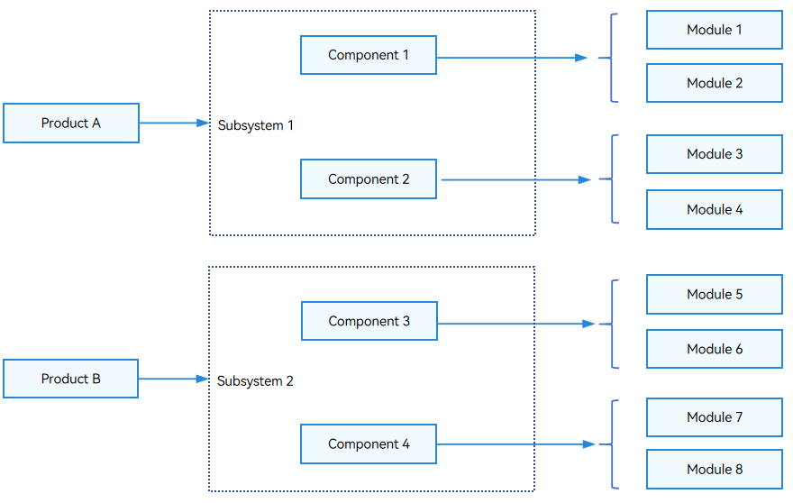
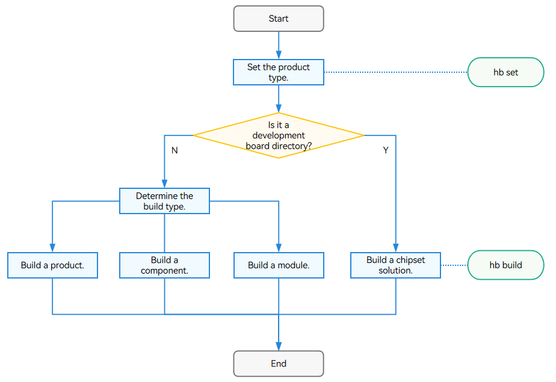

# Compilation and Building Guide

## Overview

The OpenHarmony Compilation and Building subsystem provides a build framework based on Generate Ninja (GN) and Ninja. It abstracts the build and configuration granularity by component, and provides function enhancement for built-in modules and function extension for service modules. The OpenHarmony Compilation and Building subsystem provides the following functions:

- Allows products to be assembled and independently built by component.
- Supports version builds for mini, small, and standard systems and build of the software development kit (SDK), which facilitates application developers to use the Integrated development environment (IDE).
- Supports customization and independent build based on different chipset solutions.

### Application Scope

This guide is applicable to mini, small, and standard systems. The [Chipset Solution](subsys-build-chip_solution.md) applies only to mini and small systems.

### Basic Concepts


Learn the following basic concepts before you get started:

- Platform 

  A platform consists of a development board and the kernel. The subsystems and components vary with the platform.

- Product 

  A product is a collection of components. The product image built can run on different development boards.

- Subsystem 

  OpenHarmony is designed with a layered architecture, which consists of the kernel layer, system service layer, framework layer, and application layer from bottom up. For details, see [OpenHarmony Technical Architecture](https://gitee.com/openharmony#technical-architecture). System functions are built from components, subsystems, and then to the system. In a multi-device deployment, you can customize subsystems and components as required. A subsystem, as a logical concept, consists of the least required components.

- Component 

  A component is a reusable software binary unit that contains source code, configuration files, resource files, and build scripts. It can be built independently, integrated in binary mode, and tested independently. The chipset solution mentioned in this guide is a special component in nature.

- Module 

  A module is a target to build. A component can also be a target to build.

- Feature 

  A component can provide differentiated functions through features.

- GN 

  GN is used to generate Ninja files.

- Ninja 

  Ninja is a small high-speed build system.

- hb 

  hb is an OpenHarmony command line tool used to execute build commands.

The Compilation and Build subsystem implements compilation and packaging through configuration. The following describes the relationships between the product, subsystem, component, and module.

**Figure 1** Relationships between product, subsystem, component, and module



The relationships between the product, subsystem, component, and module are as follows:

- A subsystem is a collection of all components. A component can belong to only one subsystem.
- A component is a collection of modules. A module can belong to only one component.
- The product configuration file contains the configuration of all the components of the product. The component configuration can be reused.
- A component used in different products can provide differentiated functions through variants or features.
- A module is a target to build, and a component can also be a target to build.

### Working Principles

A product, component, and module can be built, but a subsystem cannot. The figure below shows the build process.

**Figure 2** Build process



1. Run **hb set** to set the product to build.

2. Use **hb build** to build a product, development board, or component.

   The procedure is as follows:
   
   1. Read the **config.gni** file of the development board selected. The file contains the build toolchain, linking commands, and build options.
   2. Run the **gn gen** command to read the product configuration and generate the **out** directory and **ninja** files for the product solution.
   3. Run **ninja -C out/board/product** to start the build.
   4. Package the files built, set the file attributes and permissions, and create a file system image.

### Constraints

Currently, only Ubuntu18.04 and Ubuntu20.04 are supported. Ubuntu22.04 is not supported.

### Environment Configuration

You must install the software packages required for build. The command is as follows:

- Method 1: Run the script in the project directory.
  ```shell
  ./build/build_scripts/env_setup.sh
  ```
  
- Method 2: Run the **apt-get install** and **pip3 install** commands.
  ```shell
  apt-get update -y 
  apt-get install -y  
  # Install Python 3.9 for Ubuntu 20.04, and install Python 3.8 for Ubuntu 18.04.
  apt-get install -y apt-utils binutils bison flex bc build-essential make mtd-utils gcc-arm-linux-gnueabi u-boot-tools python3.9 python3-pip git zip unzip curl wget gcc g++ ruby dosfstools mtools default-jre default-jdk scons python3-distutils perl openssl libssl-dev cpio git-lfs m4 ccache zlib1g-dev tar rsync liblz4-tool genext2fs binutils-dev device-tree-compiler e2fsprogs git-core gnupg gnutls-bin gperf lib32ncurses5-dev libffi-dev zlib* libelf-dev libx11-dev libgl1-mesa-dev lib32z1-dev xsltproc x11proto-core-dev libc6-dev-i386 libxml2-dev lib32z-dev libdwarf-dev 
  apt-get install -y grsync xxd libglib2.0-dev libpixman-1-dev kmod jfsutils reiserfsprogs xfsprogs squashfs-tools  pcmciautils quota ppp libtinfo-dev libtinfo5 libncurses5 libncurses5-dev libncursesw5 libstdc++6  gcc-arm-none-eabi vim ssh locales doxygen
  apt-get install -y libxinerama-dev libxcursor-dev libxrandr-dev libxi-dev
  # The following modules must be installed for Python. You can obtain the repo file from the source code of the build environment you use.
  chmod +x /usr/bin/repo 
  pip3 install --trusted-host https://repo.huaweicloud.com -i https://repo.huaweicloud.com/repository/pypi/simple requests setuptools pymongo kconfiglib pycryptodome ecdsa ohos-build pyyaml prompt_toolkit==1.0.14 redis json2html yagmail python-jenkins 
  pip3 install esdk-obs-python --trusted-host pypi.org 
  pip3 install six --upgrade --ignore-installed six
  #Install LLVM, hc-gen, gcc_riscv32, Ninja, node-v14.15.4-linux-x64, and GN. If the shell in use is not bash or zsh, configure the following environment variables:
  # export PATH=/home/tools/llvm/bin:$PATH
  # export PATH=/home/tools/hc-gen:$PATH
  # export PATH=/home/tools/gcc_riscv32/bin:$PATH
  # export PATH=/home/tools/ninja:$PATH
  # export PATH=/home/tools/node-v12.20.0-linux-x64/bin:$PATH
  # export PATH=/home/tools/gn:$PATH
  # export PATH=~/.local/bin:$PATH
  ```

  >**NOTE**
  >
  >The hb tool will be installed during the installation of **ohos-build**. If hb tool fails to be installed, [install hb](../../device-dev/quick-start/quickstart-pkg-install-tool.md#hb-installation) again.


## Configuration Rules

To ensure that chipset and product solutions are decoupled from OpenHarmony, you need to follow certain rules during the configuration.

- [Product Configuration Rules](subsys-build-product.md#configuration-rules)
- [Subsystem Configuration Rules](subsys-build-subsystem.md#configuration-rules)
- [Component Configuration Rules](subsys-build-component.md#configuration-rules)
- [Module Configuration Rules](subsys-build-module.md#configuration-rules)
- [Rust Module Configuration Rules](subsys-build-rust-compilation.md#configuration-rules)
- [Chipset Solution Configuration Rules](subsys-build-chip_solution.md#configuration-rules)
- [Feature Configuration Rules](subsys-build-feature.md#configuration-rules)
- [System Capability Configuration Rules](subsys-build-syscap.md)

## Guidelines

### Directory Structure

```shell

/build                          # Directory for build

├── __pycache__                   
├── build_scripts/              # Python scripts for build
├── common/                       
├── config/                     # Build-related configuration
├── core
│   └── gn/                     # BUILD.gn configuration
    └── build_scripts/            
├── docs                          
gn_helpers.py*                    
lite/                           # hb and preloader entry                     
misc/
├── ohos                        # Configuration of OpenHarmony build and packaging
│   ├── kits                    # Kits build and packaging templates and processing
│   ├── ndk                     # NDK templates and processing
│   ├── notice                  # Notice templates and processing
│   ├── packages                # Distribution packaging templates and processing
│   ├── sa_profile              # SA profiles and processing
│   ├── sdk                     # SDK templates and processing, which contains the module configuration in the SDK
│   └── testfwk                 # Testing-related processing
├── ohos.gni*                   # Common .gni files (facilitating one-time import of each module)
├── ohos_system.prop              
├── ohos_var.gni*                 
├── prebuilts_download.sh*        
├── print_python_deps.py*         
├── scripts/                      
├── subsystem_config.json         
├── subsystem_config_example.json 
├── templates/                  # C/C++ build templates
├── test.gni*                     
├── toolchain                   # Build toolchain configuration
├── tools                       # Common tools
├── version.gni                   
├── zip.py*                       

```


### Build Commands

Run the **prebuilts** script in the root directory of the source code to perform precompilation and install the compiler and binary tool.

```shell
bash build/prebuilts_download.sh
```

Then, run the build commands in command line (CLI) mode or hb mode.

1. Using the CLI

   - Run the following command in the root directory of the source code to build a full distribution:

     Release version:

     ```shell
     ./build.sh --product-name {product_name}
     ```

     Debug version:

     ```shell
     ./build.sh --product-name {product_name} --gn-args is_debug=true
     ```

     > **CAUTION**
     >
     > Due to the limitation of the image size, the full build for the debug version may fail to be burnt. You are advised to build the binary file for each module separately. Run the following command to build a module separately:
     >
     > ```
     > ./build.sh --product-name {product_name} --gn-args is_debug=true --build-target {target_name}
     > ```
     >
     > **{product_name}** specifies the product platform supported by the current distribution, for example, **hispark_taurus_standard**.
     >
     > The image generated is stored in the **out/{device_name}/packages/phone/images/** directory.

   - The **./build.sh** command supports the following options:

     ```shell
     -h, --help                                       # Display help information and exit.
     --source-root-dir=SOURCE_ROOT_DIR                # Specify the path.
     --product-name=PRODUCT_NAME                      # Specify the product name.
     --device-name=DEVICE_NAME                        # Specify the device name.
     --target-cpu=TARGET_CPU                          # Specify the CPU.
     --target-os=TARGET_OS                            # Specify the operating system.
     -T BUILD_TARGET, --build-target=BUILD_TARGET     # Specify one or more targets to build.
     --gn-args=GN_ARGS                                # Specify GN parameters.
     --ninja-args=NINJA_ARGS                          # Specify Ninja parameters.
     -v, --verbose                                    # Display all commands used.
     --keep-ninja-going                               # Keep Ninja going until 1,000,000 jobs fail.
     --jobs=JOBS
     --export-para=EXPORT_PARA
     --build-only-gn                                  # Perform GN parsing and do not run Ninja.
     --ccache                                         # (Optional) Use ccache for build. You need to install ccache locally.
     --fast-rebuild                                   # Specify whether to allow fast rebuild. The default value is False.
     --log-level=LOG_LEVEL                            # Specify the log level used in the build process. The options are debug, info, and error. The default value is info.
     --device-type=DEVICE_TYPE                        # Specify the device type. The default value is default.
     --build-variant=BUILD_VARIANT                    #Specify the device operation mode. The default value is user.
     ```

     

2. Using the hb tool

   **hb** is an OpenHarmony command line tool for executing build commands. Common hb commands are described as follows:

   **hb set**

   Sets the product to build.

   ```shell
   hb set -h
   usage: hb set [-h] [-root [ROOT_PATH]] [-p]
   
   optional arguments:
     -h, --help            show this help message and exit
     -root [ROOT_PATH], --root_path [ROOT_PATH]
                           Set OHOS root path
     -p, --product         Set OHOS board and kernel
   ```

   - If you run **hb set** with no argument, the default setting process starts.

   - You can run **hb set -root** *dir* to set the root directory of the source code.

   - You can run **hb set -p** to set the product to build.

     

   **hb env**

   Displays current settings.

   ```shell
   hb env
   [OHOS INFO] root path: xxx
   [OHOS INFO] board: hispark_taurus
   [OHOS INFO] kernel: liteos
   [OHOS INFO] product: ipcamera
   [OHOS INFO] product path: xxx/vendor/hisilicon/ipcamera
   [OHOS INFO] device path: xxx/device/hisilicon/hispark_taurus/sdk_linux_4.19
   ```

   

   **hb build**

   Builds a product, component, module, or chipset solution.

   ```shell
   hb build -h
   usage: hb build [-h] [-b BUILD_TYPE] [-c COMPILER] [-t [TEST [TEST ...]]] [-cpu TARGET_CPU] [--dmverity] [--tee]
                   [-p PRODUCT] [-f] [-n] [-T [TARGET [TARGET ...]]] [-v] [-shs] [--patch] [--compact-mode]
                   [--gn-args GN_ARGS] [--keep-ninja-going] [--build-only-gn] [--log-level LOG_LEVEL] [--fast-rebuild]
                   [--device-type DEVICE_TYPE] [--build-variant BUILD_VARIANT]
                   [component [component ...]]
   
   positional arguments:
     component             name of the component, mini/small only
   
   optional arguments:
     -h, --help            show this help message and exit
     -b BUILD_TYPE, --build_type BUILD_TYPE
                           release or debug version, mini/small only
     -c COMPILER, --compiler COMPILER
                           specify compiler, mini/small only
     -t [TEST [TEST ...]], --test [TEST [TEST ...]]
                           compile test suit
     -cpu TARGET_CPU, --target-cpu TARGET_CPU
                           select cpu
     --dmverity            enable dmverity
     --tee                 Enable tee
     -p PRODUCT, --product PRODUCT
                           build a specified product with {product_name}@{company}
     -f, --full            full code compilation
     -n, --ndk             compile ndk
     -T [TARGET [TARGET ...]], --target [TARGET [TARGET ...]]
                           compile single target
     -v, --verbose         show all command lines while building
     -shs, --sign_haps_by_server
                           sign haps by server
     --patch               apply product patch before compiling
     --compact-mode        compatible with standard build system set to false if we use build.sh as build entrance
     --gn-args GN_ARGS     specifies gn build arguments, eg: --gn-args="foo="bar" enable=true blah=7"
     --keep-ninja-going    keeps ninja going until 1000000 jobs fail
     --build-only-gn       only do gn parse, do not run ninja
     --log-level LOG_LEVEL
                           specifies the log level during compilationyou can select three levels: debug, info and error
     --fast-rebuild        it will skip prepare, preloader, gn_gen steps so we can enable it only when there is no change
                           for gn related script
     --device-type DEVICE_TYPE
                           specifies device type
     --build-variant BUILD_VARIANT
                           specifies device operating mode
   ```

   - If you run **hb build** with no argument, the previously configured code directory, product, and options are used for the build. The **-f** option deletes all products to be built. It is equivalent to running **hb clean** and **hb build**.

   - You can run **hb build** *{component_name}* to build product components separately based on the development board and kernel set for the product, for example, **hb build kv_store**.

   - You can run **hb build -p ipcamera@hisilicon** to skip the setting step and build the product directly.

   - You can run **hb build** in **device/board/device_company** to select the kernel and build an image that contains the kernel and drivers only based on the current development board and the selected kernel.

     

   **hb clean**

   Deletes all the files except **args.gn** and **build.log** in the **out** directory (default). To clear files in a specified directory, add the directory parameter to the command, for example, **hb clean out/board/product**.

   ```shell
   hb clean
   usage: hb clean [-h] [out_path]
   
   positional arguments:
     out_path    clean a specified path.
   
   optional arguments:
     -h, --help  show this help message and exit
   ```

   > **NOTE**
   >
   > - For details about how to set up the build environment and perform the build, see the related topics in [Getting Started](../quick-start/quickstart-overview.md).
   > - OpenHarmony also provides the Docker environment, which spares the installation of the build tool. For details, see [Docker Environment](../get-code/gettools-acquire.md).

### Building Procedures 

You can add and build a product, component, chipset solution, and module. For details, see:

- [Adding and Building a Product](subsys-build-product.md#adding-and-building-a-product)
- [Adding and Building a Component](subsys-build-component.md#adding-and-building-a-component)
- [Adding and Building a Module](subsys-build-module.md#adding-and-building-a-module)
- [Adding and Building a Chipset Solution](subsys-build-chip_solution.md#adding-and-building-a-chipset-solution)

## FAQs

- [Common Build Problems and Solutions](subsys-build-FAQ.md)

## Reference

- [deps and external_deps](subsys-build-reference.md#deps-and-external_deps)
- [Using Sanitizer](subsys-build-reference.md#using-sanitizer)
- [Information Collected by the Open Source Software Notice](subsys-build-reference.md#information-collected-by-the-open-source-software-notice)
- [Parameters for Accelerating Local Build](subsys-build-reference.md#parameters-for-accelerating-local-build)
- [Viewing Ninja Build Information](subsys-build-reference.md#viewing-ninja-build-information)
- [Customizing the chip_prod Image](subsys-build-reference.md#customizing-the-chip_prod-image)

