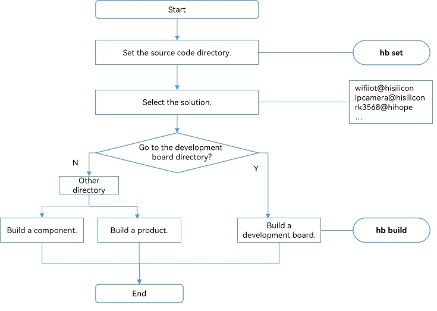

# Building Guidelines for Mini and Small Systems<a name="EN-US_TOPIC_0000001060646620"></a>

-   [Overview](#section10958256161119)
    -   [Basic Concepts](#section1732301411128)
    -   [Directory Structure](#section1588744014121)
    -   [Build Process](#section15761735134)

-   [Configuration Rules](#section2345183962710)
    -   [Module](#section142532518308)
    -   [Chipset](#section121501451143710)
    -   [Product](#section134549283435)

-   [Usage Guidelines](#section13754457192211)
    -   [Prerequisites](#section31651120233)
    -   [Using hb](#section1133304172313)
    -   [Adding a Module](#section167110415315)
    -   [Adding a Chipset Solution](#section1474718565412)
    -   [Adding a Product Solution](#section1097623294220)

-   [Troubleshooting](#section19909721104319)
    -   [Invalid -- w Option](#section138233464318)
    -   [Library ncurses Not Found](#section151033911442)
    -   [mcopy not Found](#section19811838104418)
    -   [No riscv File or Directory](#section03111118451)
    -   [No Crypto](#section69981127125013)
    -   [Unexpected Operator](#section967617530505)


## Overview<a name="section10958256161119"></a>

The Compilation and Building subsystem is a build framework that supports module-based OpenHarmony development using Generate Ninja \(GN\) and Ninja. You can use this subsystem to:

-   Assemble modules for a product and build the product.

-   Build chipset source code independently.
-   Build a single module independently.

### Basic Concepts<a name="section1732301411128"></a>

Learn the following concepts before you start compilation and building:

-   Subsystem

    A subsystem is a logical concept. It consists of one or more modules. OpenHarmony is designed with a layered architecture, which consists of the kernel layer, system service layer, framework layer, and application layer from bottom to top. System functions are developed by the level of system, subsystem, and module. In a multi-device deployment scenario, you can customize subsystems and modules as required.


-   Module

    A module is a reusable, configurable, and tailorable function unit. Each module has an independent directory, and multiple modules can be developed concurrently and built and tested independently.

-   **GN**

    Generate Ninja \(GN\) is used to generate Ninja files.

-   **Ninja**

    Ninja is a small high-speed build system.

-   **hb**

    hb is a command line tool for OpenHarmony to execute build commands.


### Directory Structure<a name="section1588744014121"></a>

```
build/lite
├── components                  # Module description file
├── figures                     # Figures in the readme file
├── hb                          # hb pip installation package
├── make_rootfs                 # Script used to create the file system image
├── config                      # Build configuration
│   ├── component               # Module-related template definition
│   ├── kernel                  # Kernel-related build configuration
│   └── subsystem               # Subsystem build configuration
├── platform                    # ld script
├── testfwk                     # Test build framework
└── toolchain                   # Build toolchain configuration, which contains the compiler directories, build options, and linking options
```

### **Build Process**<a name="section15761735134"></a>

[Figure 1](#fig9744112715161)  shows the build process.

**Figure  1**  Build process<a name="fig9744112715161"></a>  


1.  Use  **hb set **to set the OpenHarmony source code directory and the product to build.
2.  Use  **hb build**  to build the product, development board, or module. The procedure is as follows:
    -   Read the  **config.gni**  file of the development board selected. The file contains the build toolchain, linking commands, and build options.
    -   Run the  **gn gen**  command to read the product configuration and generate the  **out**  directory and  **ninja**  files for the solution.
    -   Run  **ninja -C out/board/product**  to start the build.
    -   Package the build result, set the file attributes and permissions, and create a file system image.


## Configuration Rules<a name="section2345183962710"></a>

To ensure that the chipset and product solutions are pluggable and decoupled from OpenHarmony, the paths, directory trees, and configuration of modules, chipset solutions, and product solutions must comply with the following rules:

### **Module**<a name="section142532518308"></a>

The source code directory for a module is named in the  _\{Domain\}/\{Subsystem\}/\{Module\}_  format. The module directory tree is as follows:

> **CAUTION:** 
>Define module attributes, such as the name, source code directory, function description, mandatory or not, build targets, RAM, ROM, build outputs, adapted kernels, configurable features, and dependencies, in the JSON file of the subsystem in the  **build/lite/components**  directory. When adding a module, add its definition to the JSON file of the corresponding subsystem. The module configured for a product must have been defined in a subsystem. Otherwise, the verification will fail.

```
component
├── interfaces
│   ├── innerkits  # APIs exposed internally among modules
│   └── kits       # App APIs provided for app developers
├── frameworks     # Framework implementation
├── services       # Service implementation
└── BUILD.gn       # Build script
```

The following example shows how to define attributes of the sensor module of the pan-sensor subsystem:

```
{
  "components": [
    {
      "component": "sensor_lite",                # Module name
      "description": "Sensor services",          # Brief description of the module
      "optional": "true",                        # Whether the module is mandatory for the system
      "dirs": [                                  # Source code directory of the module
        "base/sensors/sensor_lite"
      ],
      "targets": [                               # Build entry of the module
        "//base/sensors/sensor_lite/services:sensor_service"
      ],
      "rom": "92KB",                             # Module ROM
      "ram": "~200KB",                           # Module RAM (estimated)
      "output": [ "libsensor_frameworks.so" ],   # Module build outputs
      "adapted_kernel": [ "liteos_a" ],          # Adapted kernel for the module
      "features": [],                            # Configurable features of the module
      "deps": {                      
        "components": [                          # Other modules on which the module depends
          "samgr_lite",
          "ipc_lite"

        ],
        "third_party": [                         # Open-source third-party software on which the module depends
          "bounds_checking_function"
        ]
      }
    }
  ]
}
```

Observe the following rules when building the  **BUILD.gn**  module:

-   The build target name must be the same as the module name.
-   Define the configurable features in the  **BUILD.gn**  file of the module. Name the configurable features in the  **ohos\_**\{_subsystem_\}**\_**\{_module_\}**\_**\{_feature_\} format. Define the features in module description and configure them in the  **config.json**  file.
-   Define macros in the  **OHOS\_**\{_SUBSYSTEM_\}**\_**\{_MODULE_\}**\_**\{_FEATURE_\} format.

    > **NOTE:** 
    >GN is used as the build script language for modules. For details about how to use GN, see https://gn.googlesource.com/gn/+/master/docs/quick_start.md. In GN, a module is a build target, which can be a static library, a dynamic library, an executable file, or a group.	


The following example shows how to build the  **foundation/graphic/ui/BUILD.gn**  file for a graphics UI module:

```
	# Declare the configurable features of the module
	declare_args() {
  enable_ohos_graphic_ui_animator = false # Animation switch
  ohos_ohos_graphic_ui_font = "vector"    # Configurable font type, which can be vector or bitmap
	}
	
	# Basic module functions
	shared_library("base") {
	  sources = [
	    ......
	  ]
	  include_dirs = [
	    ......
	  ]
	}
	
	# Build only when the animator is enabled
	if(enable_ohos_graphic_ui_animator ) { 
	  shared_library("animator") {
	    sources = [
	      ......
	    ]
	    include_dirs = [
              ......
	    ]
	    deps = [ :base ]
	  }
	}
	......
	# It is recommended that the target name be the same as the module name, which can be an executable .bin file, shared_library (.so file), static_library (.a file), or a group.
	executable("ui") {
	  deps = [
	    ":base"
	  ]

	  # The animator feature is configured by the product.
	  if(enable_ohos_graphic_ui_animator ) {
	      deps += [
	        "animator"
	      ]
	  }
	}
```

### **Chipset**<a name="section121501451143710"></a>

-   The chipset solution is a complete solution based on a development board. The solution includes the drivers, API adaptation, and SDK.
-   The chipset solution is a special module, whose source code directory is named in the  _**device**/\{Chipset solution vendor\}/\{Development board\}_  format.
-   The chipset solution module is built by default based on the development board selected by the product.

The chipset solution directory tree is as follows:

```
device                                      
└── company                         # Chipset solution vendor
    └── board                       # Name of the development board
        ├── BUILD.gn                # Build script
        ├── hals                    # Southbound APIs for OS adaptation
        ├── linux                   # Linux kernel version (optional)
        │   └── config.gni          # Build options for the Linux version
        └── liteos_a                # LiteOS kernel version (optional)
            └── config.gni          # Build options for the LiteOS Cortex-A version
```

> **NOTE:** 
>The  **config.gni**  file contains build-related configurations of the development board. The parameters in the file are globally visible to the system and can be used to build all OS modules during the build process.

The  **config.gni**  file contains the following key parameters:

```
kernel_type:            kernel used by the development board, for example, liteos_a, liteos_m, or linux.
kernel_version:         kernel version used by the development board, for example, 4.19.
board_cpu:              CPU of the development board, for example, cortex-a7 or riscv32.
board_arch:             chipset architecture of the development board, for example, armv7-a or rv32imac.
board_toolchain:        name of the customized build toolchain used by the development board, for example, gcc-arm-none-eabi. If this field is not specified, ohos-clang will be used by default.
board_toolchain_prefix: prefix of the build toolchain, for example, gcc-arm-none-eabi.
board_toolchain_type:  build toolchain type, for example, gcc or clang. Currently, only GCC and clang are supported.
board_cflags:          build options of the .c file configured for the development board.
board_cxx_flags:       build options of the .cpp file configured for the development board.
board_ld_flags:        link options configured for the development board.
```

### **Product**<a name="section134549283435"></a>

The product solution is a complete product based on a development board. It includes the OS adaptation, module assembly configuration, startup configuration, and file system configuration. The source code directory of a product solution is named in the  **vendor**/\{_Product solution vendor_\}/\{_Product name_\} format. A product solution is also a special module.

The product solution directory tree is as follows:

```
vendor                              
└── company                         # Product solution vendor
    ├── product                     # Product name
    │   ├── init_configs
    │   │     ├── etc               # Startup configuration of the init process (only required for the Linux kernel)
    │   │     └── init.cfg          # System service startup configuration
    │   ├── hals                    # OS adaptation
    │   ├── BUILD.gn                # Product build script
    │   └── config.json             # Product configuration file
    │   └── fs.yml                  # File system packaging configuration
    └── ......
```

> **CAUTION:** 
>Create directories and files based on the preceding rules for new products. The Compilation and Building subsystem scans the configured products based on the rules.

The key directories and files are described as follows:

1.  **vendor/company/product/init\_configs/etc**

    This folder contains the  **rcS**,  **S**_xxx_, and  **fstab**  scripts. The  **init**  process runs the  **rcS**,  **fstab**, and  **S**_00_-_xxx_  scripts in sequence before starting system services. The  **S**_xxx_  script contains content related to the development board and product. It is used to create device nodes and directories, scan device nodes, and change file permissions. These scripts are copied from the  **BUILD.gn**  file to the  **out**  directory of the product as required and packaged into the  **rootfs**  image.

2.  **vendor/company/product/init\_configs/init.cfg**

    This file is the configuration file for the  **init**  process to start services. Currently, the following commands are supported:

    -   **start**: starts a service.
    -   **mkdir**: creates a folder.
    -   **chmod**: changes the permission on a specified directory or file.
    -   **chown**: changes the owner group of a specified directory or file.
    -   **mount**: mounts a device.

    The fields in the file are described as follows:

    ```
    {
        "jobs" : [{                                                     # Job array. A job corresponds to a command set. Jobs are executed in the following sequence: pre-init > init > post-init.
                "name" : "pre-init",
                "cmds" : [
                    "mkdir /storage/data",                              # Create a directory.
                    "chmod 0755 /storage/data",                         # Change the permission, which is in 0xxx format, for example, 0755.
                    "mkdir /storage/data/log",
                    "chmod 0755 /storage/data/log",
                    "chown 4 4 /storage/data/log",                      # Change the owner group. The first number indicates the UID, and the second indicates the GID.
                    ......
                    "mount vfat /dev/mmcblock0 /sdcard rw, umask=000"    # The command is in the mount [File system type][source] [target] [flags] [data] format.
                                                                        # Currently, flags can only be nodev, noexec, nosuid, or rdonly.
                ]
            }, {
                "name" : "init",
                "cmds" : [                                              # Start services based on the sequence of the cmds array.
                    "start shell",                                      # Note that there is only one space between start and the service name.
                    ......
                    "start service1"
                ]
            }, {
                "name" : "post-init",                                   # Job that is finally executed. Operations performed after the init process is started, for example, mounting a device after the driver initialization.
                "cmds" : []
            }
        ],
        "services" : [{                                                 # Service array. A service corresponds to a process.
                "name" : "shell",                                       # Service name
                "path" : ["/sbin/getty", "-n", "-l", "/bin/sh", "-L", "115200", "ttyS000", "vt100"],    # Full path of the executable file. It must start with "path".
                "uid" : 0,                                              # Process UID, which must be the same as that in the binary file.
                "gid" : 0,                                              # Process GID, which must be the same as that in the binary file.
                "once" : 0,                                             # Whether the process is a one-off process. 1: The proces is a one-off process. The init process does not restart it after the process exits. 0: The process is not a one-off process. The init process restarts it if the process exits.
                "importance" : 0,                                       # Whether the process is a key process. 1: The process is a key process. If it exits, the init process restarts the board. 0: The process is not a key process. If it exits, the init process does not restart the board.
                "caps" : [4294967295]
            }, 
            ......
        ]
    }
    ```

3.  **vendor/company/product/init\_configs/hals**

    This file stores the content related to OS adaptation of the product. For details about APIs for implementing OS adaptation, see the readme file of each module.

4.  **vendor/company/product/config.json**

    The  **config.json**  file is the main entry for the build and contains configurations of the development board, OS modules, and kernel.

    The following example shows the  **config.json**  file of the IP camera developed based on the hispark\_taurus development board:

    ```
    {
    	"product_name": "ipcamera",                       # Product name
		"version": "3.0",                                 # config.json version, which is 3.0
        "type": "small",                                  # System type, which can be mini, small, or standard
    	"ohos_version": "OpenHarmony 1.0",                # OS version
    	"device_company": "hisilicon",                    # Chipset vendor
    	"board": "hispark_taurus",                        # Name of the development board
    	"kernel_type": "liteos_a",                        # Kernel type
     	"kernel_version": "3.0.0",                        # Kernel version
    	"subsystems": [                            
    	  {
        "subsystem": "aafwk",                         # Subsystem
    	    "components": [
          { "component": "ability", "features":[ "enable_ohos_appexecfwk_feature_ability = true" ] }   # Module and its features
    	    ]
    	  },
    	  {
    	   ......
    	  }
    	  ......
      More subsystems and modules
    	}
    }
    ```

5.  **vendor/company/product/fs.yml**

    This file packages the build result to create a configuration file system image, for example,  **rootfs.img**  \(user-space root file system\) and  **userfs.img**  \(readable and writable file\). It consists of multiple lists, and each list corresponds to a file system. The fields are described as follows:

    ```
    fs_dir_name: (Mandatory) declares the name of the file system, for example, rootfs or userfs.
    fs_dirs:     (Optional) configures the mapping between the file directory in the out directory and the system file directory. Each file directory corresponds to a list.
    source_dir:  (Optional) specifies the target file directory in the out directory. If this field is missing, an empty directory will be created in the file system based on target_dir.
    target_dir:  (Mandatory) specifies the corresponding file directory in the file system.
    ignore_files: (Optional) declares ignored files during the copy operation.
    dir_mode:    (Optional) specifies the file directory permission, which is set to 755 by default.
    file_mode: (Optional) declares permissions of all files in the directory, which is set to 555 by default.
    fs_filemode: (Optional) configures files that require special permissions. Each file corresponds to a list.
    file_dir:    (Mandatory) specifies the detailed file path in the file system.
    file_mode:   (Mandatory) declares file permissions.
    fs_symlink:  (Optional) configures the soft link of the file system.
    fs_make_cmd: (Mandatory) creates the file system script. The script provided by the OS is stored in the build/lite/make_rootfs directory. Linux, LiteOS, ext4, jffs2, and vfat are supported. Chipset vendors can also customize the script as required.
    fs_attr:     (Optional) dynamically adjusts the file system based on configuration items.
    ```

    The  **fs\_symlink**  and  **fs\_make\_cmd**  fields support the following variables:

    -   $\{root\_path\}

        Code root directory, which corresponds to  **$\{ohos\_root\_path\}**  of GN

    -   $\{out\_path\}

        **out**  directory of the product, which corresponds to  **$\{root\_out\_dir\}**  of GN

    -   $\{fs\_dir\}

        File system directory, which consists of the following variables

        -   $\{root\_path\}
        -   $\{fs\_dir\_name\}

    > **NOTE:** 
    >**fs.yml**  is optional and does not need to be configured for devices without a file system.

6.  **vendor/company/product/BUILD.gn**

    This file is the entry for building the source code of the solution vendor and copying the startup configuration file. The  **BUILD.gn**  file in the corresponding product directory will be built by default if a product is selected. The following example shows how to build the  **BUILD.gn**  file of a product:

    ```
    group("product") { # The target name must be the same as the product name (level-3 directory name under the product directory).
      deps = []
      # Copy the init configuration.
      deps += [ "init_configs" ]
      # Others
      ......
    }
    ```


## Usage Guidelines<a name="section13754457192211"></a>

### Prerequisites<a name="section31651120233"></a>

The development environment has GN, Ninja, Python 3.7.4 or later, and hb available. For details about installation methods, see  [Environment Setup](../quick-start/quickstart-lite-env-setup.md).

### Using hb<a name="section1133304172313"></a>

**hb**  is a command line tool for OpenHarmony to execute build commands. Common hb commands are described as follows:

**hb set**

```
hb set -h
usage: hb set [-h] [-root [ROOT_PATH]] [-p]

optional arguments:
  -h, --help            show this help message and exit
  -root [ROOT_PATH], --root_path [ROOT_PATH]
                        Set OHOS root path
  -p, --product         Set OHOS board and kernel
```

-   **hb set**  \(without argument\): starts the default setting process.
-   **hb set -root** _dir_: sets the root directory of the code.
-   **hb set -p**: sets the product to build.

**hb env**

Displays the current configuration.

```
hb env
[OHOS INFO] root path: xxx
[OHOS INFO] board: hispark_taurus
[OHOS INFO] kernel: liteos
[OHOS INFO] product: ipcamera
[OHOS INFO] product path: xxx/vendor/hisilicon/ipcamera
[OHOS INFO] device path: xxx/device/hisilicon/hispark_taurus/sdk_linux_4.19
```

**hb build**

```
hb build -h
usage: hb build [-h] [-b BUILD_TYPE] [-c COMPILER] [-t [TEST [TEST ...]]]
                [--dmverity] [--tee] [-p PRODUCT] [-f] [-n]
                [-T [TARGET [TARGET ...]]] [-v] [-shs] [--patch]
                [component [component ...]]

positional arguments:
  component             name of the component

optional arguments:
  -h, --help            show this help message and exit
  -b BUILD_TYPE, --build_type BUILD_TYPE
                        release or debug version
  -c COMPILER, --compiler COMPILER
                        specify compiler
  -t [TEST [TEST ...]], --test [TEST [TEST ...]]
                        compile test suit
  --dmverity            Enable dmverity
  --tee                 Enable tee
  -p PRODUCT, --product PRODUCT
                        build a specified product with
                        {product_name}@{company}, eg: camera@huawei
  -f, --full            full code compilation
  -n, --ndk             compile ndk
  -T [TARGET [TARGET ...]], --target [TARGET [TARGET ...]]
                        Compile single target
  -v, --verbose         show all command lines while building
  -shs, --sign_haps_by_server
                        sign haps by server
  --patch               apply product patch before compiling

  --dmverity            Enable dmverity
  -p PRODUCT, --product PRODUCT
                        build a specified product with
                        {product_name}@{company}, eg: ipcamera@hisilcon
  -f, --full            full code compilation
  -T [TARGET [TARGET ...]], --target [TARGET [TARGET ...]]
                        Compile single target
```

-   **hb build**  \(without argument\): builds the code based on the configured code directory, product, and options. The  **-f**  option deletes all products to be built, which is equivalent to running  **hb clean**  and  **hb build**.
-   **hb build** _\{module\_name\}_: builds a product module separately based on the development board and kernel set for the product, for example,  **hb build kv\_store**.
-   **hb build -p ipcamera@hisilicon**: skips the  **set**  step and builds the product directly.
-   You can run  **hb build**  in  **device/device\_company/board**  to select the kernel and start the build based on the current development board and the selected kernel to generate an image that contains the kernel and driver only.

**hb clean**

You can run  **hb clean**  to clear the build result of the product in the  **out**  directory and retain the  **args.gn**  and  **build.log**  files only. To clear files in a specified directory, add the directory parameter to the command, for example,  **hb clean out/xxx/xxx**.

```
hb clean
usage: hb clean [-h] [out_path]

positional arguments:
  out_path    clean a specified path.

optional arguments:
  -h, --help  show this help message and exit
```

### Adding a Module<a name="section167110415315"></a>

To add a module, determine the subsystem to which the module belongs and the module name, and then perform the following steps:

1.  Add the module build script after the source code development is complete.

    The following example adds the  **BUILD.gn**  script \(stored in the  **applications/sample/hello\_world**  directory\) to build the  **hello\_world**  module \(as an executable file\).

    ```
    executable("hello_world") {
      include_dirs = [
        "include",
       ]
      sources = [
        "src/hello_world.c"
      ]
    }
    ```

    The above script is used to build  **hello\_world**  that can run on OpenHarmony.

    To build the preceding module separately, select a product via the  **hb set**  command and run the  **-T**  command.

    ```
    hb build -f -T //applications/sample/hello_world
    ```

    After the module functions are verified on the development board, perform steps  [2 to 4](#li11471037297)  to configure the module to the product.

2.  <a name="li11471037297"></a>Add module description.

    The module description is stored in the  **build/lite/components**  directory. New modules must be added to the JSON file of the corresponding subsystem. The module description must contain the following fields:

    -   **module**: name of the module
    -   **description**: brief description of the module
    -   **optional**: whether the module is optional
    -   **dirs**: source code directory of the module
    -   **targets**: module build entry

    For example, to add the  **hello\_world**  module to the application subsystem, add the  **hello\_world**  object to the  **applications.json**  file.

    ```
    {
      "components": [
        {
          "component": "hello_world",
          "description": "Hello world.",
          "optional": "true",
          "dirs": [
            "applications/sample/hello_world"
          ],
          "targets": [
            "//applications/sample/hello_world"
          ]
        },
        ...
       ]
    }
    ```

3.  Configure the module for the product.

    The  **config.json**  file is stored in the  **vendor/company/product/**  directory. The file must contain the product name, OpenHarmony version, device vendor, development board, kernel type, kernel version, and the subsystem and module to configure. The following example adds the  **hello\_world**  module to the  **my\_product.json**  configuration file:

    ```
    {
        "product_name": "hello_world_test",
        "ohos_version": "OpenHarmony 1.0",
        "device_company": "hisilicon",
        "board": "hispark_taurus",
        "kernel_type": "liteos_a",
        "kernel_version": "1.0.0",
        "subsystems": [
          {
            "subsystem": "applications",
            "components": [
              { "component": "hello_world", "features":[] }
            ]
          },
          ...
        ]
    }
    ```

4.  Build the product.

    1. Run the  **hb set**  command in the root code directory and select the product.

    2. Run the  **hb build**  command.


### Adding a Chipset Solution<a name="section1474718565412"></a>

The following uses the RTL8720 development board provided by Realtek as an example. To a chipset solution, perform the following steps:

1.  <a name="li1970321162111"></a>Create a directory for the chipset solution.

    To create a directory based on  [1-Configuration Rules for Modules, Chipset Solutions, and Product Solutions](#section1625463413327), run the following command in the root code directory:

    ```
    mkdir -p device/realtek/rtl8720
    ```

2.  Create a directory for kernel adaptation and build the  **config.gni**  file of the development board.

    For example, to adapt the LiteOS Cortex-M kernel to the RTL8720 development board, configure the  **device/realtek/rtl8720/liteos\_a/config.gni**  file as follows:

    ```
    # Kernel type, e.g. "linux", "liteos_a", "liteos_m".
    kernel_type = "liteos_a"
    
    # Kernel version.
    kernel_version = "3.0.0"
    
    # Board CPU type, e.g. "cortex-a7", "riscv32".
    board_cpu = "real-m300"
    
    # Board arch, e.g. "armv7-a", "rv32imac".
    board_arch = ""
    
    # Toolchain name used for system compiling.
    # E.g. gcc-arm-none-eabi, arm-linux-harmonyeabi-gcc, ohos-clang, riscv32-unknown-elf.
    # Note: The default toolchain is "ohos-clang". It's not mandatory if you use the default toochain.
    board_toolchain = "gcc-arm-none-eabi"
    
    # The toolchain path instatlled, it's not mandatory if you have added toolchian path to your ~/.bashrc.
    board_toolchain_path =
        rebase_path("//prebuilts/gcc/linux-x86/arm/gcc-arm-none-eabi/bin",
                    root_build_dir)
    
    # Compiler prefix.
    board_toolchain_prefix = "gcc-arm-none-eabi-"
    
    # Compiler type, "gcc" or "clang".
    board_toolchain_type = "gcc"
    
    # Board related common compile flags.
    board_cflags = []
    board_cxx_flags = []
    board_ld_flags = []
    ```

3.  Build the script.

    Create the  **BUILD.gn**  file in the development board directory. The target name must be the same as that of the development board. The content in the  **device/realtek/rtl8720/BUILD.gn**  file is configured as follows:

    ```
    group("rtl8720") { # The target can be shared_library, static_library, or an executable file.
      # Content
      ......
    }
    ```

4.  Build the chipset solution.

    Run the  **hb build**  command in the development board directory to start the build.


### Adding a Product Solution<a name="section1097623294220"></a>

You can use the Compilation and Building subsystem to customize product solutions by assembling chipset solutions and modules. The procedure is as follows:

1.  Create a product directory.

    The following uses the Wi-Fi IoT module on the RTL8720 development board as an example. Run the following command in the root code directory to create a product directory based on  [1-Configuration Rules for Modules, Chipset Solutions, and Product Solutions](#section1625463413327):

    ```
    mkdir -p vendor/my_company/wifiiot
    ```

2.  Assemble the product.

    Create the  **config.json**  file in the product directory. The  **vendor/my\_company/wifiiot/config.json**  file is as follows:

    ```
    {
        "product_name": "wifiiot",                        # Product name
		"version": "3.0",                                 # config.json version, which is 3.0
        "type": "small",                                  # System type, which can be mini, small, or standard
        "ohos_version": "OpenHarmony 1.0",                # OS version
        "device_company": "realtek",                      # Name of the chipset solution vendor
        "board": "rtl8720",                               # Name of the development board
        "kernel_type": "liteos_m",                        # Kernel type
        "kernel_version": "3.0.0",                        # Kernel version
        "subsystems": [                            
          {
            "subsystem": "kernel",                        # Subsystem
            "components": [
              { "component": "liteos_m", "features":[] }  # Module and its features
            ]
          },
          ...
          {
             More subsystems and modules
          }
        ]
    }
    ```

    Before the build, the Compilation and Building subsystem checks the validity of fields, including  **device\_company**,  **board**,  **kernel\_type**,  **kernel\_version**,  **subsystem**, and  **component**. The  **device\_company**,  **board**,  **kernel\_type**, and  **kernel\_version**  fields must match the current chipset solution, and  **subsystem**  and  **component**  must match the module description in the  **build/lite/components**  file.

3.  Implement adaptation to OS APIs.

    Create the  **hals**  directory in the product directory and store the source code as well as the build script for OS adaptation in this directory.

4.  Configure the system service.

    Create the  **init\_configs**  directory in the product directory and then the  **init.cfg**  file in the newly created directory. Configure the system service to be started.

5.  \(Optional\) Configure the init process only for the Linux kernel.

    Create the  **etc**  directory in the  **init\_configs**  directory, and then the  **init.d**  folder and the  **fstab**  file in the newly created directory. Then, create the  **rcS**  and  **S**_xxx_  files in the  **init.d**  file and edit them based on product requirements.

6.  \(Optional\) Configure the file system image only for the development board that supports the file system.

    Create the  **fs.yml**  file in the product directory and configure it as required. A typical  **fs.yml**  file is as follows:

    ```
    -
      fs_dir_name: rootfs # Image name
      fs_dirs:
        -
          # Copy the files in the out/my_board/my_product/bin directory to the rootfs/bin directory and ignore the .bin files related to testing.
          source_dir: bin
          target_dir: bin
          ignore_files:
            - Test.bin
            - TestSuite.bin
        -
          # Copy the files in the out/my_board/my_product/libs directory to the rootfs/lib directory, ignore all .a files, and set the file permissions to 644 and folder permissions 755.
          source_dir: libs
          target_dir: lib
          ignore_files:
            - .a
          dir_mode: 755
          file_mode: 644
        -
          source_dir: usr/lib
          target_dir: usr/lib
          ignore_files:
            - .a
          dir_mode: 755
          file_mode: 644
        -
          source_dir: config
          target_dir: etc
        -
          source_dir: system
          target_dir: system
        -
          source_dir: sbin
          target_dir: sbin
        -
          source_dir: usr/bin
          target_dir: usr/bin
        -
          source_dir: usr/sbin
          target_dir: usr/sbin
        -
          # Create an empty proc directory.
          target_dir: proc
        -
          target_dir: mnt
        -
          target_dir: opt
        -
          target_dir: tmp
        -
          target_dir: var
        -
          target_dir: sys
        -
          source_dir: etc
          target_dir: etc
        -
          source_dir: vendor
          target_dir: vendor
        -
          target_dir: storage
    
      fs_filemode:
        -
          file_dir: lib/ld-uClibc-0.9.33.2.so
          file_mode: 555
        -
          file_dir: lib/ld-2.24.so
          file_mode: 555
        -
          file_dir: etc/init.cfg
          file_mode: 400
      fs_symlink:
        -
          # Create the soft link ld-musl-arm.so.1 -> libc.so in the rootfs/lib directory.
          source: libc.so
          link_name: ${fs_dir}/lib/ld-musl-arm.so.1
        -
          source: mksh
          link_name: ${fs_dir}/bin/sh
        -
          source: mksh
          link_name: ${fs_dir}/bin/shell
      fs_make_cmd:
        # Create an ext4 image for the rootfs directory using the script.
        - ${root_path}/build/lite/make_rootfs/rootfsimg_linux.sh ${fs_dir} ext4
    -
      fs_dir_name: userfs
      fs_dirs:
        -
          source_dir: storage/etc
          target_dir: etc
        -
          source_dir: data
          target_dir: data
      fs_make_cmd:
        - ${root_path}/build/lite/make_rootfs/rootfsimg_linux.sh ${fs_dir} ext4
    
    ```

7.  \(Optional\) Configure patches if the product and modules need to be patched.

    Create the  **patch.yml**  file in the product directory and configure it as required. A typical  **patch.yml**  file is as follows:

    ```
    # Directory in which the patch is to be installed
    foundation/communication/dsoftbus:
      # Directory in which the patch is stored
      - foundation/communication/dsoftbus/1.patch
      - foundation/communication/dsoftbus/2.patch
    third_party/wpa_supplicant:
      - third_party/wpa_supplicant/1.patch
      - third_party/wpa_supplicant/2.patch
      - third_party/wpa_supplicant/3.patch
    ...
    ```

    If you add  **--patch**  when running the  **hb build**  command, the patch file can be added to the specified directory before the build.

    ```
    hb build -f --patch
    ```

8.  Build the script.

    Create the  **BUILD.gn**  file in the product directory and write the script. The following  **BUILD.gn**  file uses the Wi-Fi IoT module in  [1](#li1970321162111)  as an example:

    ```
    group("wifiiot") { # The target name must be the same as the product name.
      deps = []
      # Copy the init configuration.
      deps += [ "init_configs" ]
      # Build the hals directory.
      deps += [ "hals" ]
      # Others
      ......
    }
    ```

9.  Build the product.

    Run the  **hb set**  command in the code root directory, select the new product as prompted, and run the  **hb build**  command.


## Troubleshooting<a name="section19909721104319"></a>

### Invalid -- w Option<a name="section138233464318"></a>

-   **Symptom**

    The build fails, and "usr/sbin/ninja: invalid option -- w" is displayed.

-   **Cause**

    The Ninja version in the build environment is outdated and does not support the  **--w**  option.

-   **Solution**

    Uninstall Ninja and GN and follow the instructions provided in  [IDE](../get-code/gettools-ide.md)  to install Ninja and GN of the required version.


### Library ncurses Not Found<a name="section151033911442"></a>

-   **Symptom**

    The build fails, and "/usr/bin/ld: cannot find -lncurses" is displayed.

-   **Cause**

    The ncurses library is not installed.

-   **Solution**

    ```
    sudo apt-get install lib32ncurses5-dev
    ```


### mcopy not Found<a name="section19811838104418"></a>

-   **Symptom**

    The build fails, and "line 77: mcopy: command not found" is displayed.

-   **Cause**

    mcopy is not installed.

-   **Solution**

    ```
    sudo apt-get install dosfstools mtools
    ```


### No riscv File or Directory<a name="section03111118451"></a>

-   **Symptom**

    The build fails, and the following information is displayed:

    riscv32-unknown-elf-gcc: error trying to exec 'cc1': execvp: No such file or directory.

-   **Cause**

    Permission is required to access files in the  **riscv**  compiler directory.

-   **Solution**

    Run the following command to query the directory where  **gcc\_riscv32**  is located:

    ```
    which riscv32-unknown-elf-gcc
    ```

    Run the  **chmod**  command to change the directory permission to  **755**.


### No Crypto<a name="section69981127125013"></a>

-   **Symptom**

    The build fails, and "No module named 'Crypto'" is displayed.

-   **Cause**

    Crypto is not installed in Python 3.

-   **Solution**
    1.  Run the following command to query the Python version:

        ```
        python3 --version
        ```

    2.  Ensure that Python 3.7 or later is installed, and then run the following command to install pycryptodome:

        ```
        sudo pip3 install pycryptodome
        ```


### Unexpected Operator<a name="section967617530505"></a>

-   **Symptom**

    The build fails, and "xx.sh \[: xx unexpected operator" is displayed.

-   **Cause**

    The build environment is shell, not bash.

-   **Solution**

    ```
    sudo rm -rf /bin/sh
    sudo ln -s /bin/bash /bin/sh
    ```

