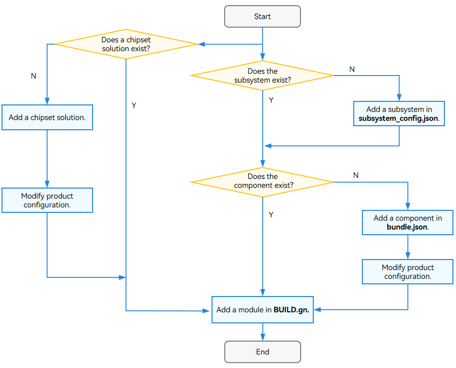

# Module
## Configuration Rules

The Compilation and Building subsystem implements compilation and packaging by module, component, and product. A module is a target to build. It can be a dynamic library, static library, configuration file, or prebuilt module. A module must belong to a component and can belong to only one component. OpenHarmony provides customized GN templates to configure modules. For details about the GN basics, see [GN Reference](https://gn.googlesource.com/gn/+/main/docs/reference.md).

The common templates for module configuration are as follows:

```
# C/C++ templates
ohos_shared_library
ohos_static_library
ohos_executable
ohos_source_set

# Prebuilt templates
ohos_prebuilt_executable
ohos_prebuilt_shared_library
ohos_prebuilt_static_library

# HAP templates
ohos_hap
ohos_app_scope
ohos_js_assets
ohos_resources

# Rust templates
ohos_rust_executable
ohos_rust_shared_library
ohos_rust_static_library
ohos_rust_proc_macro
ohos_rust_shared_ffi
ohos_rust_static_ffi
ohos_rust_cargo_crate
ohos_rust_systemtest
ohos_rust_unittest
ohos_rust_fuzztest

# Other templates
# Configuration file
ohos_prebuilt_etc

# SA profile
ohos_sa_profile
```

You are advised to use OpenHarmony custom templates.

### C/C++ Template Example

The path of the .gni file of the template starting with **ohos** is **openharmony/build/templates/cxx/cxx.gni**.

**ohos_shared_library** example:

```shell
import("//build/ohos.gni")
ohos_shared_library("helloworld") {
  sources = ["file"]
  include_dirs = []             # If there are duplicate header files, the header file defined earlier takes precedence over the file defined later.
  cflags = []                   # If there are duplicate or conflict settings, the settings in cflags take effect.
  cflags_c = []
  cflags_cc = []
  ldflags = []                  # If there are duplicate or conflict definitions, the settings in ohos_template take effect.
  configs = []
  deps = []                     # Dependent modules that belong to the same component.

  external_deps = [             # Dependent modules that belong to different components.
  "part_name:module_name",      # The value is in the Component_name:Module_name format.
  ]                             # The dependent modules must be declared in inner_kits by the dependent component.

  output_name = [string]        # Name of the module output.
  output_extension = []         # Extension name of the module.
  module_install_dir = ""       # Module installation directory in /system/lib64 or /system/lib.
  relative_install_dir = ""     # Relative module installation directory (relative to /system/lib64 or /system/lib). If module_install_dir is configured, the parameter does not take effect.

  part_name = ""                #  Component name. This parameter is mandatory.
  output_dir

  # Sanitizer configuration. Each item is optional, and is false or left unspecified by default.
  sanitize = {
    # Sanitizer settings
    cfi = [boolean]               # Whether to enable the control-flow integrity (CFI) check.
    cfi_cross_dso = [boolean]     # Whether to enable the cross-DSO CFI check.
    integer_overflow = [boolean]  # Whether to enable the integer overflow check.
    boundary_sanitize = [boolean] # Whether to enable the boundary check.
    ubsan = [boolean]             # Whether to enable some Undefined Behavior Sanitizer (UBSAN) options.
    all_ubsan = [boolean]         # Whether to enable all UBSAN options.
    ...

    debug = [boolean]             # Whether to enable the debug mode.
    blocklist = [string]          # Path of the blocklist.
  }

  testonly = [boolean]
  license_as_sources = []
  license_file = []               # A .txt file.
  remove_configs = []
  no_default_deps = []
  install_images = []
  install_enable = [boolean]
  symlink_target_name = []
  version_script = []
  use_exceptions = []
}
```

**ohos_static_library** example

```shell
import("//build/ohos.gni")
ohos_static_library("helloworld") {
  sources = ["file"]            # .c files.
  include_dirs = ["dir"]        # Directories to be included.
  configs = []                  # Configuration.
  deps = []                     # Dependent modules that belong to the same component.
  part_name = "" # Component name.
  subsystem_name = ""           # Subsystem name.
  cflags = []

  external_deps = [             # Dependent modules that belong to different components.
  "part_name:module_name",      # The value is in the Component_name:Module_name format.
  ]                             # The dependent modules must be declared in inner_kits by the dependent component.

  lib_dirs = []
  public_configs = []

  # Sanitizer configuration. Each item is optional, and is false or left unspecified by default.
  sanitize = {
    # Sanitizer settings
    cfi = [boolean]               # Whether to enable the control-flow integrity (CFI) check.
    cfi_cross_dso = [boolean]     # Whether to enable the cross-DSO CFI check.
    integer_overflow = [boolean]  # Whether to enable the integer overflow check.
    boundary_sanitize = [boolean] # Whether to enable the boundary check.
    ubsan = [boolean]             # Whether to enable some Undefined Behavior Sanitizer (UBSAN) options.
    all_ubsan = [boolean]         # Whether to enable all UBSAN options.
    ...

    debug = [boolean]             # Whether to enable the debug mode.
    blocklist = [string]          # Path of the blocklist.
  }

  remove_configs = []
  no_default_deps = []
  license_file = []               # A .txt file.
  license_as_sources = []
  use_exceptions = []
}
```

**ohos_executable** example:

```shell
import("//build/ohos.gni")
ohos_executable("helloworld") {
  configs = []                       # Configuration. 
  part_name = ""                     # Component name.
  subsystem_name = ""                # Subsystem name.
  deps = []                          # Dependent modules that belong to the same component.

  external_deps = [                  # Dependent modules that belong to different components.
  "part_name:module_name",           # The value is in the Component_name:Module_name format.
  ]                                  # The dependent modules must be declared in inner_kits by the dependent component.
  ohos_test = []
  test_output_dir = []

  # Sanitizer configuration. Each item is optional, and is false or left unspecified by default.
  sanitize = {
    # Sanitizer settings
    cfi = [boolean]                  # Whether to enable the control-flow integrity (CFI) check.
    cfi_cross_dso = [boolean]        # Whether to enable the cross-DSO CFI check.
    integer_overflow = [boolean]     # Whether to enable the integer overflow check.
    boundary_sanitize = [boolean]    # Whether to enable the boundary check.
    ubsan = [boolean]                # Whether to enable some Undefined Behavior Sanitizer (UBSAN) options.
    all_ubsan = [boolean]            # Whether to enable all UBSAN options.
    ...

    debug = [boolean]                # Whether to enable the debug mode.
    blocklist = [string]             # Path of the blocklist.
  }

  testonly = [boolean]
  license_as_sources = []
  license_file = []                  # A .txt file.
  remove_configs = []
  static_link = []
  install_images = []
  module_install_dir = ""            # Module installation directory, starting from system/ or vendor/.
  relative_install_dir = ""
  symlink_target_name = []
  output_dir = [directory]           # Directory in which output files are located.
  install_enable = [boolean]
  version_script = []
  use_exceptions = []
}
```

**ohos_source_set** example

```shell
import("//build/ohos.gni")
ohos_source_set("helloworld") {
  sources = ["file"]              # .c files.
  include_dirs = []               # Directories to be included.
  configs = []                    # Configuration.
  public = []                     # .h header files.
  defines = []
  public_configs = []
  part_name = ""                  # Component name.
  subsystem_name = ""             # Subsystem name.
  deps = []  # Dependent modules that belong to the same component.

  external_deps = [               # Dependent modules that belong to different components.
  "part_name:module_name",        # The value is in the Component_name:Module_name format.
  ]                               # The dependent modules must be declared in inner_kits by the dependent component.

  # Sanitizer configuration. Each item is optional, and is false or left unspecified by default.
  sanitize = {
    # Sanitizer settings
    cfi = [boolean]               # Whether to enable the control-flow integrity (CFI) check.
    cfi_cross_dso = [boolean]     # Whether to enable the cross-DSO CFI check.
    integer_overflow = [boolean]  # Whether to enable the integer overflow check.
    boundary_sanitize = [boolean] # Whether to enable the boundary check.
    ubsan = [boolean]             # Whether to enable some Undefined Behavior Sanitizer (UBSAN) options.
    all_ubsan = [boolean]         # Whether to enable all UBSAN options.
    ...

    debug = [boolean]             # Whether to enable the debug mode.
    blocklist = [string]          # Path of the blocklist.
  }

  testonly = [boolean]
  license_as_sources = []
  license_file = []
  remove_configs = []
  no_default_deps = []
  license_file = []               # A .txt file.
  license_as_sources = []
  use_exceptions = []
}
```

> **NOTE**
>
>   - Only **sources** and **part_name** are mandatory.
>   - For details about the Sanitizer configuration, see [Using Sanitizer](subsys-build-reference.md#using-sanitizer).


### Prebuilt Template Example

The path of the .gni file of the prebuilt templates is **openharmony/build/templates/cxx/prebuilt.gni**.

**ohos_prebuilt_executable** example

```shell
import("//build/ohos.gni")
ohos_prebuilt_executable("helloworld") {
  source = "file" # Source.
  output = []
  install_enable = [boolean]         

  deps = []                          # Dependent modules that belong to the same component.
  public_configs = []
  subsystem_name = ""                # Subsystem name.
  part_name = ""                     # Component name.

  testonly = [boolean]
  visibility = []

  install_images = []
  module_install_dir = ""            # Module installation directory, starting from system/ or vendor/.
  relative_install_dir = ""          # Relative module installation directory (relative to system/etc). If module_install_dir is configured, the parameter does not take effect.
  symlink_target_name = []


  license_file = []                  # A .txt file.
  license_as_sources = []
}
```

**ohos_prebuilt_shared_library** example

```shell
import("//build/ohos.gni")
ohos_prebuilt_shared_library("helloworld") {
  source = "file"                   # Source file, normally with a file name extension .so.
  output = []
  install_enable = [boolean]

  deps = []                         # Dependent modules that belong to the same component.
  public_configs = []
  subsystem_name = ""               # Subsystem name.
  part_name = ""                    # Component name.

  testonly = [boolean]
  visibility = []

  install_images = []
  module_install_dir = ""           # Module installation directory, starting from system/ or vendor/.
  relative_install_dir = ""         # Relative module installation directory (relative to system/etc). If module_install_dir is configured, the parameter does not take effect.
  symlink_target_name = [string]


  license_file = [string]           # A .txt file.
  license_as_sources = []
}
```

**ohos_prebuilt_static_library** example

```shell
import("//build/ohos.gni")
ohos_prebuilt_static_library("helloworld") {
  source = "file"                    # Source file, normally with a file name extension .so.
  output = []

  deps = []                          # Dependent modules that belong to the same component.
  public_configs = []
  subsystem_name = ""                # Subsystem name.
  part_name = ""                     # Component name.

  testonly = [boolean]
  visibility = []

  license_file = [string]            # A .txt file.
  license_as_sources = []
}
```

> **NOTE**<br> Only **sources** and **part_name** are mandatory.

### HAP Templates

For details about the HAP templates, see [HAP Build Guide](subsys-build-gn-hap-compilation-guide.md).

### Rust Templates

For details about the Rust templates, see [Rust Module Configuration Rules and Guide](subsys-build-rust-compilation.md).

### Other Templates

**ohos_prebuilt_etc** example:

```shell
import("//build/ohos.gni")
ohos_prebuilt_etc("helloworld") {
  # The most common attributes of the ohos_prebuilt_etc template.
  source = "file"                         # Single source file.
  module_install_dir = ""                 # Module installation directory, starting from system/ or vendor/.
  subsystem_name = ""# Subsystem name.
  part_name = ""                          # Component name. This parameter is mandatory.
  install_images = []
  relative_install_dir = ""               # Relative module installation directory (relative to system/etc). If module_install_dir is configured, the parameter does not take effect.
  
  # Uncommon attributes of the ohos_prebuilt_etc template:
  deps = []                               # Dependent modules that belong to the same component.
  testonly = [boolean]
  visibility = []
  public_configs = []
  symlink_target_name = [string]
  license_file = [string]
  license_as_sources = []
}
```

**ohos_sa_profile** example:

```shell
import("//build/ohos.gni")
ohos_sa_profile("helloworld") {
  sources = [".xml"]                   # .xml file.
  part_name = ""                       # Component name.
  subsystem_name = ""                  # Subsystem name.
}
```

> **NOTE**
>
> Only **sources** and **part_name** are mandatory.


## Adding and Building a Module

The following figure shows the logic for adding a module. Generally, you need to add a module to a component of a subsystem. If there is no subsystem or component, you must add the subsystem and component first. Note that the chip solution is a special component and does not have a subsystem.

- Add a module to an existing component.

- Add a module to a new component.

- Add a module to a new subsystem.

  

**Adding a Module to an Existing Component**

1. Configure the **BUILD.gn** file in the module directory and select the GN template.

2. Modify the **bundle.json** file.

   ```shell
   {
      "name": "@ohos/<component_name>,                       # HPM component name, in the "@Organization/Component_name" format.
      "description": "xxxxxxxxxxxxxxxxxxx",                  # Description of the component functions.
      "version": "3.1",                                      # Version, which must be the same as the version of OpenHarmony.
      "license": "MIT",                                      # Component license.
      "publishAs": "code-segment",                           # HPM package release mode. The default value is code-segment.
      "segment": {
          "destPath": "third_party/nghttp2"
      },                                                     # Code restoration path (source code path) set when publishAs is code-segment.
      "dirs": {},                                            # Directory structure of the HPM package. This field is mandatory and can be left empty.
      "scripts": {},                                         # Scripts to be executed. This field is mandatory and can be left empty.
      "licensePath": "COPYING",
      "readmePath": {
          "en": "README.rst"
      },
      "component": {                                         # Component attributes.
          "name": "<component_name>",                        # Component name.
          "subsystem": "",                                   # Subsystem to which the component belongs.
          "syscap": [],                                      # System capabilities provided by the component for applications.
          "features": [],                                    # List of configurable features of the component. Generally, this parameter corresponds to sub_component in build.
          "adapted_system_type": [],                         # Types of adapted systems. The value can be mini, small, standard, or their combinations.
          "rom": "xxxKB"                                     # ROM baseline. If there is no baseline, enter the current value.
          "ram": "xxxKB",                                    # RAM baseline. If there is no baseline, enter the current value.
          "deps": {
              "components": [                                # Other components on which this component depends.
              "third_party": [                               # Third-party open-source software on which this component depends.
          },
       
          "build": {                                         # Build-related configuration.
              "sub_component": [
                  "//foundation/arkui/napi:napi_packages",      # Existing module 1.
                  "//foundation/arkui/napi:napi_packages_ndk"   # Existing module 2.
                  "//foundation/arkui/napi:new"                 # Module to add.
              ],                                                # Component build entry. Configure the module here.
              "inner_kits": [],                                 # APIs between components.
              "test": []                                        # Entry for building the component's test cases.
          }
      }
   }
   ```

   > **NOTE**<br>The **bundle.json** file must be in the folder of the corresponding subsystem.

3. Start the build and check whether a .so file or binary file is generated.

**Creating a Component and Adding a Module**

1. Configure the **BUILD.gn** file in the module directory and select the corresponding GN template. Note that **part_name** in the **BUILD.gn** file is the name of the component to add.

2. Create a **bundle.json** file in the folder of the corresponding subsystem.

3. Add the new component to the end of existing components in **vendor/{product_company}/{product-name}/config.json**.

   ```shell
    "subsystems": [
         {
           "subsystem": "Subsystem to which the component belongs",
           "components": [
             {"component": "Component 1 name", "features":[]},         # Existing component 1 in the subsystem
             { "component": "Component 2 name", "features":[] },       # Existing component 2 in the subsystem
             {"component": "New component name", "features":[]}        # New component in the subsystem
           ]
         },
         .
    ]
   ```

4. Start the build and check whether a .so file or binary file is generated.
   

**Creating a Subsystem and Adding a Module**

1. Configure the **BUILD.gn** file in the module directory and select the corresponding GN template. This step is the same as Step 1 in "Creating a Component and Adding a Module."

2. Create a **bundle.json** file in the folder of the component of the subsystem. This step is the same as Step 2 in "Creating a Component and Adding a Module."

3. Modify the **subsystem_config.json** file in the **build** directory.

   ```shell
   {
    "Subsystem 1 name": {                     # Existing subsystem 1
      "path": "Subsystem 1 directory",
      "name": "Subsystem 1 name"
    },
     "Subsystem 2 name": {                    # Existing subsystem 2
      "path": "Subsystem 2 directory",
      "name": "Subsystem 2 name"
    },
    "Subsystem name new": {                   # Subsystem to add
      "path": "New subsystem directory",
      "name": "New subsystem name"
    },
   
   }
   ```

   The **subsystem_config.json** file defines the subsystems and their directories. When adding a subsystem, specify **path** and **name** for the subsystem.

4. If **product-name** in the **vendor/{product_company}/{product-name}** directory is **hispark_taurus_standard**, add the new component information to the end of existing components in the **config.json** file.

   ```shell
   "subsystems": [
     {
       "subsystem": "arkui",                      # Name of the existing subsystem
       "components": [                            # All components of the subsystem
         {
           "component": "ace_engine_standard",    # Name of the existing component
           "features": []
         },
         {
           "component": "napi",                   # Name of the existing component
           "features": []
         }
          {
           "component": "component_new1",         # Name of the new component to add
           "features": []
         }
      ]
     },
     {
       "subsystem": "subsystem_new",              # Name of the new subsystem to add.
       "components": [
         {
           "component": "component_new2",         # Name of the component to be added to the new subsystem
           "features": []
         }
       ]
     },
    
    ]
   ```

4. Start the build and check whether a .so file or binary file is generated.


**Building a Module**

You can start the build by using the [CLI or hb tool](subsys-build-all.md#build-commands). The following uses the CLI as an example:

Run the **--build-target** *Module_name* command to build a module separately.

   ```shell
   ./build.sh --build-target Module_name
   ```

Build a product. For example, to build hispark_taurus_standard, run the following command:

   ```shell
   ./build.sh --product-name hispark_taurus_standard --build-target Module_name --ccache
   ```

Build the component to which the module belongs.

   ```shell
   ./build.sh --product-name hispark_taurus_standard --build-target musl --build-target Module_name --ccache
   ```
