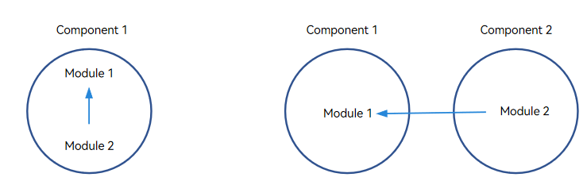
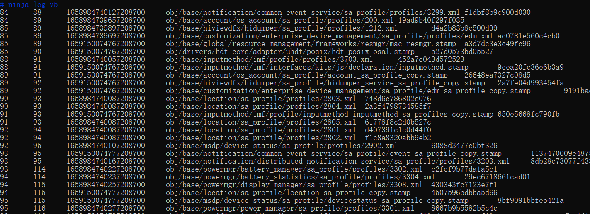

# Reference

## deps and external_deps

When adding a module, you must declare its dependencies in **BUILD.gn**. **deps** specifies dependent modules in the same component, and **external_deps** specifies dependent modules between components.

**Dependency Types**



The dependency between modules can be classified into **deps** (left in the figure above) and **external_deps** (right in the figure above).

- **deps**: The dependent module to be added belongs to the same part with the current module. For example, module 2 depends on module 1, and both modules 1 and 2 belong to the same component.

- **external_deps**: The dependent module to be added belongs to another component. For example, module 2 depends on module 1, and modules 1 and 2 belong to different components.

- Example of **deps**:

  ```shell
  import("//build/ohos.gni")
  ohos_shared_library("module1") {
    ...
    part_name = "part1"   # (Mandatory) Name of the component to which the module belongs.
    ...
  }
  ```

  ```shell
  import("//build/ohos.gni")
  ohos_shared_library("module2") {
    ...
    deps = [
      "GN target of module 1",
    ...
   ]                      # Intra-component dependency
  part_name = "part1"     # (Mandatory) Name of the component to which the module belongs.
  }
  ```

- Example of **external_deps**:

  ```shell
  import("//build/ohos.gni")
  ohos_shared_library("module1") {
    ...
    part_name = "part1"   # (Mandatory) Name of the component to which the module belongs.
    ...
  }
  ```

  ```shell
  import("//build/ohos.gni")
  ohos_shared_library("module2") {
    ...
    external_deps = [
      "part1:module1",
    ...
    ]                      # Inter-component dependency. The dependent module must be declared in inner_kits by the dependent component.
    part_name = "part2"    # (Mandatory) Name of the component to which the module belongs.
  }
  ```

 > **NOTE**<br>The dependency between components must be written in the format of **Component name:Module name** in **external_deps**. The dependent module must be declared in **inner_kits**.

## Using Sanitizer

When adding a module, you can enable the Sanitizer, such as the integer overflow check and control-flow integrity (CFI), provided by the compiler as required. You can also enable the debug or release mode and configure a blocklist. Each configuration item is optional and **false** by default. You can also leave it empty. 

Sanitizer configuration example:

``` shell
  ohos_shared_library("example") {
    sanitize = {
      cfi = true                            # Enable the CFI check.
      cfi_cross_dso = true                  # Enable the cross-DSO CFI check.
      integer_overflow = true               # Enable the integer overflow check.
      boundary_sanitize = true              # Enable the bounds check.
      ubsan = true                          # Enable some UBSAN options.
      all_ubsan = true                      # Enable all UBSAN options.
      debug = true                          # Enable the debug mode, which is disabled by default.
      blocklist = "./blocklist.txt"         # Path of the blocklist.
    }
    ...
  }
```

**Supported Sanitizer Types**

Currently, Sanitizers provides the following functions:

- **integer_overflow**: provides check of unsigned integer overflow (unsigned_integer_overflow), check of signed integer overflow (signed_integer_overflow), or both (integer_overflow).
- CFI: provides CFI and cross-DSO CFI checks.
- **boundary_sanitize**: provides the bounds check.
- **ubsan**: checks some Undefined Behavior Sanitizer (UBSAN) options, including **bool**, **integer-divide-by-zero**, **return**, **returns-nonnull-attribute**, **shift-exponent**, **unreachable**, and **vla-bound**.
- **all_ubsan**: checks all UBSAN options.

**Release and Debug Modes**

**Debug** specifies whether the debug mode or the release mode is used. The default value **false** indicates that the release mode is used. The value **true** explicitly declares the debug mode. The **debug** option takes effect only for the Sanitizer and does not determine whether a module is debuggable. In the build configuration for a module in release version, you are advised to set **debug** to **false** (enable the release mode) or leave it unspecified.

- Debug mode: If debug mode is enabled, abundant error-related information is provided to help locate faults. When an error occurs, the application will be resumed instead of being interrupted to further identify subsequent errors.

- Release mode: If release mode is enabled, the application will be directly interrupted when an error occurs. This can protect the system against errors or maliciously attacks.


**Blocklist**

The blocklist specifies the functions or source programs that are not affected by Sanitizer in the module. It prevents benign behavior from being identified as errors or prevents hotspot functions from generating unreasonable and unacceptable overheads. Exercise caution when using this function. 

Blocklist example:

```
[cfi]
fun:*([Tt]est|TEST)*
fun: main

[integer]
src:example/*.cpp
```


## Information Collected by the Open Source Software Notice

An open source software notice is a file related to the project open source. It collects license information to comply with open source specifications.

**Information to Collect**

The notice collects only the licenses of the modules packaged in the image. For example, the licenses of the tools (such as Clang, Python, and Ninja) used during the build process are not collected.

A static library itself is not packaged. However, if it is packaged into the system as part of a dynamic library or an executable file, the license of the static library will be collected for completeness.

The final **Notice.txt** file must include all licenses used by the files in the image and the mapping between modules and licenses.

The **Notice.txt** file is located in the **/system/etc/** directory.

**Rules for Collecting Information**

Licenses are collected by priority, which ranges from 1 to 4 in descending order of seniority.

1. Licenses that are directly declared in a module's **BUILD.gn** are given the top priority. The following is an example:

   ```shell
   ohos_shared_library("example") {
       ...
       license_file = "path-to-license-file"
       ...
   }
   ```

2. If there is no explicitly declared license, the build script searches for the **Readme.OpenSource** file in the directory of **BUILD.gn**, parses the file, and collects the obtained licenses. If the **Readme.OpenSource** file does not contain license information, an error will be reported.

3. If the **Readme.OpenSource** file does not exist, the build script searches for the **License**, **Copyright**, and **Notice** files from the current directory to the root directory of the source code by default. The obtained license information will be used as the licenses of the module.

4. If no license is found, the default license (Apache License 2.0) will be used.

Pay attention to the following:

- For third-party open-source software, such as OpenSSL and ICU, **Readme.OpenSource** must be configured in the source code directory. Check whether **Readme.OpenSource** is in the same directory as **BUILD.gn** and whether the licenses configured in **Readme.OpenSource** are valid.
- If the source code is not licensed under Apache License 2.0, the corresponding license file must be provided in the source code directory or declared in **license_file** for the module.
- If the source code file added to **BUILD.gn** is not from the current directory, check whether the license in the repository where the source code file is located is the same as that in the repository of **BUILD.gn**.

## Parameters for Accelerating Local Build

The following parameters can be added to the build command to speed up the build process:

- **--ccache**
  - Ccache caches the output of C/C++ compilation. If the compilation input remains unchanged the next time, the compilation can be skipped and the output can be taken from the cache.
  - Installing ccache:
    - Quick installation: Run the **sudo apt-get install ccache** command.
    - Download the binary file from the [official website](https://ccache.dev/download.html) and configure the ccache path to the environment variable.
  - Usage: Run the **./build.sh --product-name** *Product_name* **--ccache** command.
- **--fast-rebuild**
  - The compilation process includes preloader -> loader -> GN -> Ninja. If the GN and product configuration files are not modified locally, adding **--fast-rebuild** will start from Ninja directly.
  - Usage: Run the **./build.sh --product-name** *Product_name* **--fast-rebuild** command.
- **enable_notice_collection=false**
  - Adding this parameter can skip the process of collecting the module licenses of the open-source software.
  - Usage: Run the **./build.sh --product-name** *Product_name* **--gn-args --enable_notice_collection=false --ccache** command.
- **--build-target**
  - This parameter specifies the module to compile. You can obtain the module name as follows:
    - Pay attention to keywords such as **group**, **ohos_shared_library**, and **ohos_executable** in **BUILD.gn**.
    - Run **./build.sh --product-name** *Product_name* **--build-target** *Module_name* **--build-only-gn** to generate **build.ninja** and locate the related module name in the file.
  - Usage: Run the **./build.sh --product-name** *Product_name* **--build-target ark_js_host_linux_tools_packages** command.

## Viewing Ninja Build Information

The **out/rk3568/.ninja_log** file records the build start time and end time (ms) of each module. A shorter interval indicates a faster build and higher compilation performance.

The four columns are start time, end time, modified timestamp (mtime), and command hash from left to right.



You can graphically display the build time as follows:

- Open **build.trace** locally.
  Decompress **out/rk3568/build.trace.gz** and drag **build.trace** to **chrome://tracing/**.
- Open **build.trace** at **ci.openharmony.cn/events**.
  You can open the **build.trace.html** file in each compilation output as follows:
  1. Click **Success** under **Static Check**.

  2. Click **Output** in the **Output** column. The **build.trace.html** file is displayed in the **build_trace** column on the left. Click the file to open it.

## Customizing the chip_prod Image

### When to Use

The different capabilities for the products in the same chip solution are placed in the **chip_prod** partition. You need to generate the **chip_prod.img** specific to the product.

### Procedure
1. Configure the **config.json** file.
   
   In the **config.json** file, add **chipprod_config_path**, which specifies the path of the product definition file.
   The file is named **chip_product_list.gni**, and in the **chip_product_list = ["productA", "productB", ...]** format.
   
   Example:
   
   To customize **chip_prod.img** for **MyProduct**, modify the **//vendor/Product vendor/MyProduct/config.json** as follows:
   
   ```shell
	{
        "product_name": "MyProduct",                                 # Product name.
        "version": "3.0",                                            # config.json version, which is 3.0.
        "chipprod_config_path": "",                                  # (Optional) Path of the chipprod configuration file.
   "subsystems": [
          {
            "subsystem": "arkui",                                    # Subsystem of the product. 
            "components": [
              {
                  "component": "ace_engine",
                  "features":[ "ace_engine_feature_enable_web = true",
                    "ace_engine_feature_enable_accessibility = true" ] }   
            ]
          },
          {
           ...
          }
         ...
      More subsystems and components.
        }
   }
   ```
   
2. Configure the module.

   If the configuration file has different product configurations, for example, to generate **chip_prod.img** for product A, you need to configure **install_images** and **module_install_dir** for module compilation.

   The following uses **ohos_prebuilt_executable** as an example:

   ```shell
   ohos_prebuilt_executable("moduleXXX"){
   install_images = [ "chip_prod" ]
   module_install_dir = "productA/etc/***"     # The path must start with productA.
   }
   ```

3. Run the build command.
```shell
./build.sh --product-name {product_name} --build-target chip_prod_image
```

4. Generate the images.
   If products A and B are defined (**chip_product_list = ["productA", "productB"]**) and a module is installed in the products, the following images are generated:
   
   ```
   images/productA/chip_prod.img
   images/productB/chip_prod.img
   ```
