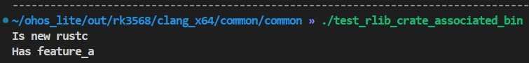

# Rust Module Configuration Rules and Guide

## Introduction

Rust is a static, strongly typed programming language. It has advantages such as secure memory management, high running performance, and native support for multi-thread development. Rust uses Cargo to create projects and compile and build Rust code.<br>
To integrate C/C++ code and improve the build speed, OpenHarmony uses Generate Ninja (GN) and Ninja as its build system. GN has simple and easy-to-use build language, and Ninja provides direct and efficient assembly-level build rules.
To integrate Rust code and maximize the interaction between the C/C++ code used in OpenHarmony and Rust, OpenHarmony uses GN as a unified build tool to build Rust source code files (xxx.rs) and is added with features such as interoperability with C/C++, compile time lints, test, IDL conversion, third-party library integration, and IDE. In addition, the GN framework is extended to support automatic interface conversion, which greatly simplifying development.

### Basic Concepts

| Term | Description                                                        |
| ----- | ------------------------------------------------------------ |
| Cargo | Cargo is an official build tool used by Rust. It allows Rust projects to declare dependencies and ensures reproducible builds.|
| crate | Crate is a unit that can be independently compiled.                               |
| Lint  | Lint is a code analysis tool used to flag programming errors, bugs, stylistic errors, and suspicious constructs. It performs extensive error analysis on programs.|


## Configuration Rules
OpenHarmony provides a variety of GN templates for compiling Rust executables, dynamic libraries, and static libraries. The following table describes the templates.

| GN Template                    | Description             | Output                               |
|--------------------------|-----------------|-----------------------------------|
| ohos_rust_executable     | Rust executable file.      | Rust executable file, without the file name extension.                   |
| ohos_rust_shared_library | Rust dynamic library.        | Rust dylib dynamic library, with the default file name extension **.dylib.so**.      |
| ohos_rust_static_library | Rust static library.        | Rust rlib static library, with the default file name extension **.rlib**.           |
| ohos_rust_proc_macro     | Rust proc_macro library. | Rust proc_macro library, with the default file name extension **.so**.        |
| ohos_rust_shared_ffi     | Rust Foreign Function Interface (FFI) dynamic library.    | Rust cdylib dynamic library, which is called by the C/C++ module. The default file name extension is **.so**.|
| ohos_rust_static_ffi     | Rust FFI static library.    | Rust staticlib library, which is called by the C/C++ module. The default file name extension is **.a**.|
| ohos_rust_cargo_crate    | Third-party Cargo crate. | Third-party Rust crates, which support rlib, dylib, and bin.      |
| ohos_rust_systemtest     | Rust system test cases.     | Executable system test cases for Rust, without the file name extension.               |
| ohos_rust_unittest       | Rust unit test cases.     | Executable unit test cases for Rust, without the file name extension.               |
| ohos_rust_fuzztest       | Rust fuzzing test cases.  | Executable fuzzing test cases for Rust, without the file name extension.             |


## Configuration Guide
The configuration of the Rust module is similar to that of the C/C++ module. For details, see [Module Configuration Rules](subsys-build-module.md). The following provides examples of using different Rust templates.
### Configuring a Rust Static Library
The following example shows how to use the **ohos_rust_executable** and **ohos_rust_static_library** templates to build a binary executable and a static rlib library, respectively. The executable depends on the static library. 
The procedure is as follows:

1. Create **build/rust/tests/test_rlib_crate/src/simple_printer.rs**.

   ```rust
   //! simple_printer
   
   /// struct RustLogMessage
   
   pub struct RustLogMessage {
       /// i32: id
       pub id: i32,
       /// String: msg
       pub msg: String,
   }
   
   /// function rust_log_rlib
   pub fn rust_log_rlib(msg: RustLogMessage) {
       println!("id:{} message:{:?}", msg.id, msg.msg)
   }
   ```

2. Create **build/rust/tests/test_rlib_crate/src/main.rs**.

   ```rust
   //! rlib_crate example for Rust.
   
   extern crate simple_printer_rlib;
   
   use simple_printer_rlib::rust_log_rlib;
   use simple_printer_rlib::RustLogMessage;
   
   fn main() {
       let msg: RustLogMessage = RustLogMessage {
           id: 0,
           msg: "string in rlib crate".to_string(),
       };
       rust_log_rlib(msg);
   }
   ```

3. Configure the GN build script **build/rust/tests/test_rlib_crate/BUILD.gn**.

   ```
   import("//build/ohos.gni")
   
   ohos_rust_executable("test_rlib_crate") {
     sources = [ "src/main.rs" ]
     deps = [ ":simple_printer_rlib" ]
   }
   
   ohos_rust_static_library("simple_printer_rlib") {
     sources = [ "src/simple_printer.rs" ]
     crate_name = "simple_printer_rlib"
     crate_type = "rlib"
     features = [ "std" ]
   }
   ```

4. Run **BUILD.gn** to generate the build targets.

   

### Configuring a Third-Party Library

The **BUILD.gn** file of the rust third-party library can be automatically generated using the cargo2gn tool. For details, see [Using Cargo2gn](subsys-build-cargo2gn-guide.md).

The following example shows how to use the **ohos_rust_executable** and **ohos_rust_cargo_crate** templates to compile a third-party static library rlib file that contains a prebuilt file **build.rs**. 
The procedure is as follows:

1. Create **build/rust/tests/test_rlib_cargo_crate/crate/src/lib.rs**.

   ```rust
   include!(concat!(env!("OUT_DIR"), "/generated/generated.rs"));
   
   pub fn say_hello_from_crate() {
       assert_eq!(run_some_generated_code(), 45);
       #[cfg(is_new_rustc)]
       println!("Is new rustc");
       #[cfg(is_old_rustc)]
       println!("Is old rustc");
       #[cfg(is_ohos)]
       println!("Is ohos");
       #[cfg(is_mac)]
       println!("Is darwin");
       #[cfg(has_feature_a)]
       println!("Has feature_a");
       #[cfg(not(has_feature_a))]
       panic!("Wasn't passed feature_a");
       #[cfg(not(has_feature_b))]
       #[cfg(test_a_and_b)]
       panic!("feature_b wasn't passed");
       #[cfg(has_feature_b)]
       #[cfg(not(test_a_and_b))]
       panic!("feature_b was passed");
   }
   
   #[cfg(test)]
   mod tests {
       /// Test features are passed through from BUILD.gn correctly. This test is the target configuration.
       #[test]
       #[cfg(test_a_and_b)]
       fn test_features_passed_target1() {
           #[cfg(not(has_feature_a))]
           panic!("feature a was not passed");
           #[cfg(not(has_feature_b))]
           panic!("feature b was not passed");
       }
   
       #[test]
       fn test_generated_code_works() {
           assert_eq!(crate::run_some_generated_code(), 45);
       }
   }
   ```

2. Create **build/rust/tests/test_rlib_cargo_crate/crate/src/main.rs**.

   ```rust
   pub fn main() {
       test_rlib_crate::say_hello_from_crate();
   }
   ```

3. Create **build/rust/tests/test_rlib_cargo_crate/crate/build.rs**.

   ```rust
   use std::env;
   use std::path::Path;
   use std::io::Write;
   use std::process::Command;
   use std::str::{self, FromStr};
   
   fn main() {
       println!("cargo:rustc-cfg=build_script_ran");
       let my_minor = match rustc_minor_version() {
           Some(my_minor) => my_minor,
           None => return,
       };
   
       if my_minor >= 34 {
           println!("cargo:rustc-cfg=is_new_rustc");
       } else {
           println!("cargo:rustc-cfg=is_old_rustc");
       }
   
       let target = env::var("TARGET").unwrap();
   
       if target.contains("ohos") {
           println!("cargo:rustc-cfg=is_ohos");
       }
       if target.contains("darwin") {
           println!("cargo:rustc-cfg=is_mac");
       }
   
       let feature_a = env::var_os("CARGO_FEATURE_MY_FEATURE_A").is_some();
       if feature_a {
           println!("cargo:rustc-cfg=has_feature_a");
       }
       let feature_b = env::var_os("CARGO_FEATURE_MY_FEATURE_B").is_some();
       if feature_b {
           println!("cargo:rustc-cfg=has_feature_b");
       }
   
       // Tests used to verify whether Cargo features are enabled.
       assert!(Path::new("build.rs").exists());
       assert!(Path::new(&env::var_os("CARGO_MANIFEST_DIR").unwrap()).join("build.rs").exists());
       assert!(Path::new(&env::var_os("OUT_DIR").unwrap()).exists());
   
       // Ensure that the following env var is set.
       env::var_os("CARGO_CFG_TARGET_ARCH").unwrap();
   
       generate_some_code().unwrap();
   }
   
   fn generate_some_code() -> std::io::Result<()> {
       let test_output_dir = Path::new(&env::var_os("OUT_DIR").unwrap()).join("generated");
       let _ = std::fs::create_dir_all(&test_output_dir);
       // Test that environment variables from .gn files are passed to build scripts.
       let preferred_number = env::var("ENV_VAR_FOR_BUILD_SCRIPT").unwrap();
       let mut file = std::fs::File::create(test_output_dir.join("generated.rs"))?;
       write!(file, "fn run_some_generated_code() -> u32 {{ {} }}", preferred_number)?;
       Ok(())
   }
   
   fn rustc_minor_version() -> Option<u32> {
       let rustc_bin = match env::var_os("RUSTC") {
           Some(rustc_bin) => rustc_bin,
           None => return None,
       };
   
       let output = match Command::new(rustc_bin).arg("--version").output() {
           Ok(output) => output,
           Err(_) => return None,
       };
   
       let rustc_version = match str::from_utf8(&output.stdout) {
           Ok(rustc_version) => rustc_version,
           Err(_) => return None,
       };
   
       let mut pieces = rustc_version.split('.');
       if pieces.next() != Some("rustc 1") {
           return None;
       }
   
       let next_var = match pieces.next() {
           Some(next_var) => next_var,
           None => return None,
       };
   
       u32::from_str(next_var).ok()
   }
   ```

4. Configure the GN build script **build/rust/tests/test_rlib_cargo_crate/BUILD.gn**.

   ```
   import("//build/templates/rust/ohos_cargo_crate.gni")
   
   ohos_cargo_crate("target") {
     crate_name = "test_rlib_crate"
     crate_root = "crate/src/lib.rs"
     sources = [ "crate/src/lib.rs" ]
   
     #To generate the build_script binary
     build_root = "crate/build.rs"
     build_sources = [ "crate/build.rs" ]
     build_script_outputs = [ "generated/generated.rs" ]
   
     features = [
       "my-feature_a",
       "my-feature_b",
       "std",
     ]
     rustflags = [
       "--cfg",
       "test_a_and_b",
     ]
     rustenv = [ "ENV_VAR_FOR_BUILD_SCRIPT=45" ]
   }
   
   # Exists to test the case that a single crate has both a library and a binary
   ohos_cargo_crate("test_rlib_crate_associated_bin") {
     crate_root = "crate/src/main.rs"
     crate_type = "bin"
     sources = [ "crate/src/main.rs" ]
   
     #To generate the build_script binary
     build_root = "crate/build.rs"
     build_sources = [ "crate/build.rs" ]
     features = [
       "my-feature_a",
       "my-feature_b",
       "std",
     ]
     rustenv = [ "ENV_VAR_FOR_BUILD_SCRIPT=45" ]
     deps = [ ":target" ]
   }
   ```

5. Run **BUILD.gn** to generate the build target.

   

### Other Configuration Examples
You can find the Rust module configuration examples in the **build/rust/tests** directory.

| Directory                                        | Description                                                    |
|----------------------------------------------|----------------------------------------------------------|
| build/rust/tests/test_bin_crate              | Tests the build of an executable file on the host platform and running of the executable file on the target platform.|
| build/rust/tests/test_static_link            | Tests the static linking of an executable file to a standard library.                                       |
| build/rust/tests/test_dylib_crate            | Tests the build of a dynamic library and dynamic linking.                                        |
| build/rust/tests/test_rlib_crate             | Tests the build of a static library and static linking.                                        |
| build/rust/tests/test_proc_macro_crate       | Tests the build of Rust process macros and the linking function. Test cases are provided for different types of macros.                      |
| build/rust/tests/test_cdylib_crate           | Tests the generation of Rust FFI bindings to a C/C++ dynamic library.                                   |
| build/rust/tests/test_staticlib_crate        | Tests the generation of Rust FFI bindings to a C/C++ static library.                                   |
| build/rust/tests/rust_test_ut                | Tests the Rust code unit test template.                              |
| build/rust/tests/rust_test_st                | Tests the Rust code system test template.                              |
| build/rust/tests/test_bin_cargo_crate        | Tests the build and running of a Rust third-party executable file. The third-party source code contains **build.rs**.                    |
| build/rust/tests/test_rlib_cargo_crate       | Tests the build of a Rust third-party static library and static linking. The third-party source code contains **build.rs**.                    |
| build/rust/tests/test_proc_macro_cargo_crate | Tests the build of Rust third-party process macros and linking. The third-party source code contains **build.rs**.                      |
| build/rust/tests/rust_test_fuzzb             | Tests the Rust code fuzzing test template.                                     |
## Reference

### Feature Examples

#### Linking a C/C++ library in Rust Source Code
By default, the dynamic library of the OpenHarmony C/C++ module is in the **.z.so** format. However, when the Rust **-l** command is executed, only the dynamic library in the **.so** format is linked by default. If a C/C++ dynamic library is used as the dependency, you need to add **output_extension = "so"** to the GN build script of the dynamic library to make the generated dynamic library be named with **.so** instead of **.z.so**.
If a dynamic library is directly linked in the Rust source code, the dynamic library must be in **.so** format. In this case, use the dynamic library name without "lib". The following is an example of linking **libhilog.so** in the Rust source code.

```rust
#[link(name = "hilog")]
```
#### Using externs
If a module depends on the binary rlib library, you can use the **externs** attribute.
```
executable("foo") {
    sources = [ "main.rs" ]
    externs = [{                    # Convert it to `--extern bar=path/to/bar.rlib` during the compilation.
        crate_name = "bar"
        path = "path/to/bar.rlib"
    }]
}
```
### Lint Rules
The OpenHarmony framework supports two types of lints: rustc lints and Clippy lints. Each type of lint has three levels: openharmony (highest), vendor, and none (lowest).
When configuring the Rust module, you can specify the lint level in **rustc_lints** or **clippy_lints**.
If **rustc_lints** or **clippy_lints** is not configured in the module, the lint level is matched based on the module path. Different restrictions apply to the syntax specifications of Rust code in different directories. Therefore, you need to pay attention to the path of the module when configuring the Rust module to build in OpenHarmony.

#### Levels of Rustc Lints and Clippy Lints
| **Lint Type**| **Module Attribute**| **Lint Level**| **Lint Level Flag**| **Lint Content**                                               |
| ------------- | ------------ | ------------- | ----------------- | ------------------------------------------------------------ |
| rustc lints  | rustc_lints  | openharmony   | RustOhosLints     | "-A deprecated", "-D missing-docs", "-D warnings"           |
| rustc lints  | rustc_lints  | vendor        | RustcVendorLints  | "-A deprecated", "-D warnings"                                |
| rustc lints  | rustc_lints  | none          | allowAllLints     | "-cap-lints allow"                                           |
| Clippy lints | clippy_lints| openharmony   | ClippyOhosLints   | "-A clippy::type-complexity", "-A clippy::unnecessary-wraps", "-A clippy::unusual-byte-groupings", "-A clippy::upper-case-acronyms" |
| Clippy lints | clippy_lints | vendor        | ClippyVendorLints | "-A clippy::complexity", "-A Clippy::perf", "-A clippy::style" |
| Clippy lints | clippy_lints | none          | allowAllLints     | "--cap-lints allow"                                          |

#### Mapping Between Code Paths and Lint Levels
| Path      | Lint Level  |
| ---------- | ----------- |
| thirdparty | none        |
| prebuilts  | none        |
| vendor     | vendor      |
| device     | vendor      |
| others     | openharmony |

### [Interactive Tool User Guide](subsys-build-bindgen-cxx-guide.md)
### [Using Cargo2gn](subsys-build-cargo2gn-guide.md)
