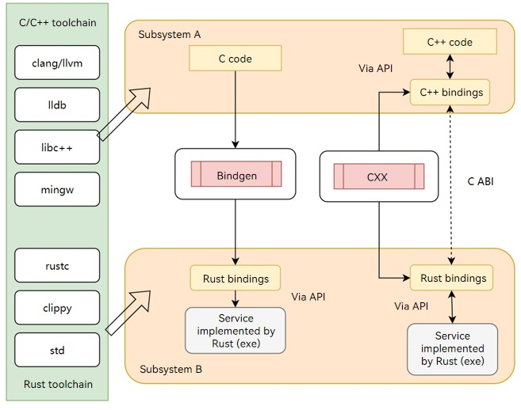
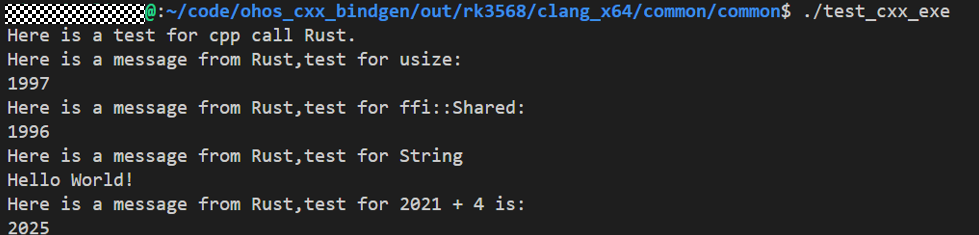

# OpenHarmony rust module configuration rules and guidance
## Configuration rules for various types of rust
Currently, OpenHarmony provides various types of gn templates for compiling and building rust code,include ohos_rust_executable、ohos_rust_static_library、ohos_rust_proc_macro、ohos_rust_shared_ffi、ohos_rust_static_ffi、ohos_rust_cargo_crate、ohos_rust_systemtest、ohos_rust_unittest.
## Guide for configuring various types of rust
### GN template
To use the rust rule, you need to first import "//build/ohos. gni", which is a shared external interface with C/C++
```
import("//build/ohos.gni")
```
To use the rust rule, you need to first import "//build/test. gni", which is a shared external interface with C/C++
```
import("//build/test.gni")
```
### Example
Currently, 'host x86_64', 'target arm64', and 'target arm' architectures have been supported for rust compilation and construction
#### Example reference
There are configuration examples of various types of rust modules available for reference in the build/rust/tests directory:
| test directory | test function |
| ---- | ---- |
| test_bin_crate | Test the host and target compilation links and running of 'ohos_rust_executable' |
| test_static_link | Testing static link from "ohos_rust_executable" to libstd.rlib |
| test_dylib_crate | Test the compilation dependency and running of 'ohos_rust_executable' on 'ohos_rust_shared_library' |
| test_rlib_crate | Test the compilation dependency and running of 'ohos_rust_executable' on 'ohos_rust_static_library' |
| test_proc_macro_crate | Test the compilation dependency and running of 'ohos_rust_executable' on 'ohos_rust_proc_macro' |
| test_cdylib_crate | Test the compilation dependency and running of 'ohos_rust_executable' on 'ohos_rust_shared_ffi' |
| test_staticlib_crate | Test the compilation dependency and running of 'ohos_rust_executable' on 'ohos_rust_static_ffi' |
| test_rust_ut | Test 'ohos_rust_unittest', with the use case code and feature code in the same file |
| test_rust_st | Test 'ohos_rust_systemtest', with the use case code and feature code in the same file |
| test_bin_cargo_crate | Test executable file which using 'ohos_cargo_crate' |
| test_rlib_cargo_crate | Test static library file which using 'ohos_cargo_crate' |
| test_proc_macro_cargo_crate | Test proc_macro which using 'ohos_cargo_crate' |
#### Example of characteristic points
##### Rust source code relies on calling C/C++ libraries
By default, C/C++ modules in a dynamic library on OH use the .z.so suffix, but when they are depended on by Rust, they are converted to -l links, which will only link dynamic libraries with the .so suffix. Therefore, C/C++ dynamic libraries that are dependent on need to add output_externsion = "so". Similarly, if linking to a dynamic library in Rust source code, the suffix also needs to use ".so", and the middle name of the dynamic library does not need to add the "lib" prefix. For example, linking to libhilog.so:
```
#[link(name = "hilog")]
```
##### externs
If a module relies on a binary rlib library, the externs attribute can be used:
```
executable("foo") {
    sources = [ "main.rs" ]
    externs = [{                    # `--extern bar=path/to/bar.rlib`
        crate_name = "bar"
        path = "path/to/bar.rlib"
    }]
}
```
##### rust-project.json for IDE
```
./build.sh --product-name rk3568 --build-target=build/rust:default --export-rust-project
```
#### Verification
Currently target ohos arm and ohos arm64 architectures are supported. Arm64 simulator compilation startup method:
```
./build.sh --product-name qemu-arm64-linux-min
./vendor/ohemu/qemu_arm64_linux_min/qemu_run.sh -e out/qemu-arm-linux/packages/phone/images/
```
### Lints rules
The OH framework supports two levels of lints: rustc lints and clippy lints, identified by the module attributes rustc_lints and clippy_lints respectively. It also supports three standard levels: "openharmony", "vendor", and "none", with "openharmony" being the strictest and system-configured. When a module has no configuration, the level is determined based on path matching.
#### The various level markers for rustc lints and clippy lints.
| **lints type** | **module attribute** | **lints level** | **lints level flags** | **lints content** |
| ---- | ---- | ---- | ---- | ---- |
| rustc_lints | rustc_lints | openharmony | RustOhosLints | "-A deprecated", "-D missing-docs", "-D warnigngs" |
| rustc_lints  |  rustc_lints | vendor | RustcVendorLints | "-A deprecated", "-D warnigs" |
| rustc_lints  | rustc_lints  | none | allowAllLints | "-cap-lints allow" |
| clippy lints | clippy lints | openharmony | ClippyOhosLints | "-A clippy::type-complexity", "-A clippy::unnecessary-wraps", "-A clippy::unusual-byte-groupings", "-A clippy::upper-case-acronyms" |
| clippy lints | clippy lints | vendor | ClippyVendorLints | "-A clippy::complexity", "-A Clippy::perf", "-A clippy::style" |
| clippy lints | clippy lints | none | allowAllLints | "--cap-lints allow" |

#### The correspondence between code paths and lint levels.
| path | Lints level | Note |
| ---- | ---- | ---- |
| thirdparty | none |  |
| prebuilts | none |  |
| vendor | vendor |  |
| device | vendor |  |
| others | openharmony |


## Bindgen and CXX tool usage guide



The main function of the Bindgen and CXX tools is to implement interactions between Rust and C/C++. Bindgen can convert C interfaces into Rust interfaces so that Rust can invoke C interfaces, and CXX can extern C++ and rust by extern methods in ffi. Bindgen's function is unidirectional, while CXX's function is bidirectional.

### Bindgen Tool usage guide

#### Use Bindgen to implement the Rust call C interface example

The header file lib.h defines the C interface. Two C interfaces are defined below, FuncAAddB for summing two numbers and SayHello for printing strings

lib.h

```c
#ifndef BUILD_RUST_TESTS_BINDGEN_TEST_LIB_H_
#define BUILD_RUST_TESTS_BINDGEN_TEST_LIB_H_
#include <stdint.h>
#include "build/rust/tests/test_bindgen_test/test_for_hello_world/lib2.h"

uint32_t FuncAAddB(uint32_t a, uint32_t b);
void SayHello(const char *message);

#endif  //  BUILD_RUST_TESTS_BINDGEN_TEST_LIB_H_
```

C file lib.c specifically write clearly the interface implementation in the lib.h header file

lib.c

```c
#include "build/rust/tests/test_bindgen_test/test_for_hello_world/lib.h"
#include <stdint.h>
#include <stdio.h>

void SayHello(const char *message)
{
    printf("This is a test for bindgen hello world:\n");
    printf("%s\n", message);
}

uint32_t FuncAAddB(uint32_t a, uint32_t b)
{
    printf("This is a test for bindgen of a + b:\n");
    return a + b;
}
```

The Rust side calls the C interface and adds include to c_ffi. (env! ("BINDGEN_RS_FILE")), in which case you import the.rs file converted from bindgen into Rust, allowing you to use the C interface as c_ffi, noting that unsafe interfaces called by Rust require unsafe wrapping.

```rust
//!  bindgen test for hello world
#![allow(clippy::approx_constant)]
mod c_ffi {
    #![allow(dead_code)]
    #![allow(non_upper_case_globals)]
    #![allow(non_camel_case_types)]
    include!(env!("BINDGEN_RS_FILE"));
}
/// pub fn add_two_numbers_in_c
pub fn add_two_numbers_in_c(a: u32, b: u32) -> u32 {
    unsafe { c_ffi::FuncAAddB(a, b) }
}

use std::ffi::c_char;
use std::ffi::CString;

/// fn main()
fn main() {
    println!("{} + {} = {}", 3, 7, add_two_numbers_in_c(3, 7));
    let c_str = CString::new("This is a message from C").unwrap();
    let c_world: *const c_char = c_str.as_ptr() as *const c_char;
    unsafe {
        c_ffi::SayHello(c_world);
    }
}

```

Write BUILD.gn to implement dependency building

ohos_shared_library lib to the c compiler so, rust_bindgen lib. H into the side of the rust. Rs file, ohos_rust_executable implementation code of rust side main. Compilation of rs, At the same time, we need to rely on c_lib and c_lib_bindgen in deps. The purpose of relying on c_lib is to identify the implementation of specific C interface, the purpose of relying on c_lib_bindgen is to convert the.rs as input, and at the same time write the path of the file to rustenv. The rust side is able to recognize the converted.rs file.

```GN
import("//build/ohos.gni")

ohos_shared_library("c_lib") {
  sources = [ "lib.c" ]
  defines = [ "COMPONENT_IMPLEMENTATION" ]
}

rust_bindgen("c_lib_bindgen") {
  header = "lib.h"
}

ohos_rust_executable("bindgen_test") {
  deps = [ ":c_lib" ]
  deps += [ ":c_lib_bindgen" ]
  sources = [ "main.rs" ]
  bindgen_output = get_target_outputs(":c_lib_bindgen")
  inputs = bindgen_output
  rustenv = [ "BINDGEN_RS_FILE=" + rebase_path(bindgen_output[0]) ]
  crate_root = "main.rs"
}
```

Compile verification


#### Validation of use cases on bindgen website

Header file of the official website

[rust-bindgen/bindgen-tests/tests/headers at main · rust-lang/rust-bindgen · GitHub](https://github.com/rust-lang/rust-bindgen/tree/main/bindgen-tests/tests/headers)

The conversion file of the official website, the conversion file and the header file are one-to-one correspondence

[rust-bindgen/bindgen-tests/tests/expectations/tests at main · rust-lang/rust-bindgen · GitHub](https://github.com/rust-lang/rust-bindgen/tree/main/bindgen-tests/tests/expectations/tests)

Bindgen is mainly used to implement C interface conversion. When the C++ interface needs to be converted, the.h file can be written as.hpp file. Of course, the clang parameter -x C++ can also be passed to clang, so that bindgen can detect the need to convert C++ related files. For details about which C++ features bindgen supports, see:

[Generating Bindings to C++ - The `bindgen` User Guide (rust-lang.github.io)](https://rust-lang.github.io/rust-bindgen/cpp.html)

- Bindgen website C conversion example

lib.h

```c
#ifndef BUILD_RUST_TESTS_BINDGEN_TEST_LIB_H_
#define BUILD_RUST_TESTS_BINDGEN_TEST_LIB_H_
// A few tests for enum-related issues that should be tested with all the enum
// representations.

enum Foo1 {
    BAR = 0,
    QUX
};

struct Foo2 {
    enum {
        FOOFIRST,
        FOOSECOND,
    } member;
};

/** <div rustbindgen nodebug></div> */
enum NoDebug {
    NODEBUG1,
    NODEBUG2,
};

/** <div rustbindgen derive="Debug"></div> */
enum Debug {
    DEBUG1,
    DEBUG2,
};

enum Neg {
    MINUSONE = -1,
    ONE = 1,
};

#endif  //  BUILD_RUST_TESTS_BINDGEN_TEST_LIB_H_
```

main.rs

```rust
//!  bindgen test for .h file
#![allow(clippy::approx_constant)]
#![allow(clippy::eq_op)]
mod c_ffi {
    #![allow(dead_code)]
    #![allow(non_upper_case_globals)]
    #![allow(non_camel_case_types)]
    include!(env!("BINDGEN_RS_FILE"));
}

fn bindgen_test_layout_foo() {
    const UNINIT: ::std::mem::MaybeUninit<c_ffi::Foo2> = ::std::mem::MaybeUninit::uninit();
    let ptr = UNINIT.as_ptr();
    println!(
        "The mem size of c_ffi::Foo2 is {} usize",
        ::std::mem::size_of::<c_ffi::Foo2>()
    );
    println!(
        "The align_of size of c_ffi::Foo2 is {} usize",
        ::std::mem::align_of::<c_ffi::Foo2>()
    );
    println!(
        "The ptr addr of!((*ptr).member) as usize - ptr as usize is {} usize",
        unsafe { ::std::ptr::addr_of!((*ptr).member) as usize - ptr as usize }
    );
}
impl Default for c_ffi::Foo2 {
    fn default() -> Self {
        let mut s = ::std::mem::MaybeUninit::<Self>::uninit();
        unsafe {
            ::std::ptr::write_bytes(s.as_mut_ptr(), 0, 1);
            s.assume_init()
        }
    }
}

/// fn main()
fn main() {
    bindgen_test_layout_foo();
}
```

BUILD.gn

```
import("//build/ohos.gni")
import("//build/templates/rust/rust_bindgen.gni")
import("//build/templates/rust/rust_template.gni")

rust_bindgen("c_lib_bindgen_h") {
  header = "lib.h"
}

ohos_rust_executable("bindgen_test_for_h") {
  deps = [ ":c_lib_bindgen_h" ]
  sources = [ "main.rs" ]
  bindgen_output = get_target_outputs(":c_lib_bindgen_h")
  inputs = bindgen_output
  rustenv = [ "BINDGEN_RS_FILE=" + rebase_path(bindgen_output[0]) ]
  crate_root = "main.rs"
}
```

- Bindgen official website conversion C++ example

lib.h

```c++
#ifndef BUILD_RUST_TESTS_BINDGEN_TEST_LIB_H_
#define BUILD_RUST_TESTS_BINDGEN_TEST_LIB_H_

// bindgen-flags: --with-derive-hash --with-derive-partialeq --with-derive-eq
typedef int SecondInt;

class C {
public:
    typedef int FirstInt;
    typedef const char* Lookup;
    FirstInt c;
    FirstInt* ptr;
    FirstInt arr[10];
    SecondInt d;
    SecondInt* other_ptr;

    void method(FirstInt c);
    void methodRef(FirstInt& c);
    void complexMethodRef(Lookup& c);
    void anotherMethod(SecondInt c);
};

class D : public C {
public:
    FirstInt* ptr;
};

#endif  //  BUILD_RUST_TESTS_BINDGEN_TEST_LIB_H_
```

main.rs

```rust
//!  bindgen test for hpp
#![allow(clippy::approx_constant)]
#![allow(non_snake_case)]
mod c_ffi {
    #![allow(dead_code)]
    #![allow(non_upper_case_globals)]
    #![allow(non_camel_case_types)]
    include!(env!("BINDGEN_RS_FILE"));
}


fn bindgen_test_layout_C() {
    const UNINIT: ::std::mem::MaybeUninit<c_ffi::C> =
        ::std::mem::MaybeUninit::uninit();
    let ptr = UNINIT.as_ptr();
    println!(
        "The mem size of c_ffi::C is {} usize",
        ::std::mem::size_of::<c_ffi::C>()
    );
    println!(
        "The align_of size of c_ffi::C is {} usize",
        ::std::mem::align_of::<c_ffi::C>()
    );
    println!(
        "The addr_of!((*ptr).c) as usize - ptr as usize is {} usize",
        unsafe { ::std::ptr::addr_of!((*ptr).c) as usize - ptr as usize }
    );
    println!(
        "The addr_of!((*ptr).ptr) as usize - ptr as usize is {} usize",
        unsafe { ::std::ptr::addr_of!((*ptr).ptr) as usize - ptr as usize }
    );
    println!(
        "The addr_of!((*ptr).arr) as usize - ptr as usize is {} usize",
        unsafe { ::std::ptr::addr_of!((*ptr).arr) as usize - ptr as usize }
    );
    println!(
        "The addr_of!((*ptr).d) as usize - ptr as usize is {} usize",
        unsafe { ::std::ptr::addr_of!((*ptr).d) as usize - ptr as usize }
    );
    println!(
        "The addr_of!((*ptr).other_ptr) as usize - ptr as usize is {} usize",
        unsafe {
            ::std::ptr::addr_of!((*ptr).other_ptr) as usize - ptr as usize
        }
    );
}


fn bindgen_test_layout_D() {
    const UNINIT: ::std::mem::MaybeUninit<c_ffi::D> =
        ::std::mem::MaybeUninit::uninit();
    let ptr = UNINIT.as_ptr();
    println!(
        "The mem size of c_ffi::D is {} usize",
        ::std::mem::size_of::<c_ffi::D>()
    );
    println!(
        "The align_of size of c_ffi::D is {} usize",
        ::std::mem::align_of::<c_ffi::D>()
    );
    println!(
        "The addr_of!((*ptr).ptr) as usize - ptr as usize is {} usize",
        unsafe { ::std::ptr::addr_of!((*ptr).ptr) as usize - ptr as usize }
    );
}
impl Default for c_ffi::D {
    fn default() -> Self {
        let mut r = ::std::mem::MaybeUninit::<Self>::uninit();
        unsafe {
            ::std::ptr::write_bytes(r.as_mut_ptr(), 0, 1);
            r.assume_init()
        }
    }
}

/// fn main()
fn main() {
    bindgen_test_layout_C();
    bindgen_test_layout_D()
}

```

BUILD.gn

```
import("//build/ohos.gni")

rust_bindgen("c_lib_bindgen_hpp") {
  header = "lib.h"
  enable_c_plus_plus = true
}

ohos_rust_executable("bindgen_test_hpp") {
  deps = [ ":c_lib_bindgen_hpp" ]
  sources = [ "main.rs" ]
  bindgen_output = get_target_outputs(":c_lib_bindgen_hpp")
  inputs = bindgen_output
  rustenv = [ "BINDGEN_RS_FILE=" + rebase_path(bindgen_output[0]) ]
  crate_root = "main.rs"
}

```

#### Implement the Rust call C interface using a extern C approach

test_extern_c.rs

```rust
//! test for extern "C"
#![allow(clippy::approx_constant)]
use std::os::raw::c_double;
use std::os::raw::c_int;

extern "C" {
    fn abs(num: c_int) -> c_int;
    fn sqrt(num: c_double) -> c_double;
    fn pow(num: c_double, power: c_double) -> c_double;
}

/// fn main()
fn main() {
    let x: i32 = -123;
    println!("This is an example of calling a C library function from Rust:");
    println!("The absolute value of {x} is: {}.", unsafe { abs(x) });
    let n: f64 = 9.0;
    let p: f64 = 3.0;
    println!("The {n}th power of {p} is: {}.", unsafe { pow(n, p) });
    let mut y: f64 = 64.0;
    println!("The square root of {y} is: {}.", unsafe { sqrt(y) });
    y = -3.14;
    println!("The square root of {y} is: {}.", unsafe { sqrt(y) });
}

```

BUILD.gn

```
import("//build/ohos.gni")

ohos_rust_executable("test_extern_c") {
  sources = [ "test_extern_c.rs" ]
}

```


### CXX tool usage guide

#### C++ calls the Rust interface

In the Rust side file lib.rs, mod ffi specifies the C++ interfaces that need to be invoked and extern them with extern "Rust" to expose them to C++

```rust
//! #[cxx::bridge]
#[cxx::bridge]
mod ffi{
    #![allow(dead_code)]
    #[derive(Clone, Debug, PartialEq, Eq, PartialOrd, Ord)]
    struct Shared {
        z: usize,
    }
    extern "Rust"{
        fn print_message_in_rust();
        fn r_return_primitive() -> usize;
        fn r_return_shared() -> Shared;
        fn r_return_rust_string() -> String;
        fn r_return_sum(_: usize, _: usize) -> usize;
    }
}

fn print_message_in_rust(){
    println!("Here is a test for cpp call Rust.");
}
fn r_return_shared() -> ffi::Shared {
    println!("Here is a message from Rust,test for ffi::Shared:");
    ffi::Shared { z: 1996 }
}
fn r_return_primitive() -> usize {
    println!("Here is a message from Rust,test for usize:");
    1997
}
fn r_return_rust_string() -> String {
    println!("Here is a message from Rust,test for String");
    "Hello World!".to_owned()
}
fn r_return_sum(n1: usize, n2: usize) -> usize {
    println!("Here is a message from Rust,test for {} + {} is:",n1 ,n2);
    n1 + n2
}

```

C++ side will be converted out of the cxx tool lib.rs.h included, you can use the C++ side interface

```c++
#include <iostream>
#include "build/rust/tests/test_cxx/src/lib.rs.h"

int main(int argc, const char* argv[])
{
    int a = 2021;
    int b = 4;
    print_message_in_rust();
    std::cout << r_return_primitive() << std::endl;
    std::cout << r_return_shared().z << std::endl;
    std::cout << std::string(r_return_rust_string()) << std::endl;
    std::cout << r_return_sum(a, b) << std::endl;
    return 0;
}
```

BUILD.gn Builds dependencies

rust_cxx low-level calls CXX tool to lib. Rs file into the lib. Rs. H and lib. Rs. Cc file, ohos_rust_static_ffi compilation of source code, realize the Rust side ohos_executable implementation side of c + + code to compile

```
import("//build/ohos.gni")
import("//build/templates/rust/rust_cxx.gni")

rust_cxx("test_cxx_exe_gen") {
    sources = [ "src/lib.rs" ]
}

ohos_rust_static_ffi("test_cxx_examp_rust") {
    sources = [ "src/lib.rs" ]
    deps = [ "//build/rust:cxx_rustdeps" ]
}

ohos_executable("test_cxx_exe") {
    sources = [ "main.cpp" ]
    sources += get_target_outputs(":test_cxx_exe_gen")

    include_dirs = [ "${target_gen_dir}" ]
    deps = [
    ":test_cxx_examp_rust",
    ":test_cxx_exe_gen",
    "//build/rust:cxx_cppdeps",
    ]
}
```

ohos_rust_static_ffi depend on CXX rlib

```
group("cxx_rustdeps") {
  public_deps = [ "//third_party/rust/cxx:lib" ]
}
```

ohos_executable depend on CXX side CXX. H and CXX. Cc file

```
static_library("cxx_cppdeps") {
  defines = [ "RUST_CXX_NO_EXCEPTIONS" ]
  sources = [
    "//third_party/rust/cxx/include/cxx.h",
    "//third_party/rust/cxx/src/cxx.cc",
  ]
  deps = [ ":cxx_rustdeps" ]
  if (is_win) {
    defines += [ "CXX_RS_EXPORT=__declspec(dllexport)" ]
  } else {
    defines += [ "CXX_RS_EXPORT=__attribute__((visibility(\"default\")))" ]
  }
}
```

It also depends on the test_cxx_exe_gen and test_cxx_examp_rust files

Compile verification



#### Implementation of Rust calls C++

The header file client_blobstore.h

```c++
#ifndef BUILD_RUST_TESTS_CLIENT_BLOBSTORE_H
#define BUILD_RUST_TESTS_CLIENT_BLOBSTORE_H
#include <memory>
#include "third_party/rust/cxx/include/cxx.h"

namespace nsp_org {
namespace nsp_blobstore {
struct MultiBufs;
struct Metadata_Blob;

class client_blobstore {
public:
    client_blobstore();
    uint64_t put_buf(MultiBufs &buf) const;
    void add_tag(uint64_t blobid, rust::Str add_tag) const;
    Metadata_Blob get_metadata(uint64_t blobid) const;

private:
    class impl;
    std::shared_ptr<impl> impl;
};

std::unique_ptr<client_blobstore> blobstore_client_new();
} // namespace nsp_blobstore
} // namespace nsp_org
#endif
```

The cpp file client_blobstore.cpp

```c++
#include <algorithm>
#include <functional>
#include <set>
#include <string>
#include <unordered_map>
#include "src/main.rs.h"
#include "build/rust/tests/test_cxx_rust/include/client_blobstore.h"

namespace nsp_org {
namespace nsp_blobstore {
// Toy implementation of an in-memory nsp_blobstore.
//
// In reality the implementation of client_blobstore could be a large complex C++
// library.
class client_blobstore::impl {
    friend client_blobstore;
    using Blob = struct {
        std::string data;
        std::set<std::string> tags;
    };
    std::unordered_map<uint64_t, Blob> blobs;
};

client_blobstore::client_blobstore() : impl(new class client_blobstore::impl) {}

// Upload a new blob and return a blobid that serves as a handle to the blob.
uint64_t client_blobstore::put_buf(MultiBufs &buf) const
{
    std::string contents;

    // Traverse the caller's res_chunk iterator.
    //
    // In reality there might be sophisticated batching of chunks and/or parallel
    // upload implemented by the nsp_blobstore's C++ client.
    while (true) {
        auto res_chunk = next_chunk(buf);
        if (res_chunk.size() == 0) {
        break;
        }
        contents.append(reinterpret_cast<const char *>(res_chunk.data()), res_chunk.size());
    }

    // Insert into map and provide caller the handle.
    auto res = std::hash<std::string> {} (contents);
    impl->blobs[res] = {std::move(contents), {}};
    return res;
}

// Add add_tag to an existing blob.
void client_blobstore::add_tag(uint64_t blobid, rust::Str add_tag) const
{
    impl->blobs[blobid].tags.emplace(add_tag);
}

// Retrieve get_metadata about a blob.
Metadata_Blob client_blobstore::get_metadata(uint64_t blobid) const
{
    Metadata_Blob get_metadata {};
    auto blob = impl->blobs.find(blobid);
    if (blob != impl->blobs.end()) {
        get_metadata.size = blob->second.data.size();
        std::for_each(blob->second.tags.cbegin(), blob->second.tags.cend(),
            [&](auto &t) { get_metadata.tags.emplace_back(t); });
    }
    return get_metadata;
}

std::unique_ptr<client_blobstore> blobstore_client_new()
{
    return std::make_unique<client_blobstore>();
}
} // namespace nsp_blobstore
} // namespace nsp_org

```

rs file, in the main.rs file inside the ffi, through the macro include! The header client_blobstore.h is introduced so that C++ interfaces can be invoked in the rust main function via ffi

```rust
//! test_cxx_rust
#[cxx::bridge(namespace = "nsp_org::nsp_blobstore")]
mod ffi {
    // Shared structs with fields visible to both languages.
    struct Metadata_Blob {
        size: usize,
        tags: Vec<String>,
    }

    // Rust types and signatures exposed to C++.
    extern "Rust" {
        type MultiBufs;

        fn next_chunk(buf: &mut MultiBufs) -> &[u8];
    }

    // C++ types and signatures exposed to Rust.
    unsafe extern "C++" {
        include!("build/rust/tests/test_cxx_rust/include/client_blobstore.h");

        type client_blobstore;

        fn blobstore_client_new() -> UniquePtr<client_blobstore>;
        fn put_buf(&self, parts: &mut MultiBufs) -> u64;
        fn add_tag(&self, blobid: u64, add_tag: &str);
        fn get_metadata(&self, blobid: u64) -> Metadata_Blob;
    }
}

// An iterator over contiguous chunks of a discontiguous file object.
//
// Toy implementation uses a Vec<Vec<u8>> but in reality this might be iterating
// over some more complex Rust data structure like a rope, or maybe loading
// chunks lazily from somewhere.
/// pub struct MultiBufs
pub struct MultiBufs {
    chunks: Vec<Vec<u8>>,
    pos: usize,
}
/// pub fn next_chunk
pub fn next_chunk(buf: &mut MultiBufs) -> &[u8] {
    let next = buf.chunks.get(buf.pos);
    buf.pos += 1;
    next.map_or(&[], Vec::as_slice)
}

/// fn main()
fn main() {
    let client = ffi::blobstore_client_new();

    // Upload a blob.
    let chunks = vec![b"fearless".to_vec(), b"concurrency".to_vec()];
    let mut buf = MultiBufs { chunks, pos: 0 };
    let blobid = client.put_buf(&mut buf);
    println!("This is a test for Rust call cpp:");
    println!("blobid = {}", blobid);

    // Add a add_tag.
    client.add_tag(blobid, "rust");

    // Read back the tags.
    let get_metadata = client.get_metadata(blobid);
    println!("tags = {:?}", get_metadata.tags);
}
```

BUILD.gn specifies the dependencies

Use CXX to convert main.rs to lib.rs.h and lib.rs.cc, and use the product as the source for test_cxx_rust_staticlib. Compile the rust source main.rs and rely on test_cxx_rust_staticlib.

```
import("//build/ohos.gni")

rust_cxx("test_cxx_rust_gen") {
  sources = [ "src/main.rs" ]
}

ohos_static_library("test_cxx_rust_staticlib") {
  sources = [ "src/client_blobstore.cpp" ]
  sources += get_target_outputs(":test_cxx_rust_gen")
  include_dirs = [
    "${target_gen_dir}",
    "//third_party/rust/cxx/v1/crate/include",
    "include",
  ]
  deps = [
    ":test_cxx_rust_gen",
    "//build/rust:cxx_cppdeps",
  ]
}

ohos_rust_executable("test_cxx_rust") {
  sources = [ "src/main.rs" ]
  deps = [
    ":test_cxx_rust_staticlib",
    "//build/rust:cxx_rustdeps",
  ]
}
```

Compile verification


