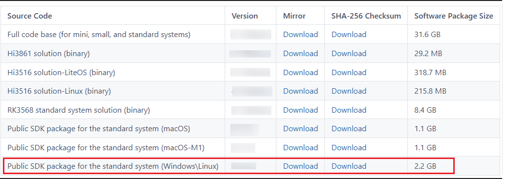

# Using Rust Toolchain

## Introduction

This document walks you through on how to compile Rust applications to make them suitable for running with OpenHarmony OS.

Rust is a static, strongly typed programming language. It has advantages such as secure memory management, high running performance, and native support for multi-thread development.

This toolchain is developed based on the open-source Rust and LLVM and adapts to OpenHarmony OS target binary builds. You can use it to convert build Rust source code into the binary code that can run on OpenHarmony devices.


## When to Use

- Compile Linux x86 target binaries or cross-compile OpenHarmony target binaries in a Linux x86 environment.
- Compile MacOS x86 target binaries in a MacOS x86 environment.
- Compile MacOS arm64 target binaries in a MacOS arm64 environment.

## How to Use

### Compiling OpenHarmony Community Code

1. Download or update the OpenHarmony community code. For details, see [Obtaining Source Code](../get-code/sourcecode-acquire.md).

2. Download and install the toolchain.

   ```shell
   ./build/prebuilts_download.sh
   ```

3. Prepare the code to be compiled.

   Create the **build/rust/tests/test_bin_crate** directory and the following files and folders in the directory:

   ```shell
   ├── BUILD.gn
   └── src
        └── main.rs
   ```

   Sample code of **main.rs**:

   ```rust
   //! Hello world example for Rust.
   
   fn main() {
        println!("Hello, world!");
        println!(env!("RUSTENV_TEST"));
   }
   ```

   Sample code of **BUILD.gn**:

   ```shell
   import("//build/ohos.gni")
   
   ohos_rust_executable("test_bin_crate") {
     sources = [ "src/main.rs" ]
     rustenv = [ "RUSTENV_TEST=123" ]
     features = [ "std" ]
     if (is_mingw) {
       rust_static_link = true
     }
   }
   ```

4. Run the following command to build the target:

   ```shell
   ./build.sh --product-name {product_name} --build-target
   ```

   The following uses RK3568 as an example.

   ```shell
   ./build.sh --product-name rk3568 --build-target build/rust/tests/test_bin_crate:test_bin_crate –no-prebuilt-sdk
   ```

   You can find the file generated in the following directory:

   ```shell
   ./out/rk3568/build/build_framework/test_bin_crate
   ```

###  Compiling Non-OpenHarmony Community Code

#### Installing the Rust Toolchain

1. Download the build repository code.

   ```shell
   git clone git@gitee.com:openharmony/build.git
   ```

2. Download and install the toolchain.

   ```shell
   ./build/prebuilts_download.sh
   ```

3. Check whether the toolchain is successfully installed.

   ```shell
   ./prebuilts/rustc/linux-x86_64/current/bin/rustc --version
   ```

   The toolchain is installed if information similar to the following is displayed:

   ```shell
   rustc 1.72.0-nightly (xxxx)
   ```

#### Installing OpenHarmony Clang

>**NOTE**
>
>This tool is used to cross-compile the OpenHarmony target in a Linux x86 environment. You do not need to install it if you do not want to compile the OpenHarmony target.

1. Obtain the SDK download path from the latest OpenHarmony [release notes](../../release-notes/Readme.md).

   

2. Download the SDK package for Linux and decompress the packages in sequence.

   ```shell
   mv ohos-sdk-windows_linux-public.tar.gz /opt/
   cd /opt/
   tar -zxvf ohos-sdk-windows_linux-public.tar.gz
   cd ohos-sdk/linux
   unzip native-linux-x64-4.1.7.5-Release.zip
   ```

#### Compiling Source Code

1. Obtain the Rust source file **main.rs**.

   ```rust
   fn main() {
     println!("hello world");
   }
   ```

2. Compile the Rust source file **main.rs** for the host platform, which is **linux-x86_64**.

   ```shell
   ./prebuilts/rustc/linux-x86_64/current/bin/rustc main.rs
   ```

   The build result is as follows:

   ```shell
   ./main
   hello world
   ```

3. Cross-compile the Rust source file **main.rs** for the target architecture **armv7-unknown-linux-ohos**, which is armv7 with the OpenHarmony OS.

   ```shell
   ./prebuilts/rustc/linux-x86_64/current/bin/rustc main.rs --target=armv7-unknown-linux-ohos -C linker=/opt/ohos-sdk/linux/native/llvm/bin/armv7-unknown-linux-ohos-clang
   ```

4. Cross-compile the Rust source file **main.rs** for the target architecture **aarch64-unknown-linux-ohos**, which is aarch64 with the OpenHarmony OS.

   ```shell
   ./prebuilts/rustc/linux-x86_64/current/bin/rustc main.rs --target=aarch64-unknown-linux-ohos -C linker=/opt/ohos-sdk/linux/native/llvm/bin/aarch64-unknown-linux-ohos-clang
   ```

5. Cross-compile the Rust source file **main.rs** for the target architecture **x86_64-unknown-linux-ohos**, which is x86_64 with the OpenHarmony OS.

   ```shell
   ./prebuilts/rustc/linux-x86_64/current/bin/rustc main.rs --target=x86_64-unknown-linux-ohos -C linker=/opt/ohos-sdk/linux/native/llvm/bin/x86_64-unknown-linux-ohos-clang
   ```
