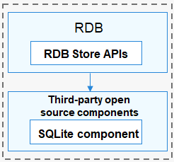

# RDB Overview

The relational database (RDB) manages data based on relational models. With the underlying SQLite database, the OpenHarmony RDB provides a complete mechanism for managing local databases. To satisfy different needs in complicated scenarios, the RDB offers a series of methods for performing operations such as adding, deleting, modifying, and querying data, and supports direct execution of SQL statements.

## Basic Concepts

- RDB

  A type of database created on the basis of relational models. The RDB stores data in rows and columns.

- Predicate

  A representation of the property or feature of a data entity, or the relationship between data entities. It is mainly used to define operation conditions.

- Result set

  A set of query results used to access data. You can access the required data in a result set in flexible modes.

- SQLite database

  A lightweight open-source relational database management system that complies with Atomicity, Consistency, Isolation, and Durability (ACID).

## Working Principles
The OpenHarmony RDB provides a common operation interface (**RdbStore**) for external systems. It uses the third-party open-source SQLite as the underlying persistent storage engine, which supports all SQLite database features.

**Figure 1** How RDB works

## Default Settings
- The default database logging mode is write-ahead logging (WAL).
- The default database flush mode is Full mode.
- The default shared memory is 8 MB for the OpenHarmony database and 2 MB for a single query.

## Constraints
- A maximum of four connection pools can be connected to an RDB to manage read and write operations.
- To ensure data accuracy, the RDB supports only one write operation at a time.
